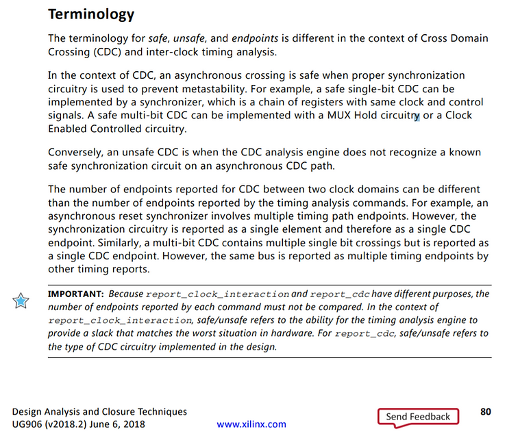
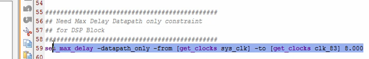
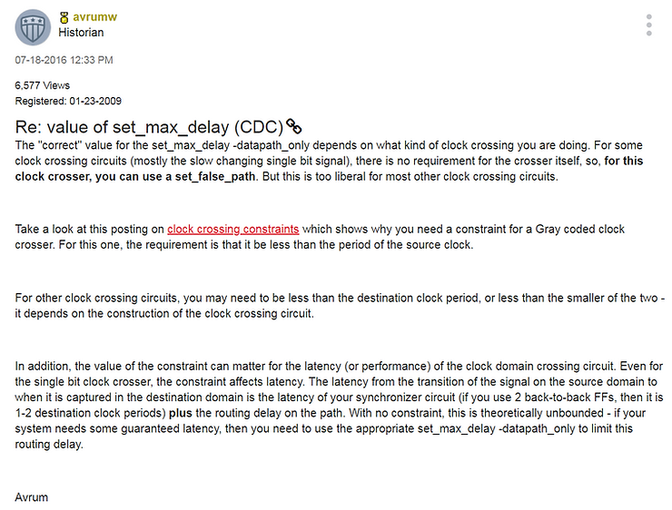
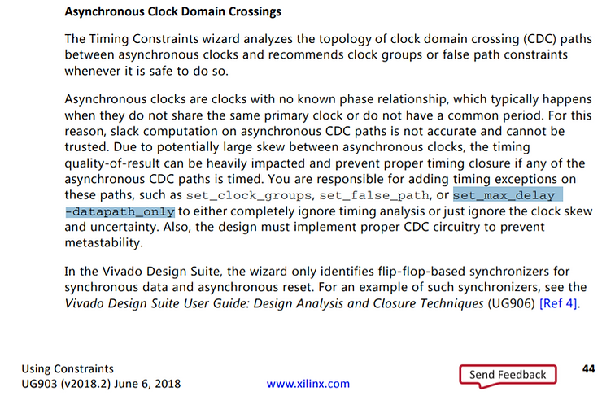
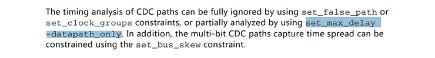
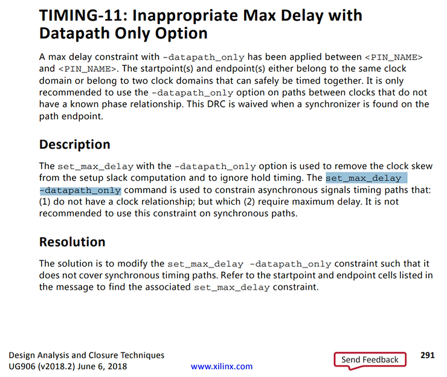

# Notes on the "Using the Vivado Timing Constraint Wizard" QuickTake Video from Xilinx

This post lists notes on the "Using the Vivado Timing Constraint Wizard" QuickTake Video from Xilinx. It includes info highlights, links to the video, further explanations of some terms used and the steps to use the Timing Constraint Wizard in Vivado.

**<u>Link to the Quick Take Video</u>**

Video at [[link](https://www.xilinx.com/video/hardware/using-vivado-timing-constraint-wizard.html)]

**<u>UltraFast Design Methodology</u>**

The UltraFast design methodology says (@ 2:09):

1.  Define all the clocks that exist in your design
    
2.  Then specify the interactions between these clocks
    
3.  Next constraint all your inputs and outputs
    
4.  And finally, cautiously and sparingly add timing exceptions such as: **false paths** and **multicycle paths**
    

**<u>Steps</u>**

<u>Step 1</u>: Run synthesis (the timing constraint wizard operates on a gate-level netlist)

<u>Step 2</u>: Run Sources > Hierarchy > Constraints > constrs\_1 > dsp\_block\_constraints.xdc (to look at the existing constraints file)

<u>Step 3</u>: Run Synthesis > Synthesized Design > Report Timing Summary (to familiarize yourself with the design)

<u>Step 4</u>: Run Synthesis > Synthesized Design > Report Clock Interactions (to gain visibility into the **clock domain crossings**)

"Unsafe clock crossings" are in red.

Note from p.80 of UG906

A great CDC write can be found at \[[<u>link</u>](https://filebox.ece.vt.edu/~athanas/4514/ledadoc/html/pol_cdc.html)\]. The write up defines a CDC as: "**A CDC signal is a signal latched by a flip-flop (FF) in one clock domain and sampled in another asynchronous clock domain."** The write up also shows sync circuits.

@5:57 The narrator mentions that the sys\_clk to clk\_83 crossing has been constrained with the **set\_max\_delay -datapath\_only**

@ 4:50 he brought this up in the existing .XDC file:

From the info below, this says that the maximum delay of a signal on the path from sys\_clk (period 8.0) to clk\_83 (period 12.00) should be a maximum of 8 ns.

How do you select 8 ns (how do you select the set\_max\_delay value)?

Short answer: it depends on the synchronizer circuit you're using. A longer answer can be found at \[[<u>link</u>](https://forums.xilinx.com/t5/Timing-Analysis/value-of-set-max-delay-CDC/td-p/709151)\] or here:

The clock crossing constraints \[[<u>link</u>](https://forums.xilinx.com/t5/Vivado-TCL-Community/How-to-set-timing-constraint-in-this-case/m-p/510771#M2049)\].

_More info on set\_max\_delay -datapath\_only_

Some more info on **set\_max\_delay -datapath\_only**:

...and from p. 138:

...and (a good description):

There's also a QuickTake on this topic titled "Advanced Timing Exceptions False Path, Min Max Delay and Set ... at \[[<u>link</u>](https://www.google.com/search?q=set+max+delay+constraint&oq=set+max+delau&aqs=chrome.2.69i57j0l5.4238j1j7&sourceid=chrome&ie=UTF-8#kpvalbx=1)\].

**<u>Constraining Inputs and Outputs</u>**

@ 3:45 the video talks about **set\_input\_delay** and **set\_output\_delay**

A whole video called, "Setting Input Delay" discusses setting input delay @ \[[<u>link</u>](https://www.xilinx.com/video/hardware/setting-input-delay.html)\]

Says you need to watch, Creating Basic Clock Constraints @ \[[<u>link</u>](https://www.xilinx.com/video/hardware/creating-basic-clock-constraints.html)\] and Create Generated Clock Constraints @ \[[<u>link</u>](https://www.xilinx.com/video/hardware/creating-generated-clock-constraints.html)\]

**What is Input Delay?**

From the video discussing input delay, Setting Input Delay, **Input Delay** is:

The maximum (for set up) and the minimum (for hold) "Clock to Out" + "Trace Delay"

...the video says we only need to set maximum input delay since the max is the only parameter that affects setup timing, we don't need to check our min before checking set up

...for hold timing, we need the min

If the "upstream device" is another FPGA we should be able to use the tools to figure out what the clock to output delay is. We can figure out the trace length delay from the board.

If this is a DDR interface, we need to to figure out the clock-to-out for the falling edge as well.

**<u>Additional Resources</u>**

Additional Resources (@ 17:44)

-   Vivado courses @ [<u>https://xilinxprod-catalog.netexam.com/Training?searchCriteria=6995</u>](https://xilinxprod-catalog.netexam.com/Training?searchCriteria=6995) (the link posted in the video is not longer live)
    
-   UG903: Using Constraints \[[<u>2018.2 link</u>](https://www.xilinx.com/support/documentation/sw_manuals/xilinx2018_2/ug903-vivado-using-constraints.pdf)\]
    
-   UG906: Design Analysis and Closure Techniques \[[<u>2018.2 link</u>](https://www.xilinx.com/support/documentation/sw_manuals/xilinx2018_2/ug906-vivado-design-analysis.pdf)\]
    
-   UG949: Ultrafast Design Methodology Guide for the Vivado Suite \[[<u>2018.2 link</u>](https://www.xilinx.com/support/documentation/sw_manuals/xilinx2018_2/ug949-vivado-design-methodology.pdf)\]
    
-   Post a question to the Developer Forums \[[<u>link</u>](https://forums.xilinx.com/)\] << from \[[<u>link</u>](https://www.xilinx.com/community.html)\]
    

More Resources not Called Out In Video

-   AN 433: Constraining and Analyzing Source-Synchronous Interfaces @ \[[<u>link</u>](https://www.intel.com/content/dam/www/programmable/us/en/pdfs/literature/an/an433.pdf)\]