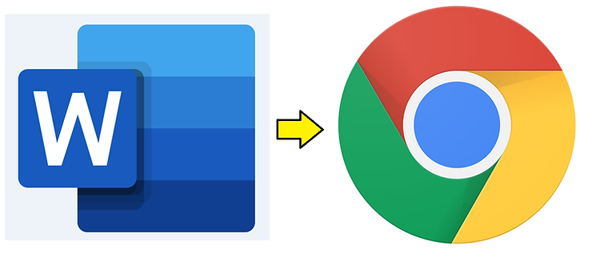
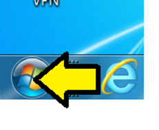
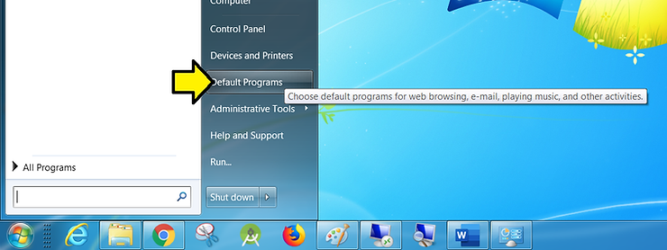
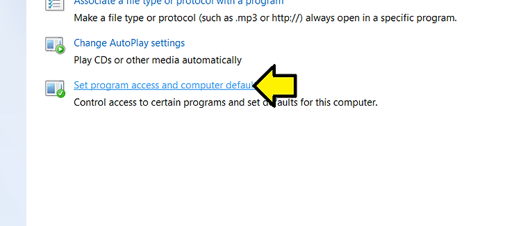
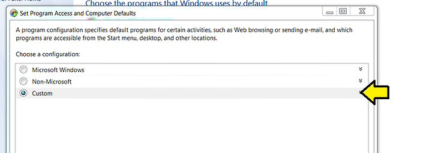
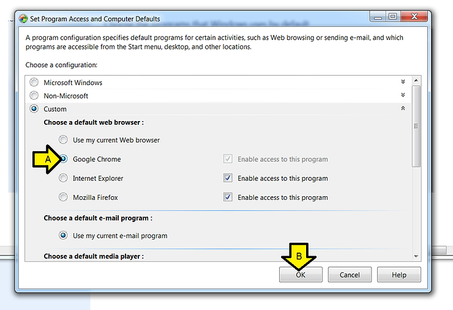

# Open Links from Word 2016 in Chrome Instead of IE on Win 7 SP1

This post shows how to open links from Word 2016 in Chrome instead of IE on Win 7.

**Versions Used**

-   Windows 7 SP1
    
-   Microsoft Office Home and Business 2016
    
-   Chrome Version 74.0.3729.157 (Official Build) (64-bit)
    

**Steps**

Step 1: Click **Windows** (Start)

Step 2: Click **Default Programs**

Step 3: Click **Set program access and computer defaults**

Step 4: Expand **Custom**

Step 5: Choose a default web browser

A. Click **Google Chrome**

B. Click **OK**

**Reference**

-   Found the steps at \[[link](http://superuser.com/questions/1231898/how-to-change-default-browser-of-ms-word-when-i-ctrl-click-a-hyperlink)\]
    
-   Word logo from \[[link](http://www.google.com/url?sa=i&source=images&cd=&cad=rja&uact=8&ved=2ahUKEwiZ-vyghajiAhUBHHwKHeYrDNUQjRx6BAgBEAU&url=https%3A%2F%2Fen.wikipedia.org%2Fwiki%2FMicrosoft_Word&psig=AOvVaw3O5lh-mftdwLJldgreTJ1J&ust=1558370661909420)\]
    
-   Chrome logo from \[[link](http://www.google.com/url?sa=i&source=images&cd=&cad=rja&uact=8&ved=2ahUKEwiHmtK4hajiAhXBhFQKHaA7DZcQjRx6BAgBEAU&url=https%3A%2F%2Fen.wikipedia.org%2Fwiki%2FGoogle_Chrome&psig=AOvVaw3t7mOfKslG6rfG19j9tis6&ust=1558370713975554)\]