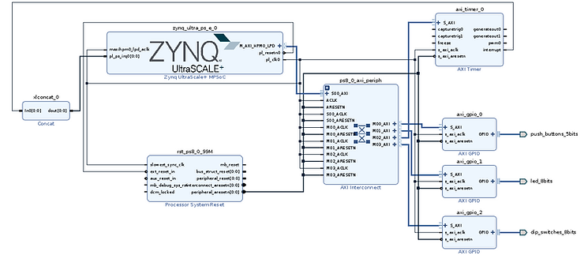

# Patch the Linux Kernel using PetaLinux 2020.2, Boot on QEMU, and Debug with GDB


In this blog post, a trivial example Linux kernel patch is created and added to a Xilinx PetaLinux project targeting a Xilinx Zynq Ultrascale+ MPSoC development board, the ZCU106, and then tested in emulation with QEMU.

**<u><span>Objective</span></u>**

A standard way of modifying the Linux Kernel is to check out a specific release of the Linux Kernel from GIT SCM online and then apply your own modifications. You may wish to add or modify drivers for the creation of your own custom BSP, or you may wish to fix a bug or limitation before that change is accepted upstream.

In this blog post, the trivial example patch is created and added to a Xilinx PetaLinux project. Barriers to including the patch are discussed, such as requirements for PetaLinux commands to be executed so that the patches are applied. And finally, running the kernel in the QEMU emulator and debugging it with GDB is discussed to show that the changes were indeed applied to the kernel.

**<u><span>Following the Xilinx EDT tutorial to create a minimal Programmable Logic design</span></u>**

The board I wish to build for and emulate is the Xilinx ZCU106 development board. This is achieved in a few steps. First, Vitis 2020.2 (with Vivado 2020.2.) and PetaLinux 2020.2 are installed on an Ubuntu 18.04 host. Second, a bare minimum PL design is created with Vivado 2020.2 to provide PL access to timers, LEDs, and buttons. The [<u><span>Embedded Design Tutorial Zynq Ultrascale+ MPSoC Design 1</span></u>](https://xilinx.github.io/Embedded-Design-Tutorials/master/docs/Introduction/ZynqMPSoC-EDT/7-design1-using-gpio-timer-interrupts.html) was followed with modification for the ZCU106 development board instead of the ZCU102. My PL design is shown here.



Third, a PetaLinux project is created. This involves downloading the PetaLinux BSP for the ZCU106 from the Xilinx website. Once downloaded, a new PetaLinux project is created from the BSP. The project is built. The hardware export from Vivado is then added to the project configuration. The project is built again.

```
$ petalinux-create -t project -s xilinx-zcu106-v2020.2-final.bsp -n xilinx-zcu106-v2020.2-custom-build
$ cd ./xilinx-zcu106-v2020.2-custom-build
$ petalinux-build
$ petalinux-config --get-hw-description=../edt_zcu106_wrapper.xsa
$ petalinux-build
```

**<u><span>Procedure to patch the kernel and add the patch to the build environment</span></u>**

(It is important for the user to have already set their name and email in their global git config.)

Finally, the kernel is ready for modifications. We GIT clone the Xilinx Linux kernel, modify the sources we wish to change, generate a GIT diff, and add the diff files to the project's **project-spec** directory. There are several steps to accomplish this.

To modify the exact same kernel sources as specified by the project we created, we GIT clone the Xilinx Linux Kernel and check out the same branch and tag that were referenced by the BSP.

```
$ cd ./build/tmp/work-shared/zynqmp-generic/kernel-source/
$ git remote -v
origin	https://github.com/Xilinx/linux-xlnx.git (fetch)
origin	https://github.com/Xilinx/linux-xlnx.git (push)
$ git branch
...
* xlnx_rebase_v5.4
...
$ git log -1
commit 62ea514294a0c9a80455e51f1f4de36e66e8c546 (HEAD -> xlnx_rebase_v5.4, origin/xlnx_rebase_v5.4)
...
$ cd ../../../../../../
$ git clone https://github.com/Xilinx/linux-xlnx.git
$ cd linux-xlnx/
$ git checkout xlnx_rebase_v5.4
$ git log -1
commit 77883b257c27f47445381c70c9236ade8f87eeaa (HEAD -> xlnx_rebase_v5.4, origin/xlnx_rebase_v5.4)
$ git checkout 62ea514294a0c9a80455e51f1f4de36e66e8c546
$ git log -1
commit 62ea514294a0c9a80455e51f1f4de36e66e8c546 (HEAD, tag: xlnx_rebase_v5.4_2020.2)
```

Note that when inspecting the externally cloned linux-xlnx GIT history, the **git log** command reveals that the tag **xlnx\_rebase\_v5.4\_2020.2** corresponds to the BSP's kernel revision, which is many commits behind the tip of the **xlnx\_rebase\_v5.4** branch. This is the kernel source commit revision that was checked out when the project was first built. If the kernel is then configured and re-built with:

```
petalinux-config -c kernel
petalinux-build -c kernel
```

the PetaLinux build environment will check out the Xilinx Linux Kernel sources of the same GIT commit of the same sources branch. However, the kernel sources will be moved to the directory **components/yocto/workspace/sources/linux-xlnx**.

```
$ cd ./components/yocto/workspace/sources/linux-xlnx
$ git remote -v
origin	https://github.com/Xilinx/linux-xlnx.git (fetch)
origin	https://github.com/Xilinx/linux-xlnx.git (push)
$ git branch
...
* xlnx_rebase_v5.4
...
$ git log -1
commit 62ea514294a0c9a80455e51f1f4de36e66e8c546 (HEAD -> xlnx_rebase_v5.4, origin/xlnx_rebase_v5.4)
Author:
Date:   Mon Nov 2 01:23:52 2020 -0800
...
```

To patch the kernel, change the directory to the cloned **linux-xlnx** outside of the PetaLinux build environment.

```
$ cd ../../../../../../linux-xlnx
$ git checkout tags/xlnx_rebase_v5.4_2020.2
# same as 62ea514294a0c9a80455e51f1f4de36e66e8c546
```

As an example of changing the kernel sources, let us rename the **/proc/config.gz** path to **/proc/simple-rename-config.gz**. Examine the source file ./kernel/configs.c and change the two literal strings "config.gz" to "simple-rename-config.gz". Save the configs.c file. Then generate a diff with:

```
$ git diff > 0001_renamed_config_gz_to_other_name.patch
$ cat 0001_renamed_config_gz_to_other_name.patch
```

```
diff --git a/kernel/configs.c b/kernel/configs.c
index c09ea4c995e1..b46781d9d1d9 100644
--- a/kernel/configs.c
+++ b/kernel/configs.c
@@ -58,7 +58,7 @@ static int __init ikconfig_init(void)
 	struct proc_dir_entry *entry;
 
 	/* create the current config file */
-	entry = proc_create("config.gz", S_IFREG | S_IRUGO, NULL,
+	entry = proc_create("simple-rename-config.gz", S_IFREG | S_IRUGO, NULL,
 			    &ikconfig_file_ops);
 	if (!entry)
 		return -ENOMEM;
@@ -70,7 +70,7 @@ static int __init ikconfig_init(void)
 
 static void __exit ikconfig_cleanup(void)
 {
-	remove_proc_entry("config.gz", NULL);
+	remove_proc_entry("simple-rename-config.gz", NULL);
 }
```

Now, let's add this patch to the build environment manually so that each time the kernel sources are extracted and built, the build environment will apply this patch to the source tree prior to any compilation. Copy the patch into the recipe folder linux-xlnx/ and add a SRC\_URI specification of the patch file name.

```
$ cp 0001_renamed_config_gz_to_other_name.patch ../<project-name>/project-spec/meta-user/recipes-kernel/linux/linux-xlnx/
$ cat ../<project-name>/project-spec/meta-user/recipes-kernel/linux/linux-xlnx_%.bbappend
# edit ../<project-name>/project-spec/meta-user/recipes-kernel/linux/linux-xlnx_%.bbappend
$ cat ../<project-name>/project-spec/meta-user/recipes-kernel/linux/linux-xlnx_%.bbappend
```

The contents of **linux-xlnx\_%.bbappend** were:

```
SRC_URI += "file://bsp.cfg"
KERNEL_FEATURES_append = " bsp.cfg"
FILESEXTRAPATHS_prepend := "${THISDIR}/${PN}:"
```

The contents of **linux-xlnx\_%.bbappend** are edited to now be:

```
SRC_URI += "file://bsp.cfg"
SRC_URI += "file://0001_renamed_config_gz_to_other_name.patch"
KERNEL_FEATURES_append = " bsp.cfg"
FILESEXTRAPATHS_prepend := "${THISDIR}/${PN}:"
```

To apply the patch, it is necessary to rebuild the kernel sources entirely. If that were not the case, the build environment would need to rely on the kernel sources' Kconfig and Makefile build environment to know which sources to recompile after sources have been modified. PetaLinux will apply the external patch when the kernel is fully rebuilt, not when it is incrementally rebuilt. To demonstrate this, let's try building the kernel now without performing a clean operation.

```
$ petalinux-build -c kernel
```

Note that the build performs a kernel compile with the task:

```
linux-xlnx-5.4+git999-r0 do_compile 
```

Now, after the sources are built, inspect the kernel source tree residing in the build environment.

```
$ cat ./components/yocto/workspace/sources/linux-xlnx/kernel/configs.c
```

Notice that the literal strings for the proc path are still "config.gz" and have not been patched. The kernel could be cleaned and rebuilt; but the same build behavior results in the patch not being applied. The patch is applied if all sources are rebuilt. This is accomplished by:

```
$ petalinux-build -x mrproper -f
$ petalinux-build
```

Note that the kernel sources again reside in ./build/tmp/work-shared/zynqmp-generic/kernel-source/ . To configure the kernel again:

```
petalinux-config -c kernel
```

In preparation for running the kernel in QEMU, change the following configuration options in the kernel configuration window.

```
CPU Power Management ---> CPU Idle ---> [ ] CPU idle PM support
Kernel hacking ---> [*] KGDB: kernel debugger ---
```

To build the kernel and dependencies again, generating bootable image components:

```
petalinux-build
```

Examine the kernel sources to see if the patch was applied:

```
$ cat ./components/yocto/workspace/sources/linux-xlnx/kernel/configs.c
```

Note that the patch was applied, and the kernel builds with the changes.

**<u><span>Procedure to boot the modified kernel in QEMU for test-driving</span></u>**

To boot the custom ZCU106 kernel with rootfs, QEMU is used to debug the software. The following command boots the ZCU106 with GDB debugging connected to the Linux Kernel.

```
petalinux-boot --qemu --kernel
```

It is necessary to read the boot-time messages produced by QEMU on the Linux terminal. Note the TCP port assigned to GDB as stated in the initial boot messages. It may differ on your computer.

```
-gdb tcp::9000
```

One of the messages indicates which TCP port can be connected to with the GDB debugger. To connect to the Linux kernel image symbols, the following command will enable debugging of the kernel. In a separate terminal window, execute:

```
$ cd ./images/linux/
$ petalinux-util --gdb vmlinux
(gdb) target remote :9000
(gdb) break /home/<username>/<project-name>/components/yocto/workspace/sources/linux-xlnx/kernel/configs.c:44
(gdb) continue
```

Note that a breakpoint is established at the reading of the config.gz data from /projc/simple-rename-config.gz.

Login to the booted PetaLinux image with the root account. Then list the config.gz node name under the /proc/ filesystem.

```
root@xilinx-zcu106-2020_2:~# ls /proc/simple-rename-config.gz 
/proc/simple-rename-config.gz
root@xilinx-zcu106-2020_2:~# ls /proc/config.gz
ls: /proc/config.gz: No such file or directory
```

Just as modified in source code, the /proc/ entry for config.gz was changed to simple-rename-config.gz . To read from the node:

```
root@xilinx-zcu106-2020_2:~# cat /proc/simple-rename-config.gz | gunzip | less
```

Over at the GDB terminal, the breakpoint is hit repeatedly while the compressed kernel data of config.gz is output from the /proc/ filesystem node to the gunzip pipe. After a few breakpoints are hit, disable the breakpoint to allow the execution of the terminal command to finish.

```
(gdb) continue
Continuing.
[Switching to Thread 1.2]

Thread 2 hit Breakpoint 1, ikconfig_read_current (file=0xffff000869661e00, buf=0xffff000867644000 "", len=4096, offset=0xffff800011a8bb18)
    at /home/timothystotts/wa/tutorial-peta-zcu106/xilinx-zcu106-v2020.2-custom-build/components/yocto/workspace/sources/linux-xlnx/kernel/configs.c:44
44		return simple_read_from_buffer(buf, len, offset,

(gdb) continue
Continuing.

Thread 2 hit Breakpoint 1, ikconfig_read_current (file=0xffff000869661e00, buf=0xffff000869475000 "", len=4096, offset=0xffff800011a8bb18)
    at /home/timothystotts/wa/tutorial-peta-zcu106/xilinx-zcu106-v2020.2-custom-build/components/yocto/workspace/sources/linux-xlnx/kernel/configs.c:44
44		return simple_read_from_buffer(buf, len, offset,

(gdb) disable breakpoints
(gdb) continue
Continuing.
```

Now at the QEMU terminal, the contents of the config.gz are displayed with the **less** pager on the terminal. To set more breakpoints, type CTRL-C on the GDB terminal and then enter breakpoint commands.

**<u><span>Summary</span></u>**

In this blog post, a trivial example patch was created and added to a Xilinx PetaLinux project. targeting a Xilinx Zynq Ultrascale+ MPSoC development board, the ZCU106. Barriers to including the patch were discussed, such as requirements for PetaLinux commands to be executed so that the patches are applied. And finally, running the kernel in an emulator was discussed to show that the changes were indeed applied to the kernel, as well as setting breakpoints based on source code line numbers.

**<u><span>References</span></u>**

-   [PetaLinux Tools Documentation: Reference Guide: 2020.2](https://www.xilinx.com/support/documentation/sw_manuals/xilinx2020_2/ug1144-petalinux-tools-reference-guide.pdf)
    
-   [Embedded Design Tutorial - Zynq Ultrascale+ MPSoC - Design 1](https://xilinx.github.io/Embedded-Design-Tutorials/master/docs/Introduction/ZynqMPSoC-EDT/7-design1-using-gpio-timer-interrupts.html)
    
-   [Patching the Linux kernel on Petalinux: outdated i... - Community Forums (xilinx.com)](https://forums.xilinx.com/t5/Embedded-Linux/Patching-the-Linux-kernel-on-Petalinux-outdated-information-on/td-p/1125886)
    
-   [How to Patch PetaLinux - FPGA Developer](https://www.fpgadeveloper.com/how-to-patch-petalinux/)
    
-   Xilinx logo from \[[<u><span>link</span></u>](https://twitter.com/xilinxinc)<u><span>]</span></u>