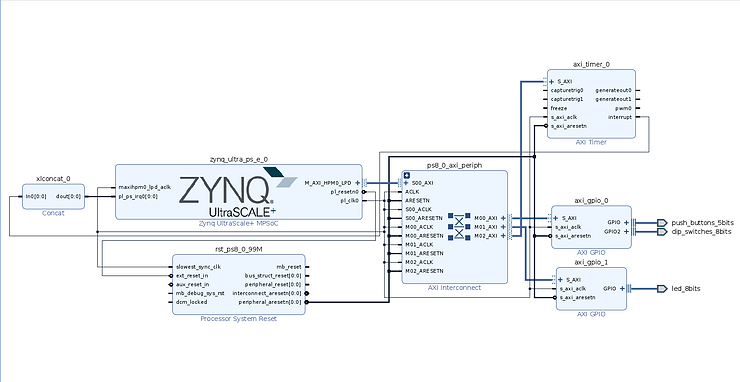
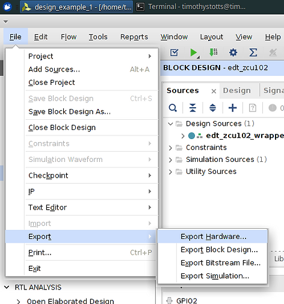
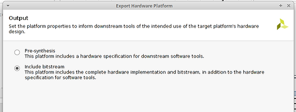
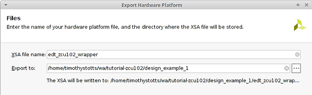

# Patching the Linux Kernel with devshell in PetaLinux 2020.2


In this blog post, three trivial example Linux kernel patches are created and added to a Xilinx PetaLinux project using Yocto devshell, targeting a Xilinx Zynq Ultrascale+ MPSoC development board, the ZCU102, and then tested in emulation with QEMU.

**<u><span>Objective</span></u>**

A standard way of modifying the Linux Kernel is to check out a specific release of the Linux Kernel from git SCM online and then apply your modifications. You may wish to add or modify drivers for creating your custom BSP, or you may want to fix a bug or limitation before that change is accepted upstream.

In this blog post, three trivial example patches are created and added to a Xilinx PetaLinux project. Procedure for including the patches is discussed, including using the Yocto devshell to develop and apply changes in the kernel working directory, followed by adding patches to the PetaLinux project recipes targeting the kernel.

First, install the Vitis 2020.2 (with Vivado 2020.2) and PetaLinux 2020.2, plus a System Edition license for Vivado. We used the Ubuntu 18.04 operating system plus extra required libraries installed with the Ubuntu' apt tool. These commands install the extra packages on Ubuntu 18.04 prior to install of the Xilinx tools.

```
$ sudo apt-get install iproute2 gcc g++ net-tools libncurses5-dev zlib1g:i386 libssl-dev flex bison libselinux1 xterm autoconf libtool texinfo zlib1g-dev gcc-multilib build-essential screen pax python3 python3-pexpect python3-pip python3-git python3-jinja2
$ sudo apt-get install lib32stdc++6 libgtk2.0-0:i386 libfontconfig1:i386 libx11-6:i386 libxext6:i386 libxrender1:i386 libsm6:i386 libqtgui4:i386
$ sudo apt-get install curl
$ sudo apt-get install chrpath
$ sudo apt-get install bash-doc gdb-doc make-doc
```

```
$ sudo dpkg-reconfigure dash
```

```
# choose bash instead of dash for implementing /bin/sh
```

Note that the Unified Xilinx Installer may encounter a crash when trying to install Vitis, Vivado, and PetaLinux on Ubuntu 18.04.5. To solve this, we rename our system as Ubuntu 18.04.4 temporarily and then install Vitis followed by PetaLinux. To rename the system, we edit the following files as root user:

-   /etc/os-release
    
-   /etc/lsb-release
    

Replace every string that contains "18.04.5" with "18.04.4". Then install the Xilinx tools. Then edit these files again, replacing the strings "18.04.4" back to the original value of "18.04.5". Unfortunately, there is no simple way to downgraded from 18.04.5 to 18.04.4 with the Ubuntu apt tool; and the Xilinx installer crashes when trying to install on a unsupported system. Thus, this procedure is necessary.

**<u><span>Following the Xilinx EDT tutorial to create a minimal Programmable Logic design</span></u>**  

The board chosen for this blog post is the Xilinx ZCU102. Xilinx's QEMU documentation lists the ZCU102 as a board whose BSP can emulate the Zynq PL hardware due to included support. See [QEMU Supported Platforms - Xilinx Wiki - Confluence (atlassian.net)](https://xilinx-wiki.atlassian.net/wiki/spaces/A/pages/821821485/QEMU+Supported+Platforms).

Create a minimum ZCU102 Zynq PL design for access to PL-connected buttons and LEDs. To accomplish this, we followed the [Embedded Design Tutorial Zynq Ultrascale+ MPSoC Design 1](https://xilinx.github.io/Embedded-Design-Tutorials/master/docs/Introduction/ZynqMPSoC-EDT/7-design1-using-gpio-timer-interrupts.html). The following figure shows our basic PL design.



Third, export the Hardware Description with Bitstream included. Note that name given to the XSA file produced by this set of dialogs.







- Fourth, we generate a PetaLinux project from the ZCU102 BSP. Download the PetaLinux BSP for the ZCU102 from the [Xilinx website PetaLinux 2020.2 downloads](https://www.xilinx.com/support/download/index.html/content/xilinx/en/downloadNav/embedded-design-tools/2020-2.html). Note that you will need to sign-in with a Xilinx website account. Once downloaded, we create a new PetaLinux project from the BSP. Then we build the project. After, we add the hardware export from the Vivado project; and we rerun the project build.

  ```
  $ petalinux-create -t project -s xilinx-zcu102-v2020.2-final.bsp -n ds-krnl-zcu102-2020.2
  $ cd ./ds-krnl-zcu102-2020.2
  $ petalinux-build
  $ petalinux-config --get-hw-description=../edt_zcu106_wrapper.xsa
  # Exit from the Kconfig menu without making changes.
  $ petalinux-build
  ```

  **Procedure to enter Devshell for the kernel component**

  The user should have already set their name and email in their global git config. The procedure for this on the command line follows. Substitute your name and email address. 

  ```
  $ git config --global user.name "My Name"
  $ git config --global user.email "myemail@mydomain.com"
  $ git config --global -l
  user.email=myemail@mydomain.com
  user.name=My Name
  ```

  Finally, the kernel is ready for modifications. We git clone the Xilinx Linux kernel, modify the sources we wish to change, generate three git diff, and add the diff files to the project's **project-spec** directory. There are several steps to accomplish this.

  To cause the Linux kernel sources to move to the Yocto workspace, we configure the Linux kernel and build it again. The moving of the Linux kernel sources out of the build path and into the Yocto components path is a PetaLinux feature. Here we disable ARM CPU Idle support and enable KGDB kernel debugging. Then after configuring, invoke the kernel component build.

  ```
  $ petalinux-config -c kernel
  # CPU Power Management ---> CPU Idle ---> [ ] CPU idle PM support
  # Kernel hacking ---> [*] KGDB: kernel debugger ---
  $ petalinux-build -c kernel
  ```

  To list the available PetaLinux/Yocto commands available to invoke on a single software item, execute the build command with a parameter to "listtasks". Here we list the tasks for the Linux kernel.

  ```
  $ petalinux-build -c kernel -x listtasks
  ```

  Note that all tasks start with the prefix "do_". To invoke one of the commands, remove the "do_" prefix. To begin modifying the Linux kernel in a terminal complete with cross-compiling GCC, GNU Make, and Kconfig, we run the task "devshell". This command will start an OpenEmbedded Developer Shell in a separate terminal window for interacting with the cloned sources, including the cross-compile toolchain.

  ```
  $ petalinux-build -c kernel -x devshell
  ```

  When the terminal opens, we inspect the environment to see the cross-compiler settings.

  ```
  $ ls -l $(which ar gcc gdb g++ make)
  lrwxrwxrwx 1 1000 1000 11 May 12 22:24 /home/workarea/blog/ds-krnl-zcu102-2020.2/build/tmp/hosttools/ar -> /usr/bin/ar
  lrwxrwxrwx 1 1000 1000 12 May 12 22:24 /home/workarea/blog/ds-krnl-zcu102-2020.2/build/tmp/hosttools/g++ -> /usr/bin/g++
  lrwxrwxrwx 1 1000 1000 12 May 12 22:24 /home/workarea/blog/ds-krnl-zcu102-2020.2/build/tmp/hosttools/gcc -> /usr/bin/gcc
  lrwxrwxrwx 1 1000 1000 106 May 12 22:24 /home/workarea/blog/ds-krnl-zcu102-2020.2/build/tmp/hosttools/make -> /opt/Xilinx/PetaLinux/2020.2/tool/components/yocto/buildtools/sysroots/x86_64-petalinux-linux/usr/bin/make
  -rwxr-xr-x 1 root root 7619056 Oct 30 2020 /usr/bin/gdb
  $ echo ${CC}
  aarch64-xilinx-linux-gcc -march=armv8-a+crc -mtune=cortex-a72.cortex-a53 -fstack-protector-strong -D_FORTIFY_SOURCE=2 -Wformat -Wformat-security -Werror=format-security --sysroot=/home/workarea/blog/ds-krnl-zcu102-2020.2/build/tmp/work/zynqmp_generic-xilinx-linux/linux-xlnx/5.4+git999-r0/recipe-sysroot
  $ echo ${CFLAGS}
  -O2 -pipe -g -feliminate-unused-debug-types -fmacro-prefix-map=/home/workarea/blog/ds-krnl-zcu102-2020.2/build/tmp/work/zynqmp_generic-xilinx-linux/linux-xlnx/5.4+git999-r0=/usr/src/debug/linux-xlnx/5.4+git999-r0 -fdebug-prefix-map=/home/workarea/blog/ds-krnl-zcu102-2020.2/build/tmp/work/zynqmp_generic-xilinx-linux/linux-xlnx/5.4+git999-r0=/usr/src/debug/linux-xlnx/5.4+git999-r0 -fdebug-prefix-map=/home/workarea/blog/ds-krnl-zcu102-2020.2/build/tmp/work/zynqmp_generic-xilinx-linux/linux-xlnx/5.4+git999-r0/recipe-sysroot= -fdebug-prefix-map=/home/workarea/blog/ds-krnl-zcu102-2020.2/build/tmp/work/zynqmp_generic-xilinx-linux/linux-xlnx/5.4+git999-r0/recipe-sysroot-native=
  $ echo ${CXX}
  aarch64-xilinx-linux-g++ -march=armv8-a+crc -mtune=cortex-a72.cortex-a53 -fstack-protector-strong -D_FORTIFY_SOURCE=2 -Wformat -Wformat-security -Werror=format-security --sysroot=/home/workarea/blog/ds-krnl-zcu102-2020.2/build/tmp/work/zynqmp_generic-xilinx-linux/linux-xlnx/5.4+git999-r0/recipe-sysroot
  $ echo ${CXXFLAGS}
  -O2 -pipe -g -feliminate-unused-debug-types -fmacro-prefix-map=/home/workarea/blog/ds-krnl-zcu102-2020.2/build/tmp/work/zynqmp_generic-xilinx-linux/linux-xlnx/5.4+git999-r0=/usr/src/debug/linux-xlnx/5.4+git999-r0 -fdebug-prefix-map=/home/workarea/blog/ds-krnl-zcu102-2020.2/build/tmp/work/zynqmp_generic-xilinx-linux/linux-xlnx/5.4+git999-r0=/usr/src/debug/linux-xlnx/5.4+git999-r0 -fdebug-prefix-map=/home/workarea/blog/ds-krnl-zcu102-2020.2/build/tmp/work/zynqmp_generic-xilinx-linux/linux-xlnx/5.4+git999-r0/recipe-sysroot= -fdebug-prefix-map=/home/workarea/blog/ds-krnl-zcu102-2020.2/build/tmp/work/zynqmp_generic-xilinx-linux/linux-xlnx/5.4+git999-r0/recipe-sysroot-native= -fvisibility-inlines-hidden
  ```

  We can also inspect the environment to see a partial list of the cross-compiler settings. Note that for the ZCU102, we target the 4-core Cortex A53 64-bit CPU hardware with the embedded Xilinx Linux operating system. The Devshell environment uses the **aarch64-xilinx-linux-** prefix for the compiler tool names by setting command-line variables. GNU Make inspects these variables to find the intended compiler toolchain.

  ```
  $ export | grep aarch64 | grep -v PATH
  declare -x AR="aarch64-xilinx-linux-gcc-ar"
  declare -x AS="aarch64-xilinx-linux-as "
  declare -x CC="aarch64-xilinx-linux-gcc -march=armv8-a+crc -mtune=cortex-a72.cortex-a53 -fstack-protector-strong -D_FORTIFY_SOURCE=2 -Wformat -Wformat-security -Werror=format-security --sysroot=/home/workarea/blog/ds-krnl-zcu102-2020.2/build/tmp/work/zynqmp_generic-xilinx-linux/linux-xlnx/5.4+git999-r0/recipe-sysroot"
  declare -x CCLD="aarch64-xilinx-linux-gcc -march=armv8-a+crc -mtune=cortex-a72.cortex-a53 -fstack-protector-strong -D_FORTIFY_SOURCE=2 -Wformat -Wformat-security -Werror=format-security --sysroot=/home/workarea/blog/ds-krnl-zcu102-2020.2/build/tmp/work/zynqmp_generic-xilinx-linux/linux-xlnx/5.4+git999-r0/recipe-sysroot"
  declare -x CONFIGURE_FLAGS="--target=aarch64-xilinx-linux --host=aarch64-xilinx-linux --build=x86_64-linux --with-libtool-sysroot=/home/workarea/blog/ds-krnl-zcu102-2020.2/components/yocto/tmp/sysroots/zynqmp-generic"
  declare -x CONFIG_SITE="/home/workarea/blog/ds-krnl-zcu102-2020.2/components/yocto/site-config-aarch64-xilinx-linux"
  declare -x CPP="aarch64-xilinx-linux-gcc -E --sysroot=/home/workarea/blog/ds-krnl-zcu102-2020.2/build/tmp/work/zynqmp_generic-xilinx-linux/linux-xlnx/5.4+git999-r0/recipe-sysroot -march=armv8-a+crc -mtune=cortex-a72.cortex-a53 -fstack-protector-strong -D_FORTIFY_SOURCE=2 -Wformat -Wformat-security -Werror=format-security"
  declare -x CROSS_COMPILE="aarch64-xilinx-linux-"
  declare -x CXX="aarch64-xilinx-linux-g++ -march=armv8-a+crc -mtune=cortex-a72.cortex-a53 -fstack-protector-strong -D_FORTIFY_SOURCE=2 -Wformat -Wformat-security -Werror=format-security --sysroot=/home/workarea/blog/ds-krnl-zcu102-2020.2/build/tmp/work/zynqmp_generic-xilinx-linux/linux-xlnx/5.4+git999-r0/recipe-sysroot"
  declare -x FC="aarch64-xilinx-linux-gfortran -march=armv8-a+crc -mtune=cortex-a72.cortex-a53 -fstack-protector-strong -D_FORTIFY_SOURCE=2 -Wformat -Wformat-security -Werror=format-security --sysroot=/home/workarea/blog/ds-krnl-zcu102-2020.2/build/tmp/work/zynqmp_generic-xilinx-linux/linux-xlnx/5.4+git999-r0/recipe-sysroot"
  declare -x GDB="aarch64-xilinx-linux-gdb"
  declare -x LD="aarch64-xilinx-linux-ld --sysroot=/home/workarea/blog/ds-krnl-zcu102-2020.2/build/tmp/work/zynqmp_generic-xilinx-linux/linux-xlnx/5.4+git999-r0/recipe-sysroot "
  declare -x NM="aarch64-xilinx-linux-nm"
  declare -x OBJCOPY="aarch64-xilinx-linux-objcopy"
  declare -x OBJDUMP="aarch64-xilinx-linux-objdump"
  declare -x OECORE_TARGET_ARCH="aarch64"
  declare -x RANLIB="aarch64-xilinx-linux-gcc-ranlib"
  declare -x READELF="aarch64-xilinx-linux-readelf"
  declare -x STRINGS="aarch64-xilinx-linux-strings"
  declare -x STRIP="aarch64-xilinx-linux-strip"
  declare -x TARGET_PREFIX="aarch64-xilinx-linux-"
  ```

  In this terminal window, we can invoke the Linux kernel Kconfig ncurses make target, **menuconfig**, directly, demonstrating that we are now interacting with the sources directly. We can also invoke the git SCM command to see that the files of this path are a clone of the Xilinx Linux Kernel at the release tag for PetaLinux version 2020.2.

  ```
  $ make menuconfig
  # Inspect the configuration for previous changes, and then exit without saving.
  ```

  In this terminal window, we again see the ncurses Kconfig menu for configuring the Linux kernel. This time the menu executes from command-line modification of the kernel sources instead of a recipe called by Yocto bitbake (under the hood of the PetaLinux commands). We can check to see if our previous configuration changes are the same; is Power Management CPU Idle disabled, and is KGDB configured for inclusion in the kernel compilation. Exit the menu without making or saving changes. We can inspect the git SCM control of the sources in this path.

  ```
  $ git status
  On branch xlnx_rebase_v5.4
  Your branch is behind 'origin/xlnx_rebase_v5.4' by 9 commits, and can be fast-forwarded.
   (use "git pull" to update your local branch)
  
  Untracked files:
   (use "git add <file>..." to include in what will be committed)
   singletask.lock
  
  nothing added to commit but untracked files present (use "git add" to track)
  $ git remote -v
  origin https://github.com/Xilinx/linux-xlnx.git (fetch)
  origin https://github.com/Xilinx/linux-xlnx.git (push)
  $ git branch --show-current
  xlnx_rebase_v5.4
  $ git log -1
  commit 62ea514294a0c9a80455e51f1f4de36e66e8c546 (HEAD -> xlnx_rebase_v5.4, tag: xlnx_rebase_v5.4_2020.2)
  Author: Vishal Sagar <vishal.sagar@xilinx.com>
  Date: Mon Nov 2 01:23:52 2020 -0800
  
   v4l: xilinx: sdirxss: Rate limit irq handler error messages
   
    Sometimes in 3GA 1920x1080p60 mode the ST352 valid register is 0x0 even
   though the core is locked. This causes the irq handler to print the
   error messages leading to boot console flooding with messages.
   These messages stop when the GT is reset. But to even do that console is
   not available sometimes. So rate limit the error messages.
   
   Signed-off-by: Vishal Sagar <vishal.sagar@xilinx.com>
   Reported-by: Venkateshwar Rao Gannavarapu <venkateshwar.rao.gannavarapu@xilinx.com>
   Reviewed-by: Hyun Kwon <hyun.kwon@xilinx.com>
   State: pending
  ```

  We can also check if Yocto previously compiled the source code. Invoke the make command without a target, specifying the number of cores on your Linux host computer (to compile more quickly). Note that the kernel build compiles the source code from scratch, and the kernel build places the object files under the path declared by the environment variable **KBUILD_OUTPUT**. We are interacting with the sources in a non-automatic terminal. Each development command is required to be known by the engineer.

  ```
  $ pwd
  /home/workarea/blog/ds-krnl-zcu102-2020.2/components/yocto/workspace/sources/linux-xlnx
  $ make -j 8
  ...
   LD [M]  net/netfilter/xt_conntrack.ko
   LD [M] net/netfilter/xt_nat.ko
   LD [M] net/netfilter/xt_state.ko
   LD [M] net/nsh/nsh.ko
   LD [M] net/openvswitch/openvswitch.ko
   LD [M] net/openvswitch/vport-vxlan.ko
  make[1]: Leaving directory '/home/workarea/blog/ds-krnl-zcu102-2020.2/build/tmp/work/zynqmp_generic-xilinx-linux/linux-xlnx/5.4+git999-r0/linux-xlnx-5.4+git999'
  ```

  **Procedure to patch the kernel with multiple changes**

  Here we plan to modify the Xilinx Linux Kernel source code with a few trivial example changes that provide no added function. To track these changes, we use the command-line SCM tool git. The intent is to perform three elementary modifications as examples of generating kernel patches. First, we change the /proc/ filesystem path of the config.gz path node in source file **kernel/configs.c**. Second, we add info messages to the Xilinx GPIO driver in source file **drivers/gpio/gpio-xilinx.c**. Third, we add an info message to the **sysfs** GPIO interface in source file **drivers/gpio/gpiolib-sysfs.c**.

  Still in the OpenEmbedded Development Shell.

  ```
  # edit ./kernel/configs.c
  $ git diff | tee ../../../../../project-spec/meta-user/recipes-kernel/linux/linux-xlnx/0001_simple_rename_configgz.patch
  diff --git a/kernel/configs.c b/kernel/configs.c
  index c09ea4c995e1..b46781d9d1d9 100644
  --- a/kernel/configs.c
  +++ b/kernel/configs.c
  @@ -58,7 +58,7 @@ static int __init ikconfig_init(void)
    struct proc_dir_entry *entry;
   
    /* create the current config file */
  - entry = proc_create("config.gz", S_IFREG | S_IRUGO, NULL,
  + entry = proc_create("simple-rename-config.gz", S_IFREG | S_IRUGO, NULL,
     &ikconfig_file_ops);
    if (!entry)
    return -ENOMEM;
  @@ -70,7 +70,7 @@ static int __init ikconfig_init(void)
   
   static void __exit ikconfig_cleanup(void)
   {
  - remove_proc_entry("config.gz", NULL);
  + remove_proc_entry("simple-rename-config.gz", NULL);
   }
   
   module_init(ikconfig_init);
  
  $ git restore ./kernel/configs.c
  
  # edit ./drivers/gpio/gpio-xilinx.c
  diff --git a/drivers/gpio/gpio-xilinx.c b/drivers/gpio/gpio-xilinx.c
  index 38696f711154..b30d3242b292 100644
  --- a/drivers/gpio/gpio-xilinx.c
  +++ b/drivers/gpio/gpio-xilinx.c
  @@ -450,6 +450,7 @@ static int xgpio_irq_setup(struct device_node *np, struct xgpio_instance *chip)
   
    if (ret <= 0) {
    pr_info("GPIO IRQ not connected\n");
  + pr_info("GPIO check the IPI-BD for PL IRQ connection\n");
    return 0;
    }
   
  @@ -697,6 +698,7 @@ static int xgpio_of_probe(struct platform_device *pdev)
    chip->mmchip.gc.base);
   
    tree_info = of_get_property(np, "xlnx,is-dual", NULL);
  +
    if (tree_info && be32_to_cpup(tree_info)) {
    chip_dual = devm_kzalloc(&pdev->dev, sizeof(*chip_dual),
     GFP_KERNEL);
  @@ -760,6 +762,9 @@ static int xgpio_of_probe(struct platform_device *pdev)
    pr_info("XGpio: %s: dual channel registered, base is %d\n",
    np->full_name, chip_dual->mmchip.gc.base);
    }
  + else {
  + pr_info("XGpio: wasted PL resources, XGpio is not dual.\n");
  + }
   
    pm_runtime_put(&pdev->dev);
    return 0;
  
  $ git restore ./drivers/gpio/gpio-xilinx.c
  
  # edit ./drivers/gpio/gpiolib-sysfs.c
  $ git diff | tee ../../../../../project-spec/meta-user/recipes-kernel/linux/linux-xlnx/0003_simple_gpiolib_info.patch
  diff --git a/drivers/gpio/gpiolib-sysfs.c b/drivers/gpio/gpiolib-sysfs.c
  index fbf6b1a0a4fa..11d4dde9e3d1 100644
  --- a/drivers/gpio/gpiolib-sysfs.c
  +++ b/drivers/gpio/gpiolib-sysfs.c
  @@ -466,6 +466,7 @@ static ssize_t export_store(struct class *class,
    /* reject invalid GPIOs */
    if (!desc) {
    pr_warn("%s: invalid GPIO %ld\n", __func__, gpio);
  + pr_info("%s: user, look-up valid GPIO numbers\n", __func__);
    return -EINVAL;
    }
   
  $ git restore ./drivers/gpio/gpiolib-sysfs.c
  ```

  Now that we generated the patches--with each one not being dependent upon the other--it is time to check the new functionality in QEMU before adding the patches to the kernel Xilinx Linux recipe. We check that the git clone is clean. We then manually apply the three previously generated patches.

  ```
  $ git status
  On branch xlnx_rebase_v5.4
  Your branch is behind 'origin/xlnx_rebase_v5.4' by 9 commits, and can be fast-forwarded.
   (use "git pull" to update your local branch)
  
  Untracked files:
   (use "git add <file>..." to include in what will be committed)
   singletask.lock
  
  nothing added to commit but untracked files present (use "git add" to track)
  
  $ patch -p1 < ../../../../../project-spec/meta-user/recipes-kernel/linux/linux-xlnx/0001_simple_rename_configgz.patch
  $ patch -p1 < ../../../../../project-spec/meta-user/recipes-kernel/linux/linux-xlnx/0002_simple_xgpio_info.patch
  $ patch -p1 < ../../../../../project-spec/meta-user/recipes-kernel/linux/linux-xlnx/0003_simple_gpiolib_info.patch
  
  $ git status
  Refresh index: 100% (66044/66044), done.
  On branch xlnx_rebase_v5.4
  Your branch is behind 'origin/xlnx_rebase_v5.4' by 9 commits, and can be fast-forwarded.
   (use "git pull" to update your local branch)
  
  Changes not staged for commit:
   (use "git add <file>..." to update what will be committed)
   (use "git restore <file>..." to discard changes in working directory)
   modified: drivers/gpio/gpio-xilinx.c
   modified: drivers/gpio/gpiolib-sysfs.c
   modified: kernel/configs.c
  
  Untracked files:
   (use "git add <file>..." to include in what will be committed)
   singletask.lock
  
  no changes added to commit (use "git add" and/or "git commit -a")
  ```

  After exiting devshell, we must manually invoke the kernel compile command to build the kernel with our changes. 

  ```
  $ petalinux-build -c kernel
  ```

  Now we build the project from the current point forward, generating the kernel image with the root filesystem. After this, we can launch QEMU to inspect our kernel changes.

  ```
  $ petalinux-build
  $ grep --quiet --text "simple-rename-config.gz" images/linux/vmlinux && echo "Proc rename of config.gz was detected in kernel image."
  Proc rename of config.gz was detected in kernel image.
  ```

  **Procedure to inspect the kernel changes in QEMU**

  We now execute QEMU with kernel debugging. In the current terminal window, run QEMU with kernel debugging with the following command:

  ```
  $ petalinux-boot --qemu --kernel
  ```

  We can inspect the QEMU startup message for the TCP port number that the kernel GDB is executing on. Then, we can launch a kernel-debugging GDB session that connects to the QEMU session. In a new terminal window:

  ```
  $ cd ./imgages/linux/
  $ petalinux-util –gdb vmlinux
  (gdb) target remote :9000
  arch_local_irq_enable ()
    at /home/workarea/blog/ds-krnl-zcu102-2020.2/components/yocto/workspace/sources/linux-xlnx/arch/arm64/include/asm/irqflags.h:36
  36 asm volatile(ALTERNATIVE(
  (gdb) continue
  Continuing.
  ```

  Back to the QEMU session terminal, we now inspect our changes. First, login. Then:

  ```
  # For checking Patch 0001, verify the renaming of /proc/config.gz
  $ ls -l /proc/simple-rename-config.gz /proc/config.gz
  ls: /proc/config.gz: No such file or directory
  -r--r--r-- 1 root root 35083 May 13 22:55 /proc/simple-rename-config.gz
  
  # For checking Patch 0002, verify GPIO and XGpio messages from kernel
  $ dmesg | grep 'XGpio\|GPIO'
  [ 5.943904] GPIO IRQ not connected
  [ 5.945074] GPIO check the IPI-BD for PL IRQ connection
  [ 5.947118] XGpio: gpio@80000000: registered, base is 507
  [ 5.949297] GPIO IRQ not connected
  [ 5.950987] GPIO check the IPI-BD for PL IRQ connection
  [ 5.954854] XGpio: gpio@80000000: dual channel registered, base is 499
  [ 5.958374] GPIO IRQ not connected
  [ 5.959549] GPIO check the IPI-BD for PL IRQ connection
  [ 5.960830] XGpio: gpio@80010000: registered, base is 491
  [ 5.962514] XGpio: wasted PL resources, XGpio is not dual.
  
  # For checking Patch 0003, verify that the driver will generate the extra
  # info message if the user attempts to export an invalid GPIO IO number.
  $ cd /sys/class/gpio/
  $ ls -1
  export
  gpiochip285
  gpiochip301
  gpiochip317
  gpiochip491
  gpiochip499
  gpiochip507
  unexport
  $ cat ./gpiochip285/ngpio
  16
  $ echo 285 > ./export
  $ ls -1
  export
  gpio285
  gpiochip285
  gpiochip301
  gpiochip317
  gpiochip491
  gpiochip499
  gpiochip507
  unexport
  $ echo 284 > ./export
  [ 296.230892] export_store: invalid GPIO 284
  [ 296.232228] export_store: user, look-up valid GPIO numbers
  -sh: echo: write error: Invalid argument
  $ echo 285 > ./unexport
  $ ls -1
  export
  gpiochip285
  gpiochip301
  gpiochip317
  gpiochip491
  gpiochip499
  gpiochip507
  unexport
  $ echo 284 > ./unexport
  [ 369.215349] unexport_store: invalid GPIO 284
  -sh: echo: write error: Invalid argument
  ```

  **Procedure to add the kernel changes to the PetaLinux project**

  To add the patches to the PetaLinux project, we must amend the kernel recipe to include the three patch files. Note that we must add the patch file names in the order of application to the kernel. In this example, we created three independent patches; however, it would be possible for us to create three patches, where each depends on us having already applied the previous patch.

  To amend the kernel recipe in the PetaLinux project to persist after a **mrproper** clean of the project, we edit the **bbappend** file in the linux recipe. Open the following file in an editor:

  ```
  $ EDITOR project-spec/meta-user/recipes-kernel/linux/linux-xlnx_%.bbappend
  ```

  The contents of the file before modification may look similar to:

  ```
  $ cat project-spec/meta-user/recipes-kernel/linux/linux-xlnx_%.bbappend
  SRC_URI += "file://bsp.cfg"
  KERNEL_FEATURES_append = " bsp.cfg"
  FILESEXTRAPATHS_prepend := "${THISDIR}/${PN}:"
  ```

  The contents of the file after modification, by adding the patches to the SRC_URI variable, may look similar to:

  ```
  $ cat project-spec/meta-user/recipes-kernel/linux/linux-xlnx_%.bbappend 
  SRC_URI += "file://bsp.cfg"
  SRC_URI += "\
  file://0001_simple_rename_configgz.patch \
  file://0002_simple_xgpio_info.patch \
  file://0003_simple_gpiolib_info.patch \
  "
  
  KERNEL_FEATURES_append = " bsp.cfg"
  FILESEXTRAPATHS_prepend := "${THISDIR}/${PN}:"
  ```

  **Procedure to verify persistence of the kernel changes to the PetaLinux project**

  We should verify the persistence of the kernel modifications in their patch form. We can accomplish this by invoking a clean build, inspecting the kernel sources to check for applied patches, and then executing the QEMU a second time.

  To perform a clean build of the PetaLinux project.

  ```
  $ petalinux-build -x mrproper -f
  $ petalinux-build
  ```

  Next, we locate the kernel sources and inspect the three files that we patched. We grep for keywords of our changes in this example. It would be better to open the files with an editor.

  ```
  $ find . -name 'configs.c' -type f
  ./build/tmp/work-shared/zynqmp-generic/kernel-source/kernel/configs.c
  $ cd ./build/tmp/work-shared/zynqmp-generic/kernel-source/
  ```

  For patch 0001.

  ```
  $ grep 'config[.]gz' kernel/configs.c
   entry = proc_create("simple-rename-config.gz", S_IFREG | S_IRUGO, NULL,
   remove_proc_entry("simple-rename-config.gz", NULL);
  ```

  For patch 0002.

  ```
  $ grep 'pr_info' drivers/gpio/gpio-xilinx.c
   pr_info("GPIO IRQ not connected\n");
   pr_info("GPIO check the IPI-BD for PL IRQ connection\n");
   pr_info("XGpio: %s: registered, base is %d\n", np->full_name,
   pr_info("XGpio: %s: dual channel registered, base is %d\n",
   pr_info("XGpio: wasted PL resources, XGpio is not dual.\n");
  ```

  For patch 0003.

  ```
  $ grep 'pr_info' drivers/gpio/gpiolib-sysfs.c
   pr_info("%s: user, look-up valid GPIO numbers\n", __func__);
  ```

  That concludes a quick check of the kernel sources to view the changes the kernel recipe automatically applied because we modified the kernel recipe in the previous section. Next, we run QEMU and perform our file system and dmesg examination a second time.

  ```
  $ cd ../../../../../
  $ petalinux-boot --qemu --kernel
  ```

  We perform the file system commands we described in section **Procedure to inspect the kernel changes in QEMU** to check again that our changes have made their way into the kernel build as intended. For brevity, please refer to the mentioned section.

  **Procedure to debug the kernel changes in GDB against the running Linux kernel in QEMU**

  After executing the previous step to boot this PetaLinux project in QEMU, we can open a separate terminal window and run GDB to debug the kernel. First, note the GDB TCP port in the first section of messages output by QEMU preceding the U-Boot boot-loader messages. In this example, the QEMU selected TCP port 9000 for GDB debugging. In our separate terminal window, we can run the following debug session. A breakpoint is set at the reading of /proc/simple-rename-config.gz. A breakpoint is set at the change of direction to output for any Xilinx GPIO port. And a breakpoint is set at the failure to export (in sysfs) any non-existent GPIO port number to the /sys/class/gpio/ filesystem path.

  ```
  $ sudo rm /usr/src/kernel
  $ sudo ln -s ${PWD}/build/tmp/work-shared/zynqmp-generic/kernel-source/ /usr/src/kernel
  $ cd ./images/linux/
  $ petalinux-util –gdb vmlinux
  ...
  Reading symbols from vmlinux...
  (gdb) target remote :9000
  Remote debugging using :9000
  arch_local_irq_enable () at /usr/src/kernel/arch/arm64/include/asm/irqflags.h:36
  36 asm volatile(ALTERNATIVE(
  (gdb) break /usr/src/kernel/kernel/configs.c:44
  Breakpoint 1 at 0xffff80001015c688: file /usr/src/kernel/kernel/configs.c, line 44.
  (gdb) break /usr/src/kernel/drivers/gpio/gpio-xilinx.c:234
  Breakpoint 2 at 0xffff80001057a5b8: file /usr/src/kernel/drivers/gpio/gpio-xilinx.c, line 234.
  (gdb) break /usr/src/kernel/drivers/gpio/gpiolib-sysfs.c:468
  Breakpoint 3 at 0xffff800010578334: file /usr/src/kernel/drivers/gpio/gpiolib-sysfs.c, line 468.
  (gdb) continue
  Continuing.
  ```

  To trip the first breakpoint, we read the contents of /proc/simple-rename-config.gz.

  ```
  # Terminal 1:
  $ cat /proc/simple-rename-config.gz | gunzip | less
  # Once the kernel calls ikconfig_read_current() a large number of times
  # the less pager will display the contents of config.gz.
  
  # Terminal 2:
  [Switching to Thread 1.3]
  
  Thread 3 hit Breakpoint 1, ikconfig_read_current (file=0xffff00087a0b7d00, buf=0xffff00087a211000 "", len=4096, offset=0xffff800014a23b18) at /usr/src/kernel/kernel/configs.c:44
  44 return simple_read_from_buffer(buf, len, offset,
  (gdb) continue
  Continuing.
  
  Thread 3 hit Breakpoint 1, ikconfig_read_current (file=0xffff00087a0b7d00, buf=0xffff0008773b6000 "", len=4096, offset=0xffff800014a23b18) at /usr/src/kernel/kernel/configs.c:44
  44 return simple_read_from_buffer(buf, len, offset,
  (gdb) disable 1
  (gdb) continue
  Continuing.
  ```

  To trip the second breakpoint, we export an arbitrary XGpio GPIO port and then change its direction to output. Port 507 uses the XGpio GPIO driver.

  ```
  # Terminal 1:
  $ ls -1 /sys/class/gpio/
  export
  gpiochip285
  gpiochip301
  gpiochip317
  gpiochip491
  gpiochip499
  gpiochip507
  unexport
  $ echo 507 > /sys/class/gpio/export 
  $ ls -1 /sys/class/gpio/
  export
  gpio507
  gpiochip285
  gpiochip301
  gpiochip317
  gpiochip491
  gpiochip499
  gpiochip507
  unexport
  $ ls -1 /sys/class/gpio/gpio507/
  active_low
  device
  direction
  power
  subsystem
  uevent
  value
  $ echo "out" > /sys/class/gpio/gpio507/direction
  
  # Terminal 2:
  [Switching to Thread 1.1]
  
  Thread 1 hit Breakpoint 2, xgpio_dir_out (gc=0xffff000877eb8c80, gpio=0, val=0) at /usr/src/kernel/drivers/gpio/gpio-xilinx.c:234
  234 chip->gpio_dir &= ~BIT(gpio);
  (gdb) continue
  Continuing.
  ```

  To trip the third breakpoint, we attempt to export an arbitrary non-existent GPIO port number.

  ```
  # Terminal 1:
  $ ls -1 /sys/class/gpio/
  export
  gpio507
  gpiochip285
  gpiochip301
  gpiochip317
  gpiochip491
  gpiochip499
  gpiochip507
  unexport
  $ echo 600 > /sys/class/gpio/export 
  [ 288.056478] ------------[ cut here ]------------
  [ 288.058631] invalid GPIO 600
  [ 288.060284] WARNING: CPU: 1 PID: 817 at drivers/gpio/gpiolib.c:126 gpio_to_desc+0xd8/0x140
  [ 288.062284] Modules linked in:
  [ 288.063486] CPU: 1 PID: 817 Comm: sh Not tainted 5.4.0-xilinx-v2020.2 #1
  [ 288.065219] Hardware name: ZynqMP ZCU102 Rev1.0 (DT)
  [ 288.066774] pstate: 80000005 (Nzcv daif -PAN -UAO)
  [ 288.067775] pc : gpio_to_desc+0xd8/0x140
  [ 288.068626] lr : gpio_to_desc+0xd8/0x140
  [ 288.069811] sp : ffff800014313cf0
  [ 288.070657] x29: ffff800014313cf0 x28: ffff000878b485c0 
  [ 288.071970] x27: 0000000000000000 x26: 0000000000000000 
  [ 288.073328] x25: 0000000056000000 x24: 0000000000000015 
  [ 288.074677] x23: ffff800014313e50 x22: ffff00087644e120 
  [ 288.076079] x21: 0000000000000000 x20: 0000000000000000 
  [ 288.077510] x19: 0000000000000258 x18: 0000000000000010 
  [ 288.078434] x17: 0000000000000000 x16: 0000000000000000 
  [ 288.079710] x15: ffff000878b489e8 x14: ffffffffffffffff 
  [ 288.081248] x13: ffff800094313a37 x12: ffff800014313a40 
  [ 288.082492] x11: ffff8000110f5000 x10: 0000000000000000 
  [ 288.084028] x9 : ffff800011193000 x8 : 0000000000000198 
  [ 288.085773] x7 : 0000000000000006 x6 : 0000000000000001 
  [ 288.087212] x5 : 0000000000000000 x4 : 0000000000000001 
  [ 288.088671] x3 : 0000000000000006 x2 : 0000000000000007 
  [ 288.089587] x1 : 9707b689c0510b00 x0 : 0000000000000000 
  [ 288.090867] Call trace:
  [ 288.091434] gpio_to_desc+0xd8/0x140
  [ 288.092292] export_store+0x40/0x130
  [ 288.093056] class_attr_store+0x18/0x28
  [ 288.094287] sysfs_kf_write+0x40/0x50
  [ 288.095515] kernfs_fop_write+0xe4/0x1d8
  [ 288.096818] __vfs_write+0x18/0x40
  [ 288.097945] vfs_write+0xcc/0x1b8
  [ 288.099126] ksys_write+0x68/0xf0
  [ 288.100252] __arm64_sys_write+0x18/0x20
  [ 288.101571] el0_svc_common.constprop.0+0x68/0x160
  [ 288.103125] el0_svc_handler+0x6c/0x88
  [ 288.104641] el0_svc+0x8/0xc
  [ 288.105961] ---[ end trace 5f30c7a083ee6515 ]---
  -sh: echo: write error: Invalid argument
  
  # Terminal 2:
  [Switching to Thread 1.2]
  
  Thread 2 hit Breakpoint 3, export_store (class=<optimized out>, attr=<optimized out>, buf=<optimized out>, len=4) at /usr/src/kernel/drivers/gpio/gpiolib-sysfs.c:468
  468 pr_warn("%s: invalid GPIO %ld\n", __func__, gpio);
  (gdb) continue
  Continuing.
  ```

  With breakpoint [#3](https://www.centennialsoftwaresolutions.com/blog/hashtags/3), the kernel crashed an internal process when the kernel paused in gpiolib-sysfs.c. The engineer must take care when setting breakpoints inside the Linux kernel.

  **Conclusion**

  We have demonstrated a procedure for generating multiple source code patches against the Xilinx Linux Kernel using the OpenEmbedded Development Shell. We have also shown a method for triggering breakpoints in a running Linux kernel in QEMU, enabling us to debug code changes.

  **References**

  - [QEMU Supported Platforms - Xilinx Wiki - Confluence (atlassian.net)](https://xilinx-wiki.atlassian.net/wiki/spaces/A/pages/821821485/QEMU+Supported+Platforms)
  - [Embedded Design Tutorial Zynq Ultrascale+ MPSoC Design 1](https://xilinx.github.io/Embedded-Design-Tutorials/master/docs/Introduction/ZynqMPSoC-EDT/7-design1-using-gpio-timer-interrupts.html)
  - [Xilinx website PetaLinux 2020.2 downloads](https://www.xilinx.com/support/download/index.html/content/xilinx/en/downloadNav/embedded-design-tools/2020-2.html)
  - The Xilinx graphic is from [[link](http://pbs.twimg.com/profile_images/535545777020338176/pEWdIYq__400x400.png)]