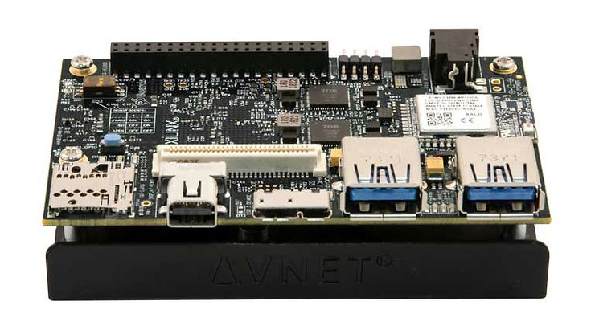
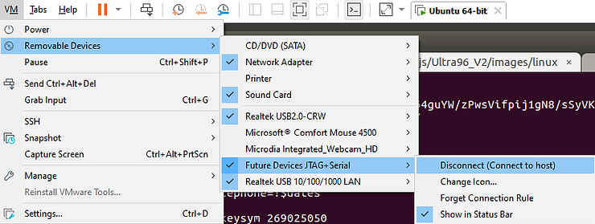
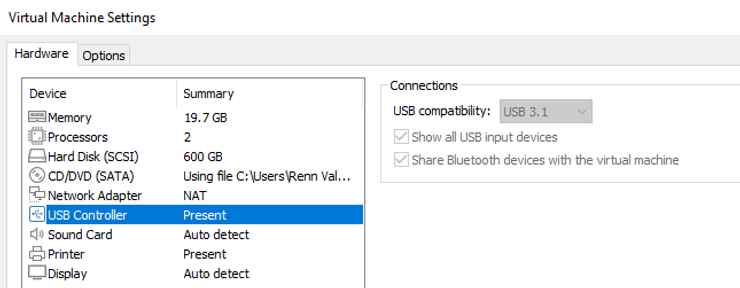
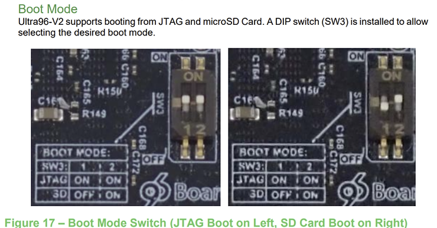
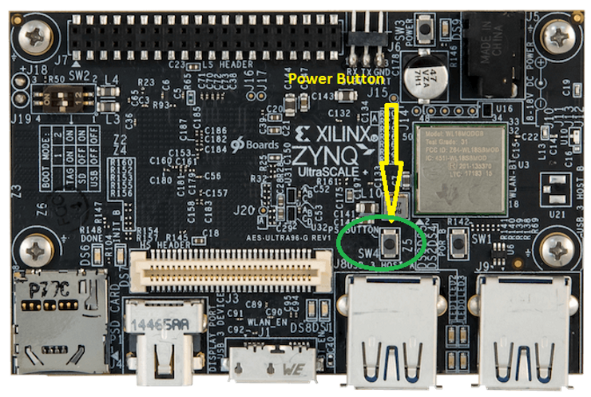

# PetaLinux Build Guide for Ultra96-V2 Avnet out of box BSP 2018.3



Build Steps

-   [<u><span>PetaLinux Tools Build Guide for Ultra96-V2 Avnet out of box BSP 2018.3</span></u>](https://www.centennialsoftwaresolutions.com/post/petalinux-build-guide-for-ultra96-v2-avnet-out-of-box-bsp-2018-3)
    
-   [<u><span>Build First Stage Bootloader (FSBL) for Ultra96 V2</span></u>](https://www.centennialsoftwaresolutions.com/post/how-to-build-first-stage-bootloader-fsbl-for-ultra96-v2)
    
-   [<u><span>Build Platform Management Unit firmware PMUFW) for Ultra96 V2</span></u>](https://www.centennialsoftwaresolutions.com/post/how-to-build-platform-management-unit-firmware-pmufw-for-ultra96-v2)
    
-   [<u><span>Build Arm Trusted Firmware (ATF) for Ultra96 V2</span></u>](https://www.centennialsoftwaresolutions.com/post/how-to-build-arm-trusted-firmware-for-ultra96-v2)
    
-   [<u><span>Build U-Boot for Ultra96 V2</span></u>](https://www.centennialsoftwaresolutions.com/post/how-to-build-u-boot-for-ultra96-v2)
    
-   [<u><span>Build Petalinux Kernel for Ultra96 V2</span></u>](https://www.centennialsoftwaresolutions.com/post/how-to-build-petalinux-kernel-for-ultra96-v2)
    
-   [<u><span>Build Root File System for Ultra96 V2</span></u>](https://www.centennialsoftwaresolutions.com/post/how-to-build-rootfs-for-ultra96-v2)
    

## System Requirements

-   Host OS: Ubuntu 16:04 LTS
    
-   CPU: 4 core or more recommended
    
-   RAM: Minimum 8GB
    
-   Storage: 30GB or more
    
-   Internet Connection
    

## Download Required Files

Download petalinux 2018.3 installer

https://www.xilinx.com/member/forms/download/xef.html?filename=petalinux-v2018.3-final-installer.run 

Download Avnet out of box BSP 2018.3

[ultra96v2_oob_2018_3.zip](https://www.avnet.com/wps/wcm/connect/onesite/3d0e9623-2279-4c2b-a5e6-bfeab6da7d5d/ultra96v2_oob_2018_3.zip?MOD=AJPERES&CVID=nxFYcYf&CVID=nxFYcYf&CVID=nxFYcYf&CVID=nxFYcYf&CVID=nxFYcYf&CVID=nxBqzE6&CVID=nxBqzE6) (Unzip this file in the Downloads folder for use in a later step)

## Prepare ubuntu build environment.

Install dependent packages

```
sudo apt-get install gawk xvfb chrpath socat autoconf libtool git texinfo zlib1g-dev gcc-multilib libsdl1.2-dev libglib2.0-dev
```

Install Library

```
sudo apt-get install libncurses5-dev libncursesw5-dev libssl-dev zlib1g:i386
```

Install Minicom so you can view output from JTAG

```
sudo apt-get install minicom
```

## **Install PetaLinux SDK**

Change the access permissions to the file "[petalinux-v2018.3-final-installer.run](https://www.xilinx.com/member/forms/download/xef.html?filename=petalinux-v2018.3-final-installer.run)" which should be in your Downloads folder using the command:

```
chmod +x petalinux-v2018.3-final-installer.run
```

Run the installer - you may change the directory to whatever folder you want:

```
./petalinux-v2018.3-final-installer.run /opt/pkg/petalinux/2018.3 
```

Accept License Agreements when prompted. (NOTE: you need to view each document and confirm with "y" to move on - Hit "g" between documents to skip to the next one)

## **Build The PetaLinux Distribution**

## Create a new project

-   Setup PetaLinux Environment by setting the source path to the version of PetalLinux you're using as you may have more than one version installed. Here is a sample pathway to the install we did earlier.
    

```
source /opt/pkg/petalinux/2018.3/settings.sh 
```

-   Create Project from Ultra96 BSP where --name is the name of your new project (You should run this command in your project folders and this will create a new folder with your project name)
    

```
petalinux-create -t project -s ~/Downloads/ultra96v2_oob_2018_3.bsp --name Ultra96_V2  
```

NOTE: The path is the folder you downloaded the file in the previous step and the name will create a new folder with that project name  

## Start the Build

Change folders to your new project folder

```
cd Ultra96_V2
```

Build the project

```
petalinux-build
```

## Create BOOT.BIN

```
petalinux-package --boot --fsbl images/linux/zynqmp_fsbl.elf --fpga images/linux/system.bit --pmufw images/linux/pmufw.elf --u-boot
```

## Flash micro-SDCard

\*\*All files required for this step will be present at /images/linux/ once the build is completed\*\*

First format the SD card properly, then we will copy the files to the SD card.

-   **1st method**. Flash ultra96-V2 Factory image which will correctly format the SD card so you can copy the newly built images.
    
-   Download following instruction [Write the Ultra96-V2 Factory Image to microSD Card](https://www.avnet.com/wps/wcm/connect/onesite/7339b7a6-0c1c-4bf4-bf60-8e53898ab358/Ultra96v2_Factory_Image_Write_190611.zip?MOD=AJPERES&CVID=nxs6V57&CVID=nxs6V57&CVID=nxs6V57)
    

**Software**

The software required for this tutorial is:

Etcher -- https://etcher.io/

Decompression utility, such as 7-zip

NOTE: This method is used to format the card - we will copy our own image over the files it creates, but if you just wanted to boot the Ultra96\_V2 out of the box this will do that as it copies Avnet's files to the SD card for you. The process of manually moving the files over to the SD card is a good skill to have as you may create your own boot images down the line and must understand the process.

If you've used Linux tools like GParted in the past, please move to the second method.

-   **2nd method.** If you're familiar with Linux tools such as fdisk, GParted, gnome-disks etc. Format the SD Card with the following layout. If you've never used these to format an SD card then using the first method is easier.
    
    -   Partition 1:
        
        -   Format: FAT32
            
        -   Size: 1GB
            
        -   Label: BOOT
        
    -   Partition 2:
        
        -   Format: ext4
            
        -   Size: 4GB or more
            
        -   Label: root
            

## Copy Boot files

Change folders to you project folder.

```
cd /plxprjs/Ultra96_V2/images/linux
```

if you used a different name, use your folder where I have /plxprjs/Ultra96\_V2/

Now we will copy the boot.bin to our flash drive

```
cp BOOT.BIN /media/{user}/BOOT 
```

NOTE: Where it says "{user}" change to your mount point which can be located by looking at the properties of your mounted flash drive - this could be your user name or computer name.

```
cp image.ub /media/{user}/BOOT
```

## Flash rootfs Partition

**1st method**

First delete any files that might be on the partition

```
sudo rm -rf /media/{user}/root/*
```

Then Flash the root file system

```
sudo tar -xf rootfs.tar.gz -C /media/{user}/root
```

NOTE: Where it says "{user}" change to your mount point which can be located by looking at the properties of your mounted flash drive

**2nd method**

This method uses a low level DD copy directly to the drive so there is no need to clear the files. You can discover what your drive is by hooking up your USB to the computer and typing in this command.

```
ls /dev/sd*
OUTPUT - you can see all the drives
/dev/sda  /dev/sda1  /dev/sdb  /dev/sdb1  /dev/sdb2
```

Now copy the root file system

```
sudo dd if=rootfs.ext4 of=/dev/sdb2 sync
```

At this point you have successfully flashed the root partition with the new file system

## Booting the Ultra96 V2 with the new root file system installed

[#1](https://www.centennialsoftwaresolutions.com/blog/hashtags/1) Place SD card into the Ultra96 SD drive port

[#2](https://www.centennialsoftwaresolutions.com/blog/hashtags/2) Connect the USB cable to the Ultra96

[#3](https://www.centennialsoftwaresolutions.com/blog/hashtags/3) Connect the USB cable to your host machine and make sure that it is connected (If you're using a VMware session this is under VMware removable devices and must be connected using USB 3.0





[#4](https://www.centennialsoftwaresolutions.com/blog/hashtags/4) Change the switches on SW3 for SD card as shown below (we will do a JTAG boot in a later blog post)



[#5](https://www.centennialsoftwaresolutions.com/blog/hashtags/5) Open up a terminal and set the file path to Petalinux 2018.3

```
source /opt/pkg/petalinux/2018.3/settings.sh 
```

[#6](https://www.centennialsoftwaresolutions.com/blog/hashtags/6) Check available serial ports

```
ls -l /dev/ttyUSB*
```

Should look like something like this...

crw-rw---- 1 root dialout 188, 1 Apr 28 13:36 /dev/ttyUSB1

[#7](https://www.centennialsoftwaresolutions.com/blog/hashtags/7) Setup Minicom and launch

```
sudo minicom -s
```

[#8](https://www.centennialsoftwaresolutions.com/blog/hashtags/8) Edit the serial port to match the output of the connected port

```
            +-----[configuration]------+
            | Filenames and paths      |
            | File transfer protocols  |
            | Serial port setup        |
            | Modem and dialing        |
            | Screen and keyboard      |
            | Save setup as dfl        |
            | Save setup as..          |
            | Exit                     |
            | Exit from Minicom        |
            +--------------------------+
```

```
 A -    Serial Device      : /dev/ttyUSB1  
```

verify hardware flow is "No"

```
F - Hardware Flow Control : No   
```

Save as dfl file

```
 Save setup as dfl 
```

Exit and that will launch the Minicom terminal.

[#9](https://www.centennialsoftwaresolutions.com/blog/hashtags/9) Power on the Ultra96 and watch it boot in the minicom terminal



```
Starting Telephony daemon
Starting Linux NFC daemon
Starting tcf-agent: OK

PetaLinux 2018.3 ultra96v2-oob-2018-3 /dev/ttyPS0

ultra96v2-oob-2018-3 login: root
Password: 
```

## **Congratulations, you have successfully booted the Ultra 96 V2 off the new root file system.**