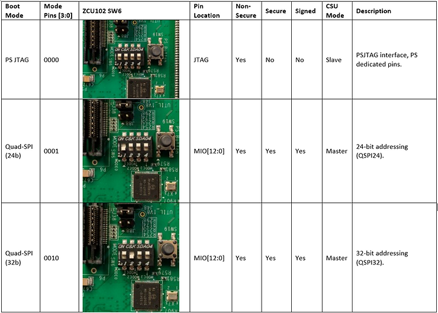
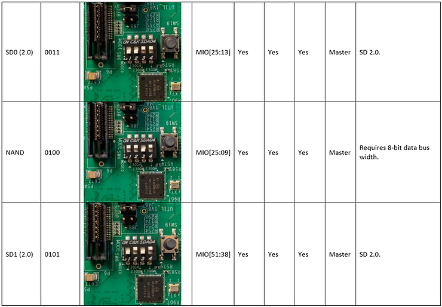
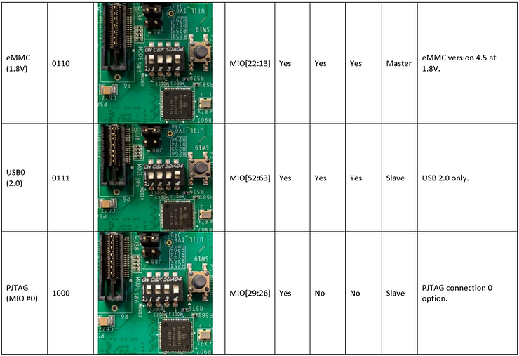
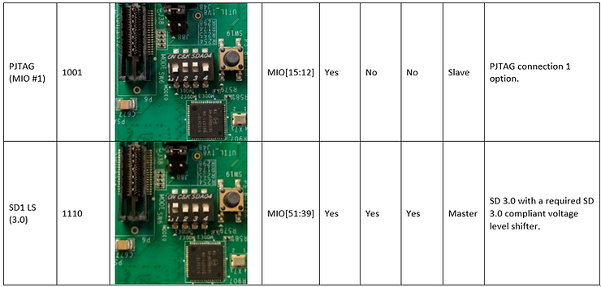

# Pictures of SW6 for every ZCU102 Zynq UltraScale+ MPSoC Boot Mode

This post shows pictures of setting SW6 on the ZCU102 to every boot mode that the Zynq UltraScale+ MPSoC supports.

Files for post at \[[link](https://drive.google.com/open?id=1wCCpDEmOhSjDTBv642QxYfaZ7XQmIj8_)\].

**<u>References</u>**

-   Table info from the <u>Zynq UltraScale+ Device Technical Reference Manual</u> UG1085 (v1.8) August 3, 2018 at \[[link](https://www.xilinx.com/support/documentation/user_guides/ug1085-zynq-ultrascale-trm.pdf)\]
    
-   The Xilinx graphic is from \[[link](https://pbs.twimg.com/profile_images/535545777020338176/pEWdIYq__400x400.png)\]