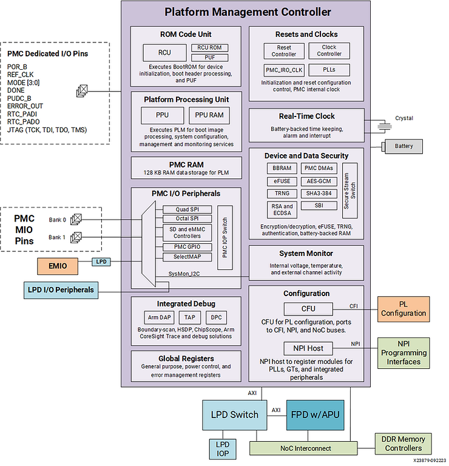
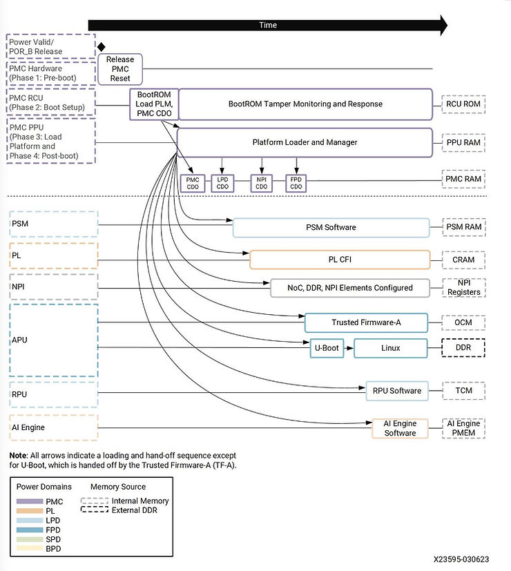
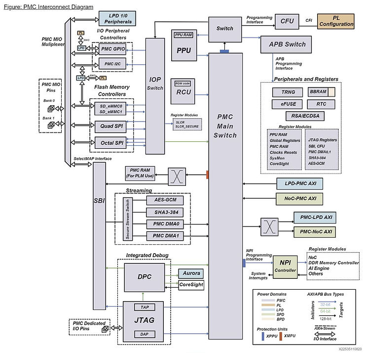
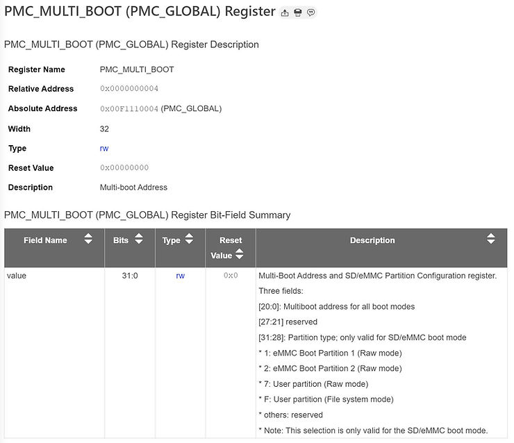

# PMC vs. PSM?

This post discusses the AMD Versal PMC vs. PSM. At a high level, the PMC (Platform Management Controller) controls boot, and the PSM (Platform System Controller) controls power. A processor in the PMC, the PMC PPU, loads the PSM and "releases it" to run. This post goes into more detail about each.

This post uses the non-secure boot process to explain more about the PMC and PSM using information from the Versal Adaptive SoC Technical Reference Manual (AM011) at https://docs.amd.com/r/en-US/am011-versal-acap-trm and the Versal Adaptive SoC System Software Developers Guide (UG1304) at https://docs.amd.com/r/en-US/ug1304-versal-acap-ssdg.

Knowing that the PMC is the first thing that can run your code is helpful when creating a Versal "Hello, World!" project with Vitis.

## Platform Management Controller (PMC)

### Legacy

The PMC replaces the MPSoC's CSU and PMU.

### PMC Blocks

The PMC contains:

-   An **RCU triple modular redundancy (TMR) MicroBlaze processor** with a dedicated RCU BootROM for initial device boot and tamper monitoring
    
-   A Platform Processing Unit (PPU) **TMR MicroBlaze processor**  
    
-   A system monitor (SYSMON) with temperature and power supply monitoring  
    
-   Global registers capture general-purpose, power, and error conditions.  
    
-   Two streaming DMAs to transfer data within the system for security configuration and processing
    

Reference

https://docs.amd.com/r/en-US/am011-versal-acap-trm/Features?tocId=I0EiFyg62dAR6fniQs6p2w

### PMC Power Domain

The PMC is located in its own power domain.

### Platform Management Controller Block Diagram

Reference https://docs.amd.com/viewer/attachment/dwmjhDJGICdJqD4swyVzcQ/phCA4b2gWBDwo4QWRWUShg

### PMC Boot

The PMC has three functional blocks that control the boot process:

-   PMC hardware dedicated state machines
    
-   PMC ROM Code Unit (RCU)
    
-   PMC Platform Processing Unit (PPU)
    

The PMC is the first place code runs. Here's the non-secure boot flow:

Reference

https://docs.amd.com/r/en-US/am011-versal-acap-trm/Non-Secure-Boot-Flow

## The PMC Interconnect

This is a redrawn version of https://docs.amd.com/r/en-US/am011-versal-acap-trm/PMC-Interconnect-Diagram.

## PMC Boot Steps

### Step 1

As mentioned above, the PMC hardware dedicated state machines run.

### Step 2

Then PMC ROM Code Unit (RCU), aka the **BootROM**, does this:

1.  Configures the system for boot
    
    1.  Initializes PMC blocks such as the System Monitor and the PMC PLLs.
        
    2.  Checks for voltage, bail if error
        
    3.  Checks PLL lock, bail if error
    
2.  Reads the Boot Mode Register (BMR)
    
3.  Accesses the boot device
    
    1.  if (BMR is JTAG or SBI boot mode)
        
    2.  Enables the SelectMAP or JTAG interface path
        
    3.  The RCU hands control to the user to load the Programmable Device Image (PDI)
        
    4.  else if ( BMR is boot interface and finds string **XLNX 0x584c4e5**8 in boot interface )
        
    5.  Check boot header checksum
        
    6.  if ( checksum valid )
        
        1.  Load the rest of the Programmable Device Image (PDI) boot header into the PPU RAM
            
        2.  **Load the Platform Loader and Manager (PLM) into the PPU RAM and hand control over to the PPU RAM**
        
    7.  else # search for string **XLNX 0x584c4e58** in the boot device
        
        1.  if not found and the boot mode is OSPI or QSPI
            
            1.  Increment PMC\_MULTI\_BOOT by 1 32 KB (check if inc by 1 or 32)  
                
            2.  Try again at the next 32 KB boundary
                
            3.  Check boot header checksum
                
            4.  if ( checksum valid )
            
        2.  Load the rest of the Programmable Device Image (PDI) boot header into the PPU RAM
            
        3.  **Load the Platform Loader and Manager (PLM) into the PPU RAM and hand control over to the PPU RAM**
            
        4.  else if not found and the boot mode is SD or eMMC boot
            
            1.  Search the 8191 FAT files for the identification string.
                
            2.  Check boot header checksum
                
            3.  if ( checksum valid )
            
        5.  Load the rest of the Programmable Device Image (PDI) boot header into the PPU RAM
            
        6.  **Load the Platform Loader and Manager (PLM) into the PPU RAM and hand control over to the PPU RAM**
        
    8.  If **XLNX 0x584c4e5** is never found
        
    9.  The RCU goes into lockdown
        
    10.  ERROR\_OUT pin is set
    

### Note

The PMC\_MULTI\_BOOT register is defined as follows.

Reference

https://docs.amd.com/r/en-US/am012-versal-register-reference/PMC_MULTI_BOOT-PMC_GLOBAL-Register

### Step 3

Once given control, the **PLM**

1.  loads the remainder of PDI content (Images and partitions) from the primary boot device.
    

Reference

https://docs.amd.com/r/en-US/ug1304-versal-acap-ssdg/Boot-Device-Modes 

## Processing System Manager (PSM)

The Processing System Manager (PSM) is a **triple-redundant 32-bit MicroBlaze** in the Low Power Domain (LPD) that controls "Platform Management Services," including controlling PS power islands when system software writes PSM global registers.

Reference

### PSM Power Domain

The **PSM** is located in the **LPD Power Domain**.

### PSM System Functions

The Global Register Set can be used to help control and communicate the status for these functions:

-   Processor controls and status
    
    -   Major subsystem power up and down in Power and Isolation Requests
        
    -   Subsystem and controller resets in Reset Service Requests
    
-   Boot-related errors detected
    
-   General storage registers
    
-   Test and debug CoreSight Wake-Up Requests
    
-   PL reconfiguration in Dynamic Function eXchange (DFX) sections
    

The PSM takes requests to power up and down these power islands:

-   APU core
    
-   APU core
    
-   APU L2 cache
    
-   RPU core
    
-   RPU core
    
-   RPU 0 TCM A
    
-   RPU 0 TCM B
    
-   RPU 1 TCM A
    
-   RPU 1 TCM B
    
-   OCM Bank 0
    
-   OCM Bank 1
    
-   OCM Bank 2
    
-   OCM Bank 3
    
-   GEM1
    
-   GEM0
    
-   FPD
    

Note: the PSM does not control the PMC, LPD, PL, SPD, and BPD power domains.

The PSM can wake up:

-   APU core 0
    
-   APU core 1
    
-   RPU core 0
    
-   RPU core 1
    
-   USB 2.0
    
-   APU core 0 CoreSight
    
-   APU core 1 CoreSight
    

## PMC vs. PSM?

PMC vs. PSM? In summary, the PMC is the first element to boot and controls boot. It orchestrates loading code into memories local to other processors and starting those processors. The PSM controls power domains. It "takes requests" from around the chip to power up, power down, and perform isolation services via the PSM Global Register. The PSM Global Register absolute address is 0x00FFC90000.

Reference

https://docs.amd.com/r/en-US/am011-versal-acap-trm/Power-Islands?tocId=iJL7AhKO5n~XJBLNqUvHGw