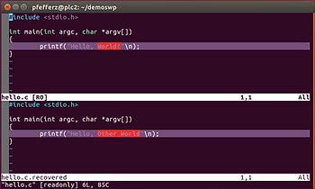

# Practice Recovering a File in Vim


This post lists steps that allow you to practice file recovery in Vim.

**Steps**

**1.** Open a terminal, create a directory and start editing a file named hello.c:

```
mkdir demoswp
cd demoswp
vim hello.c
```

**2.** Put this text in the file:

```
#include <stdio.h>

int main(int argc, char *argv[])
{
	printf("Hello, World!\n");
}
```

**3.** Save the file in Vim:

```
:w
```

**4.** Make a change to the file but \_don't\_ save:

```
#include <stdio.h>

int main(int argc, char *argv[])
{
	printf("Hello, Other World!\n");
}
```

**5.** Close the terminal.

6.

```
cd demoswp
vim hello.c
```

You should see:

```
E325: ATTENTION
Found a swap file by the name ".hello.c.swp"
          owned by: pfefferz   dated: Sun Apr  1 12:09:22 2018
         file name: ~pfefferz/demoswp/hello.c
          modified: YES
         user name: pfefferz   host name: plc2
        process ID: 4085
While opening file "hello.c"
             dated: Sun Apr  1 12:08:44 2018

(1) Another program may be editing the same file.  If this is the case,
    be careful not to end up with two different instances of the same
    file when making changes.  Quit, or continue with caution.
(2) An edit session for this file crashed.
    If this is the case, use ":recover" or "vim -r hello.c"
    to recover the changes (see ":help recovery").
    If you did this already, delete the swap file ".hello.c.swp"
    to avoid this message.

Swap file ".hello.c.swp" already exists!
[O]pen Read-Only, (E)dit anyway, (R)ecover, (D)elete it, (Q)uit, (A)bort: 
```

**7.** Type 'Q' to quit

**8.** Open the file in recovery mode:

```
vim -r hello.c
```

You should see:

```
Using swap file ".hello.c.swp"
Original file "~/demoswp/hello.c"
Recovery completed. You should check if everything is OK.
(You might want to write out this file under another name
and run diff with the original file to check for changes)
You may want to delete the .swp file now.

Press ENTER or type command to continue
```

**9.** After pressing ENTER, write the file out to check the recovery:

```
:w hello.c.recovered
```

10.

```
:e! #
:diffsp hello.c
```

**10.1** When you see the following type **'O'**

```
E325: ATTENTION
Found a swap file by the name ".hello.c.swp"
          owned by: pfefferz   dated: Sun Apr  1 12:09:22 2018
         file name: ~pfefferz/demoswp/hello.c
          modified: YES
         user name: pfefferz   host name: plc2
        process ID: 4085
While opening file "hello.c"
             dated: Sun Apr  1 12:08:44 2018

(1) Another program may be editing the same file.  If this is the case,
    be careful not to end up with two different instances of the same
    file when making changes.  Quit, or continue with caution.
(2) An edit session for this file crashed.
    If this is the case, use ":recover" or "vim -r hello.c"
    to recover the changes (see ":help recovery").
    If you did this already, delete the swap file ".hello.c.swp"
    to avoid this message.

Swap file ".hello.c.swp" already exists!
[O]pen Read-Only, (E)dit anyway, (R)ecover, (D)elete it, (Q)uit, (A)bort: 
```

**10.2** Now you should see:



Control-w j and Control-w k will let you switch between the windows

**11.** To exit diff mode type:

```
:diffoff!
```

**11.1** To remove one of the windows use Control-w j or Control-w k to enter the window then type **ZZ**.

**12.** Now find and save the right buffer. Find the right buffer:

```
:ls
```

At the following, press '2':

```
:ls
  1 # =  "hello.c"                      line 1
  2 %a   "hello.c.recovered"            line 5
Press ENTER or type command to continue
```

**13.** Now delete the swap file.

**13.1** Edit the file

```
:e hello.c
```

**13.2** At this screen type 'D' to delete:

```
E325: ATTENTION
Found a swap file by the name ".hello.c.swp"
          owned by: pfefferz   dated: Sun Apr  1 12:09:22 2018
         file name: ~pfefferz/demoswp/hello.c
          modified: YES
         user name: pfefferz   host name: plc2
        process ID: 4085
While opening file "hello.c"
             dated: Sun Apr  1 12:08:44 2018

(1) Another program may be editing the same file.  If this is the case,
    be careful not to end up with two different instances of the same
    file when making changes.  Quit, or continue with caution.
(2) An edit session for this file crashed.
    If this is the case, use ":recover" or "vim -r hello.c"
    to recover the changes (see ":help recovery").
    If you did this already, delete the swap file ".hello.c.swp"
    to avoid this message.

Swap file ".hello.c.swp" already exists!
[O]pen Read-Only, (E)dit anyway, (R)ecover, (D)elete it, (Q)uit, (A)bort: 
```

**14.** Now:

1.  Overwrite **hello.c** with **hello.c.recovered**,

2.  Delete the **hello.c.recovered** buffer

3.  ...and delete the **hello.c**.recovered file

```
:e hello.c.recovered
:w! hello.c
:bdelete hello.c.recovered
:!rm hello.c.recovered
```

```
:!ls -a
```

**15.** Check that everything is cleaned up. Run:

You should see

```
.  ..  hello.c	.hello.c.swp

Press ENTER or type command to continue
```

**References**

-   Steps adapted from the Vim user doc @ [link](http://vimdoc.sourceforge.net/htmldoc/usr_11.html).
    
-   The Vim logo is from [link](http://commons.wikimedia.org/wiki/File:Vimlogo.svg).
    
-   Used the HTML escape feature at [FreeFormatter.com](http://www.freeformatter.com/html-escape.html) for the code blocks.