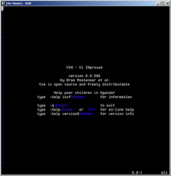
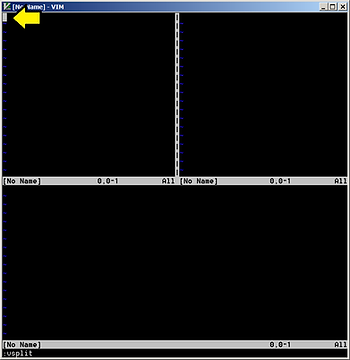
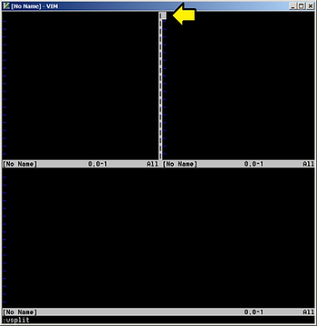
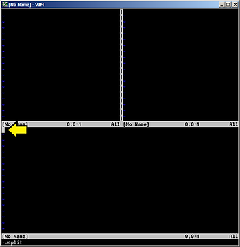
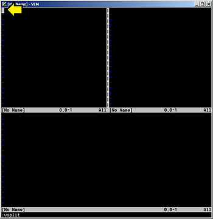
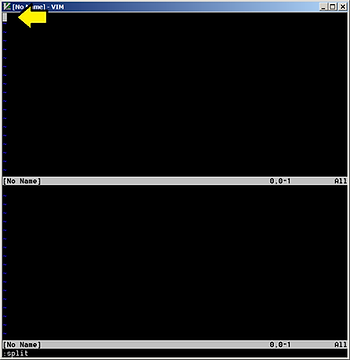

# Practice Splitting a Window Horizontally and Vertically, Moving Between the Windows and Closing Them


This post allows you to practice splitting a window horizontally and vertically, moving between the windows and closing the windows.

**TL;DR**

```
:split
:vsplit
Control-w l
Control-w j
Control-w k
ZZ
ZZ
:q
```

**Steps**

**1.** Run Vim

You'll see:



**2.** Split the screen horizontally by typing:

```
:split
```

You'll see the following. The cursor will be where the yellow arrow points.


Note: the cursor is in the upper window

**3.** Split the screen vertically by typing:

```
:vsplit
```

You'll see the following. The cursor will be where the yellow arrow points.



Note: the cursor is in the upper left window

**4.** Move right by typing:

```
Control-w l
```

You'll see the following. The cursor will be where the yellow arrow points.



**5.** Move down by typing:

```
Control-w j
```

You'll see the following. The cursor will be where the yellow arrow points.



**6.** Move up by typing:

```
Control-w k
```

You'll see the following. The cursor will be where the yellow arrow points.



**7.** Close the window by typing:

```
ZZ
```

You'll see the following. The cursor will be where the yellow arrow points.



**8.** Close the other window by typing:

```
ZZ
```

You'll see the following. The cursor will be where the yellow arrow points.


**9.** Quit Vim by typing:

\:q

**Alternative Split Commands\***

```
:split
:sp
Control-w s
Control-w Control-s
```

Horizontal Split 

Vertical Split

```
:vsplit
:vs
Control-w v
Control-w Control-v
```

**Reference**

-   \*Thanks [alfunx](http://www.reddit.com/user/alfunx) and others that replied to my reddit [post](http://www.reddit.com/r/vim/comments/89isi7/practice_splitting_a_window_horizontally_and/?st=jfljm7p9&sh=23622a20) for the alternative split commands
    
-   Used Windows Vim
    
-   The Vim logo is from [link](http://commons.wikimedia.org/wiki/File:Vimlogo.svg)