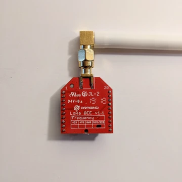
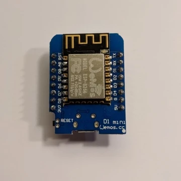
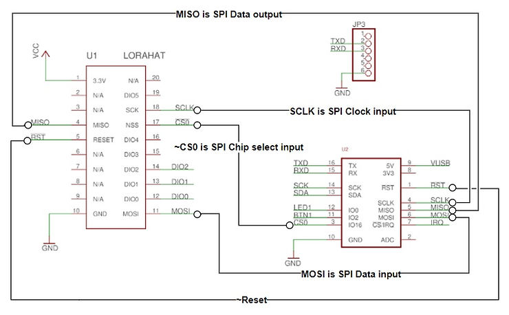

# Read LoRa BEE v1.1 Registers from a WeMos D1 Mini





This post lists the steps and code to dump the LoRa BEE v1.1 registers from a WeMos D1 Mini over SPI.

**<u><span>Prerequisites</span></u>**

1\. Follow **Get and Install the 64-bit Arduino 1.8.7 IDE on Ubuntu 16.04.3** at \[[<u><span>link</span></u>](https://www.centennialsoftwaresolutions.com/blog/get-and-install-the-64-bit-arduino-1-8-7-ide-on-ubuntu-16-04-3)\]

2\. Follow **Arduino IDE WeMos D1 Mini Board Support Install & Blink LED Instructions** at \[[<u><span>link</span></u>](https://www.centennialsoftwaresolutions.com/blog/arduino-ide-wemos-d1-mini-board-support-install-blink-led-instructions)\]

3\. If you see the **espcomm\_open failed** error after clicking **Upload** follow \[[<u><span>link</span></u>](https://www.centennialsoftwaresolutions.com/blog/error-espcomm_open-failed)\] to try and fix it

4\. Connect the WeMos D1 Mini to the LoRa BEE v1.1 using the following connections:



**<u><span>Code</span></u>**

Use the following code:

```
#include 

#define CSBAR D0

#define REG_VERSION 0x42

void selectreceiver()
{
  digitalWrite(CSBAR, LOW);
}


void unselectreceiver()
{
  digitalWrite(CSBAR, HIGH);
}

byte readRegister(byte addr)
{
  selectreceiver();
  SPI.beginTransaction(SPISettings(10000000, MSBFIRST, SPI_MODE0));
  SPI.transfer(addr & 0x7F);
  uint8_t res = SPI.transfer(0x00);
  SPI.endTransaction();
  unselectreceiver();
  return res;
}

void setup()
{ 
  Serial.begin(9600);
  Serial.println("\n\nWake up");
  
  // put your setup code here, to run once:
  pinMode(CSBAR, OUTPUT);
  SPI.begin();

  // Read the version
  byte version = readRegister(REG_VERSION);
  Serial.print("Read version: 0x"); Serial.print(version, HEX); Serial.println();

  // Dump the registers
  for (int reg; reg <= 0x70; reg++) {
    Serial.print("Reg: 0x"); Serial.print(reg, HEX); Serial.print(" ");
    Serial.print("Val: 0x"); Serial.print(readRegister(reg), HEX); Serial.println();
  } 

  // Read the version  
}

void loop() {
  // put your main code here, to run repeatedly:

}
```

1\. Compile it

2\. Download it

On the Serial Monitor you should see:

```
Wake up
Read version: 0x12
Reg: 0x0 Val: 0x0
Reg: 0x1 Val: 0x9
Reg: 0x2 Val: 0x1A
Reg: 0x3 Val: 0xB
Reg: 0x4 Val: 0x0
Reg: 0x5 Val: 0x52
Reg: 0x6 Val: 0x6C
Reg: 0x7 Val: 0x80
Reg: 0x8 Val: 0x0
Reg: 0x9 Val: 0x4F
Reg: 0xA Val: 0x9
Reg: 0xB Val: 0x2B
Reg: 0xC Val: 0x20
Reg: 0xD Val: 0x8
Reg: 0xE Val: 0x2
Reg: 0xF Val: 0xA
Reg: 0x10 Val: 0xFF
Reg: 0x11 Val: 0x70
Reg: 0x12 Val: 0x15
Reg: 0x13 Val: 0xB
Reg: 0x14 Val: 0x28
Reg: 0x15 Val: 0xC
Reg: 0x16 Val: 0x12
Reg: 0x17 Val: 0x47
Reg: 0x18 Val: 0x32
Reg: 0x19 Val: 0x3E
Reg: 0x1A Val: 0x0
Reg: 0x1B Val: 0x0
Reg: 0x1C Val: 0x0
Reg: 0x1D Val: 0x0
Reg: 0x1E Val: 0x0
Reg: 0x1F Val: 0x40
Reg: 0x20 Val: 0x0
Reg: 0x21 Val: 0x0
Reg: 0x22 Val: 0x0
Reg: 0x23 Val: 0x0
Reg: 0x24 Val: 0x5
Reg: 0x25 Val: 0x0
Reg: 0x26 Val: 0x3
Reg: 0x27 Val: 0x93
Reg: 0x28 Val: 0x55
Reg: 0x29 Val: 0x55
Reg: 0x2A Val: 0x55
Reg: 0x2B Val: 0x55
Reg: 0x2C Val: 0x55
Reg: 0x2D Val: 0x55
Reg: 0x2E Val: 0x55
Reg: 0x2F Val: 0x55
Reg: 0x30 Val: 0x90
Reg: 0x31 Val: 0x40
Reg: 0x32 Val: 0x40
Reg: 0x33 Val: 0x0
Reg: 0x34 Val: 0x0
Reg: 0x35 Val: 0xF
Reg: 0x36 Val: 0x0
Reg: 0x37 Val: 0x0
Reg: 0x38 Val: 0x0
Reg: 0x39 Val: 0xF5
Reg: 0x3A Val: 0x20
Reg: 0x3B Val: 0x82
Reg: 0x3C Val: 0xFB
Reg: 0x3D Val: 0x2
Reg: 0x3E Val: 0x80
Reg: 0x3F Val: 0x40
Reg: 0x40 Val: 0x0
Reg: 0x41 Val: 0x0
Reg: 0x42 Val: 0x12
Reg: 0x43 Val: 0x24
Reg: 0x44 Val: 0x2D
Reg: 0x45 Val: 0x0
Reg: 0x46 Val: 0x3
Reg: 0x47 Val: 0x0
Reg: 0x48 Val: 0x4
Reg: 0x49 Val: 0x23
Reg: 0x4A Val: 0x0
Reg: 0x4B Val: 0x9
Reg: 0x4C Val: 0x5
Reg: 0x4D Val: 0x84
Reg: 0x4E Val: 0x32
Reg: 0x4F Val: 0x2B
Reg: 0x50 Val: 0x14
Reg: 0x51 Val: 0x0
Reg: 0x52 Val: 0x0
Reg: 0x53 Val: 0x10
Reg: 0x54 Val: 0x0
Reg: 0x55 Val: 0x0
Reg: 0x56 Val: 0x0
Reg: 0x57 Val: 0xF
Reg: 0x58 Val: 0xE0
Reg: 0x59 Val: 0x0
Reg: 0x5A Val: 0xC
Reg: 0x5B Val: 0xFA
Reg: 0x5C Val: 0x7
Reg: 0x5D Val: 0x0
Reg: 0x5E Val: 0x5C
Reg: 0x5F Val: 0x78
Reg: 0x60 Val: 0x0
Reg: 0x61 Val: 0x19
Reg: 0x62 Val: 0xC
Reg: 0x63 Val: 0x4B
Reg: 0x64 Val: 0xCC
Reg: 0x65 Val: 0xE
Reg: 0x66 Val: 0x7F
Reg: 0x67 Val: 0x20
Reg: 0x68 Val: 0x4
Reg: 0x69 Val: 0x47
Reg: 0x6A Val: 0xAF
Reg: 0x6B Val: 0x3F
Reg: 0x6C Val: 0xBD
Reg: 0x6D Val: 0x0
Reg: 0x6E Val: 0x26
Reg: 0x6F Val: 0xB
Reg: 0x70 Val: 0xD0
```

**<u><span>References</span></u>**

-   HopeRF RFM95/96/97/98(W) datasheet at \[[<u><span>link</span></u>](http://www.hoperf.com/upload/rf/RFM95_96_97_98W.pdf)\]
    
-   Semtech LoRa SX1276/77/78/79 datasheet at \[[<u><span>link</span></u>](https://www.semtech.com/uploads/documents/DS_SX1276-7-8-9_W_APP_V5.pdf)\]
    
-   ESP-8266EX Datasheet at \[[<u><span>link</span></u>](https://www.espressif.com/sites/default/files/documentation/0a-esp8266ex_datasheet_en.pdf)\]
    
-   ESP-1ch-Gateway-ver-2.0 at \[[<u><span>link</span></u>](https://github.com/platenspeler/ESP-1ch-Gateway-ver-2.0)\]
    
-   D1 mini A mini wifi board with 4MB flash based on ESP-8266EX at \[[<u><span>link</span></u>](https://wiki.wemos.cc/products:d1:d1_mini?do=)\]
    
-   Arduino icon clipped from \[[<u><span>link</span></u>](https://www.arduino.cc/)\]