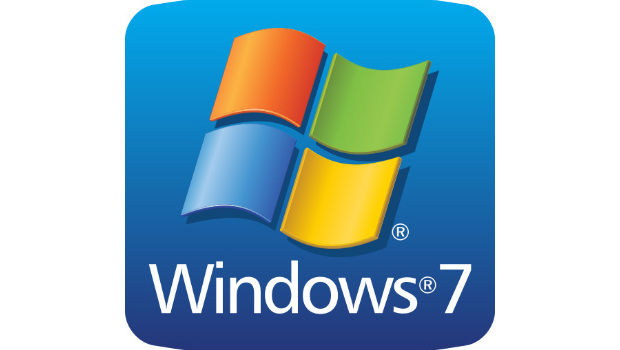
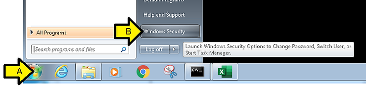
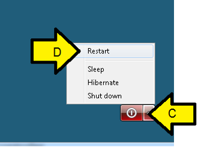

# Reboot Windows 7 Remotely over RDP

This post shows how to restart Windows 7 over RDP.

A. Click **Windows**

B. Click **Windows Security**

C. Expand the red **Power Off** button

D. Click **Restart**

E. Wait a few minutes

F. Log back in over RDP

**References**

Windows 7 logo form \[[link](http://www.techcentral.ie/wp-content/uploads/2014/08/Windows_7_Logo.jpg)\]