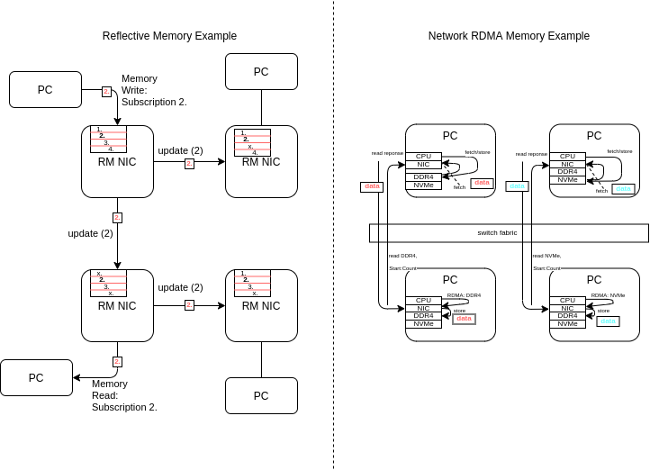
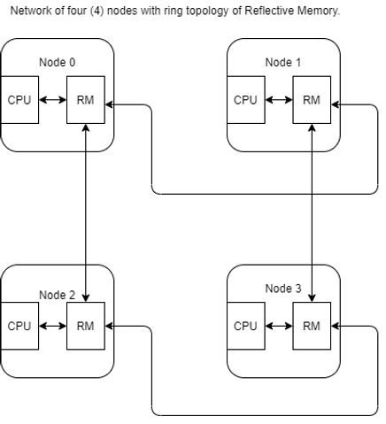
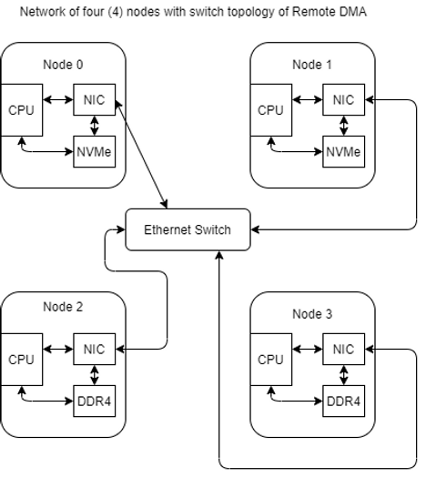
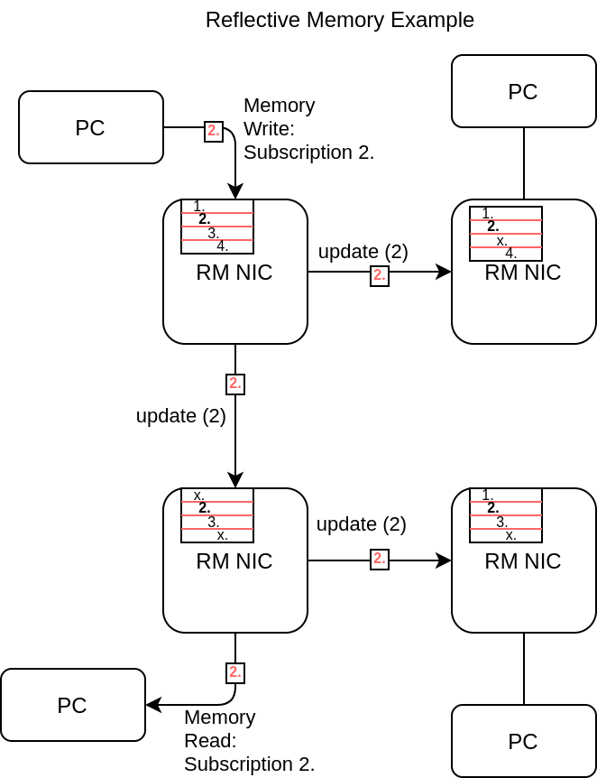
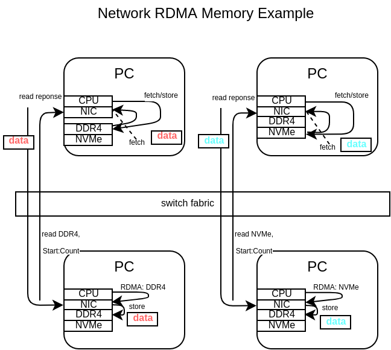

# Reflective and Remote Memory Concepts

Of the categories of remote memory access in the computing industry, Reflective Memory and Remote DMA (RDMA) stand out for their potential to offload the CPU for part of the data exchange. Reflective Memory is often used in High Performance Computing applications where multiple computing nodes share subscribed data values with a hard real-time deadline--that is, the data must be exchanged from the writing node to all subscribing nodes within a specified amount of time. Remote Direct Memory Access (RDMA) is often used for real-time or best-effort performance, allowing one computer to access another computer's RAM or storage, with all of the memory copies performed by the Network Interface Card (NIC), bypassing the need to interrupt the host CPU, increasing data exchange computing bandwidth and service time.

**<u>Reflective Memory</u>**

Reflective Memory is a concept developed early on during the design of computers, prior to the 2000s, and continues to be a concept for connecting shared memory between physically separate computers/computing devices. Reflective Memory (RM) is similar in concept to shared memory between processes in POSIX system programming. The difference here is that RM is shared memory between processes on separate computers. RM is not to be confused with MPI and other message-passing algorithms that cause fork/join or packets of data to be shared between multiple processes on multiple remote threads of execution. Those solutions often incur latencies/delays during synchronization that cause difficulties for applications that require real-time data exchange. RM implements a RAM synchronization over network links with hard real-time requirements. Common applications that make use of RM include scientific simulations.

**<u>Remote Direct Memory Access (RDMA)</u>**

RDMA is a different concept that allows memory (storage or RAM) to be read from or written to when the storage/memory location is on a different network Node. RDMA is Remote Direct Memory Access. The requesting Node calls an API from its operating system to the Network Interface Controller to read or write a remote location. The call to the API specifies a remote memory address, a local memory address, the operation (read or write), and a data length. The RDMA-enabled NIC then bypasses the upper layers of the OSI network stack, including TCP, and transfers the data as quickly as rapid best-effort processing will permit. Once the operation transfers the data at the NIC, the CPU is notified that the Remote DMA operation is completed. While waiting for the operation to complete, the Node CPU may compute other algorithms without being bogged down by memory copy routines.

**<u>Reflective Memory Features</u>**

Reflective Memory operates similarly to a Dual-Port SRAM. One side of the RAM is connected to the host system to read and write at any time. The other side of the RAM is connected to a networking protocol that performs reads, writes, and/or updates. The local CPU writes updates to the system-side port of the RAM, and these updates are transmitted to subscribing Nodes. The local CPU reads the system-side of the RAM, and no network traffic occurs. A remote Node writes updates to its own system-side port, and updates are transmitted to subscribing Nodes receiving on the network port of their memory. A single Node (one processing unit in the RM system) can subscribe to portions of the shared memory and ignore the other portions. Then, when a subscribed region of RAM is written to locally, other Nodes can receive the RAM contents via a real-time update; and when a subscribed region of RAM is written to remotely, the local Node of interest (and all others) subscribing to that region of RAM receive updates to their local copy.

**<u>RDMA Features</u>**

Separate from but related to RM, RDMA is one category of algorithms that can off-load the computing Node's CPU for the exchange of data in real-time with low latency and high bandwidth. RDMA is often implemented with a NIC (Network Interface Card) with an FPGA (Field-Programmable Gate Array) or ASIC (Application Specific Integrated Circuit) executing all-parallel IP (Intellectual Property) algorithms. The ASIC/FPGA IC (Integrated Circuit) contains a set of algorithms implemented in parallel and pipelined that process the lower protocol layers of Ethernet or Fibre Channel. At these lower layers of the network protocol of choice used in the network, the RDMA-enabled NIC implements an RDMA to exchange data storage, scientific key/value data pairs, or other data with the RDMA-enabled NIC of other Nodes in the network. This prevents the CPU of each Node from being bogged down with process copying algorithms for data that was exchanged. The CPU only initiates the memory copy via a Direct Memory Access API, and the NIC will off-load the CPU and exchange data with remote network Nodes communicating WRITE, READ, and SEND operations, as previously described. In this way, the CPU of each Node is "offloaded" from processing the notify, transmit, receive, and copy of real-time data. An IC on each Node's NIC performs this instead.

**<u>RDMA Example: RoCEv2</u>**

RoCEv2 (RDMA over Converged Ethernet) is one widely used RDMA protocol to enable computers within a LAN (Local Area Network) to exchange large quantities of storage data, and other data, without the need to interrupt the CPU of each Node except at completion of the data transfer. The RDMA-enabled hardware on the Node (NIC) performs the exchanges according to memory mappings. Read more about RoCEv2 at [<u>https://www.roceinitiative.org/</u>](https://www.roceinitiative.org/) .

**<u>Summary</u>**

Of the two types of remote memory exchange discussed, Reflective Memory and RDMA have found different common usages. Reflective Memory is traditionally used for High Performance Computing, such as weather simulations, and can provide the computing network with hard real-time exchanges of subscribed content. RDMA is commonly used with NVMe SSD data exchange over Ethernet in a data center, allowing multiple PCs in a rack space to access each other's mass storage via Ethernet Fiber or other protocols. This allows the RDMA-enabled machines to accomplish higher performance cloud computing features, including virtualization.

**<u>References</u>**

-   Il Joo Baek, _A survey on Reflective Memory Systems, USA: IEEE, 2002._
    
-   Milan Jovanovic, Veljko Milutinovic, _An Overview of Reflective Memory Systems,_ IEEE: 1999.
    
-   Myung Seon Ryou, et al, _Optimization of Data Accesses in Reflective Memory Systems_, IEEE: 2006.
    
-   _5565 Reflective Memory Node Cards Datasheet_, Abaco Systems: 2016.
    
-   Rob Davis, _What is RDMA_, YouTube: [<u>https://youtu.be/QAIAoNheX-8</u>](https://youtu.be/QAIAoNheX-8) , 2018.
    
-   _ConnectX -4 Lx EN Card Adapter Card Product Brief_, Mellanox Technologies, 2020.
    
-   _<u>RoCE</u>_<u>, </u> [<u>https://www.roceinitiative.org</u>](https://www.roceinitiative.org/)<u>, 2021.</u>