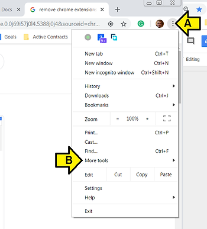
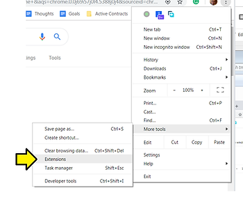
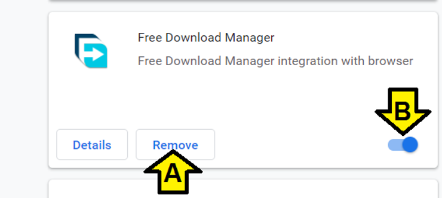

# Remove a Chrome Extension or App

This post shows you how to remove a Chrome extension.

**Method 1**

Put **chrome://extensions/** into the Chrome address

**Method 2**

1\. (A) Click the c**ircle icon with 3 vertical dots** then (B) click **More tools**

2\. Click **Extensions**

3\. (A) Click **Remove** or (B) switch an extension **off**

**Reference**

Chrome icon from \[[link](http://i1.wp.com/bdtechtalks.com/wp-content/uploads/2018/06/google-chrome.png?resize=696%2C696&ssl=1)\]