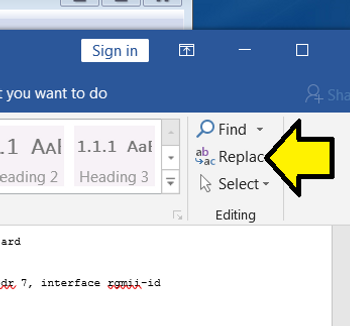
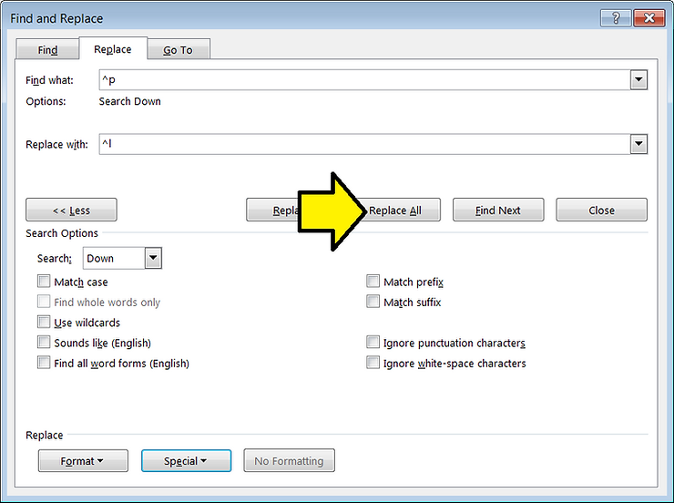

# Remove the Extra Line when Pasting into Word from Linux

This post shows how to remove the extra line from text that has been pasted into **Word** from **Linux**. The method here also answers the question: "how do I just replace text in what I've selected."

1\. Select the text

2\. Click **Replace** in Word

3\. Set **Find what:** to **^p** in the **Find and Replace** window

This is a **Paragraph Mark**

4\. Set **Replace with:** to **^l** in the **Find and Replace** window

This is a **Manual Line Break**

5\. Click **Replace All**

6\. Decline replacing text in the rest of the document.

**<u>Reference</u>**

Word image from \[[<u>link</u>](https://www.microsoft.com/en-us/store/d/word-2016/cfq7ttc0k5d7?activetab=pivot%3aoverviewtab)\]