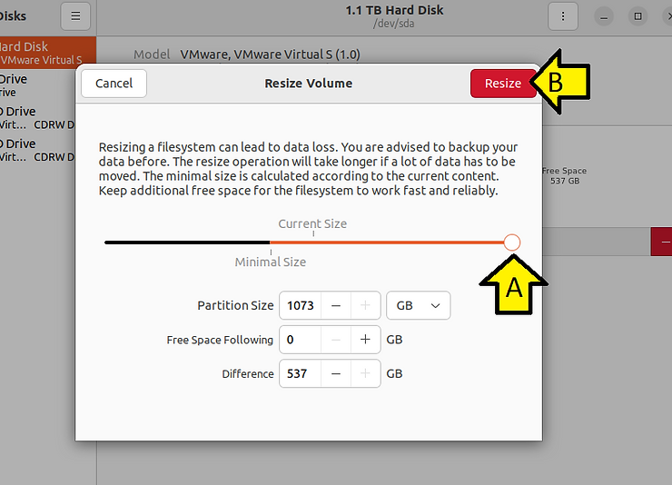

# Resize a Virtual Machine Hard Disk in VMware Workstation 16 and Ubuntu 22.04.1 LTS


This post shows step-by-step how to resize a Virtual Machine Hard Disk in VMware Workstation 16 and Ubuntu 22.04.1 LTS.

## <u><span>Prereqs</span></u>

You'll need the sudo password in your Ubuntu install

## <u><span>Expand the Disk in VMware Workstation 16</span></u>

Launch **VMware Workstation Pro**


Find the VM that needs a larger hard disk.


Double-click the **Hard Disk (SCSI)** and click **Expand...**


Increase the **Maximum disk size (GB)** and click **Expand** (this may take a moment - it took my computer 10 minutes).


Click **OK**:


**Note**: you may need to move the disk from, for example, C:\\Users\\Zach Pfeffer\\Documents\\Virtual Machines\\vmwaredisk-20230708-vivado\_22.04.1-on-ubuntu\_22.04.01\\vmwaredisk-20230708-vivado\_22.04.1-on-ubuntu\_22.04.01.vmdk to a disk with more room. See [<u><span>How to Permanently Mount an External Drive as a Folder on Windows 10</span></u>](https://www.centennialsoftwaresolutions.com/post/how-to-permanently-mount-an-external-drive-as-a-folder-on-windows-10) to ensure this location persists.

## <u><span>Expand the Disk In Ubuntu</span></u>

Power on the virtual machine and boot Ubuntu completely


Run **disks**


Select the drive, select the partition, click the gear:


Click **Resize...**


Drag the slider to the right and click **Resize**



## Versions

In PowerShell:

Windows version:

```
systeminfo | findstr /B /C:"OS Name" /B /C:"OS Version"
```

Output:

```
OS Name:                   Microsoft Windows 10 Pro
OS Version:                10.0.19045 N/A Build 19045
```

VMware Workstation version:

```
Get-WmiObject -Class Win32_Product | where vendor -eq "VMware, Inc." | select Name, Version
```

Output:

```
Name               Version
----               -------
VMware Workstation 16.2.4
```

In a terminal on Ubuntu:

```
lsb_release -a
```

Output:

```
No LSB modules are available.
Distributor ID:	Ubuntu
Description:	Ubuntu 22.04.1 LTS
Release:	22.04
Codename:	jammy
```

### This post showed how to resize a Virtual Machine Hard Disk in VMware Workstation 16 and Ubuntu 22.04.1 LTS.

## <u><span>References</span></u>

VMware Workstation 16 Logo from: https://commons.wikimedia.org/wiki/File:Vmware_workstation_16_icon.svg 