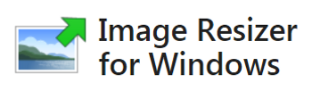
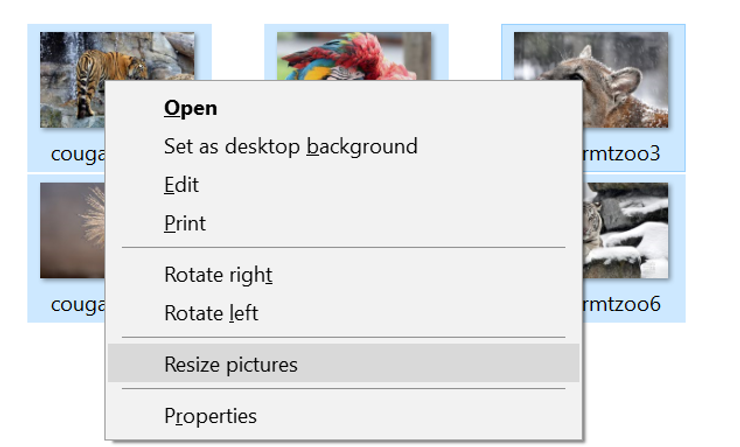
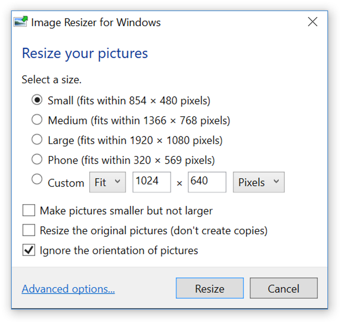

# Right-Click to Resize Multiple Pictures on Windows

Today's phones are awesome! They can take beautiful pics at high resolutions. However:

-   If you'd like to use those pictures on a blog and
    
-   Don't want to change the settings on your phone app (I always forget to change it back)
    

...check out **Image Resizer for Windows** at \[[link](http://www.bricelam.net/ImageResizer/)\] from Brice Lambson \[[link](http://github.com/bricelam)\]. Its super easy to use.

Steps and pictures from Brice's site:

**Step 1**

Select your pictures and right-click:

**Step 2**

Thanks for the great tool Brice!