# Run Hello World on a ZC702

This post shows how run **Hello World** on a Xilinx ZC702. It covers: creating a design in Vivado, exporting the design to the SDK and running Hello World on the dual-core ARM Cortex-A9 processor in the Zynq-7000.

**<u>Contains</u>**

Part I: Build a PS and Generate a Bitstream

Part II: Export Hardware Design and the Open SDK

Parr III: Set up the ZC702

Part IV: Set up the Terminal

Part V: Run HelloWorld

Part VI: Debug HelloWorld

**<u>Note</u>**

This write up follows the steps presented in **Zynq-7000 All Programmable SoC: Embedded Design Tutorial** and adds corrections, clarifications and additional information.

**<u>Versions</u>**

-   Vivado 2018.2 available @ \[[link](https://www.xilinx.com/support/download/index.html/content/xilinx/en/downloadNav/vivado-design-tools/2018-2.html)\] (install the free WebPACK edition)
    
-   Windows 7 SP1
    

**<u>Part I: Build a PS and Generate a Bitstream</u>**

<u>Step 1</u>: Start Vivado 2018.2

A. Click Start

B. Click Vivado 2018.2

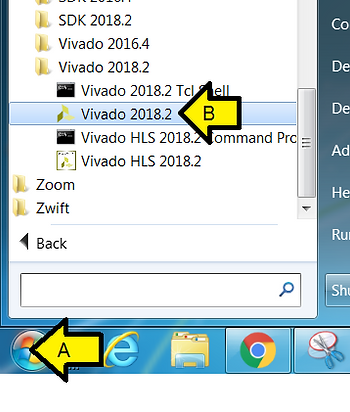

<u>Step 2</u>: Click **Create Project**

<u>Step 3</u>: Click **Next**

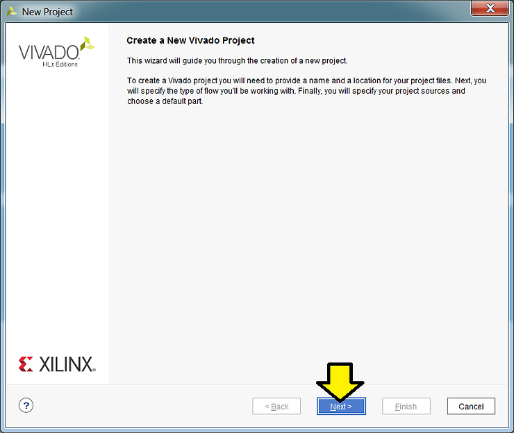

<u>Step 4</u>:

A. Set **Project name** to **helloworld** (always use a name without spaces \[[moreinfo](https://www.centennialsoftwaresolutions.com/blog/xilinx-sdk-internal-error-the-folder-c-metadata-is-read-only)\])

B. Set **Project location** to **C:/vivadoprjs** (keep paths less than 200 chars)

C. **Check** the **Create project subdirectory** checkbox

D. Click **Next**

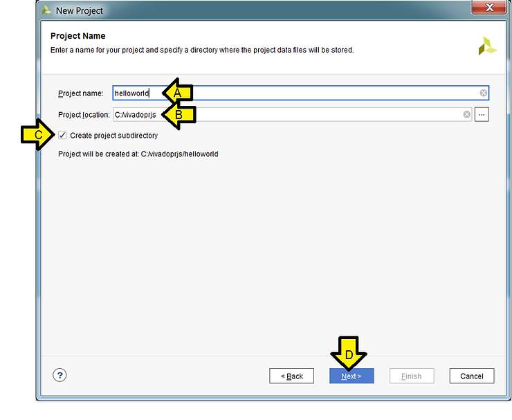

<u>Step 5</u>:

A. Select the **RTL Project** radio button if its not selected

B. Check the **Do not specify source at this time** checkbox

C. Click **Next**

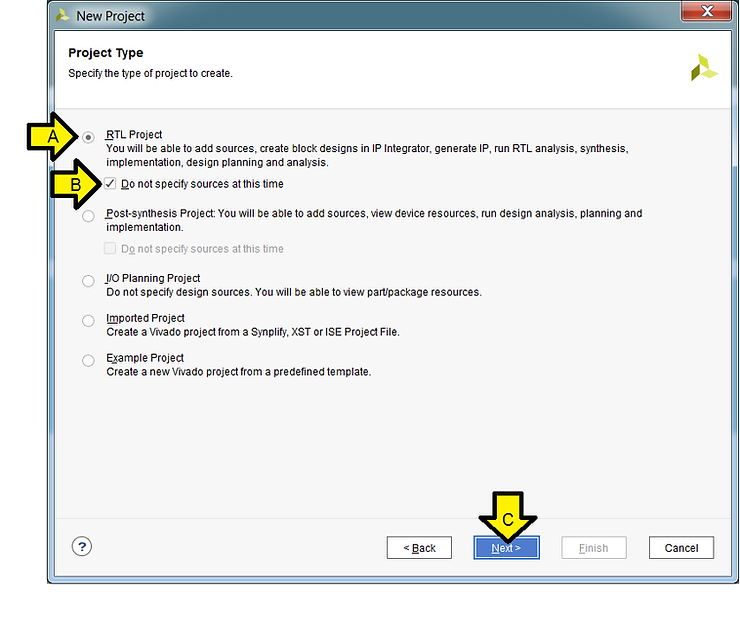

<u>Step 6</u>:

A. Click **Boards**

B. Type **ZC702**

C. Click the **ZYNQ-7 ZC702 Evaluation Board**

D. Click **Next**

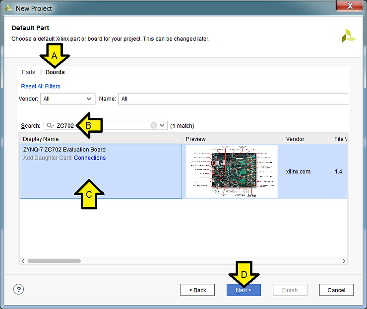

<u>Step 7</u>: Click **Finish**

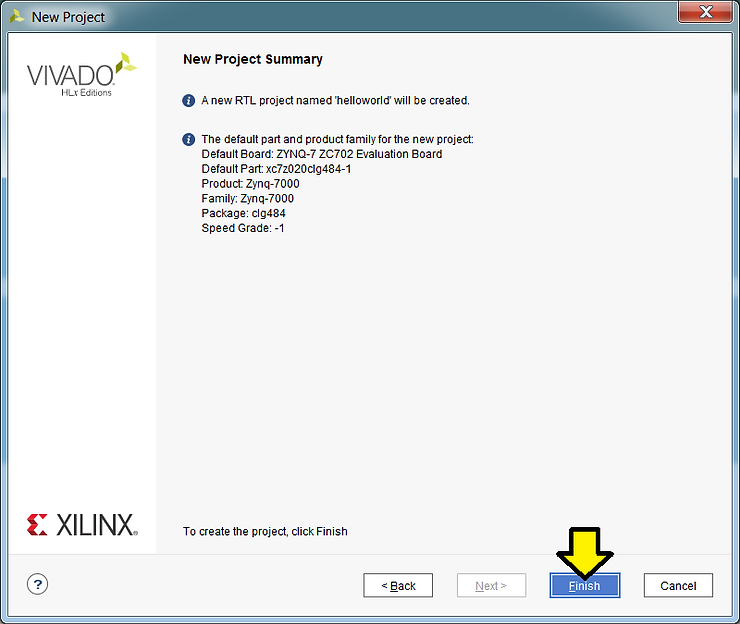

<u>Text Listed, More Info and Links to Docs</u>

New Project Summary

A new RTL project named 'helloworld' will be created.

The default part and product family for the new project:

Default Board: ZYNQ-7 ZC702 Evaluation Board

Default Part: xc7z020clg484-1 [[speedgrade and part # decode](https://www.xilinx.com/support/documentation/data_sheets/ds190-Zynq-7000-Overview.pdf) (datasheet p.23)]

Product: Zynq-7000 [[product page](https://www.xilinx.com/products/silicon-devices/soc/zynq-7000.html)]

Family: Zynq-7000

Package: clg484 [[Pinout Files](https://www.xilinx.com/support/package-pinout-files/zynq7000-pkgs.html) & [Packaging and Pinout](https://www.xilinx.com/support/documentation/user_guides/ug865-Zynq-7000-Pkg-Pinout.pdf) p.79]

Speed Grade: -1 

<u>Step 8</u>: Click **Create Block Design**

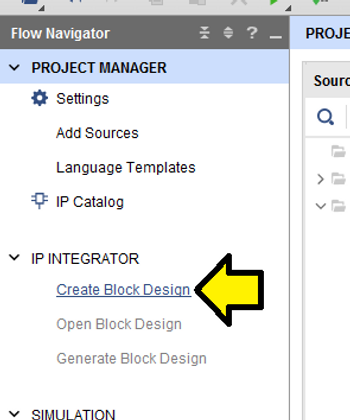

<u>Step 9</u>: Use defaults and click **OK**

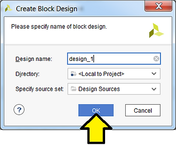

<u>Step 10</u>: Click + to add IP (or Ctrl-I)

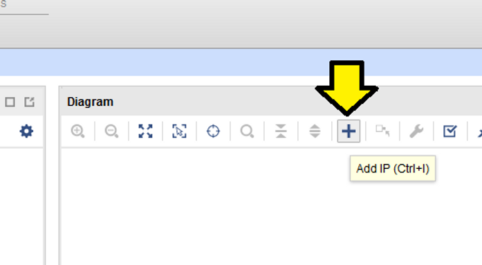

<u>Step 11</u>:

A. Type **Zynq**

B. Double click on **ZYNQ7 Processing System**

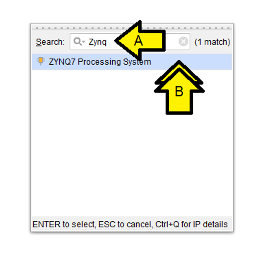

You'll see the **Xilinx LogiCORE™ IP Processing System 7 core** \[[doc](https://www.xilinx.com/support/documentation/ip_documentation/processing_system7/v5_5/pg082-processing-system7.pdf)\]:

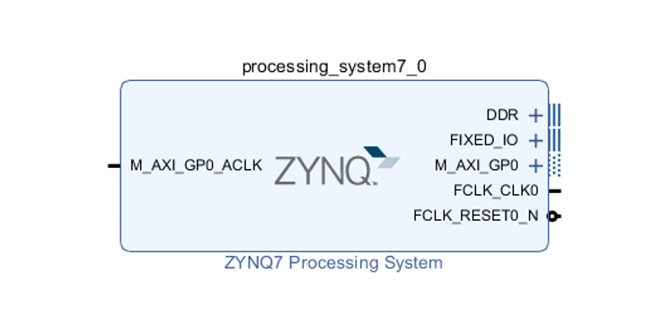

Interfaces:

M\_AXI\_GP0\_ACLK (**input**, global clock, all signals sampled on rising edge of the global clock)

DDR

FIXED\_IO

M\_AXI\_GP0

FCLK\_CLK0 (**output**, fabric aka PL clock, clock for the PL)

FCLK\_RESET0\_N

<u>Step 12</u>: Click **Run Block Automation**

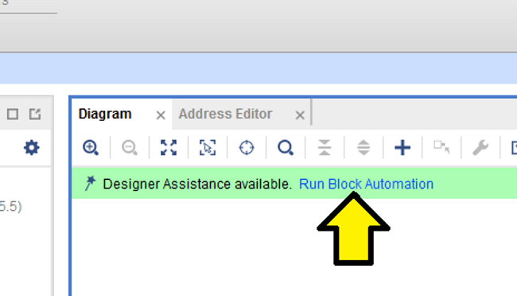

<u>Step 13</u>: Use defaults and click **OK**

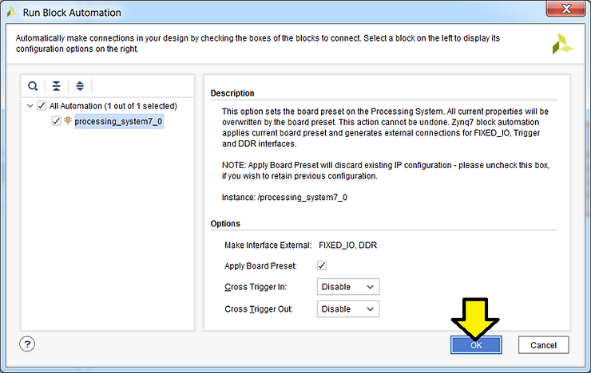

You'll see:

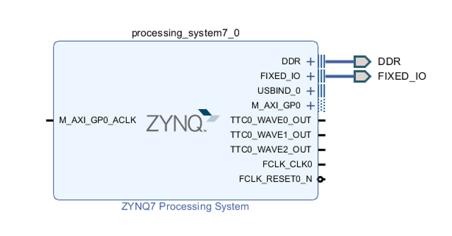

<u>Step 14</u>: Connect the PL clock (FCLK\_CLK0) to the global clock (M\_AXI\_GP0\_ACLK)

A. Click and hold on FCLK\_CLK0

B. Drag the connection to M\_AXI\_GP0\_ACLK and release mouse button

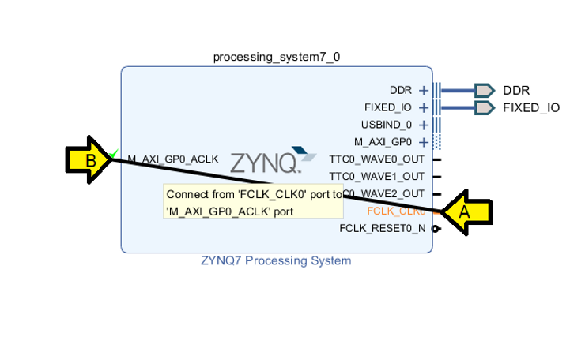

You should see:

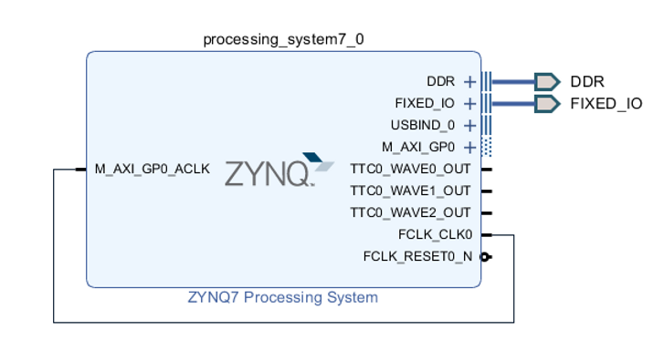

<u>Step 15</u>: Create an HDL Wrapper

A. Click **Sources**

B. Click **Hierarchy**

C. Right-click **design\_1 (design\_1.bd)**

D. Click **Create HDL Wrapper...**

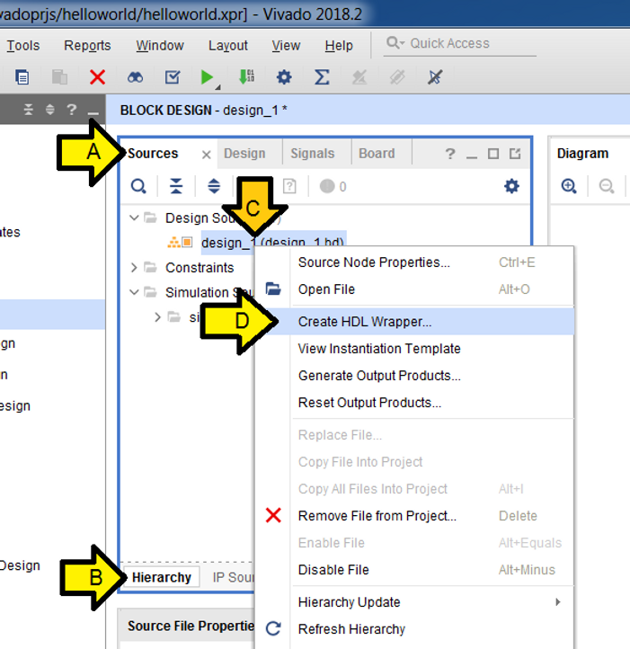

<u>Step 16</u>:

A. Leave or select **Let Vivado manage wrapper and auto-update**

B. Click **OK**

Step 17:

A. Click to expand **design\_1\_wrapper (design\_1\_wrapper.v)(1)**

B. Right-click on **design\_1\_i: design\_1 (design\_1.bd)(1)**

C. Click **Generate Output Products...**

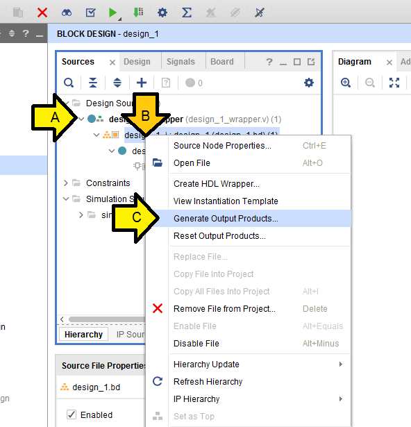

<u>Step 18</u>:

A. Leave selected or select **Out of context per IP**

B. Leave **Number of jobs** at 2

C. Click **Generate**

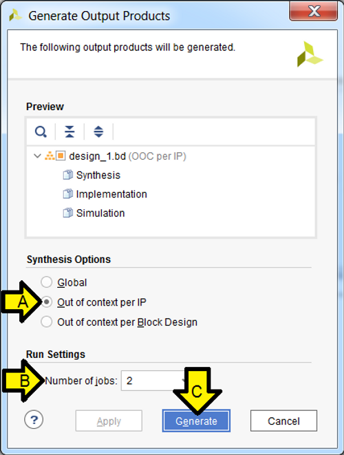

<u>Step 19</u>: Click **OK** and let the operation complete

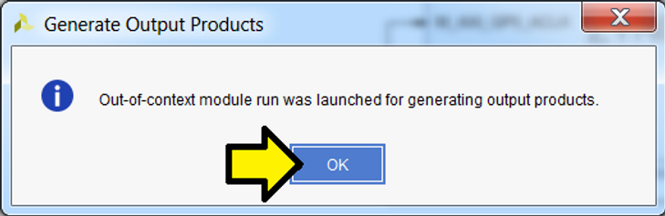

<u>Step 20</u>: Click **Run Synthesis**

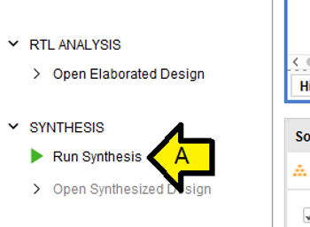

<u>Step 21</u>: Use the defaults and click **OK**

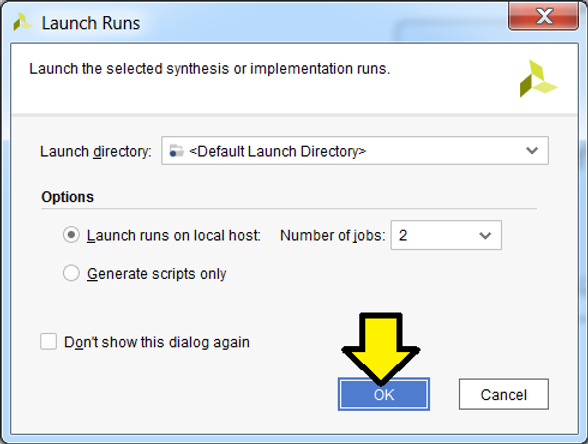

Wait for **synth\_design** to complete

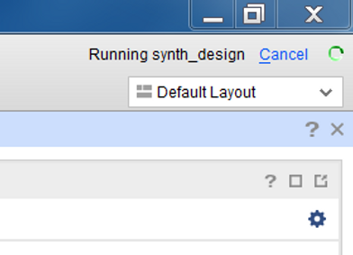

<u>Step 22</u>:

A. Leave selected or select **Run Implementation**

B. Click **OK**

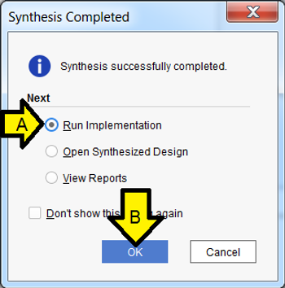

<u>Step 23</u>: Use the defaults and click **OK**

Wait for the operation to complete:

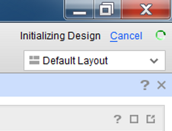

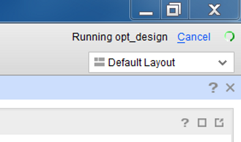

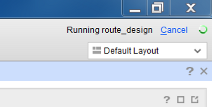

Complete:

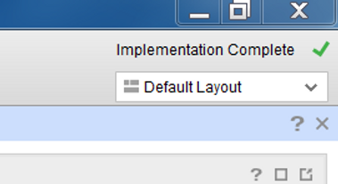

<u>Step 23</u>:

A. Select **Generate Bitstream**

B. Click **OK**

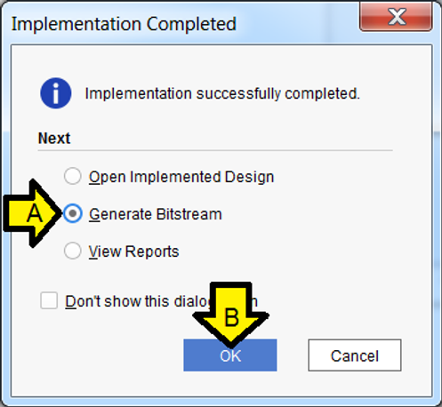

<u>Step 24</u>: Use the defaults and click **OK**

Wait for the operation to complete:

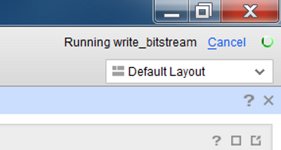

Complete:

Step 25: Click **Cancel**

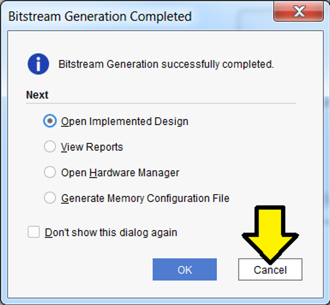

**<u>Part II: Export Hardware Design and the Open SDK</u>**

<u>Step 1</u>:

A. Click **File**

B. Click **Export**

C. Click **Export Hardware**

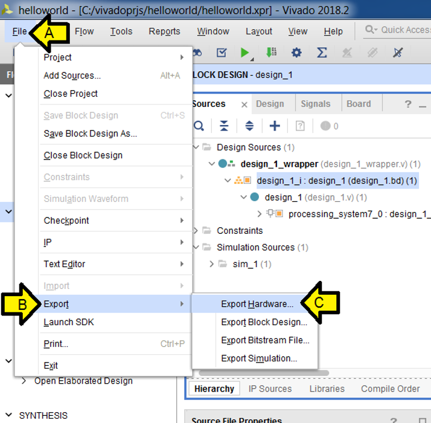

<u>Step 2</u>:

A. Click the **Include bitstream** checkbox

B. Leave **<Local to Project>**

C. Click **OK**

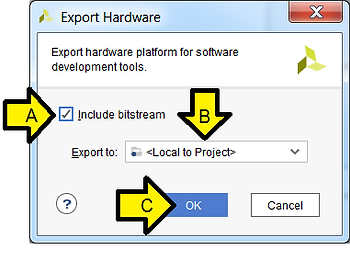

<u>Step 3</u>:

A. Click **File**

B. Click **Launch SDK**

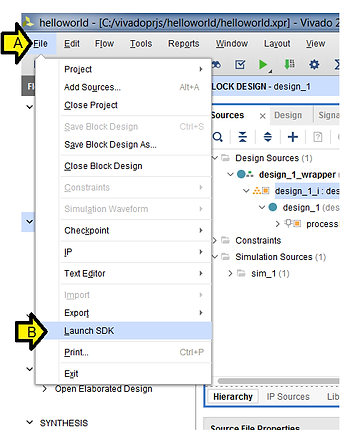

<u>Step 4</u>: Use defaults and click **OK**

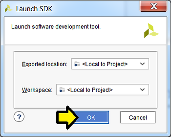

<u>Step 5</u>:

A. Click **File**

B. Click **Application Project**

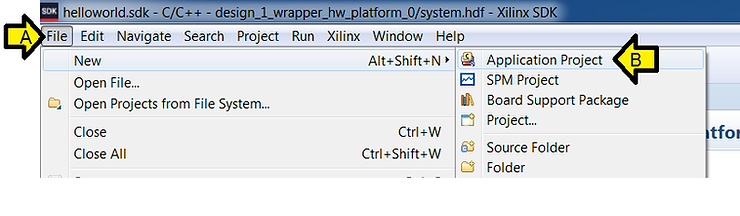

<u>Step 6</u>:

A. Type **HelloWorld** for **Project name**

B. See **HelloWorld\_bsp** autopopulate

C. Click **Next**

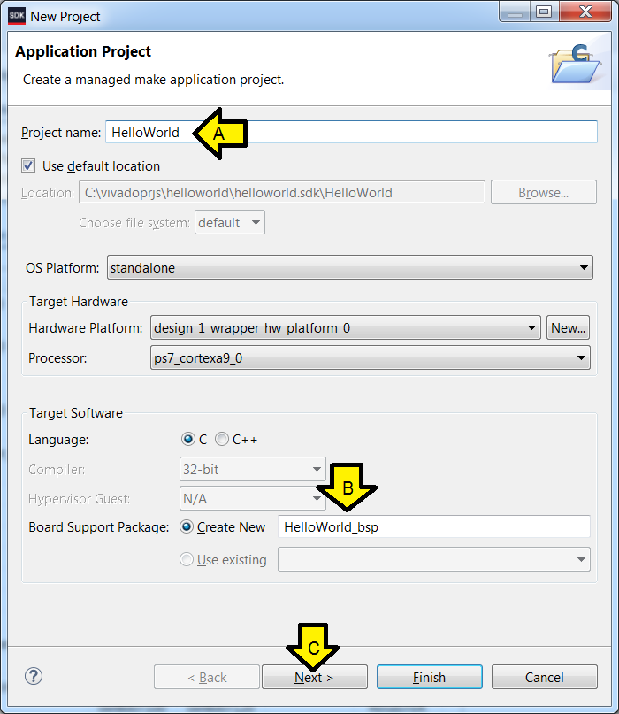

<u>Step 7</u>:

A. Ensure **Hello World** is selected (it should be)

B. Click **Finish**

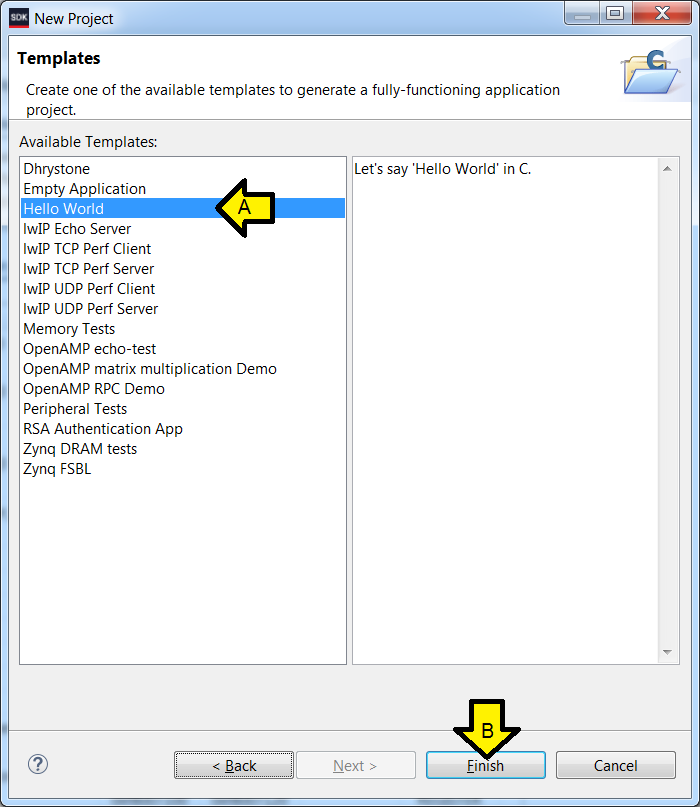

You should see:

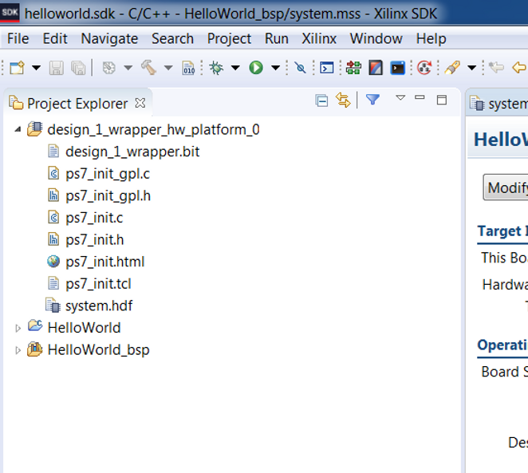

**<u>Part III: Set up the ZC702</u>**

Step 1: Set SW16 to JTAG mode [[mode documentation](https://www.xilinx.com/support/documentation/boards_and_kits/zc702_zvik/ug850-zc702-eval-bd.pdf) see p.16]

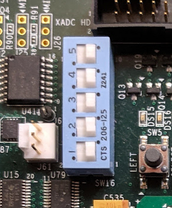

For the rest of the jumpers see the high-resolution photo of the board in the correct state at \[[link](https://photos.app.goo.gl/DddmM8T5QkTXwA7u5)\].

<u>Step 2</u>: Connect a **Micro-B to Type-A** (host connection) USB cable from U23 (Diglent USB JTAG interface) to the host PC

U23:

Micro-B connector:

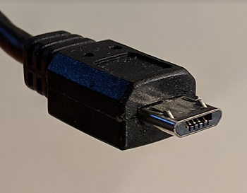

Type-A connector:

<u>Step 3</u>: Connect a **Mini-B to Type-A** (host connection) USB cable from J17 (CP2103GM USB-to\_UART Bridge) to the host PC.

J17:

Mini-B connector:

Type-A connector:

<u>Step 4</u>: Power on the board (you'll need to power on the board to see the USB-to-UART device in the next step).

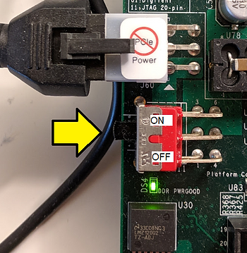

**<u>Part IV: Set up the Terminal</u>**

Step 1: Install the Silicon Labs CP210x USB to UART Bridge VCP Drivers

A. Goto [[link](https://www.silabs.com/products/development-tools/software/usb-to-uart-bridge-vcp-drivers)]

B. Download and unzip the correct installer

C. Install the driver (I did not need to restart on Windows 7 SP1)

D. Click Windows

E. Click Devices and Printers

F. You should see Silicon Labs CP210x USB to UART Bridge

G. Note the COM port (you'll need this later)

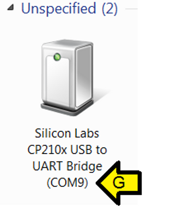

<u>Step 2</u>:

A. Click **Window**

B. Click **Show View**

C. Click **Other**

<u>Step 3</u>:

A. Expand **Terminal**

B. Click **Terminal**

C. Click **OK**

Step 4: Click **Settings**

<u>Step 5</u>:

A. Use the COM port listed in Devices and Printers (or type it in: COM9 for instance)

B. Click OK

**<u>Part V: Run HelloWorld</u>**

<u>Step 1</u>: Run Debug once

A. Right click **HelloWorld**

B. Click **Debug As**

C. Click **Launch on Hardware (System Debugger)**

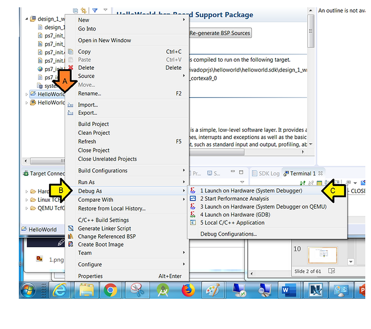

D. Click **Yes**

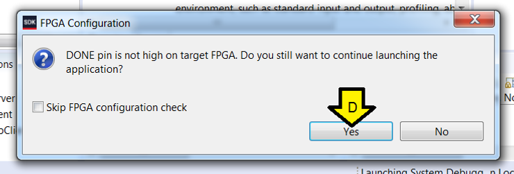

E. Click **Yes**

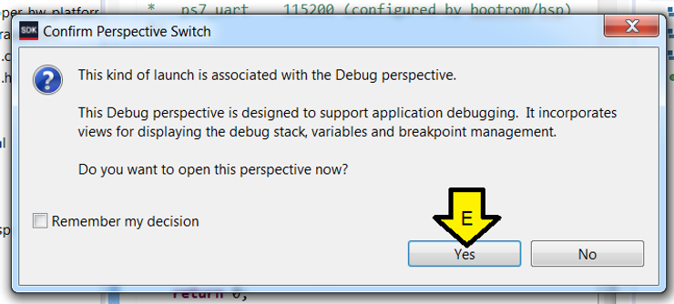

<u>Step 2</u>:

A. Click **Run**

B. Click **Run Configurations...**

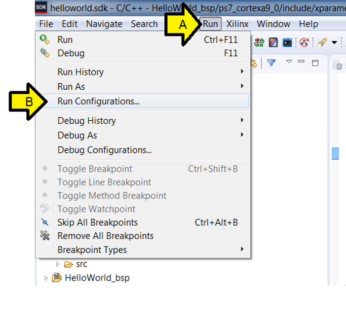

<u>Step 3</u>:

A. Make sure **System Debugger using Debug\_HelloWorld.elf on Local** is selected

B. Check the **Reset entire system** check box

C. Check the **Program FPGA** check box

D. Ensure the **Run ps7\_init** check box is checked

E. Ensure the **Run ps7\_post\_config** is checked

F. Click **Apply**

G. Click **Run**

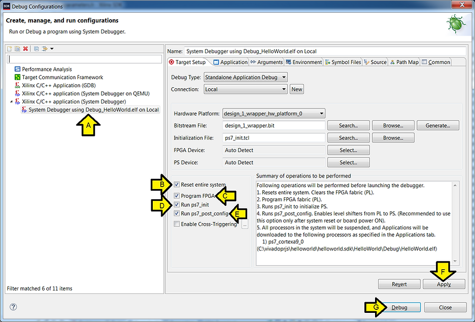

H. Switch back to the C/C++ View

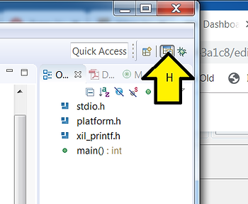

You should see:

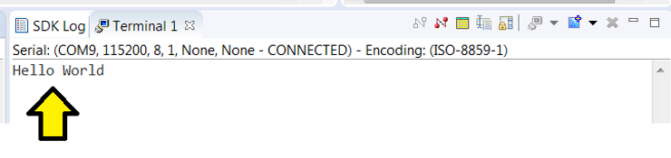

<u>Step 4</u>: Run the program again

A. Click **Run**

B. Click **Run** (this will use the Run Config you set up previously)

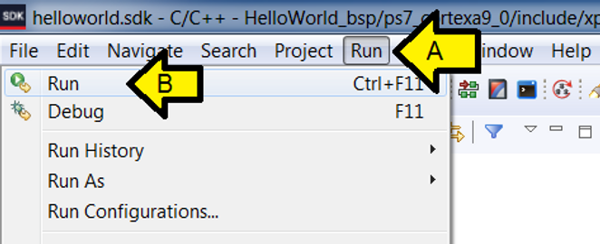

C. Click **OK**

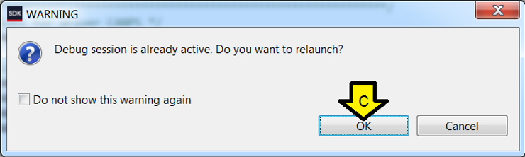

You should see another **Hello World**:

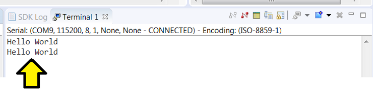

**<u>Part VI: Debug HelloWorld</u>**

<u>Step 1</u>: Click to disconnect Run terminal

<u>Step 2</u>:

A. Click **Run**

B. Click **Debug Configurations...**

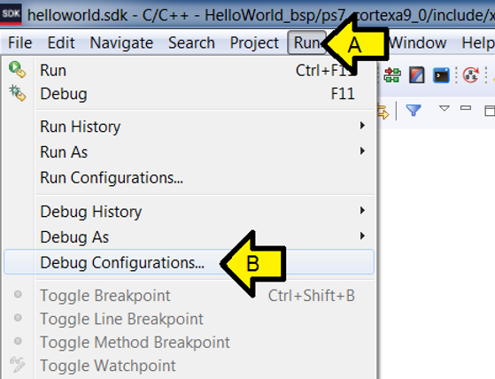

<u>Step 3</u>:

A. Make sure **System Debugger using Debug\_HelloWorld.elf on Local** is selected

B. Make sure the **Reset entire system** check box is checked

C. Make sure the**Program FPGA** check box is checked

D. Ensure the **Run ps7\_init** check box is checked

E. Ensure the **Run ps7\_post\_config** is checked

F. Click **Apply** if anything changed (the Apply button will be grayed out if no changes were needed).

G. Click **Debug**

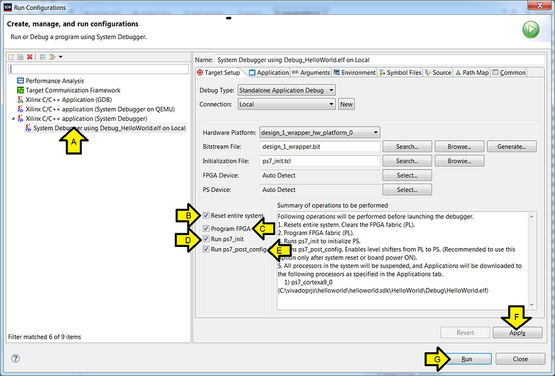

H. Click **Yes**

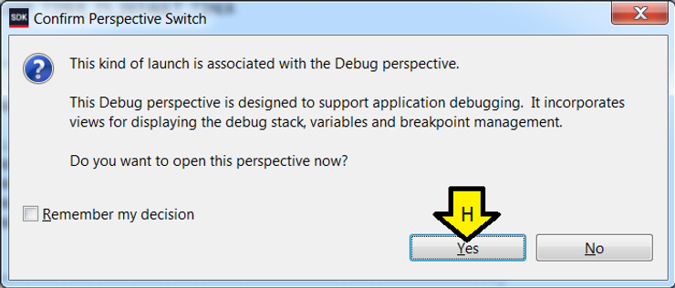

You should see:

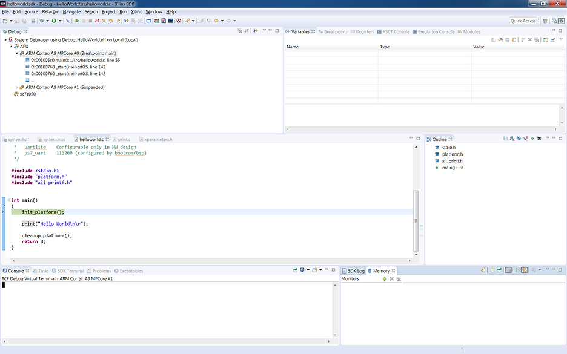

<u>Step 4</u>: Connect the serial port

A. Click **SDK Terminal**

B. Click the **'+'** (Connect to serial port.)

C. Use these settings and click **OK**

You should see:

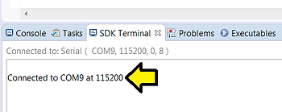

<u>Step 5</u>: Click **Resume (F8)**

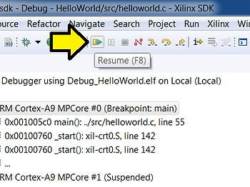

You should see:

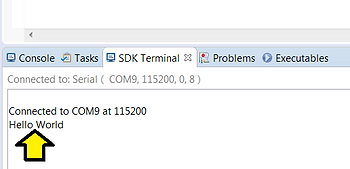

<u>Step 6</u>: Restart Debug

A. Click **Run**

B. Click **Debug** (this will use the Debug Config you set up previously)

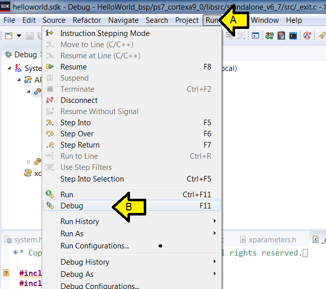

C. Click **OK**

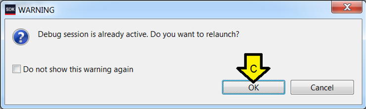

You should again see:

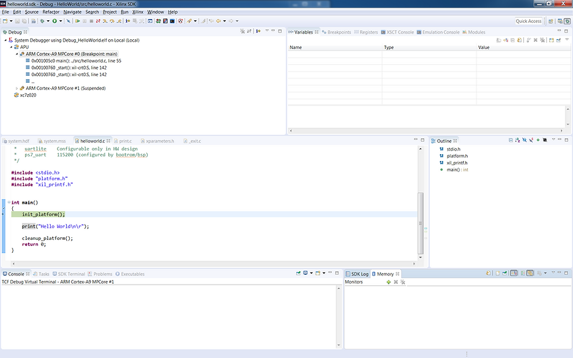

Note: to disconnect the debuggers serial port click here:

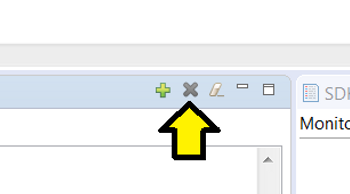

You should see:

**<u>References</u>**

-   2018.2 Zynq-7000 All Programmable SoC: Embedded Design Tutorial (UG1165) @ \[[link](https://www.xilinx.com/support/documentation/sw_manuals/xilinx2018_2/ug1165-zynq-embedded-design-tutorial.pdf)\] (p.15 to 30)
    
-   Xilinx logo found via [https://twitter.com/xilinxinc](https://twitter.com/xilinxinc) at \[[link](https://pbs.twimg.com/profile_images/535545777020338176/pEWdIYq__400x400.png)\]