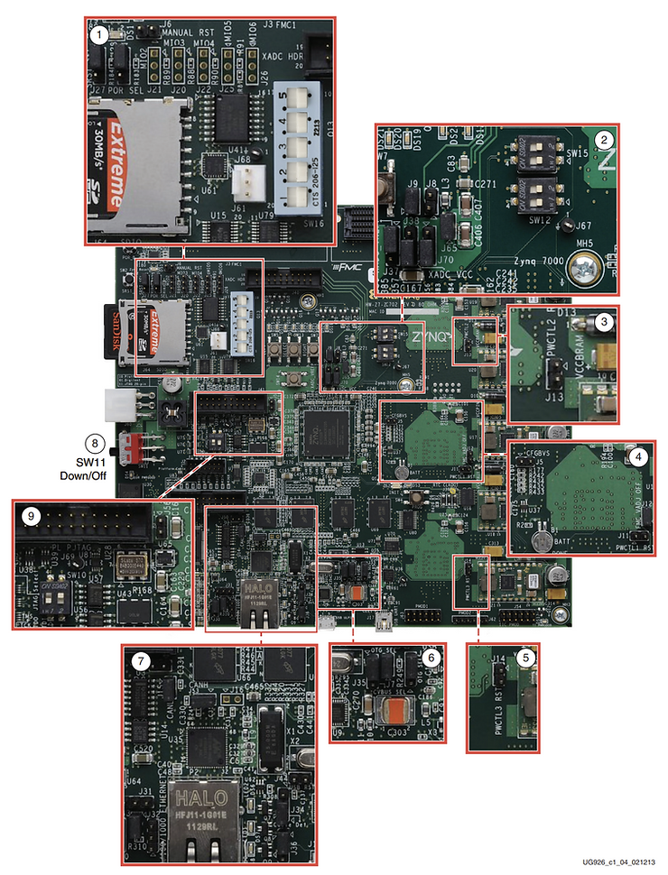
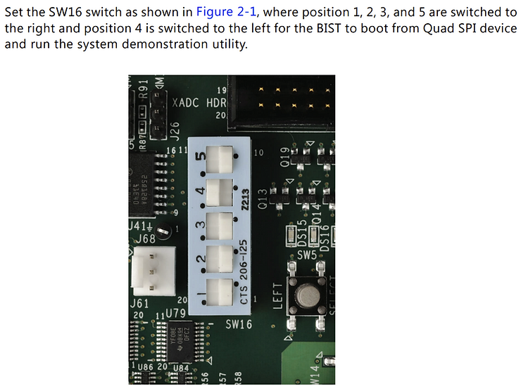
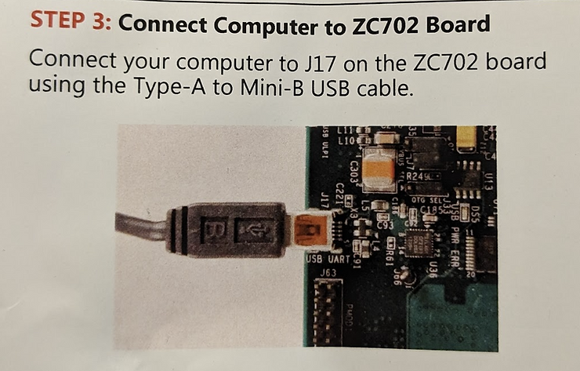
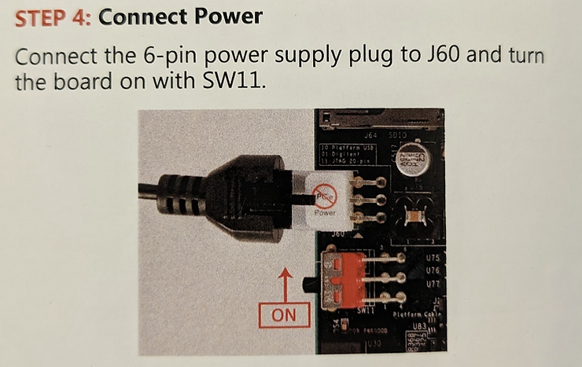
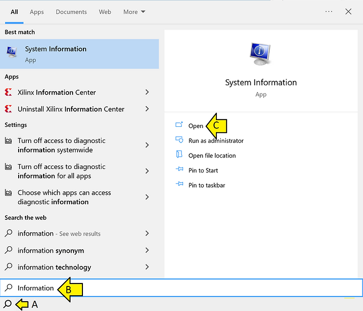
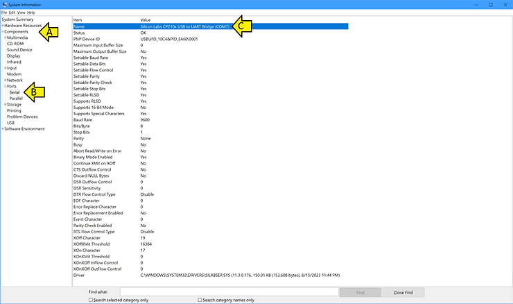
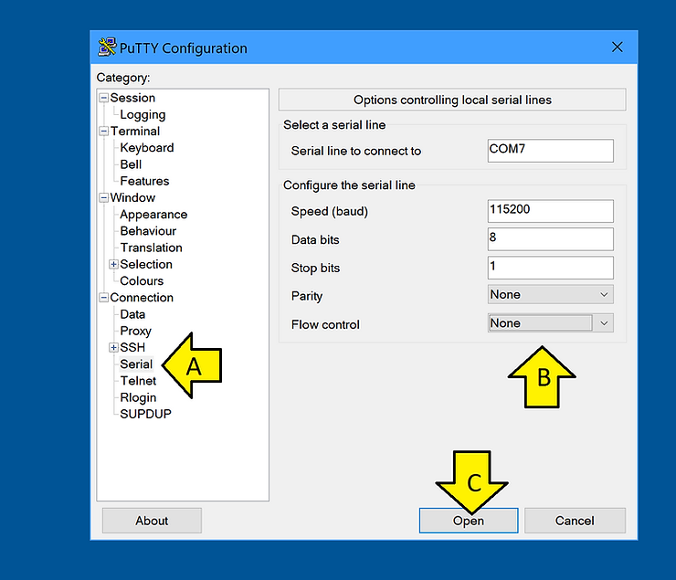
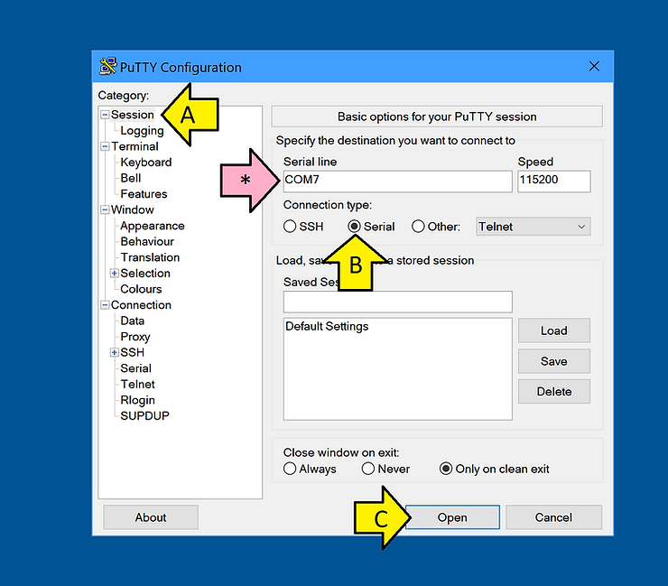
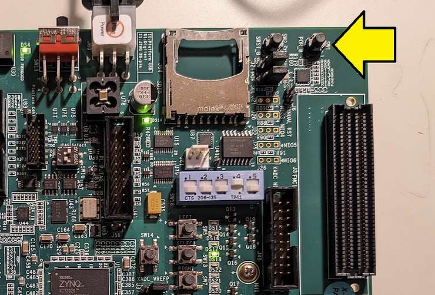
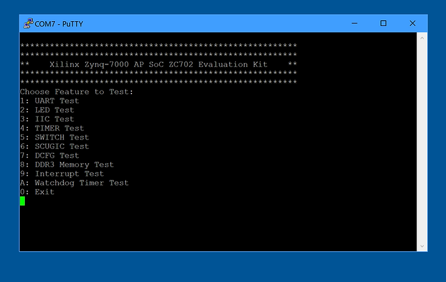

# Run the Xilinx ZC702 Built-In Self-Test on Windows 10


This post shows how to run the Xilinx ZC702 Built-In Self-Test on Windows 10. It follows the original instructions included in the kit and substitutes tools available for Windows 10.

## Install the CP210x USB-to\_UART Drivers

\# Check version of Windows 10 is at least 1803 (we're at 19045)

Using this command from [ https://stackoverflow.com/questions/7330187/how-to-find-the-windows-version-from-the-powershell-command-line ]:

```
systeminfo /fo csv | ConvertFrom-Csv | select OS*, System*, Hotfix* | Format-List
```

Output:

```
OS Name             : Microsoft Windows 10 Pro
OS Version          : 10.0.19045 N/A Build 19045
OS Manufacturer     : Microsoft Corporation
OS Configuration    : Standalone Workstation
OS Build Type       : Multiprocessor Free
System Boot Time    : 5/11/2023, 12:59:23 PM
System Manufacturer : LENOVO
System Model        : 20MAS87F00
System Type         : x64-based PC
System Directory    : C:\WINDOWS\system32
System Locale       : en-us;English (United States)Hotfix(s)           : 22 Hotfix(s) Installed.,[01]: KB5022502,[02]: KB4562830,[03]: KB4580325,[04]: KB5000736,[05]: KB5012170,[06]: KB5015684,[07]: KB5026361,[08]:KB5006753,[09]: KB5007273,[10]: KB5011352,[11]: KB5011651,[12]: KB5014032,[13]: KB5014035,[14]: KB5014671,[15]: KB5015895,[16]: KB5016705,[17]:KB5018506,[18]: KB5020372,[19]: KB5022924,[20]: KB5023794,[21]: KB5025315,[22]: KB5005699
```

\# Download https://www.silabs.com/documents/public/software/CP210x_Universal_Windows_Driver.zip from https://www.silabs.com/developers/usb-to-uart-bridge-vcp-drivers?tab=downloads to Downloads

\# Extract All

\# Browse to the unzipped folder C:\\Users\\Zach Pfeffer\\Downloads\\CP210x\_Universal\_Windows\_Driver

\# **Right-click** on the **silabser.inf** file and select **Install**

\# Follow the instructions

## Install PuTTY

\# Go to https://www.putty.org/ 

\# Use 64-bit x86: [putty-64bit-0.78-installer.msi](https://the.earth.li/~sgtatham/putty/latest/w64/putty-64bit-0.78-installer.msi)

\# Install using defaults

## Check the Jumpers

Zynq-7000 All Programmable SoC: ZC702 Evaluation Kit and Video and Imaging Kit Getting Started Guide (ISE Design Suite 14.5)

https://docs.xilinx.com/v/u/4.0-English/UG926_Z7_ZC702_Eval_Kit 

Cached @ v4.0 @

https://drive.google.com/file/d/1BCOOiHd-l49l2lzBhSG0p8bUClJnt1Fi/view?usp=sharing 



## Set Boot Mode Switches



\# Connect USB to the computer



\# Connect power and turn on the board



## Get the COM #

\# Run **System Information**



\# Expand **Components** and **Ports** and click **Serial**



COM7, in this case

## Configure and Open PuTTY

\# Select **Serial** and fill in **COM7** (read above), **115200** baud, **8** data bits, **1** stop bit, **no** parity, **no** flow control.



\# Select **Session** and select **Serial**. The **COM** should automatically populate. Click **Open**.



\# Press SW1 (POR\_B)



You should see:



### This post showed how to run the Xilinx ZC702 Built-In Self-Test on Windows 10.

## References

Xilinx logo clipped from [xilinx.com](http://xilinx.com/)