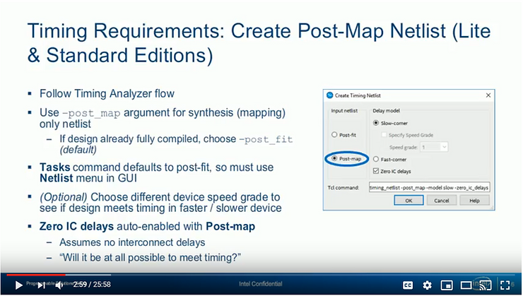
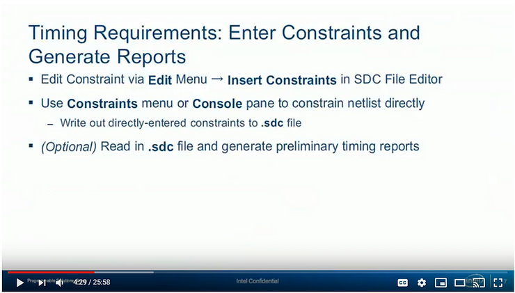
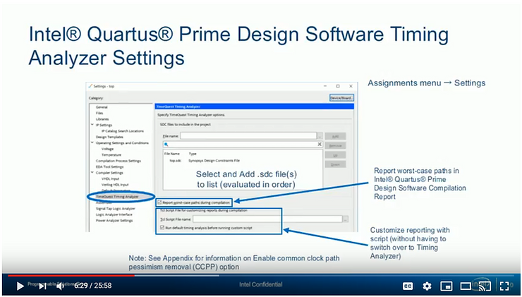

# Run Timing on a Cheaper Speed Grade to Save Money

This post lists useful information extracted from part 3 of the Intel online training: Quartus Prime Integration & Reporting. It lists a tip on running different speed grades to see if you can meet timing with a less expensive device. It also lists that you may want to run timing after synthesis since the post synthesis results are only preliminary and that a synchronous I/O delay constraint depends on the clock that launches or latches the data.

**<u>The Video</u>**

(video unavailable)

**<u>Partially Expanded Transcript</u>**

0:00

welcome to the timing analyzer online

training my name is Steve this training

is available for desktop viewing as well

as in format compatible with portable

devices both available from the same

link included in your registration email

for it either version while watching the

training use the controls at the bottom

and side of the screen to navigate to

any point feel free to pause the

training at any time to experiment with

the software when you're done with the

training please use the link provided in

the registration email you're sent to

provide us feedback on the training and

ways in which it can be improved I'll

remind you about that later

0:41

in this

course you will learn how to perform

timing analysis in the Intel Quartus

prime software using timing analyzer you

will use synopsis design constraints or

SDC files

to constrain a design to meet timing

requirements and to compare results

you'll learn how to generate time

reports in timing analyzer and came

familiarity with its graphical user

interface

1:07

here is the agenda for this

course in the first part we looked at

basic timing analysis concepts and

terminology used in timing analyzer this

included a discussion of the terminology

used to select nodes from the SDC

netlist for targeting timing constraints

in the second part you are introduced to

the timing analyzer GUI and its use in

this part you'll learn how to

incorporate timing analyzer into the

Intel Quartus prime design flow and take

a look at timing analyzers reporting

features in more detail in the final

part available on the Intel training

website and leaked at the end of this

training you learn about SDC constraints

required to fully constrain a design as

well as a number of optional constraints

1:52

now that you know the basics of how to

use the tool how do you incorporate its

use into the Intel Quartus prime design

flow

2:01

here is a slightly altered version

of a typical Intel Quartus prime design

flow that incorporates the use of the

timing analyzer if you are using the

Intel Quartus prime standard or lite

you could use a postive assist netlist

to start creating timing constraints in

analyzing the design before performing a

full compilation to do this for

synthesizes the design timing analyzer

requires the design to be synthesized in

order to create a post map netlist

2:32

next

you'll use the timing analyzer flow just

presented to specify timing requirements

for the design as mentioned earlier

timing analyzer in the until quarters

Prime Pro Edition software does not

support analysis with a Poe synthesis

netlist

2:47

if you're using this edition of

the tool you'll start by adding your

diet SDC file or files to the Intel

Korres project settings which we'll

discuss in a moment

<u>Timing Requirements: Create Post-Map Netlist (Lite &amp; Standard Editions)</u>

**Slide Text**

Timing Requirements: Create Post-Map Netlist (Lite & Standard Editions)

Follow Timing Analyzer flow

Use -post\_map argument for synthesis (mapping) only netlist

-   If design already fully compiled, choose -post\_fit (default)
    

Tasks command defaults to post-fit, so mustuse Netlist menu in GUI

(Options) Choose different device speed grade to see if design meets timing in faster / slower device

Zero IC delays auto-enabled with Post-map

-   Assume no interconnect delays
    
-   "Will it be at all possible to meet timing?"
    

**Transcript**

Follow the timing analyzer flow discussed earlier starting with the creation of the timing netlist. When generating the timing netlist use the -post\_map argument to use the post synthesis netlist if the design has only been synthesized and not fully compiled. To do this either use the create\_timing\_netlist command with the -post\_map argument in the console or use the GUI and select **post map** as the input netlist type is shown here. If you have already

performed a full compilation use the default post fit netlist type. **<u>With a slow corner delay model you can also choose a device speed grade to use for the analysis. By default if this option is enabled the speed grade of the currently target device is used. Change</u>**

**<u>the speed grade to see if a design that is not meeting timing could meet timing in a faster device or to see if a design already meeting time it could still be timing in a slower, potentially less expensive, device.</u>** With the post map netlist type selected the Zero IC (interconnect) Delays option is turned on automatically. Since there is no routing yet selected with the post map netlist, the timing analyzer should assume that there are no delays on any interconnect in the device to see if it will be at all possible to meet the timing requirements specified by the constraints.

<u>Timing Requirements: Enter Constraints and Generate Reports</u>

**Slide Text**

Timing Requirements: Enter Constraints and Generate Reports

Edit Constraint via Edit Menur -> Insert Constraints in SDC Editor

Use Constraints menu or Console pane to constrain netlist directy

-   Write out directly-entered constraints to .sdc file
    

(Option) Read in .sdc file and generate preliminary timing reports

**Transcript**

Continuing the Timing Analyzer flow enter or create constraints in the usual manner either directly in the console or the SDC file editor, either manually or with the GUI constraint dialog boxes. Remember that if you are entering constraints in the console you'll need to write out a .sdc file for use by the Intel Quartus Prime fitter. At this point you could continue the timing analyzer flow presented earlier, reading in the .sdc file you've created and generate timer reports. **However, note that reports generated at this stage of the design flow based off the postsynthesis netlist only provides preliminary timing numbers for the design. Paths that fail timing in these reports may be optimized and improved by the fitter during a full compilation allowing them to meet timing.** As such only use post map reports to help with fully constraining the design and to get an idea of what the final timing numbers for the design could be.

5:33

next for all editions of the Intel

Korra's prime software you'll specify

timing analyzer settings and select the

dot SDC file or files for the Intel

cores prime software to use as a guide

during fitting

5:49

the Intel Quartus prime

software uses SDC constraints during the

placement and routing of a design the

constraints are used as a guide for

selecting device resources that will

meet all timer requirements for all

timing models when choosing the files to

use the fitter first looks for dot SDC

files that have been explicitly added to

the project settings if no SDC files

were added to the project the fitter

looks in the project directory for a dot

SDC file that has the same name as a

current revision of the project this is

the save behavior used by the timing

analyzer tool

<u>Intel Quartus Prime Design Software Timing Analyzer Settings</u>

**Slide Text**

Intel Quartus Prime Design Software Timing Analyzer Settings

Assignments menu -> Settings

Report worst-case paths in Intel Quartus Prime Design Software Compilation Report

Customize reporting with script (without having to switch over to Timing Analyzer)

Note: See Appendix for informatiobn on Enable common clock path pessimism removal (CCPP) option

**Transcript**

The addition of .sdc files to the Intel Quartus prime project and other timing analyzer settings are found at the timing analyzer category of the settings dialog box. Browse for .sdc files and click the Add button to add them to the list. You can change the order in which the files are used by clicking the up or down buttons. The fitter views multiple dot SDC files as basically one long SDC file. Constraints that are dependent on other constraints must be listed below

the constraints they depend on either in the same file or across files when multiple files are added here. **For example a synchronous I/O delay constraint depends on the clock that launches or latches the data.** The clock constraint for this I/O constraint must either be listed earlier in a single SDC file or in a file higher up in the list when multiple files are used. It is also possible to have duplicate constraints. A duplicate constraint is a timing constraint lower down in a single .sdc file or lower in the file list that is in the same type of constraint and targets the same location in a timing netlist as another constraint. Timing Analyzer and the fitter will use the duplicated constraint overwriting the first constraint and displaying a warning. However in some cases it may be advantageous to target a particular location in the netlist with different values for a single type of constraint. As we'll see some constraints include options for doing this. Timing Analyzer settings also contain options for generating Timing Reports directly in the Intel Quartus prime software. With the options indicated you could enable the reporting of worst-case paths in the accomplish report and select a Tcl script to customize the Timer Reports generated during compilation. normally the Timer Reports generated and displayed in the compilation report are very basic require you to switch back to the timing analyzer interface to generate more detailed customized reports. with these options you could generate the same detailed reports in the Intel Quartus Prime compilation report without having to switch.

8:47

once the

timing analyzer settings are configured

in the Intel Quartus prime software

for my full compilation the fitter will

be guided by the SDC timing constraints

if you are using the Intel quarters

Prime Pro Edition either perform a full

compilation or compile up to the fitter

stage desired either planning placement

or routing after compiling use the

extensive reporting capabilities of the

timing analyzer tool to verify whether

you met your timing requirements during

compilation timing summary reports based

on the post fitna lists are generated

and appear automatically in the Intel

Quartus prime compilation report for

more detailed timing verification follow

the steps for using the timing analyzer

reporting features mentioned earlier

when creating the timing netlist use the

post FET netlist option if using the

Intel Quartus prime Lite or standard

edition or the desired fitter snapshot

if using the Pro Edition when creating

the netlist you can choose to turn on

the 0ic delays option this is normally

off for a post fit netlist but you can

turn it on to see if there's any chance

of meeting timing with the current

timing constraints and project settings

if timing fails at this stage even with

0ic delays enabled you'll probably have

to adjust your timing constraints or

optimize the project in some way in

order to meet timing once the netlist is

generated you can access the most

commonly used timely reports from the

tasks pane to easily recreate the same

reports each time you use the tool place

reporting commands in a tickle script

file and run the script from the timing

analyzer script menu using a script file

is also very useful if you are creating

your own customized timer reports it

saves time and having to create

complicated report commands remember

that the reports you generate after the

fitter has run should be used to verify

whether the fitter was able to meet your

timely requirements if any part of the

design is failing timing at this point

the design or timing constraints must be

adjusted to fix the problem and the

design recompile to implement the fix

before discussing SDC constraints in

detail let's take a closer look at some

of the reporting options available in

timing analyzer before looking at

reports in timing analyzer let's look at

reports that appear in the Intel

quarters compilation report here you can

see the basic timer reports generated by

the tool during compilation notice the

multiple timing model report folders

within the timing analyzer report folder

Multi corner analysis performs timing

analysis for all timing models supported

by the targeted device each timing

models folder includes summary reports

with the worst case positive or negative

slack displayed for each clock domain in

the design as mentioned you can also

have the tool generate additional more

advanced reports using a tickle script

these additional reports appear in a

separate folder in the complex Report

named time quest timing analyzer GUI to

create more detailed reports and have

more control over what reports are

generated use the reporting features of

the timing analyzer tool you can quickly

create simple reports from the task pane

or reports menu or create more

complicated reports with reporting

dialog boxes and command line reporting

features again store your reporting

commands in a tickle script to easily

recreate reports when making changes to

timing constraints all generated reports

can be output to three different

destinations by default all generated

reports appear in the view pane and are

listed in the report pane you could give

a custom name to report in the report

pane or the view pane with the dash

panel name option the dash multi corner

option works with the dash panel name

option to create placeholder reports for

additional timing models this makes it

easy to create custom reports for all

supporting timing models using the

options discussed earlier reports can

also be displayed in the console with

the dash standard out option another

option is to store reports as external

files you can create plain ASCII tech

files or HTML files for display on the

web use the appropriate options in the

console or in the reporting dialog boxes

to select where and how reports should

appear here is what a report appearing

in the view pane looks like with the -

multi corner option enabled a folder is

created to store the individual reports

for each supporting timing model without

the - multi corner option only a single

report would appear in the report pane

and the report in the view pane would

include the custom report name reports

output to the console look like this

expand individual paths in the report to

get more detail finally reports output

to files look like this they contain all

the textual information that would be

found in a report in the GUI create new

files in either plain text or HTML

formats or pen new reports to existing

ones reports are organized by report

type in the tasks pane and the reports

menu one type of report you can generate

our diagnostic reports diagnostic

reports don't contain specific timing

information but they do contain

information that is helpful for

constraining a design we've already

discussed report underscore SDC command

that is used to see what constraints

have been applied to the netlist report

underscore clocks provides a list of all

constrained clocks in the design any

signal that is located on a device clock

pin or the clock input of a register is

considered a clock signal that must be

constrained report ignored constraints

list constraints that the timing

analyzer is intentionally ignoring

usually because of typos incorrect

syntax or incorrect constraint arguments

finally the report unconstrained paths

command is useful for seeing which paths

in your design are considered to be

unconstrained by the tool you want to

get to the unconstrained path count down

to 0 in this report to make sure that

all paths in the design are constrained

summary reports are the most basic type

of timer reports and the ones you will

use most often separate reports are

deeded for the setup and hold analyses

use recovery and removal options for a

secretive signal analysis each row in a

summary report represents a clock domain

in the design the worst case positive or

negative slack in the clock domain is

shown if the slack is negative it will

appear in red and the endpoint tina's

column will indicate the sum total of

all the negative slack within the clock

domain this gives you an idea of how

badly the paths in a particular clock

domain are feeling timing you can also

right-click a clock domain in the

summary report and select report timing

to get a more detailed custer report on

the paths within that clock domain the

report timing option lets you create

custom detailed reports about a clock

domain selected in a summary report or

about any path or paths in the design

access the dialog box from the task pane

the reports menu or by right-clicking on

items in already generated reports as

mentioned earlier you can select where

the report is sent either a view pane in

the timing analyzer interface the

console pane as ASCII text or out to a

text or HTML file you can also select

the detail level of report by default

the detail level is set to full path

which provides detailed information for

all elements that make up the clock and

data paths associated with the selected

clock domain and targets another detail

level option is summary use the summary

detail level to see summary reports

similar to the clock domain summary

reports shown earlier with each row in

the report representing a separate path

one final important option is the number

of paths to include in the generate

report with this option set to anything

greater than 1 the paths with the most

negative or positive slack are listed at

the top of the report

analyzing multiple paths in a single

report is very helpful in spotting

timing failure trends for example if all

or many of the paths in a particular bus

are failing timing and adjustment to the

design of the source or destination

registers or the tiny constraints on

just those paths could fix the problem

without having to analyze each and every

path in the bus a single constraint

using a wild-card would handle the

entire bus the equivalent console or

script command and options are shown

here as you can see there are many

options available but they can't be

divided into three general categories

the first set of options are used to

choose exactly which paths to include in

the custom report you can choose

specific elements in the SDC netlist

discussed earlier or choose paths based

on what clock domains are used for the

launch or latch edges the second set of

options are used to choose basic options

for the report itself such as the detail

level and the report destination the

final set of options choose exactly what

information should be included in the

generated report this includes the

number of paths options just discussed

as well as an option for slack limit

with this option for example if you only

want to focus on paths that were failing

timing you could set the slack limit to

0 nanoseconds that way no paths with the

calculated slack greater than 0 would

appear in the report use the GUI and the

console command options to create

reporting commands that can be placed in

a script for repeatability some of the

more often news reporting timing

arguments are shown here each has an

equivalent option the GUI select the

type of report either set up or hold for

synchronous paths or recovery or removal

for asynchronous paths each type of

report is mutually exclusive so you'll

need to generate more than one report to

see the complete analysis results for

all paths select the detail level with

the - detail argument and the number of

paths to analyze with the - and

argument here is what a detailed slack

path report looks like

notice that the reporting command

generates a report for 10 paths in the

design with a detailed level set to full

path the summary of paths at the top of

the report lists the ten worst set up

timing paths launched by the clock times

one clock domain and latched by the

clock times two clock domain the columns

in the summary port indicate the

calculated slack on the paths the source

and destination nodes the launch and

latch clock domains the timer

relationship between the two clock

domains the clock skew between the

clocks arriving at the source and

destination registers and the total data

delay along the data arrival path after

selecting a path from the list at the

top the details for that path are shown

in tabs in the bottom two sections of

the report the path summary tab selected

on the Left gives you a basic summary of

the selected path its source and

destination nodes as well as the

calculated values for data arrival time

data required time and slack the data

path tab on the right provides detailed

information about the data arrival and

data required paths discussed earlier

this includes the logic cells and

interconnect the signal passes through

and the accumulated delay through each

of these elements this is very useful

for seeing if a certain part of the path

is adding an unusually large amount of

delay into the signal the statistics tab

provides detailed statistics about the

selected path such as the percentage of

time spent in interconnect

versus the time spent going through

cells the waveform tab provides a

graphical representation of timing

waveforms for the data arrival and data

required paths similar to the waveforms

presented earlier delay elements listed

on the data path tab can be easily

correlated to the waveforms on this tab

such as clock and data path delays use

the waveform tab to see exactly how and

where

the timing analyzer selected values for

calculating slack cursors in the

waveform tab snapped two timing events

in the waveforms make it easy to see the

amount of time that passes between two

timing events finally the extra fitter

information tab provides information

about any physical placement constraints

on the logic cells that make up a

selected data path these constraints

such as design partitions and logic lock

region assignments may force the fitter

to place design elements in particular

locations on the device which could be

the cause of a timing failure near the

bottom of the tab you can see a

miniature version of the Intel cores

prime chip planner giving you a

bird's-eye view of the routing of the

paths in the chip this helps to

visualize the placement of the path and

how the list of physical constraints

affect the paths placement in addition

to detailed timer reports you can

generate a special report that can help

you get started with closing timing on

your design the timing closure

recommendations report will analyze your

entire design and make suggestions to

help solve common timing closure

problems some common recommendations you

may seem include duplicating the source

registers of - out nodes moving or

removing restrictive logic placement

options or other fixed location

assignments and reducing the number of

logic levels on certain critical paths

if your design is failing timing run

this report as a first step till find

ways to fix the design this concludes

part three of the training if you miss

parts one or two or you'd like to

continue on to part four you can

register for free at the link shown here

to learn about additional resources

available to help you with using timing

analyzer continue to the next slide for

more information about timing analysis

and the timing analyzer

be sure to read the timing analysis or

review and timing analyzer chapters in

volume 3 of the Intel Quartus prime

handbook linked here to learn techniques

for closing timing in a design using SDC

constraint

and timing analyzer see the timing

closure and optimization chapter in

volume 2 if you'd like hands-on

experience with timing analyzer or you

want to learn advanced techniques for

closing timing into design enroll in any

of the timing analyzer related

instructor-led courses listed here there

are many free online training courses

just like this one that can help you

learn more about timing analysis and

timing closure use the links here to

register for course or to find more

training at the Intel training website

intel provides multiple avenues in which

to learn about Intel FPGA products in

addition to free online training such as

this there is the Intel FPGA YouTube

channel with its quick videos and demos

there are virtual classes where an

instructor teaches a class live over the

web and there are in-person

instructor-led classes where an intel

FPGA expert teaches a topic in an office

local to you please see the links on

this slide for more information

one last thing when you register for

this training the link was sent to you

in your confirmation email that links to

a short online survey please complete

the survey to let us know what you think

of this training and if you could think

of ways that it can be improved

**<u>References</u>**

-   Timing Analyzer / Online Training: Part 3 - Intel Quartus Prime Integration & Reporting @ \[[<u>link</u>](https://youtu.be/_7mMYhuQIbY)\]
    
-   Intel logo @ \[[<u>link</u>](https://www.youtube.com/user/alteracorp)\]