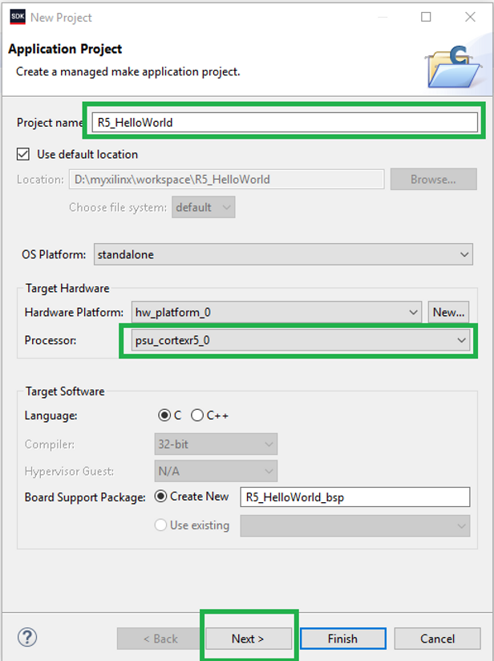
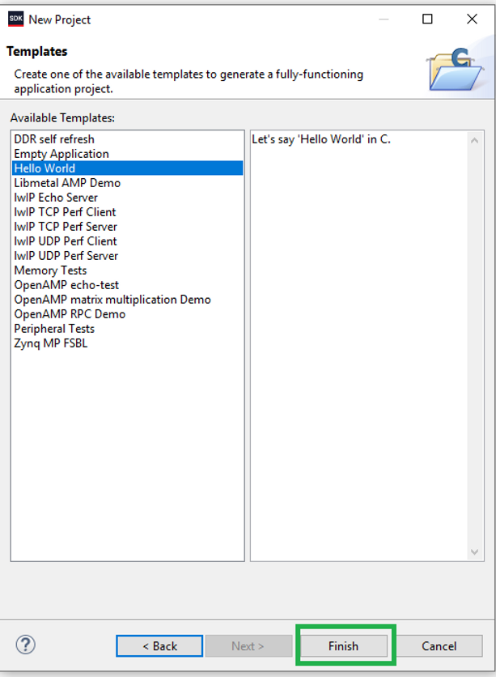
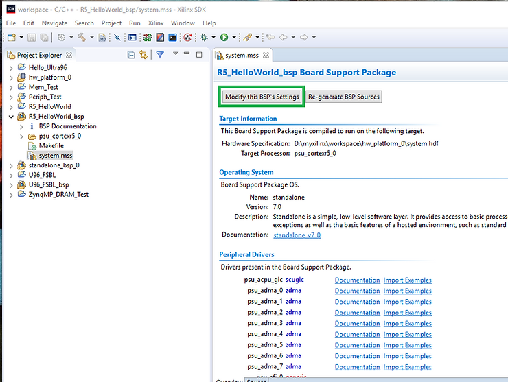
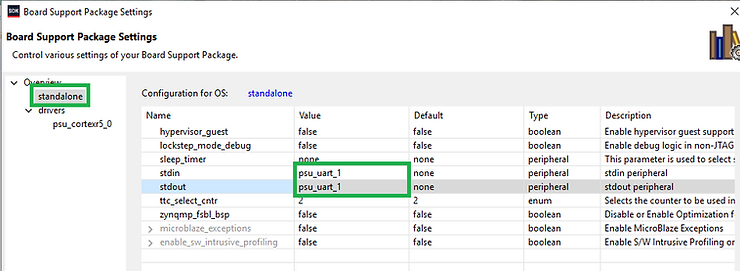
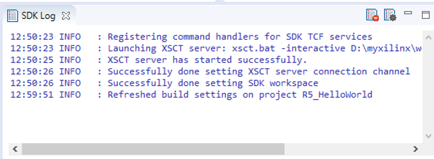
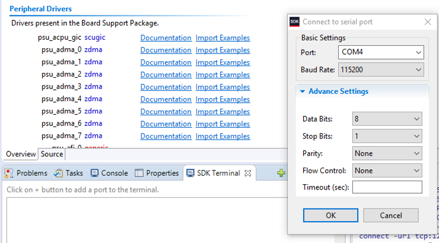
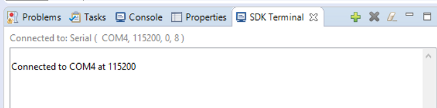
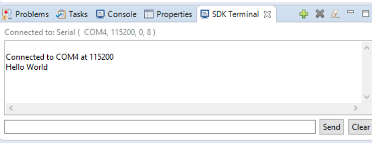

# Running "Hello World" on an Ultra96-V2's R5 Processor

Before performing these steps, its required that the following tutorials have been followed and completed.  

 https://www.centennialsoftwaresolutions.com/post/runnng-barebones-apps-on-the-ultra96-v2-cortex-a53-processor?gclid=EAIaIQobChMI7qLL1r_b5AIVzR-tBh3q1AugEAAYASAAEgIxtfD_BwE 

This guide will simply do a "Hello World" program targeting the R5 processor.  The R5 software will be run from within the SDK so make sure switch SW3 is set correctly to run from the JTAG/Serial port.

1.) Create a new Application Project

**File->New->Application Project**

2.) Select a Project Name and R5 processor. Note that a new BSP will need to be created if one hasnt been created for the R5. Select Next to continue.

3.) Select the Hello World template and select Finish to continue.

4.) Open the R5 BSP just created and double click on the system.mss file to open it and select "Modify this BSP's Settings"

5.) Click on standalone and change the STDIN and STDOUT ports to "psu\_uart\_1".

6.) The BSP should be rebuilt which can be seen in the "SDK Log Window"

7.) Make sure your Ultra96 is powered on, the Power ON Button(SW4) has been pushed (should hear fans running) and the USB is connected.

8.) Add your PC COM Port to the SDK Terminal Window.

9.) Select your R5\_HelloWorld Application Project and then Right Click->Run As->Launch On Hardware (System Debugger).

10.) Verify Serial Port Output.

11.) Congrats. Feel free to experiment with other R5 templates.

<u>Reference</u>

-   Xilinx logo clipped from [<u>xilinx.com</u>](http://xilinx.com/)