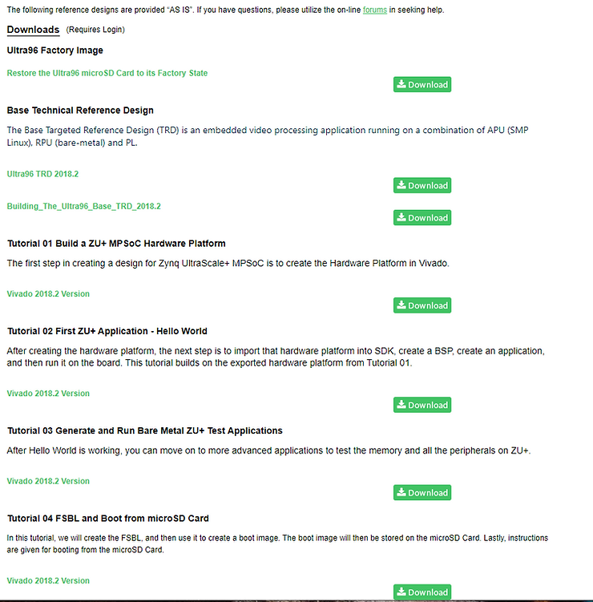
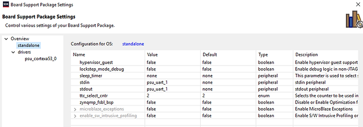

# Links to Run Bare-Metal Apps on the Ultra96-V2's Cortex A53 processor

There is a set of tutorials that is a good starting point for getting your Ultra96-V2 up and running.

The tutorials are at  http://zedboard.org/support/design/24166/156 

Tutorial 01 creates a hardware platform in Vivado which is required for subsequent tutorials

Tutorials 02 and 03 are Cortex A53 Baremetal Apps using SDK to build and run over the connected JTAG/serial port.

Tutorial 04 is an FSBL App using SDK to build the boot image which is transferred to an SD card. If using the supplied SD card for this tutorial you will overwrite the Base Reference Technical Design on the SD card. This can be restored with the Ultra96 factory image.

I would say the tutorials are about 99.5% accurate, the only error I remember is the correct uart to setup for stdout and stdin needs to ALWAYS be psu\_uart\_1

<u>Reference</u>

-   Xilinx logo clipped from [<u>xilinx.com</u>](http://xilinx.com/)