# Save a VirtualBox VM

This post show you how to save the images and state of a virtual machine managed by Oracle's VM VirtualBox Manager.

**Versions of Software and OS's Used in this Post**

-   Windows 7 Professional SP1
    
-   Version 5.1.30 r118389 (Qt5.6.2)
    
-   See \[[link](http://www.zachpfeffer.com/single-post/2017/01/28/New-T460-System-Information)\] for the hardware used
    

**Steps**

Run Oracle VM VirtualBox Manager

(**1**) Click **Start**, (**2**) Type **Oracle VM VirtualBo**x into the search term and (**3**) click on **Oracle VM VirtualBox**

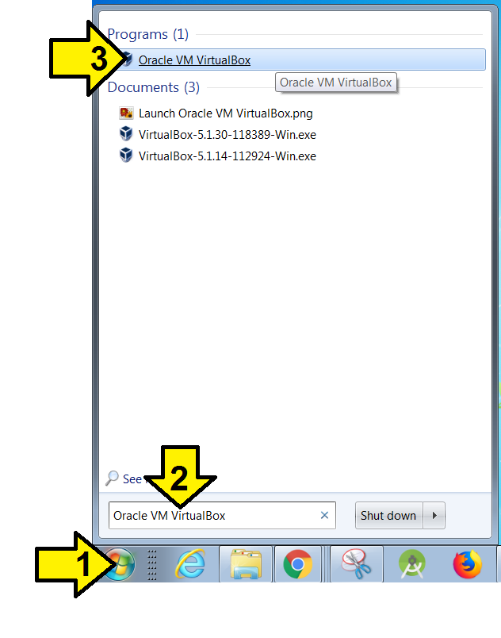

Create a folder for the images

Run Windows Explorer

(**1**) click the Windows icon, (**2**) type Windows Explorer into the search box and (**3**) click on Windows Explorer.

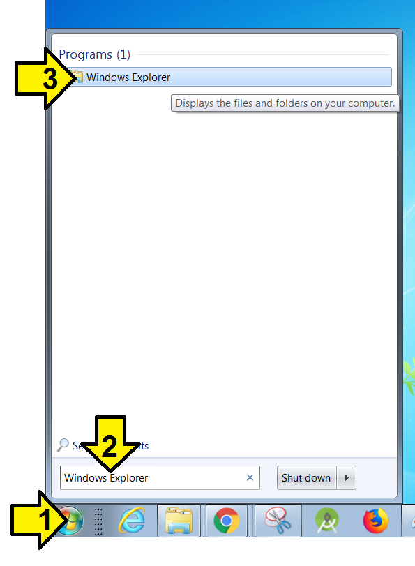

(**1**) Click **Documents** then (**2**) **New Folder**

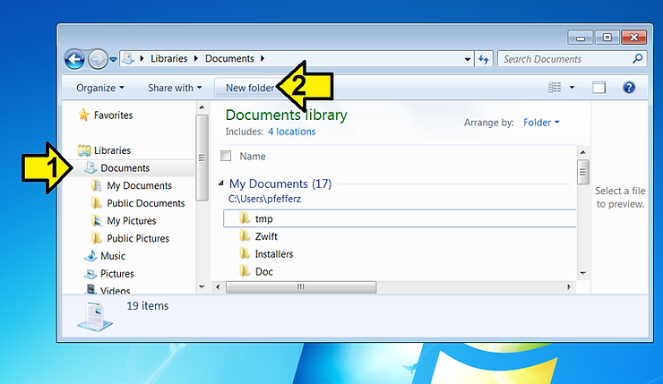

Name the folder the name of the virtual machine (VM), followed by an underscore and how many disk interfaces (SATA0, SATA1, SATA2)

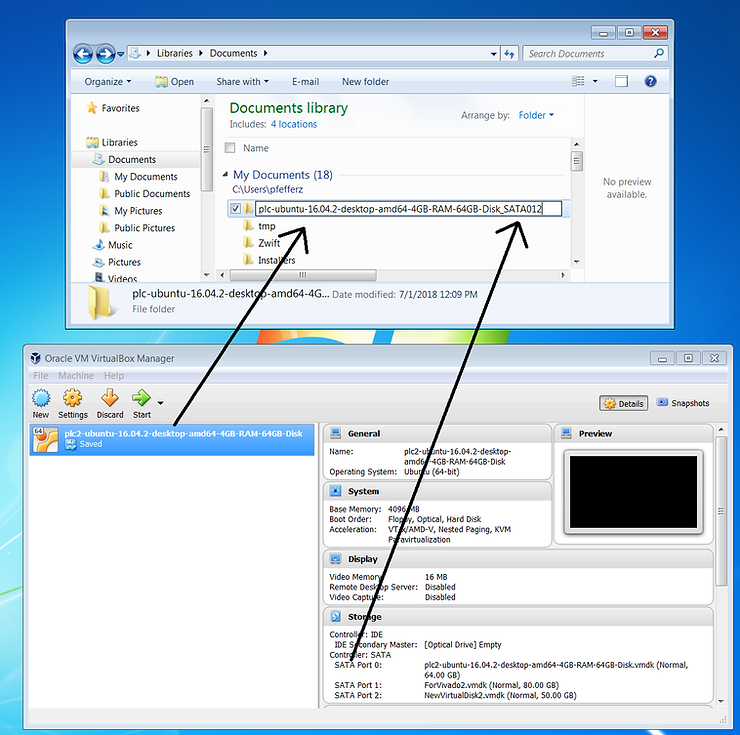

Save a screenshot of the virtual machine's **Details** into the folder

(1) Select the window and press Alt + PrtSc on your computer, (2) Open Paint (Windows > Paint), (3) type Control-Z to paste, then click Crop.

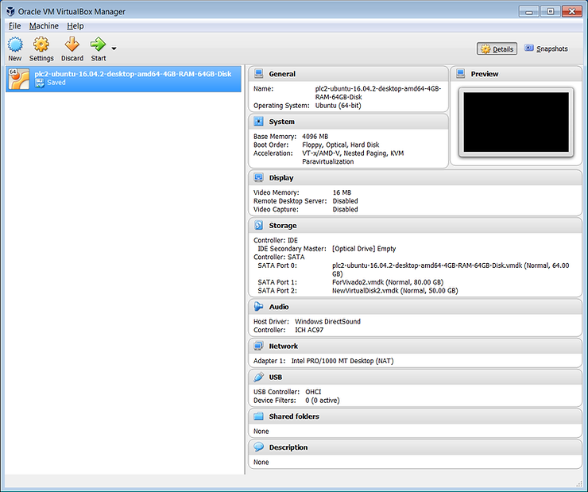

Record the version of VirtualBox you used

(1) in Oracle VM VirtualBox Manager click **Help** then (2) click **About VirtualBox...**

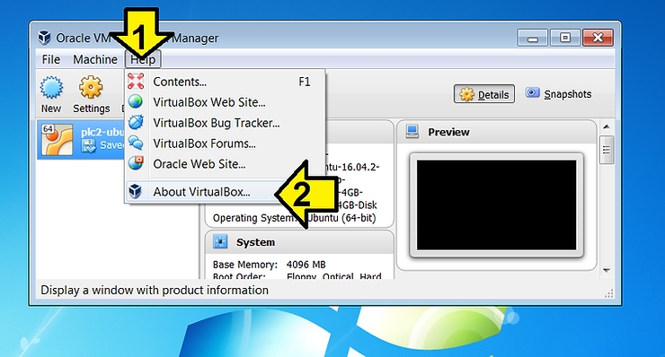

Click PrtSc and save the screen to the folder you created.

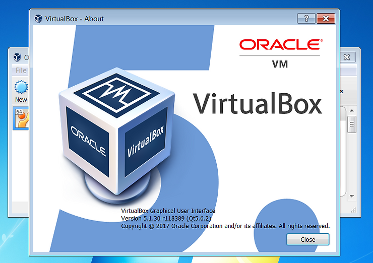

Save the installer you used to the folder, in this case VirtualBox-5.1.30-118389-Win.exe. If you don't have it, find the installer needed to install the version of VirtualBox you have, then copy it from [https://download.virtualbox.org/virtualbox/5.1.30/](http://download.virtualbox.org/virtualbox/5.1.30/) or related.

Find each disk image and save it

Click on Settings in VirtualBox Manager

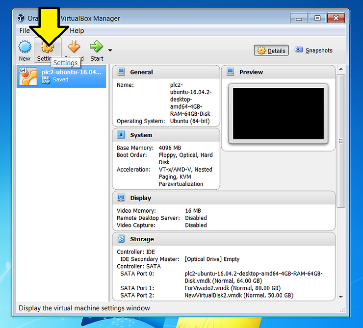

Click on Storage

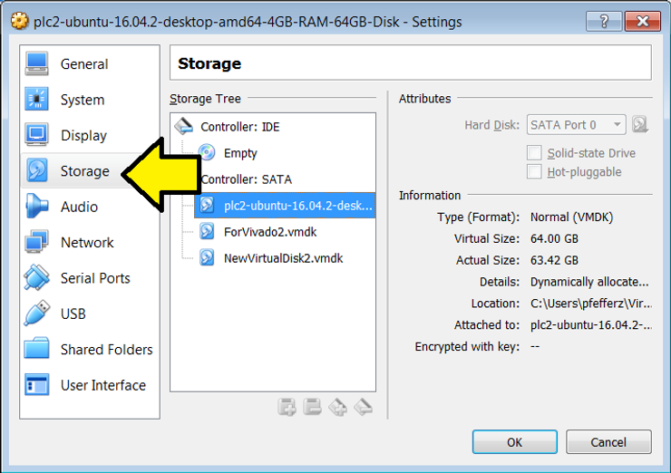

(**1**) Click on each image, (**2**) click the location, (**3**) right click, (**4**) click copy to copy the path.

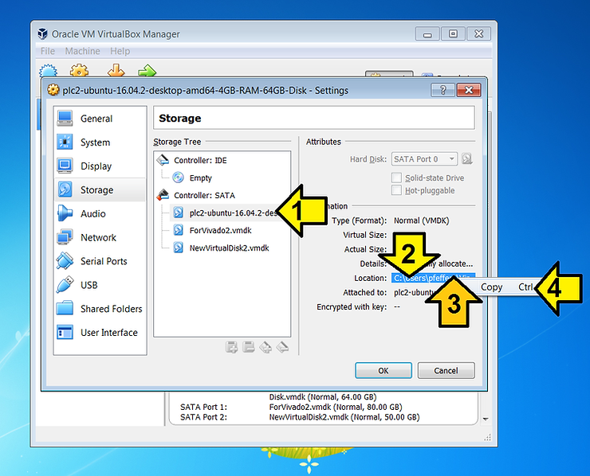

Record all the paths in Notepad and save the paths as paths.txt in the folder you created.

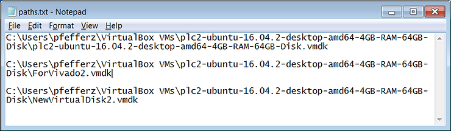

In Windows Explorer, go to the root path of the Virtual Machine. If you have enough room on your disk, copy the Virtual Machine, otherwise move it to the folder you created.

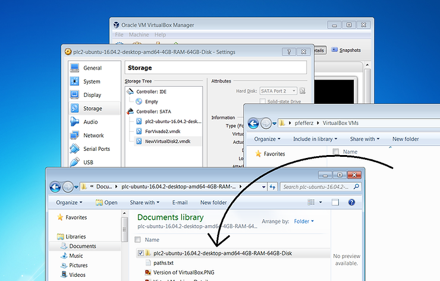

The VM I backed up was 159 GB. I initially intended to back it up to the cloud, but backed it up to a Seagate STEL40001000 instead. There's a post here: **Unboxing a Seagate STEL4000100 4 TB** \[[link](http://www.zachpfeffer.com/single-post/2018/07/01/Unboxing-Seagate-STEL4000100-4-TB)\].

**References**

VirtualBox logo from \[[link](http://linux.systeminside.net/como-instalar-y-configurar-virtualbox/)\]