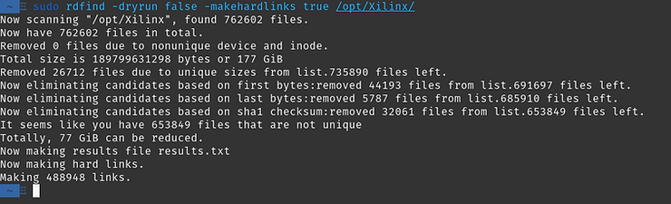

# Save space between Vivado versions


or Redundant Data Find...

It's often that developers need to use multiple versions of a tool. In this case: Vivado.

IDEs can become quite hefty and use up a lot of space. This guide only works for Linux.

My Xilinx tools are installed under **/opt/Xilinx** so I'd like to reduce this almost 200GB install.

First install **rdfind**:

```
sudo apt install rdfind
```

This command will replace all duplicate files with hard links. So to your system they will look normal, but in reality it only keeps one copy of the duplicate!

Now let's run it:

```
sudo rdfind -makehardlinks true /opt/Xilinx
```



We saved 77GB! And this is just between 2019.2 and 2020.2 Vitis/Vivado versions.

## References/Previous Posts

I came across **rdfind** on r/fpga subreddit: https://www.reddit.com/r/FPGA/comments/ellcrr/psa_deduplicate_your_vivadoquartusiseetc_installs/fdlbdtn 

This also came up in the response thread https://www.reddit.com/r/FPGA/comments/la1ems/vivado_eating_up_space_in_c_drive/ 

Thanks to /u/deNederlander for correcting me and pointing out that **-dryrun false** doesn't need to be there. https://www.reddit.com/r/FPGA/comments/lv0p2a/save_space_between_vivado_versions/gpbjpzj 

Xilinx logo from [[link](https://twitter.com/xilinxinc)]