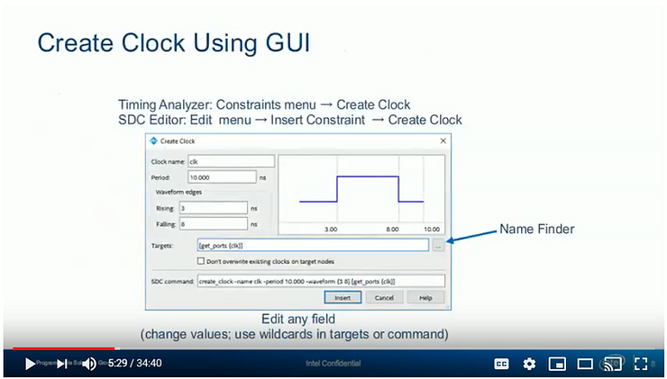
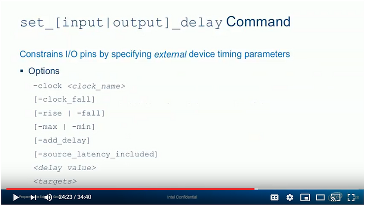

# SDC Design Constraint Examples and Explanations

This post presents how to write clock, generated clock, non-ideal clock and virtual clock SDC constraints to constrain I/O paths. It also presents a great example of constraining a synchronous I/O circuit. The descriptions are presented as a transcript of **Timing Analyzer, Online Training: Part 4 - Required SDC Constraints.**

**<u>Links to the Entire Series</u>**

-   Timing Analysis Concepts & Terminology \[[<u>link</u>](https://www.centennialsoftwaresolutions.com/blog/timing-analysis-concepts-terminology)\] (part 1)
    
-   Fast & Slow Corners in Timing Analysis, Steps to Run Timing \[[<u>link</u>](https://www.centennialsoftwaresolutions.com/blog/timing-analyzer)\] (part 2)
    
-   Run Timing on a Cheaper Speed Grade to Save Money \[[<u>link</u>](https://www.centennialsoftwaresolutions.com/blog/run-timing_on_a_cheaper_speed_grade_to_save_money)\] (part 3)
    
-   SDC Design Constraint Examples and Explanations \[[<u>link</u>](https://www.centennialsoftwaresolutions.com/blog/sdc-design-constraint-examples-and-explanations)\] (part 4)
    

**<u>Links to all the Original Videos</u>**

-   Part 1: Timing Analyzer: Introduction to Timing Analysis \[[<u>link</u>](https://youtu.be/B73G4BuTpLo)\]
    
-   Part 2: Timing Analyzer: Timing Analyzer GUI \[[<u>link</u>](https://www.youtube.com/watch?v=IGAwgI3Fs-k)\]
    
-   Part 3: Timing Analyzer: Intel Quartus Prime Integration & Reporting \[[<u>link</u>](https://www.youtube.com/watch?v=_7mMYhuQIbY)\]
    
-   Part 4: Timing Analyzer: Required SDC Constraints \[[<u>link</u>](https://www.youtube.com/watch?v=hfaiPxl9Z9A)\]
    

**<u>Video</u>**

(Video unavailable)

**<u>Transcript</u>**

<u>Timing Analyzer, Online Training: Part 4 - Required SDC Constraints</u>

**Slide Text**

Timing Analyzer

Online Training: Part 4 - Required SDC Constraints

**Transcript**

Welcome to the Intel Quartus Prime software design series Timing Analyzer

online training part 4 Required SDC constraints. My name is Steve. This training is available for desktop viewing as well as in a format compatible with portable devices both available from the same link included in your registration email. For either version, while watching the training, use the controls at the bottom and side of the screen to navigate to any point. Feel free to pause the training at any time to experiment with the software. When you're done with the training please use the link provided in the registration email you're sent to provide us feedback on the training and ways in which it can be improved. I'll remind you about that later.

0:47

<u>Objectives</u>

**Slide Text**

Objectives

-   Perform timing analysis using Timing Analyzer (TA) timing verification flows
    
-   Build Synopsys Desgin Constraint (SDC) files for constraining FPGA designs
    
-   Generate timing reports in Timing Analyzer
    
-   Gain familiarity with Timing Analyzer graphical user interface (GUI)
    

**Transcript**

In this course you will learn how to perform timing analysis in the Intel Quartus Prime software using Timing Analyzer. You will use Synopsis Design Constraints or SDC files to constrain a design to meet timing requirements and to compare results. You will learn how to generate Timing Reports in Timing Analyzer and gain familiarity with its graphical user interface.

1:11

<u>Agenda for Part 4</u>

**Slide Text**

Agenda for Part 4

-   Timing analysis concepts & terminology
    
-   SDC netlist terminology
    
-   Introduction to the Timing Analyzer GUI
    
-   Using Timing Analyzer
    
-   Incorporating timing analysis in the Intel Quartus Prime design flow
    
-   Timing Analyzer reporting
    
-   \> SDC constraints <
    

**Transcript**

Here is the agenda for this course. In previous parts we looked at basic timing analysis concepts and the terminology used in Timing Analyzer. This included a discussion of the terminology used to select nodes from the SDC netlist for targeting timing constraints. You were then introduced to the Timing Analyzer GUI, its general use and how to incorporate the tool into the Intel Quartus Prime design flow. The third part ended with a look at Timing Analyzers extensive reporting features. In this final part we will discuss the SDC constraints required to fully constrain a design as well as a number of optional constraints.

1:53

<u>Timing Analyzer, Required SDC Constraints</u>

**Slide Text**

Timing Analyzer

Required SDC Constraints

**Transcript**

To finish up this training let's look at the constraints you'll

need to fully constrain your design

2:01

Note: The following is important.

<u>Clock Constraints</u>

**Slide Text**

Clock Constraints

Two Types

Clock

Absolute/based clock: typically a clock coming into device on an input clock pin

Virtual clock

Drivers external device(s) but never actually enters FPG

For establishing launch/latch edge relationships when performing I/O timing analysis

**Transcript**

The first and most important constraints you must create our clock constraints. Clocks in the Timing Analyzer are not actual physical locations in the design. They represent signal characteristics applied to a point in the design. There are two major types of clock constraints. The first type are absolute or base clocks. these are clocks that are typically input on the device's clock pins. A variant of a base clock is a virtual clock. A virtual clock is a clock that drives devices the FPGA communicates with, either on the FPGA inputs or outputs but never actually enters the FPGA device. However a virtual clock's properties must be defined in the .sdc file in order to establish the correct launch / latch edge relationship for an I/O timing analysis. We'll look at virtual clocks in more detail in a moment.

2:56

<u>Clock Constraints</u>

**Slide Text**

Clock Constraints

◾ Two Types (cont.)

\- Generated clock

\- Timing derived from another clock in design

\- Must have defined relation with source clock

\- Apply to output of logic function that modifies clock input

\- PLLs, clock dividers, output clocks, ripple clocks, etc.

◾ All clocks are related by default

\- Cross-domain transfers analyzed

**Transcript**

The second type of clock constraints are generated clocks. Generated clocks are internal FPGA clocks that are based off of a base clock or some other generated clock. There must be a defined relationship between a generated clock and its source clock. A good example of this are the clocks output from a PLL. These clocks are related in some way to the input reference clock of the PLL. A generated clock constraint is used to define that relationship. By default all clocks are related to one another and all cross-domain transfers are analyzed by the tool even if those clock domains are asynchronous to each other. It is possible to separate clock domains using special constraints called timing exceptions. We'll touch on these special commands later.

3:48

<u>Creating an Absolute/Base/Virtual Clock</u>

**Slide Text**

Create an Absolute/Base/Virtual Clock

◾ Command: create\_clock

◾ Options

\[-name <clock\_name>\]

\-period <time>

\[-waveform {-rise\_time> <fall\_time>}\]

\[<target>\]

\[-add\]

◾ \[\] = optional

◾ **Note**: In general, the more options added to a constraint command, the more specific the constraint it. When options are not specified, the constraint is more generalized and pertains to more of the target.

**Transcript**

Here is the create\_clock command that you would use in the console or in a .sdc file to define the properties of a base or virtual clock. While the clock period is a required argument a clock name is optional. You can give the clock a unique name to make it easy to identify and use in other constraints or reports. If you don't supply a name, the clock will be named after the node targeted by the constraint. The -waveform option is used to specify the rise and fall times of the clock to create phase shifted and non 50% duty cycle clocks. By default, clocks and the Timing Analyzer rise at the start of the period and fall at the halfway point. The -add option is used to apply more than one clock constrained to a particular target location. In the SDC timing netlist this may occur for example if either a 50 MHz or a 100 MHz clock is applied to the same clock input pin of the device due to external control logic or a board build option. Finally the target option is used to select where in the SDC netlist to apply the clock constraint. This will typically be an input port in the netlist accessed with the get\_ports\_collection. If you don't supply a target, the clock is considered to be a virtual clock driving some other device on the board. Virtual clocks are used with I/O constraints and the Timing Analyzer itself to automatically derive I/O related timing uncertainties. We’ll look at the creation of a virtual clock in a moment.

5:29

<u>Create Clock Using GUI</u>

Here's the same constraint accessed in the Timing Analyzer GUI; either in the constraints menu in the main Timing Analyzer window or the Insert Constraints submenu under the Edit menu of the SDC file editor. You can set the same parameters as with the actual command. The clock waveform graphic updates as changes are made to the settings. The SDC command field near the bottom updates as you make changes as well. This is a great way to start learning the SDC syntax. If you don't know the exact target you should use, click the Browse button to open a tool called the Name Finder.

6:11

<u>Name Finder</u>

The Timing Analyzer name finder is very similar to the Intel Quartus Prime Note Finder. The difference is that the Name Finder is designed to search the SDC netlist. Select a collection from the list at the top and use the filter to search for only specific items in the collection. The highlighted options are used to decide what part of SDC netlist hierarchy to search. When the list button is clicked all the items in the selected collection that match the filter are listed on the left. The arrow buttons in the center move items to the selected items list on the right. As you select items from the net list the SDC command field at the bottom updates as well. You can edit this field putting in wildcards to simplify the command. For example if you want to target the entire DNA bus you can use a wild-card by editing the SDC command to add DNA\*. Clicking OK returns to the main constraint entry dialog box with the selected collection and items filled in the target field.

7:22

<u>Creating a Generated</u>

After creating base clocks you'll need to create constraints for any generated clocks in the design. You do this with the create\_generated\_clock command. Most of the arguments here are used to define the relationship between the source and generated clocks. some examples are inverting the generated clock with respect to the source or performing a phase shift of the generated clock a certain number of degrees with respect to the source.

7:50

<u>create_generated_clock Notes</u>

A source clock is required for the generated clock constraint using the -source argument. Typically the source should be as close as possible to the generated clock. Going back to the example of a PLL, the source of any clock output for the PLL should be the reference clock on the input pin of the PLL. If there are multiple clocks at the source location due to the create\_clock -add option use the -master\_clock option to select the correct one. Finally, the -edges and -edge\_shift options can be used to define a relationship with the source clock based on the rising and falling edges of the source. This is a different way of defining the relationship and may be useful if the relationship to the source is not easy to define with any of the other methods.

8:40

Create Generated Clock Using GUI

Here is what the GUI looks like for creating a generated clock. The generated clock can have its own unique name just like a base clock. Select the source clock location and the target location using the name finder. Then use the options available to define the relationship between the source and the generated clock. You can see here in the target's field how the SDC netlist hierarchy targets specific pins in the netlist, in this case a PLL's output clock pin. If a clock name is not filled in at the top of the dialog box the generated clock will be given the same name as the target. Since the target name can get quite complicated due to the SDC netlist hierarchy, it is recommended to always give easy to identify names to generated clocks.

9:32

Note: the following describes what virtual clocks are and how the can be used to constrain I/O.

**Transcript**

Here is a simple example of how to create base, virtual and generated clocks. A clock comes into the design on the **clk\_in** port and goes to the clock input pin of the register name **inst**. the first **create\_clock** command defines the base clock to have a period of 10 targeted to the **clk\_in** port. Because no name was given to the base clock its name will be the same as its target which in this case is **clk\_in**. This is the name used when referring to the clock in other constraints. Notice that there is a second base clock constraint. **This second base clock has the same period as clock in but no target is included in the constraint. This is an example of a virtual clock constraint**. The virtual clock named **clk\_in\_virt** is not used anywhere in the FPGA design, however it is recommended that for each base clock in your design there is a corresponding virtual clock which may or may not have the same properties as the base clock. In this example **clk\_in\_vert** is an upstream clock, meaning it drives some external device that sends data to the FPGA and it happens to be the same clock as **clk\_in**. when performing an I/O timing analysis with these clock constraints, **clk\_in\_vert will be the launch clock and clk\_in will be the latch clock**. Adding the extra virtual clock in this manner will also let the timing analyzer automatically add I/O timing uncertainties using a command we'll look at in a moment. This can help in performing a timing analysis that more closely reflects real-world timing.

To finish constraining the clocks in this design the **create\_generated\_clock** command defines the generated clock at the output pin of the clock divider. The generated clock is named **clk\_div**. Notice that the source is assigned by using the **get\_pins** collection and the clock pin of the **inst** cell. The source is set to the input pin of the register, the closest point to the output, however in this example you could use the **clk\_in** I/O port as the source to generate the same clock because there is no logic in-between. The **divide\_by** option defines the relationship. The end of the command selects the target. Again the **get\_pins** collection is called and the Q output pin of the in cell is selected. All clocks in the simple design are now fully constrained.

12:11

<u>Derive PLL Clocks (Intel FPGA SDC Extension)</u>

Note: derive\_pl\_clocks in an Intel extension that can be expanded into standard SDC.

**Transcript**

As a shortcut to creating generated clocks on the output of PLL's you can use the **derive\_pll\_clocks** command either added to the .sdc file manually or using the GUI dialog box. This is an Intel FPGA SDC extension that automatically creates generated clock constraints for PLL's based on the parameter setting specified when the PLL was added to the design as an IP core. Even if the characteristics of the PLL change, the generated clocks will update automatically to account for these changes. The only requirement for this command is that the input clock of the PLL is already constrained. However if the PLL input clock is not constrained you can use the **\-create\_based\_clocks** option to automatically create the associated input clock; again based on the PLL settings. If you need to translate this command to standard SDC use the **\-expand** option with the right SDC command. This will replace the derive\_pll\_clocks command with a standard **create\_clock** and **create\_generated\_clock** constraints.

13:20

<u>Derive PLL Clocks Using GUI</u>

To access the derived PLL clocks in the GUI simply go to the constraints pulldown menu in timing analyzer and select drive PLL clocks.

13:31

<u>derive_pll_clocks Example</u>

Here is an example of how the derived\_pll\_clocks command can simplify PLL output clock constraints. On the left are the constraints required to fully constrain the PLL shown here. First the input clock is constrained as a base clock. Then three long clock\_create\_generated clock commands constrain the outputs of the PLL; setting the source and target locations as well as defining the relationships to the source. These three commands are replaced by the single derived PLL clocks command on the right. It's easy to see how this can help when there are multiple PLL's in your design each with multiple output clocks.

The one caveat to the derived\_pll\_clocks command is that there is no way to select a custom name for the generated clocks that you normally would with the -name option. The clocks created with the derived PLL clocks will use the target pin name which could be unwieldy if the generated clocks must be used for the other constraints in the design. As a workaround use the -expand option with the right SDC command to expand out the derived\_pll\_clocks command to standard generated clock constraints and then add in the -name option to the standard create generated clocks commands to name the clocks.

14:55

<u>Non-Ideal Clock Constraints</u>

The clock constraints discussed so far defined clocks that are perfect square waves that do not take into account any external delays that may be present outside of the FPGA. To provide more realistic clock characteristics to the Timing Analyzer special constraint commands can be applied to clocks to adjust how the Timing Analyzer performs its analysis.

15:20

<u>Non-Ideal Clock Constraints (cont.)</u>

Note: recommends that users use the Intel extension, derive\_clock\_uncertainty constraint in all designs to provide the most accurate timing analysis

First, the set\_clock\_latency command is used to define source latency on input clocks. Source latency refers to board related delays that may be present on input clocks that could cause these clocks to arrive earlier or later than expected. Clock latency can be applied to any clock input to the FPGA device. A good example of where set\_clock\_latency is used would be for a feedback clock. The delay on a clock path that is output from the FPGA and then returns to a clock input pin is unknown by the tool. Using the set\_clock\_latency constraint makes it easy to define this delay.

The next special clock constraint is derive\_clock\_uncertainty. This command is an Intel SDC extension that can automatically derive uncertainties inheriting clocks used in supported devices. it adds uncertainty for data transfers within a single clock domain and for transfers going between two clock domains. As discussed earlier uncertainty values can be added to the setup and hold data required time calculations to essentially make the timing analysis more pessimistic. The derive\_clock\_uncertainty command is an easy way to add clock uncertainties without having to define them manually throughout the device. While derive\_clock\_uncertainty always drives internal device uncertainties, a virtual clock is required as discussed earlier, for the command to correctly derive uncertainties on data I/O. **It is recommended that the derive\_clock\_uncertainty constraint be used in all designs to provide the most accurate timing analysis.**

Finally, the set\_clock\_uncertainty command lets you manually add uncertainties to model jitter, guard band or skew. This can be used on its own or alongside derive\_clock\_uncertainty to completely customize uncertainties throughout your design. For more details on the usage of these other types of clock constraints see the Timing Analyzer chapter in the Intel Quartus Prime handbook and the built-in help.

17:37

<u>Undefined Clocks</u>

The Timing Analyzer considers all signals on device clock input pins and all signals that are used on register clock inputs to be clocks that need to be constrained. To verify whether you have constrained all the clocks in your design use the **Unconstrained Paths Report** found in the Intel Quartus Prime compilation report or generated in the Timing Analyzer interface using the report\_ucp command.

18:03

<u>Unconstrained Path Report</u>

Here is a typical unconstrained path report. Selecting the unconstrained paths server

report indicates the number of unconstrained clocks. Selecting the clock status summary report lists the signals considered to be clocks by the timing analyzer. the report indicates whether these clock signals are constrained or not. **Any unconstrained clocks need to be constrained for a complete analysis.**

18:31

<u>Combinational Interface</u>

Note: The following shows a method to constrain I/O paths.

Along with clocks, I/O paths must also be constrained. Internal path timing is understood by Timing Analyzer but the tool has no information about I/O paths. You can constrain I/O paths in a number of ways. This first method is useful if I/O signals simply go through combinatorial logic in the design. In this case you can use this set\_max\_delay and set\_min\_delay constraints to specify an absolute delay range that signals would take when going through the logic. The set\_max\_delay and set\_min\_delay constraints both have the same options allowing you to specify the paths where the delay should be applied. For this method of constraining I/O use the -from and -to options to select I/O ports from the get ports collection. In general -from and -to can be used to target any items in the netlist as the source or destination. The other options listed here can be used if the delay should only be applied on the rising or falling edge of the source or destination clock.

19:44

<u>set_max_delay &amp; set_min_delay (GUI)</u>

Here is the GUI interface for creating a sent\_min\_delay constraint. Use the name finder to select the end nodes of the path where you want to apply the delay. The -through option is useful if there are a number of paths that have common sources or destinations.

20:03

<u>set_max_delay &amp; set_min_delay (GUI)</u>

**Transcript**

Here is a simple example using the **set\_max** and **set\_min** delay constraints. The **\-from** option is used to select which input path the constraint should be applied to. The **\-to** option targeting **out\*** indicates that the constraint is applied to the paths that go from that input to any of the output ports. For example, the first **set\_max** delay constraint says that the maximum amount of time it should take for signal to get from the **in1** port through the logic and out to either of the out ports must be less than or equal to 5 nanoseconds. The pairs of maximum and minimum constraints define a range of delay through the combinatorial logic.

20:51

<u>Synchronous Inputs</u>

Note: The following shows **another** method to constrain I/O paths.

The other method of constraining IO signals is by providing the Timing Analyzer with information about external delay parameters. With this information, the fitter can place and route the design in a way that satisfies external timer requirements. Let's look at synchronous data inputs first. If the fitter knows about the Tco of the external device shown here as well as the board delays for the clock and data, it can place and route the input register along with the Tdataint and the Tclk2int paths in such a way as to ensure that the FPGA setup and hold time requirements are met.

21:35

<u>Synchronous Outputs</u>

Note: More good into on constraining external outputs.

Looking at synchronous outputs the fitter again needs to know about board delays as well as the set up and hold time requirements of the external device that the FPGA is driving. This gives the fitter enough information to place the output register and to route the Tdataint into path to adjust the FPGA's Tco value in such a way that it guarantees that the external devices setup and hold time requirements are met.

22:06

<u>Constraining Synchronous I/O (-max)</u>

To constrain I/O using external delays use the **set\_input\_delay** or **set\_output\_delay** constraint commands. These commands have -max and -min arguments in a similar manner to the set\_max\_delay and set\_min\_delay commands. Pairs of these commands are required, one with the -max and the other with the -min to define a range of external delay. **Let's look at a maximum delay first on the input side using maximum delay constraint to specify the maximum amount of time it can take a signal to arrive and still meet the FPGA set-up timing requirement**. On the output side **a maximum delay constraint specifies the maximum amount of time available to output a signal and still meet the external devices set-up time**. The equations listed here take into account the board delay including any capacitive loading, the clock skew between the clock arriving at the FPGA and the external device and the clock-to-out or set-up time requirements of the external device to calculate the largest possible external delay value for inputs or outputs. compare the equations to the schematics of the previous slides to see where the values come from. The computed input or output delay max value is used as the delay value in the constraint.

23:33

<u>Constraining Synchronous I/O (min)</u>

Notes: The following describes how to calculate external delay.

Now we'll look at minimum delay in a similar manner. On the input side the minimum delay constraint specifies the minimum amount of time a signal should remain active to still meet the FPGA's holding time requirement. For the output the minimum delay constraint specifies the minimum amount of time the output signal should remain active and still meet the external device's hold time. Again the equations must take into account the board delay and the clock skew, but also the clock-to-out or hold time requirements of the external device. This time the values are selected to calculate the smallest external tool a possible. using the bold equations as a guide should help when determining the values to use for external delay.

24:22

Here are the options available for the set\_input\_delay and set\_output\_delay commands. The options are the same for both.

24:32

The more important options are listed here. In addition to the -max or -min option, you must specify the clock that drives the external device's register on either the input or output side in order to determine which edges to use for the launch and latch edges. Based on the earlier discussion about virtual clocks the -clock option should always reference a virtual clock. Recall that the virtual clock is the clock used to clock the external device either on the input or on the output so using this clock as a reference is necessary for correctly establishing the launch and latch edges for I/O timing analysis. The -clock\_fall option is used if the data is launched or latched on the following edge of the specified virtual clock at the external device. The -rise and -fall options specify that the external delay should only be applied on the rising or falling edge of the targeted input or output data port. Without -rise or -fall the delay applies to both edges. since -max and -min and -rise at -fall are each mutually exclusive to each other you could have two or four constraints for each i/o port. Only two constraints specifying -max and -min are required if the delay can be applied to both the rising and falling edge of the data.

26:03

Note: This talks about constraining double data rate interfaces.

Finally, the -add\_delay option is required if different delay values are to be applied to the same targeted port. This can occur, for example, if you want separate analyses performed for data launched by the rising edge of a clock versus data launched by the clock's falling edge, as is the case in a **double data rate source synchronous interface**. Note that in order to fully constrain an I/O port you must include both a -max and -min delay constraint. If you only specify one or the other the same value will be used for both max and min and the tool display of warning.

26:43

set\_input\_delay and set\_output\_delay constraints can be created using the GUI as shown here. Notice that for the clock name you can select a clock from a pop-up list. This feature of the GUI is only available once all clocks have been constrained in the netlist updated with those constraints. The other options let you specify the calculated external delay value and the target port or ports for the delay. Remember that you can manually edit the targets in SDC command fields in order to add wildcards.

27:18

Here's an example of how to use both set\_input\_delay and set\_output\_delay to fully constrain synchronous I/O.

First the clock named **clk** is constrained as usual along with virtual clocks named **clk\_v\_in** and **clk\_v\_out** for the upstream and downstream devices respectively.

Next -max and -min set input delay commands constrain the input on the **datain** port referencing the virtual clock clk\_v\_in.

The actual extra delay values are broken down into their factors using the Tcl **expr** command. For example, for the input max delay highlighted here the delay is equal to the maximum board delay of **1 ns** minus the minimum clock skew of **\-0.5 ns** plus the maximum Tco of the external device specified as **5 ns**. The set output delay commands work in a similar manner using the defined equations, but the -clock\_fall out is used.

This is necessary because the output data is clocked in on the falling edge of the virtual clock clock be out at the external device. It may seem complicated at first but the equations make it easy to specify the correct delay values to ensure that all timing requirements both internal and external to the FPGA are met.

28:47

As before with unconstrained clocks, use the unconstrained paths report to look for any unconstrained I/O ports and port paths. Port paths refer to all the **fan-out** from an input port and all the fan-in to an output port that are considered unconstrained because the input or output port itself is unconstrained. The unconstrained paths summary report will indicate the number of unconstrained paths, while the reports in the setup and hold analysis folders show you exactly which paths are considered unconstrained. With all clock and IO constraints defined in a .sdc file, the unconstrained path summary report should indicate that the design is now fully constrained.

29:33

However, you may need to add constraints in addition to the constraints presented so far in order to accurately describe how the design is supposed to work with respect to timing. These special constraints called **timing exceptions** changed the way the Timing Analyzer looks at targeted paths for analysis. First, as discussed earlier, **set\_max\_delay** and **set\_min\_delay** can be used to select an arbitrary delay range for a path. These constraints are included as timing exceptions because using them overrides the default delays that would be selected by the fitter based on the required clock and input or output delay constraints. Next, the set\_faults\_path and set\_clock\_groups commands tell the Timing Analyzer to intentionally not perform a timing analysis on certain paths in the design including those that go between asynchronous clock domains. these commands are also very useful for isolating tests or debug logic in a design as well as for isolating multiple clocks that are never active at the same time such as those on the output of a clock mux. set\_ false\_path can also be used to prevent certain types of analysis from being performed on a targeted path.

The set\_multicycle\_path command is used to change the default launch or latch edge used for either the set up or hold analysis. By default, Timing Analyzer assumes that all data transactions take one clock cycle to reach their destinations. Specifying a multicycle path moves the launch or latch edge loosening the timing by providing extra clock cycles for logic that specifically requires more than one clock cycle to generate a result. A good example of where this might be used would be with the multiplier. If the multiplier requires two clock cycles to output a value there is no way timing can be met with the default of only one clock cycle for a data transaction. Adding a multicycle constraint on data going through the multiplier provides the extra clock cycle required by the logic.

Timing exceptions are not required to fully constrain a design, but they may be required if the design calls for them. For details and examples on the use of timing exceptions see the timing analyzer chapter in the Intel Quartus Prime Handbook.

32:02

The rest of this transcript has been processed at \[[<u>link</u>](https://www.centennialsoftwaresolutions.com/blog/timing-analysis-concepts-terminology)\].

this concludes the timing

analyzer training so to sum things up

timing constraints are very important in

any FPGA or CPL D design to guarantee

that your design will meet all timer e

requirements you must constrain all

paths in the design but at least the

clock and I hope paths the timing

analyzer provides an easy-to-use

interface for creating SDC constraints

and verifying timing with its extensive

reporting capabilities this concludes

the final part of this training if you

missed any of the previous parts you can

register for them for free at the link

shown here to learn about additional

resources available to help you with

using Timing Analyzer continue to the

next slide

for more information about timing

analysis and the Timing Analyzer be sure

to read the timing analysis or review

and Timing Analyzer chapters in volume 3

of the intel Quartus prime handbook

linked here to learn techniques for

closing timing in a design using STC

constraints and Timing Analyzer see the

timing closure and optimization chapter

in volume 2 if you'd like hands-on

experience with Timing Analyzer or you

want to learn advanced techniques for

closing timing into design enroll in any

of the Timing Analyzer related

instructor-led courses listed here there

are many free online trading courses

just like this one that can help you

learn more about timing analysis and

timing closure use the links here to

register for a course or to find more

training at the Intel training website

intel provides multiple avenues in which

to learn about Intel FPGA products in

addition to free online training such as

this there is the Intel FPGA YouTube

channel with its quick videos and demos

there are virtual classes where an

instructor teaches a class live over the

web and there are in-person

instructor-led classes where an intel

FPGA expert teaches a topic in an office

local to you please see the links on

this slide for more information

one last thing when you register for

this training the link was sent to you

in your confirmation email that links to

a short online survey please complete

the survey to let us know what you think

of this training and if you could think

of ways that it can be improved

**<u>References</u>**

-   Part 4: Timing Analyzer: Required SDC Constraints \[[<u>link</u>](https://www.youtube.com/watch?v=hfaiPxl9Z9A)\]
    
-   Intel logo @ \[[<u>link</u>](https://www.youtube.com/user/alteracorp)\]