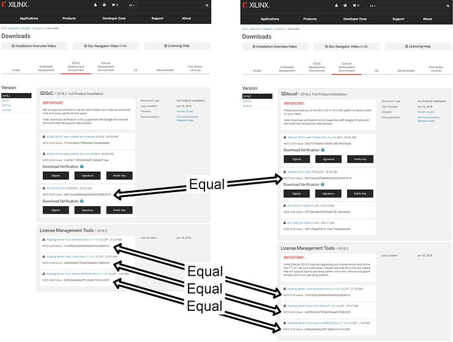

# SDx 2018.2 SFD is the same thing as SDAccel 2018.2 SFD

This post compares shows that **SDx 2018.2 SFD** download is the same thing as **SDAccel 2018.2 SFD** download on the 2018.2 **SDSoC Development Environment** and 2018.2 **SDAccel Development Environment** download pages.

The MD5 SUM of SDx 2018.2 SFD (TAR/GZIP - 20.35 GB) is

b407cba2d089d0eb30b9322f38d57018

The MD5 SUM of SDAccel 2018.2 SFDSDAccel 2018.2 SFD (TAR/GZIP - 20.35 GB) is

b407cba2d089d0eb30b9322f38d57018

The License Management Tools are also equal.

**References**

-   SDSoC Development Environment downloads at \[[link](http://www.xilinx.com/support/download/index.html/content/xilinx/en/downloadNav/sdx-development-environments.html)\]
    
-   SDAccel Development Environment downloads at \[[link](http://www.xilinx.com/support/download/index.html/content/xilinx/en/downloadNav/sdaccel-development-environment.html)\]
    
-   The Xilinx graphic is from \[[link](http://pbs.twimg.com/profile_images/535545777020338176/pEWdIYq__400x400.png)\]