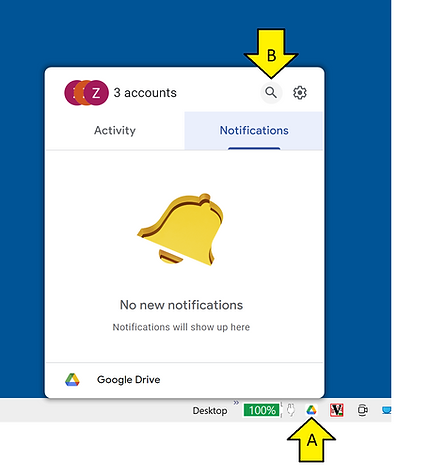
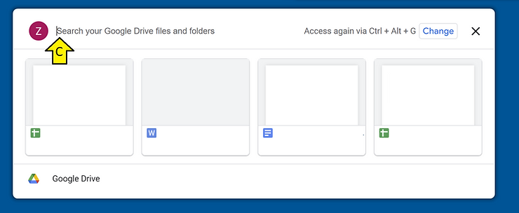
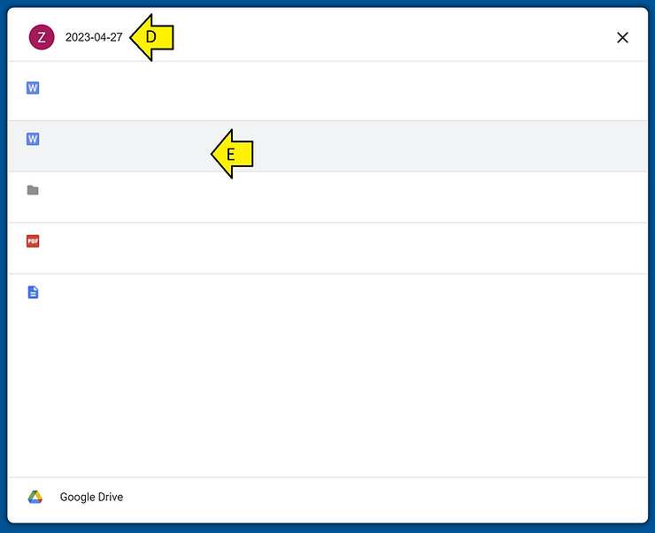

# Search Google Drive on Windows 10

This post shows how to search for Google Drive items on Windows 10. You may have tried to search without success using the Windows 10 index or the very slow Explorer interface.

## **<u>Steps</u>**

A) Click the **Google Drive** icon

B) Click Search or Type Ctrl + Alt + G

C) Click

D) Search for your term

E) Select

## **<u>Date and Configuration</u>**

This post was written on Apr 27th, 2023.

**_Version of Windows_**

PS C:\\Users\\Zach Pfeffer> systeminfo | findstr /B /C:"OS Name" /B /C:"OS Version"

OS Name: Microsoft Windows 10 Pro

OS Version: 10.0.19045 N/A Build 19045

**_The version of the Google Drive Plugin_**

PS C:\\Users\\Zach Pfeffer> Get-ItemProperty HKLM:\\Software\\Wow6432Node\\Microsoft\\Windows\\CurrentVersion\\Uninstall\\\* | Select-Object DisplayName, DisplayVersion, Publisher, InstallDate |

\>> Format-Table -AutoSize | FindStr "Google"

Google Chrome 112.0.5615.138 Google LLC 2...

HP Google Drive Plugin 40.13.54.81239 HP 2...

## **<u>References</u>**

https://devblogs.microsoft.com/scripting/use-powershell-to-find-installed-software/ 

Drive Logo form https://www.google.com/drive/