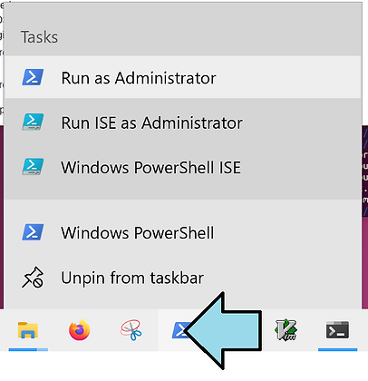

# How to Set the Timezone on Windows 10


This post shows how to set the timezone on Windows 10.

## **<u><span>How to Set the Timezone on Windows 10: Steps</span></u>**

\# Right-click Windows PowerShell and click **Run as Administrator**



\# Run tzutil /s

```
tzutil /s "Mountain Standard Time"
tzutil /s "Pacific Standard Time"
```

## **<u><span>Additional</span></u>**

### <u><span>List all Timezones</span></u>

```
tzutil /l
```

### <u><span>Help</span></u>

```
tzutil /?
```

Output:

```
PS C:\Users\Zach Pfeffer&gt; tzutil /?
Windows Time Zone Utility

Usage:
TZUTIL &lt;/? | /g | /s TimeZoneID[_dstoff] | /l&gt;

Parameters:
    /? Displays usage information.

    /g Displays the current time zone ID.

    /s TimeZoneID[_dstoff]
       Sets the current time zone using the specified time zone ID.
       The _dstoff suffix disables Daylight Saving Time adjustments
       for the time zone (where applicable).

    /l Lists all valid time zone IDs and display names. The output will
       be:
           &lt;display name&gt;
           &lt;time zone ID&gt;

Examples:
    TZUTIL /g
    TZUTIL /s "Pacific Standard Time"
    TZUTIL /s "Pacific Standard Time_dstoff"

Remarks:
    An exit code of 0 indicates the command completed successfully.
```

## **<u><span>References</span></u>**

Windows 10 logo adapted from commons.wikimedia.org @ \[[<u><span>link</span></u>](https://commons.wikimedia.org/wiki/File:Windows_10_Logo.svg)\]