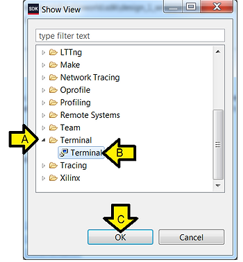
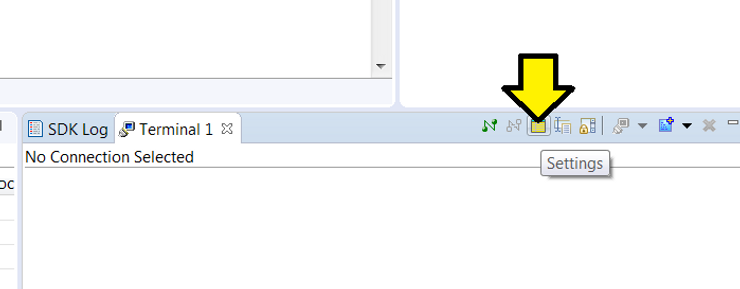
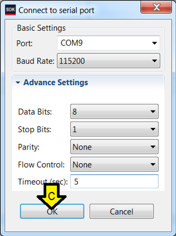

# Set up the JTAG and Serial Port on the ZC702

This post shows you how to connect the JTAG and serial port of the ZC702, where to get the USB-to-serial port driver and how to configure the SDK to see the serial port output.

**<u>Versions Used</u>**

-   SDK 2018.2
    
-   ZC702 Rev 1.1
    
-   Windows 7 SP1
    

**<u>Set up the ZC702</u>**

Step 1: Set SW16 to JTAG mode [[mode documentation](https://www.xilinx.com/support/documentation/boards_and_kits/zc702_zvik/ug850-zc702-eval-bd.pdf) see p.16]

For the rest of the jumpers see the high-resolution photo of the board in the correct state at \[[<u>link</u>](https://photos.app.goo.gl/DddmM8T5QkTXwA7u5)\].

<u>Step 2</u>: Connect a **Micro-B to Type-A** (host connection) USB cable from U23 (Diglent USB JTAG interface) to the host PC

U23:

Micro-B connector:

Type-A connector:

<u>Step 3</u>: Connect a **Mini-B to Type-A** (host connection) USB cable from J17 (CP2103GM USB-to\_UART Bridge) to the host PC.

J17:

Mini-B connector:

Type-A connector:

**<u>Part II: Set up the Terminal</u>**

<u>Step 1</u>: Install the Silicon Labs CP210x USB to UART Bridge VCP Drivers

A. Goto [[link](https://www.silabs.com/products/development-tools/software/usb-to-uart-bridge-vcp-drivers)]

B. Download and unzip the correct installer

C. Install the driver (I did not need to restart on Windows 7 SP1)

D. Click Windows

E. Click Devices and Printers

F. You should see Silicon Labs CP210x USB to UART Bridge

G. Note the COM port (you'll need this later)

<u>Step 2</u>:

A. Click **Window**

B. Click **Show View**

C. Click **Other**

<u>Step 3</u>:

A. Expand **Terminal**

B. Click **Terminal**

C. Click **OK**

Step 4: Click **Settings**

<u>Step 5</u>:

A. Use the COM port listed in Devices and Printers

B. Click OK

Step 6: Turn on the board

**<u>Part III: Switch Between Run and Debug View, Set Up Debug View</u>**

<u>Step 1</u>: Click to disconnect Run terminal (if you're connected in Run mode)

<u>Step 2</u>: Enter Debugging in the SDK

<u>Step 3</u>: Connect the serial port

A. Click **SDK Terminal**

B. Click the **'+'** (Connect to serial port.)

C. Use these settings and click **OK**

**<u>References</u>**

-   Xilinx logo found via [<u>https://twitter.com/xilinxinc</u>](https://twitter.com/xilinxinc) at \[[<u>link</u>](https://pbs.twimg.com/profile_images/535545777020338176/pEWdIYq__400x400.png)\]