# Setup a Digital Matter LoRaWAN Guppy Orientation Reference

This post shows you how to set up an orientation reference for the Digital Matter Guppy.

**<u>Hardware</u>**

The box

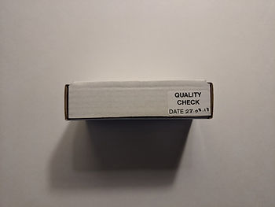

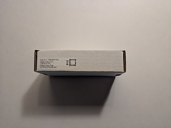

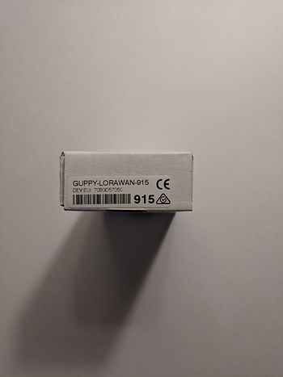

Inside the box

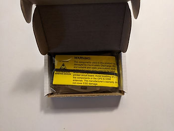

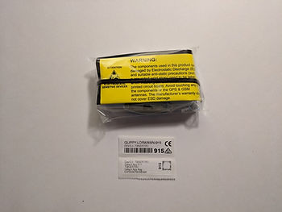

The screws are inside the unit

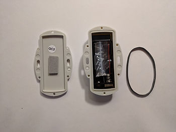

The unit

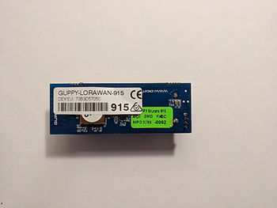

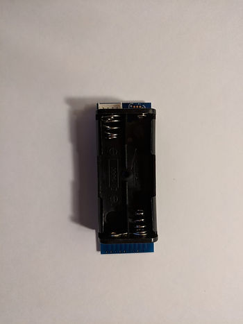

**<u>Orientation Reference</u>**

1\. Draw orientation arrows on the package with a Sharpie \[[<u>link</u>](https://www.sharpie.com/markers)\]

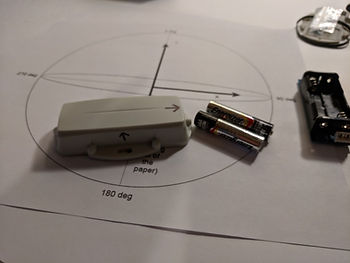

Orientation

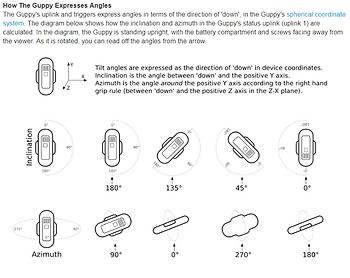

Image from \[[<u>link</u>](https://support.digitalmatter.com/support/solutions/articles/16000063353-configuration-and-usage-guide)\]. More orientation notes at \[[<u>link</u>](https://support.digitalmatter.com/support/solutions/articles/16000082220-guppy-tilt-static-angle-output-examples)\].

2\. Print out this orientation guide

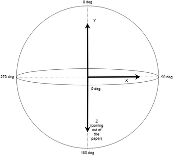

Available at \[[<u>link</u>](https://drive.google.com/open?id=1SyeaAt-FaCqTPhi1yBZ6xRznIIaU_bY1)\].

3\. Place unit face up in the package

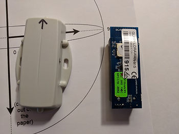

Batteries should face out

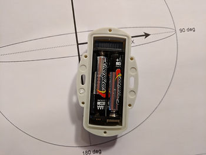

The unit on the orientation diagram

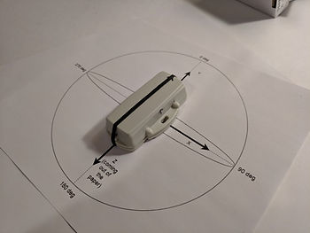

4\. Create a board for the orientation diagram

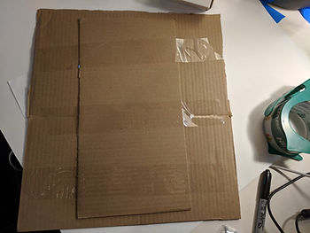

5\. Tape the orientation diagram on

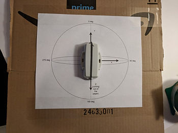

6\. Before taping the Guppy down, get the serial programming cable

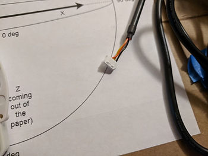

7\. Plug it in

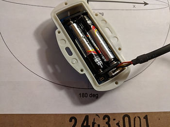

8\. Close up and put the black rubberband around the unit

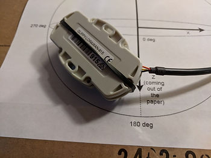

9\. Tape everything down (Update: it does not appear that you can leave the cable connected)

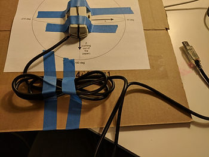

**<u>Reference</u>**

Digital Matter logo from \[[<u>link</u>](https://partners.sigfox.com/assets/media-for/58b80b11172d940cfc466151?type=company)\]