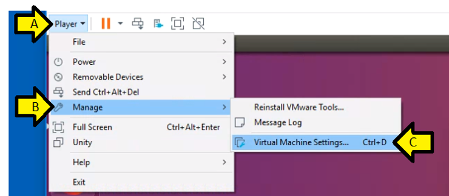
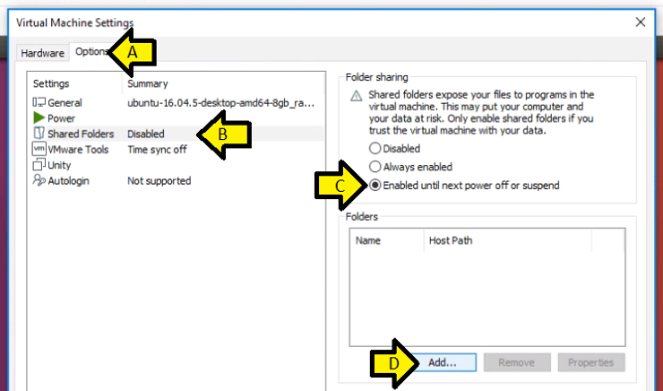
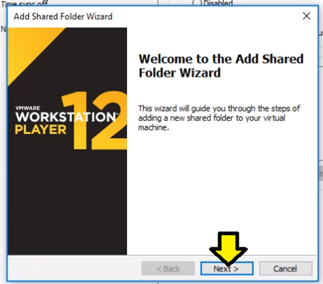
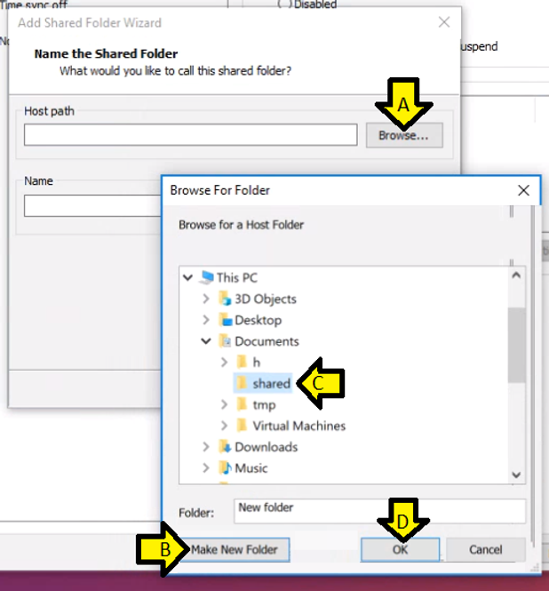
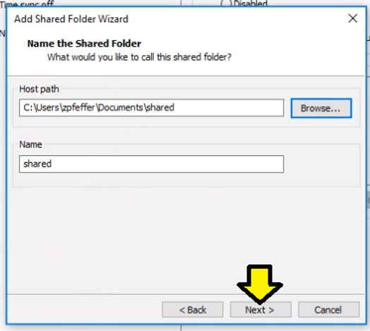
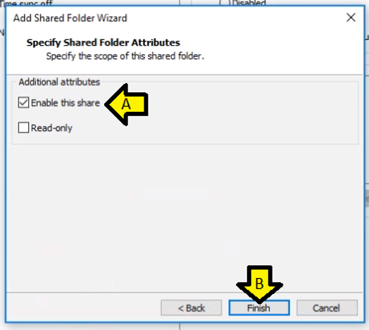
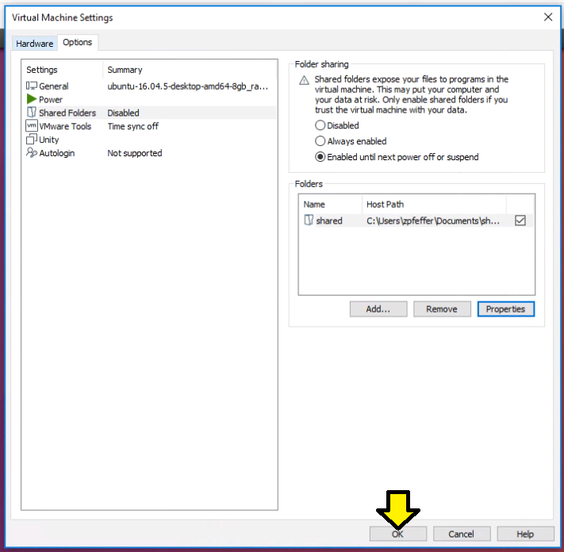

# Share a Directory Between VMware Workstation and Windows

This post shows you how to share a directory between VMware Workstation and Windows.

**<u>Versions Used</u>**

-   VMware Workstation 15 Player
    
-   Windows 10 Professional
    

**<u>Steps</u>**

Step [#1](https://www.centennialsoftwaresolutions.com/blog/hashtags/1): Click **Player > Manage > Virtual Machine Settings...**

Step [#2](https://www.centennialsoftwaresolutions.com/blog/hashtags/2): 

A) Click the **Options** tab

B) Click **Shared Folders Disabled**

C) Click the **Enabled until next power off or suspend**

D) Click **Add...**

Step [#3](https://www.centennialsoftwaresolutions.com/blog/hashtags/3): Click **Next**

Step [#4](https://www.centennialsoftwaresolutions.com/blog/hashtags/4):

A) Click Browse

B) Browse to **This PC > Documents,** click **Make New Folder** and name it **shared**

C) Select **shared**

D) Click **OK**

Step [#5](https://www.centennialsoftwaresolutions.com/blog/hashtags/5): Click **Next >**

Step [#6](https://www.centennialsoftwaresolutions.com/blog/hashtags/6): 

A) Leave **Enable this share** checked

B) Click **Finish**

Step [#7](https://www.centennialsoftwaresolutions.com/blog/hashtags/7): Click **OK**

**Step [#9](https://www.centennialsoftwaresolutions.com/blog/hashtags/9):** Look for **shared** on Linux at **/mnt/hgfs/**

**<u>References</u>**

From [https://docs.vmware.com](https://docs.vmware.com/): Enable a Shared Folder for a Virtual Machine @ [[link](https://docs.vmware.com/en/VMware-Workstation-Player-for-Windows/15.0/com.vmware.player.win.using.doc/GUID-D6D9A5FD-7F5F-4C95-AFAB-EDE9335F5562.html)]

From [https://en.wikipedia.org](https://en.wikipedia.org/wiki/VMware_Workstation_Player): VMWare Workstation Player Icon @ [[link](https://en.wikipedia.org/wiki/VMware_Workstation_Player)] 