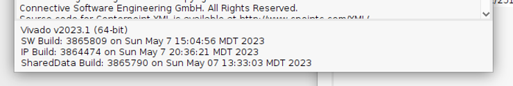
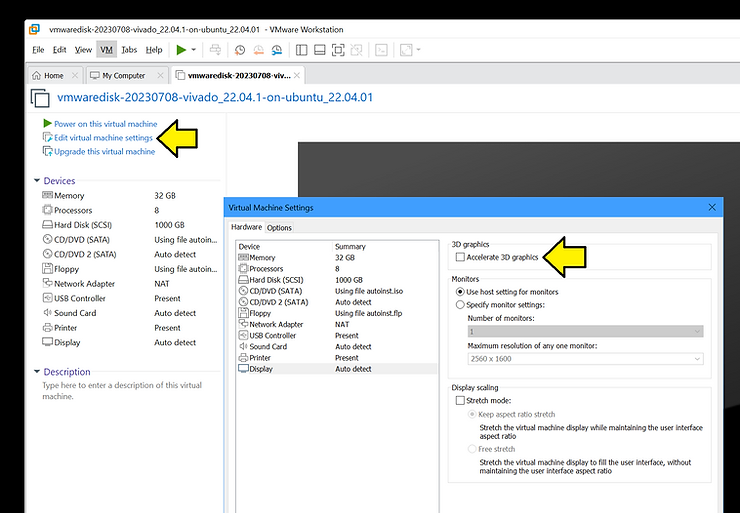
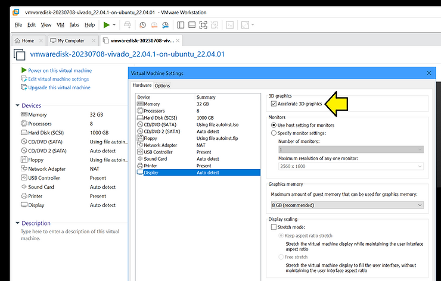
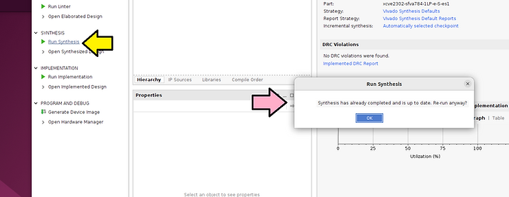
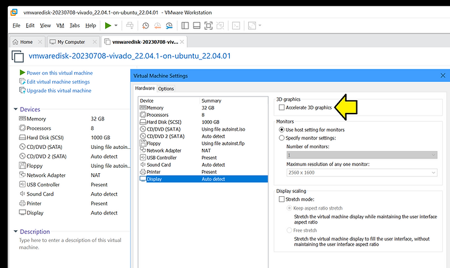
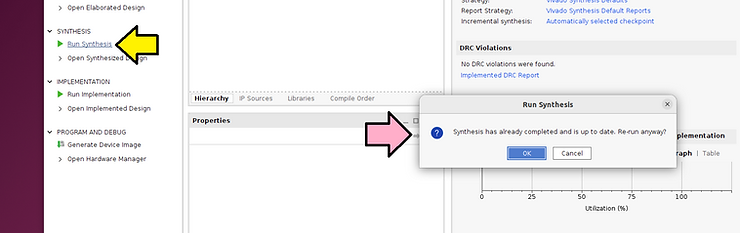

# Show Missing GUI Elements in Vivado


This post presents a way to show missing GUI elements in Vivado.

## Show Missing GUI Elements in Vivado

When I run Vivado v2023.1 in Ubuntu 22.04.01 running on VMWare Workstation VMware® Workstation 17 Pro 17.5.0 build-22583795 with the Virtual Machine Setting **Accelerate 3D graphics** turned on, some GUI elements are missing in Vivado. Turning **off** the **Accelerate 3D graphics** option works around the problem.





## Reproduce the Bug

1\. Start with a powered-off VM

2\. Enable Accelerate 3D graphics



3\. Power On the VM

4\. Start the license server:

```
~/tools/lin_flm_v11.17.2.0/lnx64.o/lmgrd -z -c- ~/licenses/ -l ~/license_log/license.log &amp;
```

5\. Start Vivado :

```
source ~/tools/amd/Vivado/2023.1/settings64.sh
export XILINXD_LICENSE_FILE=2100@fpgadev
vivado
```

6\. Click **Run Synthesis** and see the pop-up with the missing elements:



7\. Turn off the VM

## Reproduce the Bug

1\. Disable 3D graphics



2\. Power On the VM

3\. Start the license server:

```
~/tools/lin_flm_v11.17.2.0/lnx64.o/lmgrd -z -c- ~/licenses/ -l ~/license_log/license.log &amp;
```

4\. Start Vivado :

```
source ~/tools/amd/Vivado/2023.1/settings64.sh
export XILINXD_LICENSE_FILE=2100@fpgadev
vivado
```

5\. Click **Run Synthesis** and see the pop-up with all the elements:

