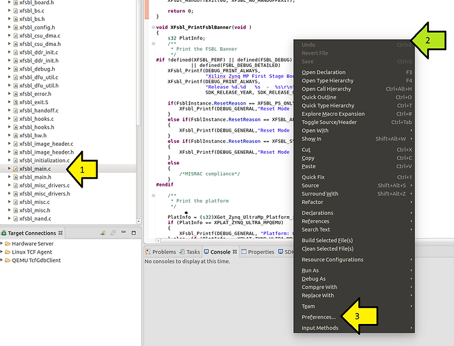

# Show Whitespace in the 2019.1 Xilinx SDK

This post shows how to show whitespace characters in the 2019.1 Xilinx SDK.

1\. Click a file

2\. Right-click on the file in the editor

3\. Click **Preferences...**

4\. Expand **General**

5\. Expand **Editors** and click **Text Editors**

6\. Select the **Show whitespace characters** checkbox

**<u>References</u>**

-   The Xilinx graphic is from \[[link](http://pbs.twimg.com/profile_images/535545777020338176/pEWdIYq__400x400.png)\]