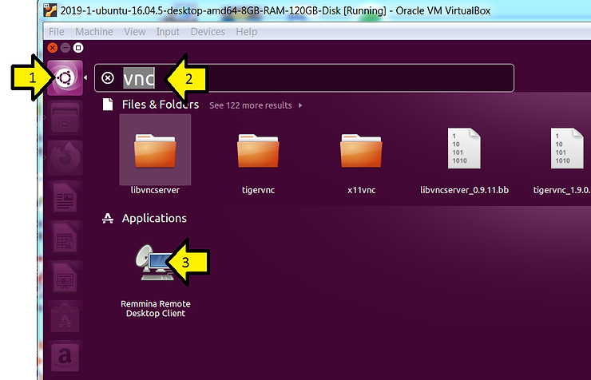

# Start a vncserver on a Remote Linux machine and Connect to it Over SSH

This post shows you how to SSH into a remote machine, start a VNC server and connect to the VNC server from Ubuntu 16.04.5.

**Note**: You should replace **user@machine.domain.com** with your username on the remote host and the name of the remote host

**Step 1**: Open a terminal window on your local machine

**Step 2**: Open an SSH connection

From your local machine type:

ssh **user@machine.domain.com**

**Step 3**: After logging in, start a VNC server:

Type in the window:

vncserver -geometry 1920x1080

You should see something like:

New '**machine.domain.com**:6 (user)' desktop is **machine.domain.com**:6

**Step 4**: Note down the number you see after machine.domain.com: in this case its **6** but it may be something else.

**Step 5**: Open another terminal window on your local machine

**Step 6**: Using the number noted above, in the window type:

ssh **user@machine.domain.com** -L 5901:localhost:590**6**

This ^^^ command sets up a "tunnel" that routes packets from port 5901 on your local machine, localhost, to port 5906 on the remote host, **machine.domain.com,** through SSH port 22.

**Step 7**: On your local host

1: Click the Ubuntu launcher

2: Type **vnc**

3: Click on the **Remmina Remote Desktop Client**

**Step 8**: After **Remmina Remote Desktop Client** launches

1: Select **VNC**

2: Type **:1**

3: Click **Connect!**

**References**

-   How to Connect to VNC using SSH \[[link](http://www.techrepublic.com/article/how-to-connect-to-vnc-using-ssh/)\]
    
-   VNC logo from \[[link](http://images.app.goo.gl/uyqGpCzJKpwyjady7)\]
    
-   SSH logo from \[[link](http://www.openssh.com/)\]