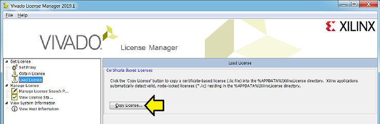

# Start and Debug lmgrd and xilinxd

This post shows how to start and debug lmgrd and xilinxd. It explains commands to start the license manager (lmgrd), look up its port, find its peer (xilinxd), replace the port number in scripts with a command to find it, and log the network traffic to the port.

## Start the FlexNet License Manager Daemon (lmgrd)

Start lmgrd and xilinxd with:

```
~/tools/lin_flm_v11.17.2.0/lnx64.o/lmgrd -z -c-~/licenses/ -l
~/license_log/license.log &
```

-   Run lmgrd from the directory ~/tools/lin\_flm\_v11.17.2.0/lnx64.o/.
    
-   Runs in the foreground because of the -z option, but is sent to the background due to the & (helps debugging)
    
-   Uses the license files located in the ~/licenses/ directory.
    
-   Log all activities to ~/license\_log/license.log; the first place to look when debugging.
    

## Figure Out the License Manager Daemon's (lmgrd) Port

Find the socket associated with the first instance of the lmgrd process:

```
ss -tulpan | grep $(pgrep -o lmgrd)
```

### Transposed Output

<table data-hook="TableComponent"><colgroup><col><col><col></colgroup><tbody><tr><td data-hook="table-plugin-cell"><p dir="auto" id="viewer-nun828338"><span><span>Netid</span></span></p></td><td data-hook="table-plugin-cell"><p dir="auto" id="viewer-6s5wk8341"><span><span>tcp</span></span></p></td><td data-hook="table-plugin-cell"><p dir="auto" id="viewer-bn2b88344"><span><span>tcp</span></span></p></td></tr><tr><td data-hook="table-plugin-cell"><p dir="auto" id="viewer-sha5e8348"><span><span>State</span></span></p></td><td data-hook="table-plugin-cell"><p dir="auto" id="viewer-ogoyk8351"><span><span>LISTEN</span></span></p></td><td data-hook="table-plugin-cell"><p dir="auto" id="viewer-xhw1j8354"><span><span>ESTAB</span></span></p></td></tr><tr><td data-hook="table-plugin-cell"><p dir="auto" id="viewer-8stdc8358"><span><span>Recv-Q</span></span></p></td><td data-hook="table-plugin-cell"><p dir="auto" id="viewer-uaz048361"><span><span>0</span></span></p></td><td data-hook="table-plugin-cell"><p dir="auto" id="viewer-um7g58364"><span><span>0</span></span></p></td></tr><tr><td data-hook="table-plugin-cell"><p dir="auto" id="viewer-xjw8p8368"><span><span>Send-Q</span></span></p></td><td data-hook="table-plugin-cell"><p dir="auto" id="viewer-2an6e8371"><span><span>500</span></span></p></td><td data-hook="table-plugin-cell"><p dir="auto" id="viewer-qzivb8374"><span><span>0</span></span></p></td></tr><tr><td data-hook="table-plugin-cell"><p dir="auto" id="viewer-785pr8378"><span><span>Local Address:Port</span></span></p></td><td data-hook="table-plugin-cell"><p dir="auto" id="viewer-qigg08381"><span><span>*:2100</span></span></p></td><td data-hook="table-plugin-cell"><p dir="auto" id="viewer-qmvu48384"><span><span>[::ffff:127.0.0.1]:2100</span></span></p></td></tr><tr><td data-hook="table-plugin-cell"><p dir="auto" id="viewer-y3a188388"><span><span>Peer Address:Port</span></span></p></td><td data-hook="table-plugin-cell"><p dir="auto" id="viewer-4tfai8391"><span><em><span>:</span></em></span></p></td><td data-hook="table-plugin-cell"><p dir="auto" id="viewer-rqofg8394"><span><span>[::ffff:127.0.0.1]:59334</span></span></p></td></tr><tr><td data-hook="table-plugin-cell"><p dir="auto" id="viewer-rgit08398"><span><span>Process</span></span></p></td><td data-hook="table-plugin-cell"><p dir="auto" id="viewer-04yc78401"><span><span>users:(("xilinxd",pid=19852,fd=0),("lmgrd",pid=19850,fd=0))</span></span></p></td><td data-hook="table-plugin-cell"><p dir="auto" id="viewer-mhgbk8404"><span><span>users:(("lmgrd",pid=19850,fd=7))</span></span></p></td></tr></tbody></table>

-   The first data column indicates that the lmgrd and xilinxd processes are listening on port 2100 on all available network interfaces.
    
-   The second data column shows that lmgrd has an **established** connection on port 2100 to another process on the same machine using port 59334.
    

## Look Up The License Manager Daemon's (lmgrd) Peer (xilinxd)

```
ss -tulpan 'dport = :59334 or sport = :59334'
```

### Transposed Output

<table data-hook="TableComponent"><colgroup><col><col><col></colgroup><tbody><tr><td data-hook="table-plugin-cell"><p dir="auto" id="viewer-72dme7263"><span><span>Netid</span></span></p></td><td data-hook="table-plugin-cell"><p dir="auto" id="viewer-pap7l7266"><span><span>tcp</span></span></p></td><td data-hook="table-plugin-cell"><p dir="auto" id="viewer-9u3fl7269"><span><span>tcp</span></span></p></td></tr><tr><td data-hook="table-plugin-cell"><p dir="auto" id="viewer-s1dtt7273"><span><span>State</span></span></p></td><td data-hook="table-plugin-cell"><p dir="auto" id="viewer-6ixox7276"><span><span>ESTAB</span></span></p></td><td data-hook="table-plugin-cell"><p dir="auto" id="viewer-0puqe7279"><span><span>ESTAB</span></span></p></td></tr><tr><td data-hook="table-plugin-cell"><p dir="auto" id="viewer-77d717283"><span><span>Recv-Q</span></span></p></td><td data-hook="table-plugin-cell"><p dir="auto" id="viewer-6f6bx7286"><span><span>0</span></span></p></td><td data-hook="table-plugin-cell"><p dir="auto" id="viewer-klxjl7289"><span><span>0</span></span></p></td></tr><tr><td data-hook="table-plugin-cell"><p dir="auto" id="viewer-gg9qm7293"><span><span>Send-Q</span></span></p></td><td data-hook="table-plugin-cell"><p dir="auto" id="viewer-qqwf97296"><span><span>0</span></span></p></td><td data-hook="table-plugin-cell"><p dir="auto" id="viewer-4k1ac7299"><span><span>0</span></span></p></td></tr><tr><td data-hook="table-plugin-cell"><p dir="auto" id="viewer-kdf197303"><span><span>Local Address:Port</span></span></p></td><td data-hook="table-plugin-cell"><p dir="auto" id="viewer-5wxf27306"><span><span>127.0.0.1:59334</span></span></p></td><td data-hook="table-plugin-cell"><p dir="auto" id="viewer-flhi97309"><span><span>[::ffff:127.0.0.1]:2100</span></span></p></td></tr><tr><td data-hook="table-plugin-cell"><p dir="auto" id="viewer-0p4fx7313"><span><span>Peer Address:Port</span></span></p></td><td data-hook="table-plugin-cell"><p dir="auto" id="viewer-sg1kx7316"><span><span>127.0.0.1:2100</span></span></p></td><td data-hook="table-plugin-cell"><p dir="auto" id="viewer-klz987319"><span><span>[::ffff:127.0.0.1]:59334</span></span></p></td></tr><tr><td data-hook="table-plugin-cell"><p dir="auto" id="viewer-ahowl7323"><span><span>Process</span></span></p></td><td data-hook="table-plugin-cell"><p dir="auto" id="viewer-2b7nw7326"><span><span>users:(("xilinxd",pid=19852,fd=10))</span></span></p></td><td data-hook="table-plugin-cell"><p dir="auto" id="viewer-o90wz7329"><span><span>users:(("lmgrd",pid=19850,fd=7))</span></span></p></td></tr></tbody></table>

The two columns indicate that there is an established TCP connection between two processes (xilinxd and lmgrd) on the same machine:

-   xilinxd is connected on port 59334 to lmgrd on port 2100.
    
-   lmgrd on port 2100 is connected back to xilinxd on port 59334.
    

## Exporting and Looking Up the Port Number

Remove 2100 by changing...

```
export XILINXD_LICENSE_FILE=2100@localhost
```

...to:

```
export XILINXD_LICENSE_FILE=$(pgrep -o lmgrd)@localhost
```

## Log All Traffic to the Port Number

For debugging TCP traffic use:

```
sudo tcpdump -vvv -XX -i any tcp and port 2100
```

-   **\-vvv**:
    
    -   This flag increases the verbosity of the output. It provides very detailed information about each packet, including headers, flags, and other metadata.
        
    -   \-v: Verbose output.
        
    -   \-vv: More verbose.
        
    -   \-vvv: Even more verbose, showing as much detail as possible.
    
-   **\-XX**:
    
    -   This flag tells tcpdump to display the packet's data in both hexadecimal and ASCII formats.
        
    -   The first -X flag shows the packet data in both hex and ASCII.
        
    -   The second -X (together as -XX) also includes the link-layer header in the output.
    
-   **\-i any**:
    
    -   Captures packets on any network interface. This is useful on machines with multiple network interfaces (e.g., Ethernet, Wi-Fi) because it captures from all of them.
    
-   **tcp**:
    
    -   This tells tcpdump to filter the packets and only capture those that use the TCP protocol.
    
-   **and port 2100**:
    
    -   Further filters the captured packets to only those that are using TCP and are directed to or from port 2100. This is useful if you know the specific port you want to monitor.
        

## AMD/Xilinx Docs



## Start and Debug lmgrd and xilinxd Wrapup

This post has shown how to start and debug lmgrd and Xilinx.
