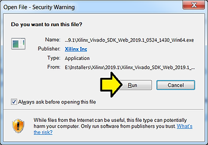
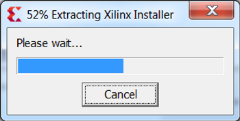
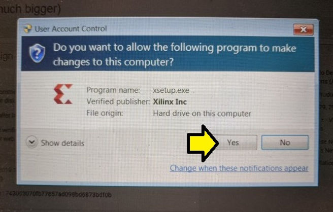
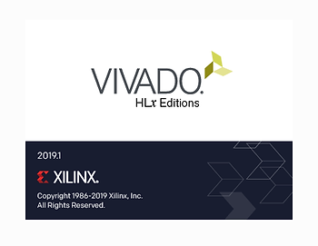
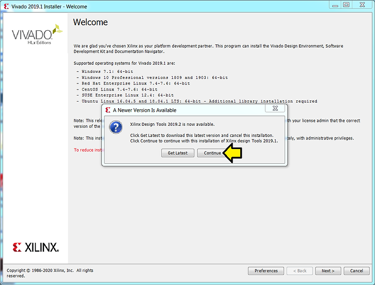
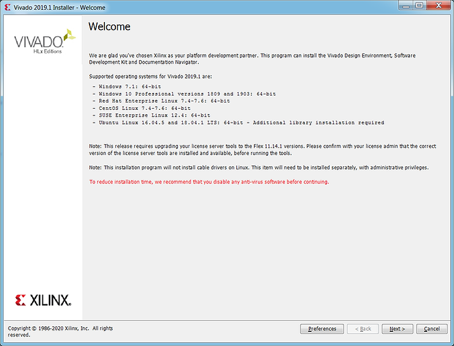

# Start Installing Xilinx's Vivado 2019.1 on Windows 7 from the Windows Self Extracting Web Install

This post walks through starting to install a licensed Vivado 2019.1 on Windows 7 from the Windows Self Extracting Web Installer. It was written on May 6th, 2020.

**<u>Prerequisites</u>**

You've downloaded the **2019.1 Windows Self Extracting Web Installer**. (See \[[<u>link</u>](https://www.centennialsoftwaresolutions.com/post/find-and-download-xilinx-s-vivado-2019-1)\] for instructions on downloading).

**<u>Steps</u>**

Step 1: Double click **Xilinx\_Vivado\_SDK\_Web\_2019.1\_0524\_1430\_Win64.exe**

Step 2: Click **Run**

You should see:

Step 3: Click **Yes**

You will see:

Step 4: Click **Continue**

You should see:

**<u>References</u>**

Xilinx logo from \[[<u>link</u>](https://twitter.com/xilinxinc)\]