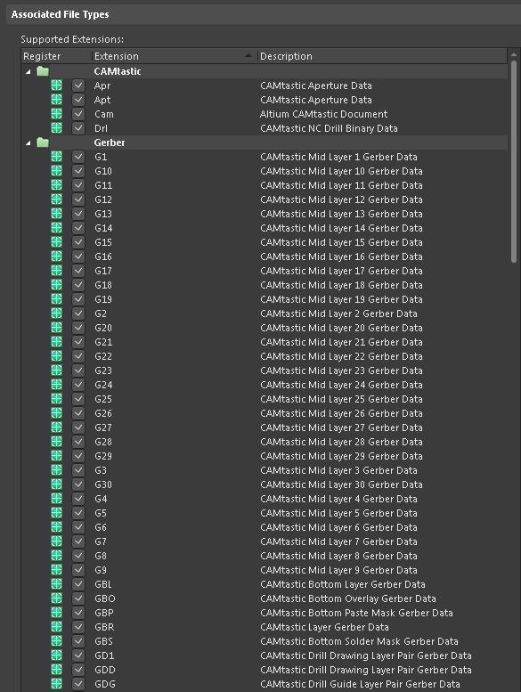
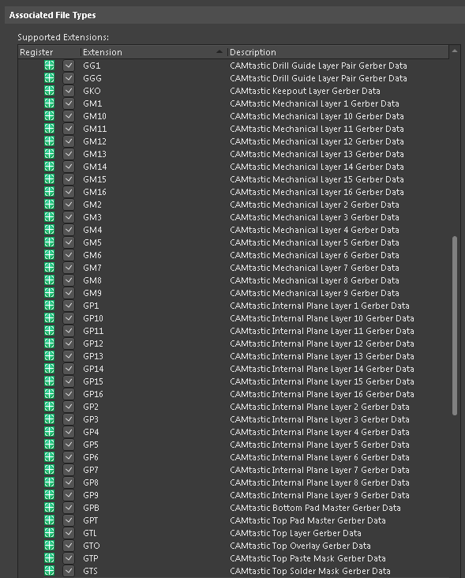
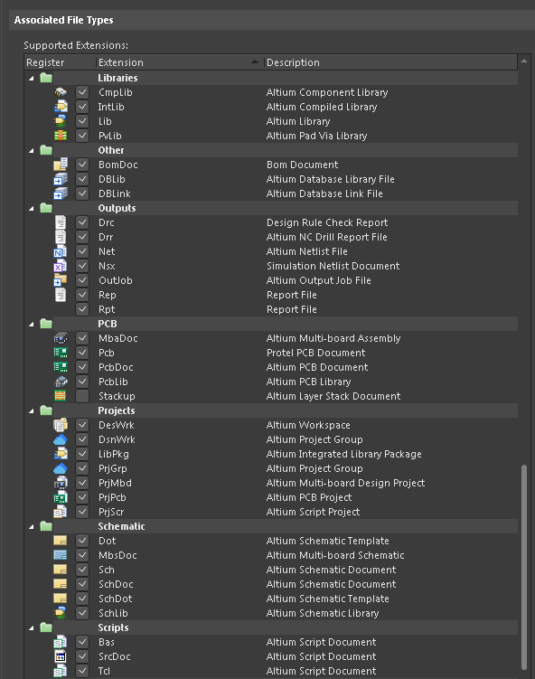
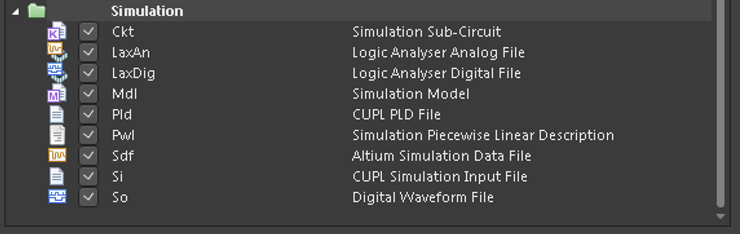
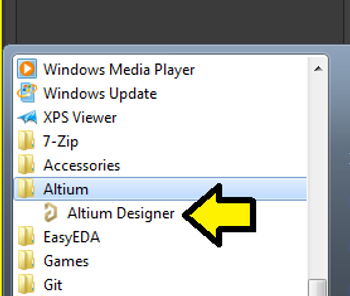
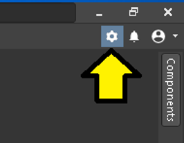
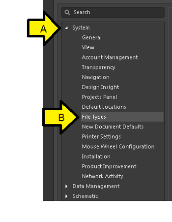

# Supported Altium File Type Extensions

This post lists all the file type extensions Altium supports and a short description of what they are.

**<u>The List</u>**

**<u>How to Look this Up</u>**

<u>Step 1</u>: Open Altium 19.0.14 (Build 431)

<u>Step 2</u>: Click the gear

<u>Step 3</u>:

A. Expand **System**

B. Click **File Types**

**<u>References</u>**

-   Altium **System - File Types** @ \[[<u>link</u>](https://www.altium.com/documentation/16.1/display/ADES/WorkspaceManager_Dlg-SysPrefsForm_FileTypes((System+-+File+Types))\]
    
-   Altium logo from \[[<u>link</u>](https://www.openbom.com/wp-content/uploads/2018/06/1.png)\]