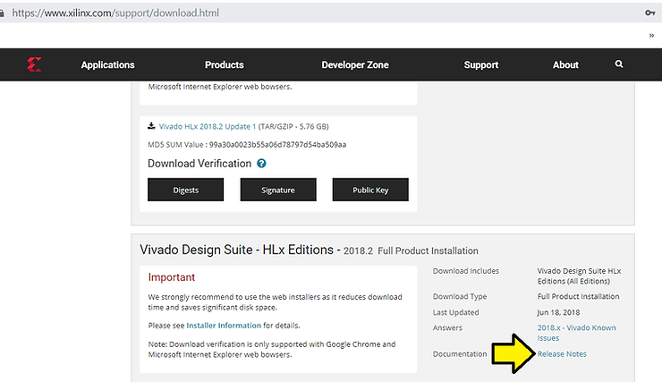
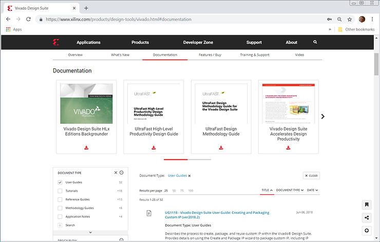

# Table of Contents and Doc Links from the Main 2018.2 Vivado Doc

This post lists the table of contents and the document links in the "Release Notes" doc listed at \[[<u>link</u>](https://www.xilinx.com/cgi-bin/docs/rdoc?v=latest;d=ug973-vivado-release-notes-install-license.pdf)\] a.k.a. the Vivado Design Suite User Guide, Release Notes, Installation, and Licensing, UG973 (v2018.2) July 23, 2018.

This post is useful if you've tried to find where the "root" Vivado doc is on the "Documentation" tab at \[[<u>link</u>](https://www.xilinx.com/products/design-tools/vivado.html#documentation)\], what's included in the doc and the major Vivado docs referenced from it.

**<u>Document Location</u>**

Listed at https://www.xilinx.com/support/download.html 

**<u>Table of Contents</u>**

<u>Chapter 1: Release Notes 2018.2</u>

What’s New 5

Important Information 8

Known Issues 10

<u>Chapter 2: Architecture Support and Requirements</u>

Operating Systems 11

Architectures 12

Compatible Third-Party Tools 13

System Requirements 14

<u>Chapter 3: Download and Installation</u>

Downloading the Vivado Design Suite Tools 16

Download Verification 17

Installing the Vivado Design Suite Tools 24

Installing Cable Drivers 30

Installing Windows Driver 30

Uninstalling Cable Drivers 30

Installing Linux Driver 30

Uninstalling Linux Driver 31

Adding Additional Tools and Devices 31

Network Installations 32

Batch Mode Installation Flow 34

Obtaining Quarterly Releases 37

Uninstalling the Vivado Design Suite Tool 38

Checking Required Libraries 39

<u>Chapter 4: WebTalk</u>

WebTalk Participation 40

Setting WebTalk Install Preference 41

Setting WebTalk User Preferences 42

Checking WebTalk Install and User Preferences 43

Types of Data Collected 43

Transmission of Data 44

<u>Chapter 5: Obtaining and Managing a License</u>

Licensing Overview 45

Generating/Installing Certificate-Based Licenses 46

Managing Licenses On Your Machine 52

Using the Xilinx Product Licensing Site 54

<u>Chapter 6: Older Release Notes</u>

Release Notes 2018.1 67

Important Information 76

Known Issues 78

<u>Appendix A: Additional Resources and Legal Notices</u>

Xilinx Resources 79

Solution Centers 79

Documentation Navigator and Design Hubs 79

Licenses and End User License Agreements 80

Registered Guest Resources 80

References 80

Training Resources 81

Please Read: Important Legal Notices 81

**<u>References</u>**

1\. UltraFast Design Methodology Guide for the Vivado Design Suite ([<u>UG949</u>](https://www.xilinx.com/cgi-bin/docs/rdoc?v=2018.2;d=ug949-vivado-design-methodology.pdf))

2\. UltraFast™ High-Level Productivity Design Methodology Guide ([<u>UG1197</u>](https://www.xilinx.com/cgi-bin/docs/rdoc?d=ug1197-vivado-high-level-productivity.pdf))

3\. UltraFast Embedded Design Methodology Guide ([<u>UG1046</u>](https://www.xilinx.com/cgi-bin/docs/rdoc?d=ug1046-ultrafast-design-methodology-guide.pdf))

4\. Vivado Design Suite User Guide: Logic Simulation ([<u>UG900</u>](https://www.xilinx.com/cgi-bin/docs/rdoc?v=2018.2;d=ug900-vivado-logic-simulation.pdf))

5\. Vivado Design Suite User Guide: High-Level Synthesis ([<u>UG902</u>](https://www.xilinx.com/cgi-bin/docs/rdoc?v=2018.2;d=ug902-vivado-high-level-synthesis.pdf))

6\. Vivado Design Suite User Guide: Partial Reconfiguration ([<u>UG909</u>](https://www.xilinx.com/cgi-bin/docs/rdoc?v=2018.2;d=ug909-vivado-partial-reconfiguration.pdf))

7\. Vivado Design Suite Tutorial: Partial Reconfiguration ([<u>UG947</u>](https://www.xilinx.com/cgi-bin/docs/rdoc?v=2018.2;d=ug947-vivado-partial-reconfiguration-tutorial.pdf))

8\. Vivado Design Suite User Guide: Hierarchical Design ([<u>UG905</u>](https://www.xilinx.com/cgi-bin/docs/rdoc?v=2018.2;d=ug905-vivado-hierarchical-design.pdf))

9\. Vivado Design Suite User Guide: Model-Based DSP Design Using System Generator

10\. Vivado Design Suite User Guide: Implementation ([<u>UG904</u>](https://www.xilinx.com/cgi-bin/docs/rdoc?v=2018.2;d=ug904-vivado-implementation.pdf))

11\. Vivado Design Suite User Guide: Power Analysis and Optimization ([<u>UG907</u>](https://www.xilinx.com/cgi-bin/docs/rdoc?v=2018.2;d=ug907-vivado-power-analysis-optimization.pdf))

12\. IP Release Notes Guide ([<u>XTP025</u>](https://www.xilinx.com/cgi-bin/docs/ndoc?t=ip+doc;d=xtp025.pdf))

13\. Platform Cable USB II Data Sheet ([<u>DS593</u>](https://www.xilinx.com/cgi-bin/docs/ndoc?t=data+sheet;d=ds593.pdf))

14\. Parallel Cable IV Data Sheet ([<u>DS097</u>](https://www.xilinx.com/cgi-bin/docs/ndoc?t=data+sheet;d=ds097.pdf))

19\. PS and PL-Based 1G/10G Ethernet Solution ([<u>XAPP1305</u>](https://www.xilinx.com/cgi-bin/docs/ndoc?t=application_notes;d=xapp1305-ps-pl-based-ethernet-solution.pdf))

20\. Secure Boot of Zynq-7000 SoC ([<u>XAPP1175</u>](https://www.xilinx.com/cgi-bin/docs/ndoc?t=application_notes;d=xapp1175_zynq_secure_boot.pdf))

21\. Model Composer User Guide ([<u>UG1262</u>](https://www.xilinx.com/cgi-bin/docs/rdoc?v=2018.2;d=ug1262-model-composer-user-guide.pdf))

22\. PetaLinux Tools Documentation: Reference Guide ([<u>UG1144</u>](https://www.xilinx.com/cgi-bin/docs/rdoc?v=2018.2;d=ug1144-petalinux-tools-reference-guide.pdf))

**<u>Reference</u>**

 Xilinx logo found via https://twitter.com/xilinxinc at [[link](https://pbs.twimg.com/profile_images/535545777020338176/pEWdIYq__400x400.png)] 

**<u>Critique</u>**

This is what I see when I click on the **Documentation** tab:

This says that the \_most\_ important doc is **UG1118 - Vivado Design Suite User Guide: Creating and Packaging Customer IP (ver2018.2)** along with guides on which edition I should use, 2 methodology guides and a marketing piece. These \_are\_ useful docs... once I know how to install and run Vivado. I would suggest the first doc listed be: **Getting Started with Vivado** covering these points.