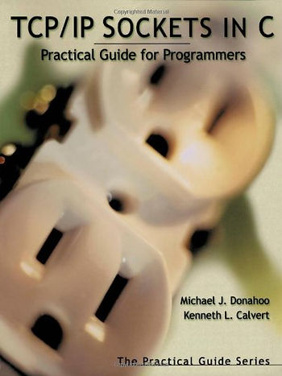

# TCPEchoServer.c Inspired Echo Server



This post contains an echo server that was adapted from TCPEchoServer.c. See the client at \[[link](https://www.centennialsoftwaresolutions.com/blog/tcpechoclient-c-with-more-error-checking)\].

```
/*
 * Derivate of TCPEchoServer.c in:
 * TCP/IP Sockets in C, 1st Edition, Practical Guide for Programmers
 * with more error checking.
 *
 * Build with
 *     CFLAGS='-Wall -g' make tcpserver
 * Run with
 *     ./tcpserver 49152
 */

#include <sys/socket.h>
#include <netinet/in.h>
#include <arpa/inet.h>
#include <stdio.h>
#include <string.h>
#include <errno.h>
#include <stdlib.h>
#include <unistd.h>
#include <ctype.h>
#include <signal.h>

#define stringify(str) #str
#define xstringify(str) stringify(str)

/* https://www.iana.org/assignments/service-names-port-numbers/service-names-port-numbers.txt */
#define MINPORT 1
#define MINPORT 1
#define MINUSRPORT 49152
#define MAXPORT 65535

#define MAXMSG 16

int main(int argc, char *argv[])
{
	if (argc != 2) {
		fprintf(stderr, "Usage: %s <port>\n", argv[0]);
		exit(EXIT_FAILURE);
	}

	long port;
	int toolong = 0;
	int containsnondigit = 0;

	/* Sanity check the length of the port*/
	if (strlen(argv[1]) > strlen(xstringify(MAXPORT)))
		toolong = 1;

	int i;
	char *ptr = argv[1];
	for (i = 0; i < strlen(argv[1]); ++i)
		if (isdigit(ptr[i]) == 0)
			containsnondigit = 1;

	if (toolong && containsnondigit) {
		fprintf(stderr, "<port> is too long ");
		fprintf(stderr, "and contains non-digits\n");
		exit(EXIT_FAILURE);
	} else if (toolong) {
		fprintf(stderr, "<port> is too long\n");
		exit(EXIT_FAILURE);
	} else if (containsnondigit) {
		fprintf(stderr, "<port> contains non-digits\n");
		exit(EXIT_FAILURE);
	}

	errno = 0;
	port = strtol(argv[1], NULL, 10);
	if (errno != 0) {
		fprintf(stderr, "error converting port %s\n",
				strerror(errno));
		exit(EXIT_FAILURE);
	}

	int serversock;
	serversock = socket(PF_INET, SOCK_STREAM, IPPROTO_TCP);
	if (serversock == -1) {
		fprintf(stderr, "error opening socket: %s\n", strerror(errno));
		exit(EXIT_FAILURE);
	}

	int enable_so_reuseaddr = 1;
	if (setsockopt(serversock, SOL_SOCKET, SO_REUSEADDR,
		       &enable_so_reuseaddr,
		       sizeof(enable_so_reuseaddr)) == -1) {
		fprintf(stderr, "error setsockopt socket: %s\n",
			strerror(errno));
		exit(EXIT_FAILURE);
	}

	struct sockaddr_in serveraddr;
	memset(&serveraddr, 0, sizeof(serveraddr));
	serveraddr.sin_family = AF_INET;
	serveraddr.sin_addr.s_addr = htonl(INADDR_ANY);
	serveraddr.sin_port = htons(port);

	if (bind(serversock, (struct sockaddr *) &serveraddr,
		sizeof(serveraddr)) == -1) {
		fprintf(stderr, "error binding socket: %s\n", strerror(errno));
		exit(EXIT_FAILURE);
	}

	if (listen(serversock, SOMAXCONN) == -1) {
		fprintf(stderr, "error listen socket: %s\n", strerror(errno));
		exit(EXIT_FAILURE);
	}

	for (;;) {
		struct sockaddr_in clientaddr;
		memset(&clientaddr, 0, sizeof(clientaddr));
		int clientsock;
		socklen_t clientaddr_len = sizeof(clientaddr);
		clientsock = accept(serversock,
				    (struct sockaddr *) &clientaddr,
				    &clientaddr_len);
		if (clientsock == -1) {
			fprintf(stderr, "error accept socket: %s\n",
				strerror(errno));
			exit(EXIT_FAILURE);
		}

		/* Receive */
		ssize_t bytes_recv = 0;
		char recvbuf[MAXMSG];
		memset(&recvbuf, 0, sizeof(recvbuf));
		char *rxbuf = recvbuf;

		printf("recv up-to %i bytes\n", MAXMSG);
		bytes_recv = recv(clientsock, rxbuf, MAXMSG, 0);
		printf("bytes_recv = %li\n", bytes_recv);
		if (bytes_recv < 0) {
			fprintf(stderr,
					"error recv socket: %s\n",
					strerror(errno));
			exit(EXIT_FAILURE);
		} else if (bytes_recv == 0) {
			/* no messages are available to be
			 * received and the
			 * peer has performed an orderly shutdown */
			break;
		}

		/* Send back */
		ssize_t bytes_sent = 0;
		size_t txbuflen = bytes_recv;
		char *txbuf = recvbuf;
		size_t tot_bytes_sent = 0;
		while (txbuflen > 0) {
			bytes_sent = send(clientsock, txbuf, txbuflen, 0);
			printf("bytes_sent = %li\n", bytes_sent);
			if (bytes_sent < 0) {
				fprintf(stderr,
					"error send socket: %s\n",
					strerror(errno));
				exit(EXIT_FAILURE);
			}

			txbuf += bytes_sent;
			txbuflen -= bytes_sent;
			tot_bytes_sent += bytes_sent;
		}
		printf("%li total bytes sent\n", tot_bytes_sent);

		close(clientsock);
	}

	close(serversock);
	exit(EXIT_SUCCESS);
}
```

**<u><span>Reference</span></u>**

Image from \[[link](https://www.amazon.com/TCP-IP-Sockets-Practical-Programmers/dp/1558608265)\]