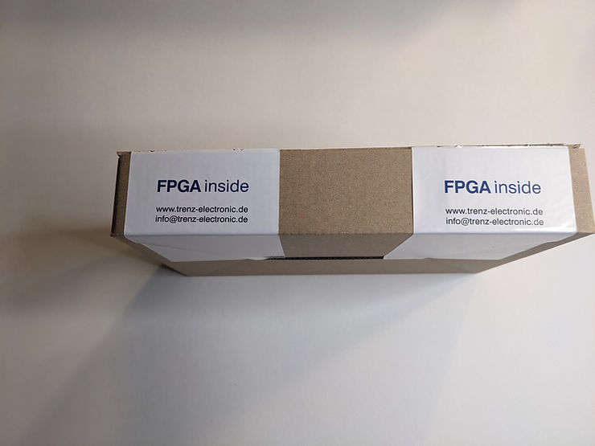
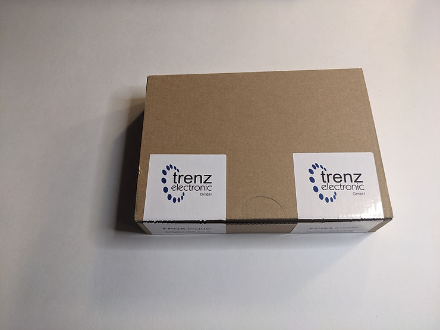
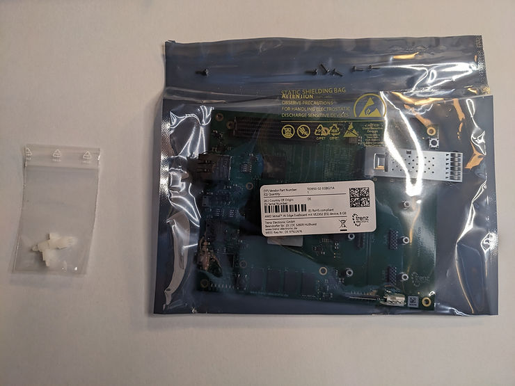
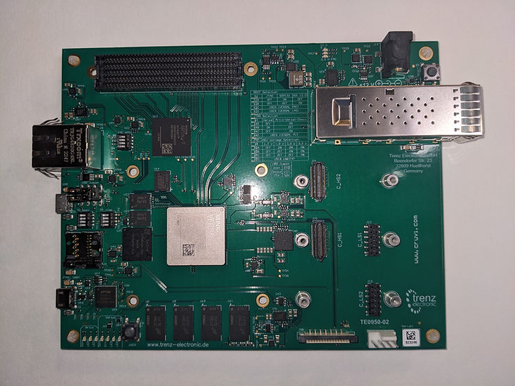
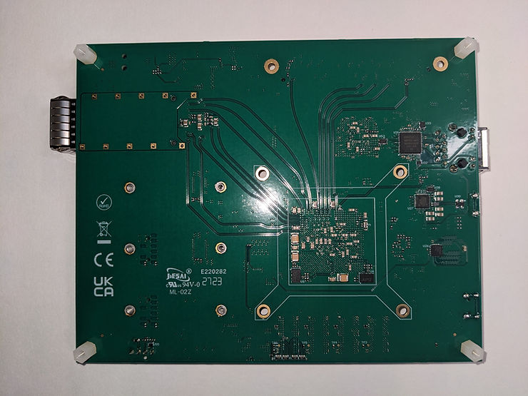
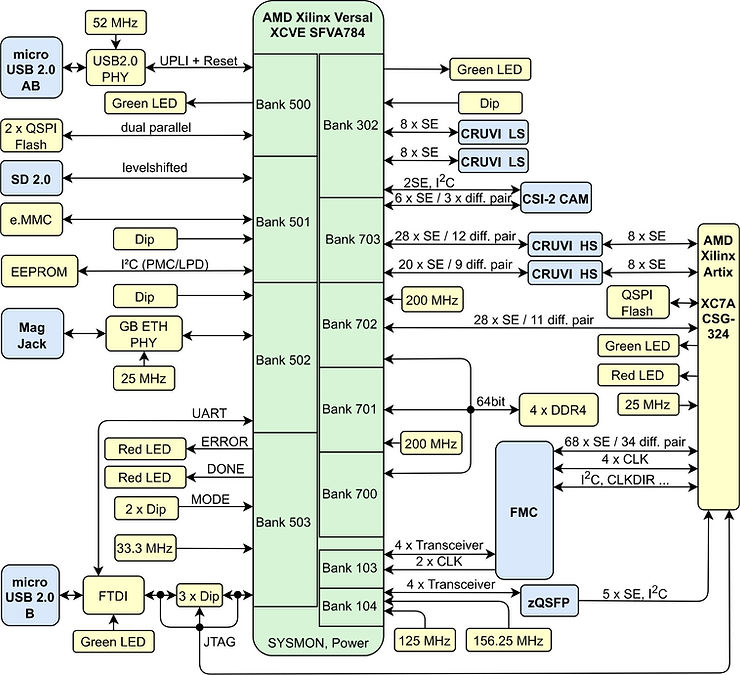

# TE0950-02-EGBE21A Unboxing

This post shows a TE0950-02-EGBE21A unboxing. The TE0950-02-EGBE21A is an "AMD VersalTM AI Edge Evalboard with VE2302 (ES) device, 8 GB DDR4 SDRAM, 15x12cm" sold by Trenz Electric from Germany. Buy your own at: https://shop.trenz-electronic.de/en/TE0950-02-EGBE21A-AMD-Versal-AI-Edge-Evalboard-with-VE2302-ES-device-8-GB-DDR4-SDRAM-15x12cm?c=256.

## TE0950-02-EGBE21A Unboxing

## Block Diagram from Trenz 

From: https://shop.trenz-electronic.de/en/TE0950-02-EGBE21A-AMD-Versal-AI-Edge-Evalboard-with-VE2302-ES-device-8-GB-DDR4-SDRAM-15x12cm?c=256 

## References

AMD Logo

[https://library.amd.com/media](https://library.amd.com/media/?mediaId=84C3498C-1B51-4965-93729CC284CD2DC2)