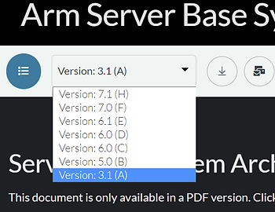

# The Arm SBSA Specification AMD Versal Supports

## The Arm SBSA Specification AMD Versal Supports

The Versal ACAP Technical Reference Manual (AM011) [<u>Server Architecture</u>](https://docs.xilinx.com/r/en-US/am011-versal-acap-trm/Server-Architecture) lists the Arm SBSA specification AMD Versal Supports:

"The Versal ACAP system is Arm SBSA Level-1 capable, at a minimum, as defined by the Arm SBSA specification document number [<u>ARM-DEN-0029A</u>](https://developer.arm.com/documentation/den0029/a/?lang=en)."

Click [<u>ARM-DEN-0029A</u>](https://drive.google.com/file/d/16HjZ7igqHPakklsVOwjJUlRiBA6oLofm/view?usp=share_link) for a cached version.

**SBSA** stands for **Server Base System Architecture.**

Versal supports "A" at [<u>link</u>](https://developer.arm.com/documentation/den0029/a/?lang=en) B-H can be downloaded:

## References

-   [<u>Versal ACAP Technical Reference Manual</u>](https://docs.xilinx.com/r/en-US/am011-versal-acap-trm) (AM011)
    
-   AMD Logo from [<u>link</u>](https://library.amd.com/web/241bcd26472f10b9/amd-corporate-logo/?mediaId=8C984466-7CF4-4E8C-9D5433E63251D45B)