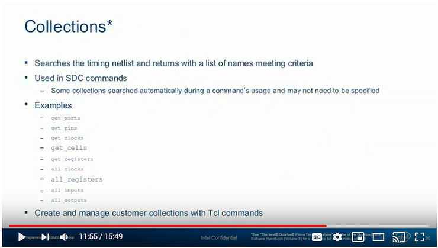

# Timing Analysis Concepts & Terminology

This post presents timing analysis concepts & terminology and SDC netlist terminology. It is presented as the annotated transcript of **Online Training: Part 1 - Introduction to Timing Analysis** from Intel FPGA where it was originally presented. I put this together because its one of the better introductions to timing analysis concepts & terminology and I thought it may be good to extract this good info from the video.

**<u>The Video</u>**

(video unavailable)

**<u>Annotated Transcript</u>**

<u>Timing Analyzer</u>

**Slide Text**

Timing Analyzer

Online Training: Part 1 - Introduction to Timing Analysis

**Transcript**

Welcome to the Intel Quartus Prime Software Design Series Timing Analyzer online training Part 1: Introduction to Timing Analysis.

My name is Steve.

This training is available for desktop viewing as well as in a format compatible with portable devices both available from the same link included in your registration email.

For either version while watching the training use the controls at the bottom and the side of the screen to navigate to any point.

Feel free to pause the training at any time to experiment with the software.

When you are done with the training please use the link provided in the registration email you were sent to provide us feedback on the training and ways in which it could be improved.

I'll remind you about that later.

<u>Objectives</u>

**Slide Text**

Objectives

-   Perform timing analysis using the Timing Analyzer (TA) timing verification flow
    
-   Build Synopsys Design Constraint (SDC) files for constrining FPGA design
    
-   Generate timing reports inb Timing Analyzer
    
-   Gain familiarity with the Timing Analyzer graphical user interface (GUI)
    

**Transcript**

In this course you'll learn how to perform timing analysis in Intel Quartus Prime Software using timing analyzer.

You will use Synopsis Design Constraints or SDC files to constrain a design to meet

timing requirements and to compare results.

You will learn how to generate timer reports in timing analyzer and gain familiarity with its graphical user interface.

<u>Agenda for Part 1</u>

**Slide Text**

Agenda for Part 1

-   \> Timing analysis concepts & terminology <
    
-   \> SDC netlist terminology <
    
-   Introduction to the Timing Analyzer GUI
    
-   Using Timing Analyzer
    
-   Incorporating timing analysis in the Intel Quartus Prime design flow
    
-   Timing Analyzer reporting
    
-   SDC constraints
    

**Transcript**

Here's the agenda for this training.

First we'll start with a look at basic timing analysis concepts and terminology used in Timing Analyzer. This will include a discussion of the terminology used to select nodes from the SDC netlist for targeting timing constraints.

Subsequent parts of this training available on the Intel training website and linked at the end of this training will introduce you to the timing analyzer GUI and its use.

You'll also learn how to incorporate timing analyzer into the Intel Quartus prime design flow, take a closer look at timing analyzers reporting features and understand the STC constraints required to fully constrain a design.

<u>Timing Analyzer</u>

**Slide Text**

Timing Analyzer

-   Timing Analysis Concepts & Terminology
    

**Transcript**

Let's get started with the look at basic timing analysis concepts as well as the terminology used in the timing analyzer for constraining and validating timing requirements.

<u>How does timing verification work?</u>

**Slide Text**

How does timing verification work?

**Transcript**

Every device path in a design must be analyzed with respect to timing specifications/requirements

-   Catch timing related errors faster than gate-level simulation & board testing
    

Designer must enter timing requirements & exceptions

-   Used to guide Fitter during placement & routing
    
-   Used to compare against actual results (post-fit)
    

So how does timing analyzer timing verification in the Intel Quartus Prime software work?

As you'll see the timing analyzer checks **each and every path in the design with respect to the requirements specified by the designer**. By **looking at each and every path** we can catch problems faster and easier than with gate level simulation or with board testing. The caveat is that **<u>it is up to the designer to enter timing requirements and exceptions for all paths in the design</u>**. The software knows nothing about how the design is supposed to work with respect to timing so timing constraints on all paths are required

to guide the fitter (place and router). Once the fitter has placed and routed the design the results can be compared to the original constraints to ensure that timing was met.

<u>Timing Analysis Basic Terminology</u>

**Slide Text**

Timing Analysis Basic Terminology

-   Latch vs latch edges
    
-   Data & clock arrival time
    
-   Data required time
    
-   Setup & hold slack analysis
    

**Transcript**

Let's look at some basic timing analysis terminology that we'll use throughout this training as well as directly in the timing analyzer.

<u>Launch &amp; Latch Edges</u>

**Transcript**

All timing analysis is based on the schematic shown here.

A **source register** drives a **signal** to a **destination register**.

These registers may both be contained within an FPGA design or one of them may be part of some third party device external to the FPGA on a board. Both the **source** and **destination registers** are clocked by some **clock source**, usually the same for both as shown here, but they could be clocked by two different sources.

<u>Launch &amp; Latch Edges</u>

**Slide Text**

Launch & Latch Edges

Launch edge: the edge with "launches" the data from the **source register**

Latch edge: the edge which "latches" the data at the destination register )with respect to the launch edge, selected by timing analyzer; typically 1 clock cycle, i.e. rising to rising edge.

**Transcript**

For a registered register path such as this the **launch edge** is defined as the clock edge that activates the **source register**. The **latch edge** is the clock edge that activates the **destination register**.

The relationship between these edges will be used to determine if register to register data

transfers will occur properly. This relationship is derived from clock constraints that will be entered by you as the designer. Also note that the **data valid window,** the time during which the data signal is valid on the path between the two registers **opens some time after**

**the launch edge** and **closes sometime after the latch edge**

<u>Data Arrival Time</u>

**Slide Text**

Data Arrival Time

-   The time for data to arrive at the destination register's (REG2) D input.
    

**Transcript**

Based on the launch edge the **data arrival time** is defined as the time it takes for data launched from the source register by the launch edge of the clock to arrive at the D input of the destination register.

<u>Data Arrival Time</u>

**Slide Text**

Data Arrival Time

-   The time for data to arrive at the destination register's (REG2) D input.
    

**Transcript**

Looking at the data arrival path defined in the diagram the data arrival time is calculated by adding the **launch edge** delay, adjusted to some 0 reference, the clock delay to the source register referred to as **Tclk1**, the clock-to-time-out or **tco** of the source register and the data delay between the source and destination registers which includes delays incurred by any combinational logic in the path. The data arrival time defines the start of the data valid window at the destination register and is calculated with this equation:

**Equations**

**Data arrival time** = launch edge + Tclk1 + tco + Tdata

<u>Clock Arrival Time</u>

**Slide Text**

Clock Arrival Time

-   The time for the clock to arrive at destination register's (REG2) clock input.
    

**Transcript**

The **clock arrival time** is the time it takes for the **latch edge** to arrive at the destination

register's clock pin. It is equal to the **latch edge** adjusted to some 0 reference plus the delay from the **clock source** to the **clock input** of the destination register. If the source and destination registers are in the same clock domain the **latch edge would be one clock period later with respect to the launch edge**. If the clocks are coming from two different clock domains then the actual difference in time between the launch and latch edges would be used.

**Equations**

**Clock arrival time** = latch edge + Tclk2

<u>Data Required Time (Setup Time)</u>

**Slide Text**

Data Required Time (Setup)

-   The minimum time required for the data to be valid before the latch edge so the data can be successfully latched into the destination register(REG2)
    

**Transcript**

The data required time is the time that a signal sent by the **source register** must arrive at the **D input** of the **destination register** in order to be properly sampled. This calculation ensures that data does not arrive at the destination too late with respect to the time needed for a valid synchronous transfer. Based off the **latch edge** and the **clock arrival time** the **setup data required** time depends on the set-up time (**tsu**) of the destination register, a direct function of the silicon. Data must be valid at the beginning of the setup time. the **setup required time** is equal to the **clock arrival time** minus **tsu** of the destination register minus an optional **setup uncertainty**. The **setup uncertainty** can be included in the calculation to help define a non-ideal clock allowing for **clock jitter** or a **guard band**.

**Equations**

**Data required time (Setup)** = Clock arrival time - tsu - Setup uncertainty (clock Jitter)

**Data required time (Setup)** = (latch edge + Tclk2) - tsu - Setup uncertainty (clock Jitter)

<u>Data Required Time (Hold)</u>

**Slide Text**

Data Required Time (Hold)

-   The minimum time required after the latch edge for the data to remain valid for successful latching into the destination register (REG2)
    

**Transcript**

The **data required time** for a **hold** calculation is **the earliest time** that a new signal value can arrive at the D input of the destination register and not interfere with the data that was sampled by the previous latch edge. This calculation ensures that new data doesn't arrive too soon with respect to the time needed for **a valid synchronous data transfer**. Like the **setup time** the hold-time (**th**) is a function of the actual silicon. Again, based off the **latch edge** the **hold required time** is equal to the **clock arrival time** plus the destination register's **hold time requirement**. The data must remain valid until this point at which time new data can arrive at the destination. An optional **hold uncertainty** can be added in a similar fashion to the **set-up uncertainty**.

**Equations**

**Data required time (Hold)** = Clock arrival time + th + Hold uncertainty (clock jitter)

**Data required time (Hold)** = (latch edge + Tclk2) + th + Hold uncertainty (clock jitter)

<u>Setup Slack (1)</u>

**Slide Text**

Setup Slack (1)

-   Margin by which the setup timing requirement is met
    
-   Ensures launched data arrives in time to meet the latching requirement
    

**Transcript**

Our ultimate goal for timing on all paths in the design is to have positive slack. Slack is a measure of how well a design is meeting or missing its timing requirements. in order for a circuit to operate properly the slack calculation must come out positive meaning there is extra margin for meeting the set-up or hold timing requirements.

**Equations**

**Data required time (Setup)** = Clock arrival time - tsu - Setup uncertainty (clock Jitter)

**Data required time (Setup)** = (latch edge + Tclk2) - tsu - Setup uncertainty (clock Jitter)

Setup Slack = Data actual time (Setup) \- **Data required time (Setup)**

GOOD: **positive** slack

**Data actual time (Setup)** > **Data required time (Setup)**

BAD: **negative** slack

**Data actual time (Setup)** < **Data required time (Setup)**

<u>Setup Slack (2)</u>

**Transcript**

Thus there are two calculations performed when determining the slack: one for set-up and one for hold. By adding the **clock arrival**, **data arrival** and **data required** paths to the diagram we can see **<u>setup slack</u>** shown here (the green arrow). The **<u>setup slack</u>** is the difference between the **data required time** and the opening of the **data valid window** already defined as the **data arrival time**.

**Equations**

**Data required time (Setup)** = Clock arrival time - tsu - Setup uncertainty (clock Jitter)

**Data required time (Setup)** = (latch edge + Tclk2) - tsu - Setup uncertainty (clock Jitter)

**Data arrival time** = launch edge + Tclk1 + tco + Tdata

**Setup slack** = Data required time (Setup) - Data arrival time

**Setup slack** = ((latch edge + Tclk2) - tsu - Setup uncertainty (clock Jitter)) - (launch edge + Tclk1 + tco + Tdata)

GOOD: Setup slack positive

BAD: Setup slack negative

i.e. if the data actually arrives in less time than required, everything is good.

<u>Hold Slack (1)</u>

**Slide Text**

Hold Slack (1)

-   Margin by which the hold timing requirement is met
    
-   Ensures latch data is not corrupted by data from the next launch edge i.e. the input data cannot change too quickly after the rising edge of the clock
    

**Transcript**

Hold slack is defined in a similar fashion.

<u>Hold Slack (2)</u>

**Transcript**

It (**hold slack**) is based off the **hold data required time** and the fact that the **latch edge** of a data transaction is the **launch edge** of the next transaction. Filling in the **data required path** and the **data arrival path** for the next date of transaction we see that the **hold slack** is the difference between the **data arrival time of the next transaction** and the **hold data required time**.

Having positive hold slack also prevents double clocking. Double clocking occurs when the data arrival time is so low when compared to the o'clock arrival time that the data is clocked through two subsequent register stages during a single clock cycle.

**Equations**

**Data arrival time of next transaction** = (Next launch edge or current latch edge) + Tclk1 + tco + Tdata

**Data required time (Hold)** = (Next launch edge or current latch edge + Tclk2) + th + Hold uncertainty (clock jitter)

Hold slack = **Data arrival time of the next transaction - Data required time (Hold)**

GOOD: Hold slack positive

BAD: Hold slack negative

i.e. if the **new data** arrives after the **data hold time** everything is good

<u>Stack Equations</u>

**Slide Text**

Slack Equations

Setup slack = Min. Data Required Time (Setup) - Max. Data Arrival Time

Hold Slack = Min Data Arrival Time - Max. Data Required Time (Hold)

Positive slack

-   Timing requirement met
    

Negative slack

-   Timing requirement not met
    

Equations work for all timing paths

-   Internal, I/O, & asynchronous control
    

**Transcript**

Here is a summary of the two slack equations. Routing paths and components in the FPGA can have small ranges of delay. Timing Analyser, by default, performs a pessimistic analysis so the worst case values for both calculations are used. In both cases if the calculated value is positive, time requirements have been met, if the value is negative, timing is failing on the data path. These equations will work whether we are talking about internal paths, I/O paths or asynchronous control signals.

<u>Timing Analyzer / SDC Netlist Terminology</u>

**Transcript**

Now that we've defined basic timing terminology let's take a look at the terminology used when creating SDC constraints.

<u>SDC Netlist Terminology</u>

**Slide Text**

**Term**: Definition

**Cell**: Device building blocks (e.g. look-up tables, registers, embedded multipliersm memory blocks, I/O elements, PLLs, etc.)

**Pin**: Input or outputs of cells

**Net**: Connections between pins

**Port**: Top-level inputs and outout (e.g. device pins)

**Registers**: Registers in a design

**Transcript**

We will be creating an SDC netlist on which we can apply SDC constraints. An SDC netlist is a database of all the paths in design and the known timing information about each of those paths. When you create constraints to try to meet the timing variables we've just defined, we have to apply, or target the constraints to certain physical locations in the SDC netlist. This is done with the terminology listed here.

To start, cells are the basic device building blocks. They can be anything such as LUTs, registers, embedded multipliers, embedded memory or I/O elements. Typically pins are thought of as device packaged pins, however in an SDC netlist, pins are the inputs and

outputs of cells. Ports are the top-level inputs and outputs of the design, in other words they are the FPGA or CPLD device I/O pins. Therefore, nets are the interconnects between pins and thus cells. So when referring to an SDC netlist switch your standard thinking of what is a pin, what is a port to target your timing constraints to the correct location in the design. Finally, while registers are referred to as cells they can also be referenced as simply registers.

<u>SDC Netlist Example</u>

**Slide Text**

Sample pin names:

-   ina|o
    
-   inrega|d
    
-   inrega|clk
    
-   inrega|q
    
-   ab|combout
    
-   ab|datac
    

Sample net names:

-   ina~input|o
    
-   ab
    
-   clk~clkctrl
    
-   inrega
    

**Transcript**

Here is a diagram of a design so we can see how to apply these SDC terms. This register named **inrega** is considered a cell, this input I/O element named **ina** is also considered

a cell. The D input to the inrega cell is a pin. The Q output from the cell is also a pin. This output from the device named **out** is a port. So in the netlist device I/O are considered both cells and ports. The connection between the **outclk** output pin of the clock control

cell and the clock input pin of the **outreg** cell as a net. Listed near the bottom of the slide are the names of some of the pins and nets in the design. Notice that pin names are always associated with the name of a cell using the pipe (|) character and net names are associated

with the driver cell and sometimes that cell's pin. Keep these physical locations in the design in mind since we'll be using them to create timing constraints.

<u>Collections*</u>

**Slide Text**

Collections\*

Searches the timing netlist and returns with a list of name meeting criteria

Used in SDC commands

-   Some collections searched automatically during a command's usage and may not need to be specified
    

Examples

-   get\_ports
    
-   get\_pins
    
-   get\_clocks
    
-   get\_cells
    
-   get\_registers
    
-   all\_clocks
    
-   all\_registers
    
-   all\_inputs
    
-   all\_outputs
    

Crate and manage customer collections with Tcl commands

**Transcript**

in SDC, each type of node or location defined on the previous slide belongs to one or more collections. Collections are used to search the know database to find items in the SDC netlist to which we can apply a constraint. To select a node in the netlist a collection is called and then an item within the collection is specified. Some examples of collections are shown here.

The collections that start with **all\_** refer to all of that particular item in the netlist. This is a quick way to target all of a particular type of item in the design. However more often than

not constraints will target individual nodes or paths. To do this the **get\_** collections are used. A path is defined by its endpoints so using the **get\_ports** and **get\_pins** collections will be the easiest way to constrain a path or a group of paths.

Once we define clock constraints the **get\_clocks** collection will be used to call out a particular clock for use in other constraints.

There are a number of other types of collections you can use, but the ones listed here are the most common. If you want to create and use your own custom collections you can do this through Tcl scripting. The add\_to\_collection command lets you merge an existing collection with items from a second compatible collection, while remove\_from\_collection lets you selectively remove any item from an existing custom collection. For more detailed discussion of the available collections and examples of their use check out the Intel Quartus Prime handbook chapter entitled Timing Analyzer linked \[[here](https://www.intel.com/content/dam/www/programmable/us/en/pdfs/literature/hb/qts/archives/qts-qps-handbook-16.0.pdf)\] (Chapter 7, "The Quartus Prime TimeQuest Timing Analyzer," at the link). For information about creating and managing custom collections see the Intel Quartus Prime built-in help.

<u>End of Part 1</u>

**Slide Text**

End of Part 1

To continue the training, check out:

-   Part 1: Timing Analyzer: Introduction to Timing Analysis \[[link](https://youtu.be/B73G4BuTpLo)\]
    
-   Part 2: Timing Analyzer: Timing Analyzer GUI \[[link](https://www.youtube.com/watch?v=IGAwgI3Fs-k)\]
    
-   Part 3: Timing Analyzer: Intel Quartus Prime Integration & Reporting \[[link](https://www.youtube.com/watch?v=_7mMYhuQIbY)\]
    
-   Part 4: Timing Analyzer: Required SDC Constraints \[[link](https://www.youtube.com/watch?v=hfaiPxl9Z9A)\]
    

**Transcript**

This concludes part 1 of the training. If you'd like to continue the training you can register for parts 2 through 4 for free at the link shown here.

To learn about additional resources available to help you with using timing analyzer continue to the next slide.

<u>For More Information (1)</u>

**Slide Text**

For More Information (1)

Timing Analysis Overview (Volume 3)

The Intel Quartus Prime Timing Analyzer (Volume 3)

Timing Closure and Optimization (Volume 2)

-   Standard Edition \[[online](https://www.intel.com/content/www/us/en/programmable/documentation/ony1529966370740.html)\]\[[pdf](https://www.intel.com/content/dam/altera-www/global/en_US/pdfs/literature/ug/ug-qps-timing-analyzer.pdf)\] (think this is correct)
    
-   Pro Edition \[[online](https://www.intel.com/content/www/us/en/programmable/documentation/psq1513989797346.html)\]\[[pdf](https://www.intel.com/content/dam/altera-www/global/en_US/pdfs/literature/ug/ug-qpp-timing-analyzer.pdf)\]
    

**Transcript**

For more information about timing analysis and the timing analyzer be sure to read the Timing Analysis Overview and Timing Analyzer chapters in Volume 3 of the Intel Quartus Prime Handbook linked here. To learn techniques for closing timing and a design using SDC Constraints and Timing Analyzer see the Timing Closure and Optimization chapter in Volume 2.

<u>For More Information (2)</u>

**Slide Text**

For More Information (2)

Instructor-led training

Timing Analysis

-   [https://www.intel.com/content/www/us/en/programmable/support/training/course/idsw120.html](https://www.intel.com/content/www/us/en/programmable/support/training/course/idsw120.html)
    

Advanced Timing Analysis with TimeQuest

-   [https://www.intel.com/content/www/us/en/programmable/support/training/course/idsw125.html](https://www.intel.com/content/www/us/en/programmable/support/training/course/idsw125.html)
    

Timing Closure with the Quartus Prime Software

-   [https://www.intel.com/content/www/us/en/programmable/support/training/course/idsw145.html](https://www.intel.com/content/www/us/en/programmable/support/training/course/idsw145.html)
    

**Transcript**

If you'd like hands-on experience with timing analyzer or you want to learn advanced techniques for closing timing in a design enroll in any of the timing analyzer related instructor-led courses listed here.

<u>Online Training (1)</u>

**Slide Text**

Online Training (1)

Design Evaluation for Timing Closure

-   [https://www.intel.com/content/www/us/en/programmable/support/training/course/odswtc02.html](https://www.intel.com/content/www/us/en/programmable/support/training/course/odswtc02.html)
    

Timing Closure Using Timing Analyzer Custom Reporting

-   [https://www.intel.com/content/www/us/en/programmable/support/training/course/otim1100.html](https://www.intel.com/content/www/us/en/programmable/support/training/course/otim1100.html)
    

Best HDL Practices for Timing Closure

-   [https://www.intel.com/content/www/us/en/programmable/support/training/course/ohdl1130.html](https://www.intel.com/content/www/us/en/programmable/support/training/course/ohdl1130.html)
    

**Transcript**

There are many free online training courses just like this one that can help you learn more about timing analysis and timing closure. Use the links here to register for a course or to find more training at the Intel training website.

<u>Online Training (2)</u>

**Slide Text**

Online Training (2)

Timing Closure Using Physical Synthesis Optimizations

-   [https://www.intel.com/content/www/us/en/programmable/support/training/course/odsw1139.html](https://www.intel.com/content/www/us/en/programmable/support/training/course/odsw1139.html)
    

Constraining Source Synchronous Interfaces

-   [https://www.intel.com/content/www/us/en/programmable/support/training/course/ocss1000.html](https://www.intel.com/content/www/us/en/programmable/support/training/course/ocss1000.html)
    

Constraining DDR Source Synchronous Interfaces

-   [https://www.intel.com/content/www/us/en/programmable/support/training/course/oddr1000.html](https://www.intel.com/content/www/us/en/programmable/support/training/course/oddr1000.html)
    

<u>Many Ways to Learn</u>

**Slide Text**

-   FREE, Always available, ~4 minutes long YouTube videos
    
-   FREE, Always available, ~30 minutes long, >200 topics English, Chinese, Japanese
    
-   Live over WebEx Training Center, Ask questions to Intel FPGA expert, Hands on labs, Taught in 1/2 day sessions, Class schedules at [https://www.intel.com/content/www/us/en/programmable/support/training/overview.html](https://www.intel.com/content/www/us/en/programmable/support/training/overview.html)
    
-   In-person, Ask questions to Intel FPGA expert, Hands on labs, 1 day long, Class scheduled at [https://www.intel.com/content/www/us/en/programmable/support/training/overview.html](https://www.intel.com/content/www/us/en/programmable/support/training/overview.html)
    

**Transcript**

Intel provides multiple avenues in which to learn about Intel FPGA products. In addition to free online training such as this there is the Intel FPGA YouTube channel \[[link](https://www.youtube.com/user/alteracorp)\] with its quick

videos and demos. There are virtual classes where an instructor teaches a class live over the web and there are in-person instructor-led classes where an Intel FPGA expert teaches a topic at an office local to you. Please see the links on this slide for more details.

<u>Intel FPGA Technical Support Resources</u>

**Slide Text**

-   Intel FPGA [Technical Training](https://www.intel.com/content/www/us/en/programmable/support/training/overview.html) materials
    
-   Intel Programmable Solutions Group (PSG) [community forum](https://forums.intel.com/s/topic/0TO0P000000MWKBWA4/programmable-devices?language=en_US) for self-help
    
-   Intel PSG [wiki site](https://fpgawiki.intel.com/wiki/Intel_FPGA_Wiki) for design examples
    
-   Intel PSG Knowledge Base [Solutions](https://www.intel.com/content/www/us/en/programmable/support/support-resources.html)
    
-   Intel PSG [Self Servicing License Center](https://www.intel.com/content/www/us/en/programmable/support/support-resources/support-centers/licensing.html)
    

Please contact your sales and field support if you need further assistance.

**Transcript**

Nothing spoken during slide

<u>Give Us Your Feedback</u>

**Slide Text**

Give Us Your Feedback

When you registered for this training you received a confirmation email

Please click on the link in the email to complete a short survey

Your feedback is important to help us improve future trainings!

**Transcript**

One last thing. When you registered for this training a link was sent to you in your confirmation email that links to a short online survey. Please complete the survey to let us know what you think of this training and if you can think of ways it can be improved.

**<u>References</u>**

-   Online Training: Part 1 - Introduction to Timing Analysis from Intel FPGA @ \[[link](https://www.youtube.com/watch?v=B73G4BuTpLo&feature=youtu.be)\]
    
-   Intel logo @ \[[link](https://www.youtube.com/user/alteracorp)\]
    
-   Introducing the Intel® Quartus® Prime Pro and Standard Edition Software User Guides @ \[[link](https://www.intel.com/content/www/us/en/programmable/products/design-software/fpga-design/quartus-prime/user-guides.html)\]
    
-   Good timing diagram explanations @ \[[link](https://www.intel.com/content/www/us/en/programmable/documentation/psq1513989797346.html)\]
    
-   Intel FPGA documentation @ \[[link](https://www.intel.com/content/www/us/en/programmable/documentation/lit-index.html)\]