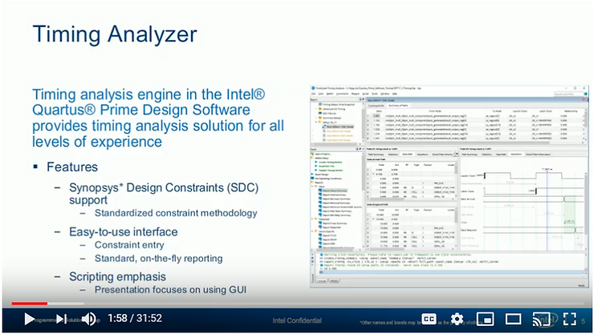

# Fast & Slow Corners in Timing Analysis, Steps to Run Timing

This post presents what fast and slow corners are and why they need to be run to correctly constrain a design. It presents the explanation given during part 2 of Timing Analyzer. In addition the steps to run Timing Analyzer are listed inline.

**<u>The Video</u>**

(video unavalible)

**<u>Featured Docs</u>**

Intel® Quartus® Prime Timing Analyzer Cookbook @ \[[<u>link</u>](https://www.intel.com/content/dam/www/programmable/us/en/pdfs/literature/manual/mnl_timequest_cookbook.pdf)\]

**<u>Slide-by-Slide</u>**

<u>Online Training: Part 2 - Timing Analyzer GUI</u>

**Slide Text**

Timing Analyzer

Online Training: Part 2 - Timing Analyzer GUI

**Transcript**

Welcome to the Intel Quartus prime software design series Timing Analyzer Online Training Part 2 Timing Analyzer GUI. My name is Steve. This training is available for desktop viewing as well as in a format compatible with portable devices both available from the same link included in your registration email. For either version while watching the training use the controls at the top and side of the screen to navigate to any point. Feel free to pause the training at any time to experiment with the software. When you are done with the training

please use the link provided in the registration email you were sent to provide us feedback on the training and ways in which it can be improved. I'll remind you about that later.

<u>Objectives</u>

**Slide Text**

Objectives

-   Perform timing analysis using the Timing Analyzer (TA) timing verification flow
    
-   Build Synopsys Design Constraint (SDC) files for constraining FPGA designs
    
-   Generate timing reports in Timing Analyzer
    
-   Gain familiarity with the Timing Analyzer graphical user interface (GUI)
    

**Transcript**

In this course you will learn how to perform timing analysis in the Intel Quartus Prime Software using Timing Analyzer. You'll use Synopsis Design Constraints or .sdc files to constrain a design to meet timing requirements and to compare results. You will learn how to

generate timer reports in timing analyzer and gain familiarity with its graphical user interface.

<u>Agenda for Part 2</u>

**Slide Text**

Agenda for Part 1

-   Timing analysis concepts & terminology
    
-   SDC netlist terminology
    
-   \> Introduction to the Timing Analyzer GUI <
    
-   \> Using Timing Analyzer <
    
-   Incorporating timing analysis in the Intel Quartus Prime design flow
    
-   Timing Analyzer reporting
    
-   SDC constraints
    

**Transcript**

Here is the agenda for this training. In the previous part we looked at basic timing analysis

concepts and terminology used in the Timing Analyzer. This included a discussion of terminology used to select nodes from the SDC netlist for targeting timing constraints. In this part you'll be introduced to the timing analyzer GUI and its use. In subsequent parts of this

training, available on the Intel training website and linked at the end of this training, you'll learn how to incorporate timing analyzer into the Quartus Prime design flow and take a look at Timing Analyzers reporting features in more detail. Finally you'll learn about the SDC constraints required to fully constrain a design.

<u>Introduction to the Timing Analyzer GUI</u>

**Slide Text**

Timing Analyzer

Introduction to the Timing Analyzer GUI

**Transcript**

Now that you understand all the terminology needed to use the timing analyzer, let's take a

look at the tool itself.

<u>Timing Analyzer</u>

**Slide Text**

Timing Analyzer

Timing analysis engine in the Intel Quartus Prime Design Software provides a timing analysis solution for all levels of experience.

Features

Synopsys Design Constraints (SDC) support

-   Standardized constraint methodology
    

Easy-to-use interface

-   Constraint entry
    
-   Standard, on-the-fly reporting
    

Scripting emphasis

-   Presentation focuses on use GUI
    

**Transcript**

Timing Analyzer, found in all editions of the Intel Quartus Prime software, provides a

powerful timing analysis solution for designers with any level of timing analysis experience and for designs of all levels of complexity; is easy-to-use providing a graphical interface for beginners and those who prefer a GUI while completely supporting a Tcl scripting based environment. timing analyzer provides fast on-demand and interactive data reporting to save

time and to make it easy to get detailed timing analysis only on the paths of interest. As already mentioned Timing Analyzer uses Synopsis Design Constraints or SDC, a standard method for constraining timing in the ASIC world used by the Synopsis Primetime timing

analysis tool. Intel has adopted the SDC standard for use with PLD designs. While Tcl and SDC are command-line and text based methods of interacting with timing analyzer this training will focus on the timing analyzer GUI and show the equivalent Tcl or SDC commands.

<u>Opening the Timing Analyzer Interface</u>

**Slide Text**

Opening the Timing Analyzer Interface

Toolbar button

Tools menu

Tasks window

Stand-alone mode

-   quartus\_staw
    

Command line

**Transcript**

Timing Analyzer is part of the Intel Quartus Prime software but can be run independently. There are several different methods to open the timing analyzer. You can click the Timing

Analyzer toolbar button, double click in the tasks window or select Timing Analyzer from the tools menu of the Intel Quartus Prime software. You can run the Timing Analyzer GUI in standalone mode by typing quartus\_staw from a command line. You can also run the Timing Analyzer without the GUI from the command line.

<u>Timing Analyzer GUI</u>

**Slide Text**

Report pane

Tasks pane

View pane

Console pane

**Transcript**

Here is the timing analyzer GUI. It is organized similarly to the Intel Quartus Prime software with the viewing pane for viewing timing reports, a task pane for executing commonly performed tasks and a report pane for keeping track of generated timing reports. There is also an operating conditions pane for choosing different timing models. We will go over each of these parts of the window in more detail and return to each of them throughout the training.

<u>Tasks Pane</u>

**Slide Text**

Tasks Pane

Provides quick access to common operations

-   Command execution
    
-   Report generation
    

Execute most commands with default settings

Use menus for non-default settings

Double-click to execute any command

**Transcript**

The tasks pane provides quick access to the most commonly used timing analyzer operations such as setting up the timing netlist and generating commonly used reports. When you execute a task from the task pane the task is performed with the task's default settings. This is important to remember because there may be cases when you want to perform an action that does not use the defaults. When this happens use the equivalent command from the menus at the top of the Timing Analyzer interface. the task pane operates in a similar manner to the task window in the main Intel Quartus Prime interface. To execute a command or create a report using a task pane simply double-click the item in the pane. Once a task is run the task turns green and a green checkmark is placed next to the task. Tasks can only be performed once on the current SDC timing netlist so there is no need to run them again until a new netlist is created or the design is reset. You'll see how to do this later.

<u>Report Pane</u>

**Slide Text**

Report Pane

Displays list of previously generated reports current available for vewiing

-   Reports generated by Tasks pane
    
-   Reports generated using report commands
    

**Transcript**

The report pane displays a list of all reports that are currently available for viewing. The reports listed here may have been generated by tasks executed from the task pane or by using reporting commands directly in the console or in a script file. To view a report simply select the report. Once a report is created it is always available here until the timing netlist is reset.

<u>View Pane</u>

**Slide Text**

View Pane

Main viewing area that displays report table contents & graphical results

Timing Summary table

**Transcript**

The View Pane is the main report viewing area of the Timing Analyzer GUI. By default newly generated reports appear in the View Pane. There are a number of different types of reports you can create that will appear here. A Timing Summary Table is the simplest and most common type of report. As mentioned, Timing Analyzer is **path based** meaning each and every path's timing is analyzed. **Each row in a timing summary report provides basic information about either a single path in the design or about a clock domain.** This information usually includes the source and destination ports or pins of the path, the launch and latch clock domains and the calculated slack for the path. Rows in the report colored **black** have positive slack and are meeting timing. Rows in the report colored red have negative slack indicating a timing failure.

<u>View Pane / Timing histogram</u>

**Slide Text**

Timing histogram

**Transcript continued**

Other types of reports you might see are timing histograms which indicate how many paths in the design have a certain amount of slack.

<u>View Pane / Path slack report</u>

**Slide Text**

Path slack report

**Transcript continued**

...and detailed path slack reports. This type of report is the most detailed type of report you can generate. It provides complete information about a single path in a design and is extremely useful in debugging timing problems.

<u>Viewing Multiple Reports</u>

**Slide Text**

Click & drag '+' sign to divide view pane into multiple windows

**Transcript**

The view pane allows you to view multiple reports at once to make it easy to compare results. It includes a couple of special controls for this purpose. To view multiple reports at once click on the plus sign in the upper right corner of the view pane and drag it to divide the view pane into multiple windows.

<u>Viewing Multiple Reports Example</u>

**Slide Text**

Viewing Multiple Reports Example

Drag bars to edges to remove splits

**Transcript**

Here's an example of the view pane split into four windows. To display a new report in one of the windows simply highlight a window and select report from the report pane you would like to appear in that window. You can also force report into a particular window using the red target button found in the upper right corner of a window. With a viewing pane targeted any report selected in the report pane will be placed in the targeted window. To remove windows from the view pane drag the bars between the windows to the edge. This removes the split.

<u>Console Pane</u>

**Slide Text**

Console Pane

Perform direct entry and execution of SDC and Tcl commands

-   Also displays equivalent of commands executed in GUI
    

Displays Timing Analyzer output messages

History tab records all executed SDC & Tcl commands

-   Copy & paste to create scripts of SDC files
    

Run scripts from Script menu

**Transcript**

The console pane found at the bottom of the timing analyzer window allows you to directly enter and execute SDC or Tcl commands. Note that SDC constraints entered here do not automatically get stored in a .sdc file and will be lost if you quit the Timing Analyzer without saving. If you use the Timing Analyzer GUI to enter commands the console pane will display

the equivalent command or constraint. The Timing Analyzer console pane also displays output messages from the timing analyzer. With the history tab you can see a record of all executed SDC and Tcl commands. Just copy and paste from the history tab to easily create Tcl scripts or .sdc files.

<u>SDC File Editor = Intel Quartus Prime Design Software text Editor</u>

**Slide Text**

SDC File Editor = Intel Quartus Prime Design Software text Editor

Use Intel Quartus Prime software editor to create and/or edit SDC

SDC editing unique features (for .sdc files)

-   Access to GUI dialog boxes for constraint entry (Edit > Insert Constraint)
    
-   Syntax coloring
    
-   Delimiter matches
    
-   Tooltip syntax help
    
-   Auto-complete
    
-   SDC templates
    

**Transcript**

To easily create and store SDC constraints the Time Analyzer feature in SDC file editor. The SDC file editor accessed through the Timing Analyzer interface by selecting a new SDC file

from the Timing Analyzer file menu is identical to the Intel Quartus Prime text editor. If you create a file using the Intel Quartus Prime text editor and give it the SDC file extension you'll have the same features available as if you created the file from within the Timing Analyzer tool. The editor includes a number of features to help you create timing constraints. If you are unfamiliar with SDC syntax you can use the insert constraints submenu found in the text

editor's edit menu to access graphical dialog boxes that will help you build valid SDC constraints. We'll see how this works next. If you are familiar with SDC and want to code your files manually syntax coloring of commands and optional arguments, detailed tooltips and highlight delimiter matching make it easy to ensure correct constraint syntax and match parentheses and square brackets. The tool also includes built in templates for quickly creating entire SDC files for common designs. We'll look at these templates in a moment.

<u>SDC File Editor GUI Constraint Entry</u>

**Slide Text**

SDC File Editor GUI Constraint Entry

Construct an SDC file using Timing Analyzer graphical constraint creation tools

Constraint inserted at cursor location

**Transcript**

As mentioned you can use the timing analyzer graphical constraint creation tools to easily create SDC constraints. When you select a type of constraint to create from the insert constraints submenu from the SDC file editors edit menu as shown here you are presented with a dialog box that includes text fields and options for creating the constraint. As you set or change constraint options the SDC command field updates on the fly to display what the final constraint will look like. When you click the insert button the constraint is entered into the data SDC file at the cursor location. Since the constraint is entered exactly at the cursor location remember to place your cursor directly before accessing one of the dialog boxes for the constraint entry. The GUI does not add carriage returns at the end of newly created constraints so we need to add the and place a cursor correctly to avoid syntax errors.

<u>SDC Templates</u>

**Slide Text**

SDC Templates

Quickly add customized constraint templates

Preview window: edit before inserting & save as user template

**Transcript**

Instead of manually creating SDC constraints one by one from scratch you can use SDC templates to quickly create a complete .sdc file for your design. Clicking the Insert Template

toolbar button or selecting the command from the Edit menu opens the dialog box shown here. On the left are a number of categories of templates. Since the text editor is used to create other types of files besides SDC you'll see categories for a number of different template types. Expanding the Time Quest category displays the templates shown here.

Templates are available for creating everything from individual constraints to complete .sdc files for many typical designs. To use a template select it from the list on the left. The template appears in the preview window on the right. The template can be edited and customized here. When ready, click insert to insert the template into your .sdc file at the cursor location or click Save to save the customized template as a saved user template. Saved user templates can be accessed for use with the other designs from the user category

of the Time Quest templates.

Complete design templates are listed in the SDC cookbook subcategory. **The SDC cookbook is an online PDF document that provides examples of SDC files for completely constraining a number of typical designs.** To learn more about the SDC cookbook click the link for it \[[<u>here</u>](https://www.intel.com/content/dam/www/programmable/us/en/pdfs/literature/manual/mnl_timequest_cookbook.pdf)\] or visit the timing analyzer online resource center.

## Valuable info ^^^^^

<u>Using Timing Analyzer</u>

**Slide Text**

Timing Analyzer

Using Timing Analyzer

**Transcript**

Now that you're familiar with the Timing Analyzer interface let's look at the steps involved in actually using the tool.

<u>Basic Steps for Using Timing Analyzer</u>

**Slide Text**

Basic Steps for Using Timing Analyzer

1\. Generate timing netlist

2\. Enter SDC constraints

-   Create and/or read in SDC file (recommended method) or Constrain design directly in console
    

3\. Update timing netlist

4\. Generate timing reports

5\. Save timing constraints (option)

**Transcript**

Every time you use timing analyzer you'll follow the steps listed here. First you'll generate an SDC timing netlist. Constraints cannot be read in or created without it. Next you'll either

read in or edit an existing SDC file or constrain the design directly in the console. You'll then

update the timing netlist based on the entered constraints and generate timing reports to verify whether your design will meet your timing requirements. Finally you'll have the option to write out your constraints into a separate SDC file.

<u>1. Generate Timing Netlist</u>

**Slide Text**

1\. Generate Timing Netlist

Create a timing netlist (i.e. database) based on compilation results and selected delay model

-   Snapshot based on what fitter has completed
    
-   Worst-case (slow; maximum operating temperate), best-case (fast; minimum operating temperature) timing models
    
-   To execute: Netlist menu > Create Timing Netlist
    

**Transcript**

To start, you'll generate a timing netlist based on your design's compilation results. The options available are slightly different depending on whether you are using the Light, Standard or Pro edition of the Intel Quartus Prime Software. We'll look at the Pro Edition options in a moment but for the Light and Standard editions the netlist you create can be based on a **full placement and routing of your design called a post fit netlist** or from just a **synthesis call a post map netlist**. Use the post map netlist option to create an early timing netlist for initially creating your timing constraints without having to place and route the design. Use the post fit netlist to verify whether the fitter was able to place and route your design in a way that satisfies all timing requirements. There are three ways to execute this command. the create\_timing\_netlist Tcl command entered in the console, selecting create timing netlist for the timing analyzer netlist menu or by double **clicking create timing netlist** in the task pane. Executing this command through the task pane uses the **default options of a post fit netlist and a slow corner delay model.** We'll look at delay models next and examine the other available netlist options in more detail later but if there is no post fit netlist because the design has not yet been fully compiled executing the command in this way will fail. If this happens just use the command from the netlist menu to select a post map option.

**Note**

**A post fit netlist and a slow corner delay model** will look to see if timing is met given the slowest possible performance for any single path. **Slow corner** means max operating temp and lowest voltage VCCMIN).

<u>Timing Models in Detail (1)</u>

**Slide Text**

Timing Models in Detail (1)

Intel Quartus Prime Design Software models device timing at multiple process voltage temperature (PVT) conditions by default

Slow corner model

-   Indicates slowest possible performance for any single path
    
-   Timing for slowest device at maximum operating temperature and lowest voltage (VCCMIN)
    

Fast corner model

-   Indicates fastest possible performance for any single path
    
-   Timing for fastest device at minimum operating temperature and highest voltage (VCCMAX)
    

2nd slow and 2nd fast models (temperature inversion phenomenon)

-   Slow timing at minim operating temperature
    
-   Fast timing at maximum operating temperature
    

**Transcript**

Timing analyzer checks timing in at least two process corners by default: a slow corner defined by the devices highest operating temperature and lowest operating voltage and a fast corner defined by the device's lowest operating temperature and highest operating voltage. When you create the timing netlist you select the slow corner, the fast corner or a custom operating condition corner that may be available depending on your target device.

<u>Timing Models in Detail (2)</u>

**Slide Text**

Timing Models in Detail (2)

Why analyze for multiple corner timing models?

-   Ensure setup timing is met in the slow models
    
-   Ensure hold timing is met in fast model
    
-   Essential for source synchronous interfaces
    

Read the following white paper for more information

-   [<u>https://www.intel.com/content/dam/www/programmable/us/en/pdfs/literature/wp/wp-01139-timing-model.pdf</u>](https://www.intel.com/content/dam/www/programmable/us/en/pdfs/literature/wp/wp-01139-timing-model.pdf)
    

**Transcript**

You may have heard of **four corner testing** for other types of analysis so why do we need to test in only to process corners? **<u>If the tool can ensure that we meet setup timing in the slow corner, meaning even the slowest signals arrive at their destinations early enough to meet setup timing requirements and made hold timing in the fast corner meaning that even very fast signals remain stable long enough to meet hold timer requirements we can guarantee timing across all supported device processes, voltages and temperature ranges often referred to as the PVT of the device.</u>**

A timing netlist in the Timing Analyzer can only analyze one delay model at a time but you can easily switch between all timing models available for your targeted device. When compiling your project note that the Intel Quartus Prime Compiler will place and route the design to meet timing in all timing models simultaneously. Timing analyzer supports additional timing models with a 65 nanometer and smaller technology devices. These smaller technology devices exhibit a temperature inversion phenomenon where they can actually perform slower at lower temperatures and faster at higher temperatures. See the white paper linked here for more details on these additional timing models.

<u>Specifying Customer Operating Conditions</u>

**Slide Text**

-   Required for 65 nm or smaller devices; military; industrial, etc.
    
-   Also for performaing timing analysis on different delay model(s) without recreating the existing timing netlist
    
-   Takes precedence over already generated netlist
    
-   Use get\_available\_operating \_conditions in Color or scripts to see available conditions for target device
    

**Transcript**

To access any available additional timing models for your targeted device use the set

operating conditions option from the netlist menu or the set operating conditions window. Besides the ability to select the standard fast and slow delay models you can select the special **<u>slow low temperature </u>** and **<u>fast high temperature models</u>** as well as any other available models depending on your selected targeted device. Military and industrial rated devices have other available operating conditions that should be analyzed to ensure these devices will meet timing in these extreme conditions. This operating condition setting has precedence over the base model selected when creating the timing netlist. To check the available models and operating conditions for your target device enter the get\_available\_operating\_conditions command in the timing analyzer console or include it in your Tcl scripts.

<u>2a. Create or Read in SDC File (1)</u>

**Slide Text**

2a. Create or Read in SDC File (1)

Create SDC file using SDC file editor

-   Recommendations: Don't enter constraints using Constraints menu (see step 2b)
    

Read in constraints & exceptions from existing SDC file(s)

-   Multiple files used like one long file
    

**Transcript**

After creating the timing netlist you'll create or read in a .sdc file. You can use the SDC file editor to create a new file or edit an existing one. You may have noticed that the constraints menu, shown here, has the same constraint creation options shown earlier when using the edit menu in the SDC file editor. It is possible to use this constraints menu to create constraints but constraints created from here get written to the console not into a .sdc file. We'll look at using a constraints menu on the next slide. For now if you are using the SDC file editor to create a .sdc file, do not use the constraints menu.

<u>Unprocessed</u>

when you're done

creating or editing the dot s DC file

use the read SDC file command found in a

task pane the constraints menu or enter

read underscore SDC in the console pane

to read the dot SDC file into the timing

analyzer executing the read SDC command

from the task pane does not give you the

option of specifying the SDC file name

if you don't specify an SDC file name

the timing analyzer will first read in

dot SDC files that have specifically

been added to your intel cores prime

project if no files have been added the

tool look for a dot SDC file that shares

the same name as the current revision of

the project

a typical design may use multiple des DC

files to constrain timing especially in

a team-based environment where different

team members work on different parts of

the design if you have multiple SDC

files simply read each one in using the

options mentioned multiple files look

like one long SDC file to the tool if

you don't have a DES DC file and don't

want to create one yet

you can enter timing constraints

directly in the timing analyzer console

you can use the GUI commands found in

the constraints menu or type the

commands into the console you may also

want to enter constraints in the console

if you want to test out new constraints

without yet adding them to your SD C

file an advantage to doing this is that

entering commands directly in the

console operates the timing analyzer in

a more interactive fashion than using a

SDC file constraints are immediately

applied to the timing netlist an

existing timer reports can be updated on

the fly without having to create a new

netlist and reload the dot SDC file

however if you do this

note that any constraints entered in the

console are not automatically added to

the dot SDC file you must do that

through a manual copy and paste or by

writing out a new file if constraints

are created directly in the console

there's no way to edit or delete them as

you could by editing a dot SDC file to

remove constraints that were applied

through the console add the remove

underscore prefix before the name of the

already applied constraint this will

remove the match constraint from the

netlist as an example remove underscore

clock can be used to remove clock

constraints

note that the remove commands other than

the remove underscore clock do not

appear in the GUI so they would need to

be entered manually in the console for

general constraint management it is

recommended to simply always use a dot

SDC file and the file editor to create

and edit constraints that way there's no

chance of losing constraints by accident

quitting the program and all constraints

are stored in one location

<u>Constraining</u>

**Slide Text**

Constraining

User MUST enter constraints for all paths to fully analyze design

-   Timing analyzer olny performs slack analysis on constrained design paths
    
-   Constraints guide the Fitter to place & route design in order to meet timing requirements
    
-   Recommendation: Constrain all paths (at least clocks & I/O)
    

Not as difficult a task as it may sound

-   Wildcards
    
-   Single, generalized constraints cover many paths, even all paths in an entire clock domain
    

**Transcript**

It has already been mentioned, but it is important to reiterate that you must enter timing constraints for all paths in order to have the timing analyzer fully analyzed the design. the timing analyzer can only analyze the design based on constraints that are entered by you as the designer. At the very minimum constraint all your clocks and all of your I/O paths. With this the fitter has enough information to place and route the design to meet all internal and external timing requirements. As you'll see constraining all clocks and I/O is not as difficult a task as it may sound. The SDC specification contains extensive support for wildcards making it possible for a single constraint to cover many paths or even all the paths within an entire clock domain. Later we'll take a closer look at some of the constraints you'll need to fully constrain your designs.

<u>3. Update Timing Netlist</u>

**Slide Text**

Apply SDC constraints/exceptions to current timing netlist

Generate warnings

-   Undefined clocks
    
-   Partially defined I/O delays
    
-   Combinatorial loops
    

Update timing netlist after adding any new constraint

Execution

-   Update Timing Netlist (Tasks pane or Netlist menu)
    
-   Tasks pane shortcut: automatically creates/updates netlist and reads .sdc file
    

**TODO**

Listed Mar 19th 2019. Write up a guide for dealing with each warning type

**Transcript**

Next you'll update the timing netlist. This tells the Timing Analyzer to take the constraints you've entered and apply them to the current timing netlist. While updating the timing netlist the tool may generate warnings for your design, for example if you have clocks or I/O that have not been completely constrained or if the design contains combinatorial feedback loops. You could perform this step in the console pane, the task pane or select the command from the netlist menu.

the three

steps presented so far creating the

netlist reading in SDC constraints

either from a file or the console and

updating the netlist are required every

time the timing analyzer is started and

any time a constraint is added or

changed the steps are listed right at

the top of the task pane to make it easy

to perform them note that if you didn't

need to specify a different SDC file in

step two because the SDC file name

matches the project name you can skip

step two and immediately update the

netlist the tool will automatically read

in the correct DC file

and update the netlist without files

constraints once the netlist is updated

with your timing constraints you'll

finally be able to generate time reports

timer reports help you verify your time

requirements and locate violations use

diagnostic reports to check your design

to make sure it is fully constrained or

get a report of what SDC constraints and

exceptions have been applied to the

timing netlist you can generate many

different types of detailed reports by

using the report timing command or by

choosing a report from the reports menu

or the reports section of the task pane

as a shortcut if you've previously

created a timing netlist and selected

the dot SDC file to read in in back in

step 2 you can skip steps one through

three and immediately start generating

timing reports just double-click the

report you want to create in the task

pane and then Atlas will be created the

died SCC file would be read in and the

netlist will get updated with the

constraints from that file before

immediately creating the selected report

25:27

in the process of generating timer

reports you may notice reports listed in

the report pane colored yellow with a

question mark indicator reports

displayed like this are considered to be

out of date a report is out of date if

the current timing netlist is altered in

some way after the report has been

generated causing the data in the report

to no longer match the current state of

the timing netlist this occurs if SEC

constraints are entered via the console

reports are also considered out-of-date

if they have not yet been generated for

a particular timing model to fix this

issue update the timing netlist if

necessary and choose either the

regenerate or regenerate all out-of-date

command from the right-click menu of an

out-of-date report note that if a

constraint is added or changed in a dot

SDC file the tool does not automatically

add the out-of-date warning to existing

reports you must recreate the timing

netlist and read in the dot SDC file

again you can do this easily with the

reset

design command

26:29

if at any point you want

to quickly erase all of your constraints

from the tools memory and start over you

can use the reset design command this

command tells the timing analyzer to

delete the current netlist and create a

new one this is equivalent to running

the delete typing netlist command from

the netlist menu followed by the great

timing Ellis command this command can be

executed from the task pane the

constraints menu or by using the reset

design command in the console

27:00

if you've

been entering constraints directly in

the console you'll need to save your

timing constraints into a dot s DC file

for use by the Quartus prime fitter to

do this use the right SCC file command

in the console the constraints menu or

the task pane the right SDC command

tells the tool to take all of the

constraints and exceptions currently

applied to the netlist and write them

out to add SDC file any wild cards used

in any constraints are automatically

expanded for example if a constraint in

your file references a bus such as Q

bracket star the written out file

duplicates the constraint for each bit

of the Q bus so a single constraint for

Q bracket star becomes multiple

constraints for Q bracket 0 Q brackets 1

and so on if you already have a dot SDC

file and you have not applied any new or

additional constraints to the design

during analysis then this step can be

skipped this step is only needed if you

have added new constraints outside of

your input SDC file there are a few

things to note about writing out a dot

SDC file remember that dot SDC files are

only generated if requested if you close

the timing analyzer tool without storing

your constraints either by manually

adding them to a dot SDC file or

automatically with the right SDC command

those constraints are lost

also when used the right SDC command

what you will see in your file are the

command

as interpreted by the tool not the exact

commands that you entered run the report

SDC command to see the exact constraints

currently applied to the netlist and

exactly what will get written out to

your dynasty C file later we'll discuss

special Intel specific constraints that

are not part of the standard SDC but

provide some useful shortcuts for

constraining a design these SDC

extension commands will not be

understood by other tools that use SDC

such as primetime to translate these

special constraints into standard SDC

use the - expand option in the console

or enable the expand option in the right

SDC file dialog box this is useful even

if all your constraints are contained in

existing SDC file

29:32

<u>Basic Steps to Using Timing Analyzer (Review)</u>

**Slide Text**

Basic Steps to Using Timing Analyzer (Review)

1\. Generate timing netlist

2\. Enter SDC constraints

-   Create and/or read in SDC file (recommended method) or constrain design directly in console
    

3\. Update timing netlist

4\. Generate timing reports

5\. Save timing constraints

**Transcript**

So those are the basic steps to using the timing analyzer tool: generate your timing netlist, enter constraints then update the timing netlist to apply them. Generate timing reports to verify results and then save any new constraints you may have entered.

29:48

this concludes part two of the training

if you miss part 1 we'd like to continue

on to parts 3 or 4 you can register for

free at the link shown here to learn

about additional resources available to

help you with timing analyzer

continue on to the next slide

30:05

for more

information about timing analysis and

the timing analyzer be sure to read the

timing analysis overview and timing

analyzer chapters in volume 3 of the

Intel Quartus prime handbook linked here

to our techniques for closing timing in

a design using SDC constraints and

timing analyzer see the timing closure

in optimization chapter in volume 2

30:28

if

you'd like hands-on experience with

timing analyzer or you want to learn

advanced techniques for closing timing

in the design enroll into any of the

timing analyzer related instructor-led

courses listed here

30:42

there are many free

online training courses just like this

one that can help you learn more about

timing analysis and timing closure use

the links here to register for course or

to find more training at the end

training website

30:57

31:02

intel provides multiple avenues in which

to learn about Intel FPGA products in

addition to free online trainings such

as this there is the Intel FPGA YouTube

channel with its quick videos and demos

there are virtual classes where an

instructor teaches a class live over the

web and there are in-person

instructor-led classes where an Intel

FPGA expert teaches a topic and an

office local to you please see the links

on this slide for more information

31:31

31:37

one last thing when you registered for

this training a link was sent to you in

your confirmation email that links to a

short online survey please complete the

survey to let us know what you think of

this training and if you could think of

ways it can be improved

**<u>References</u>**

Online Training: Online Training: Part 2 - Timing Analyzer GUI @ \[[<u>link</u>](https://www.youtube.com/watch?v=B73G4BuTpLo&feature=youtu.be)\]

Intel logo @ \[[<u>link</u>](https://www.youtube.com/user/alteracorp)\]