# TinyFPGA Bx Pinout, Schematic and Datasheets

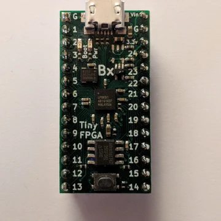

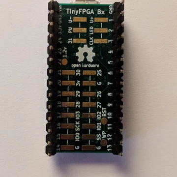

This post lists the TinyFPGA pinout, each part of the schematic and links to each part's data sheet.

**<u>Board / Schematic Overlay</u>**

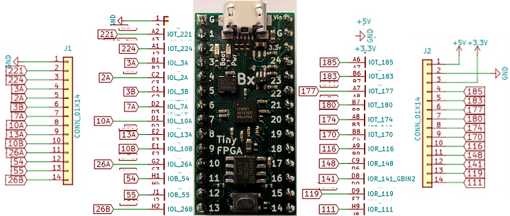

**<u>Schematic and Datasheets</u>**

TinyFPGA Bx Schematic at \[[link](https://github.com/tinyfpga/TinyFPGA-BX/blob/master/board/TinyFPGA-BX-Schematic.pdf)\]

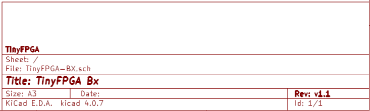

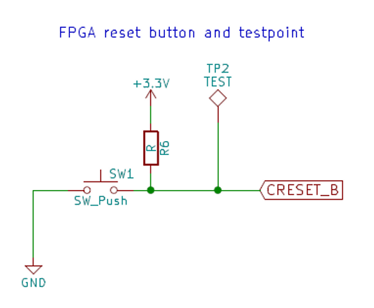

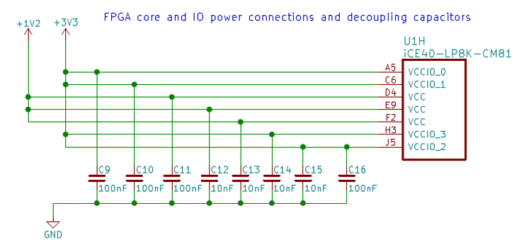

Lattice iCE40-LP8K-CM81 [[datasheet](http://www.latticesemi.com/~/media/LatticeSemi/Documents/DataSheets/iCE/iCE40LPHXFamilyDataSheet.pdf)]

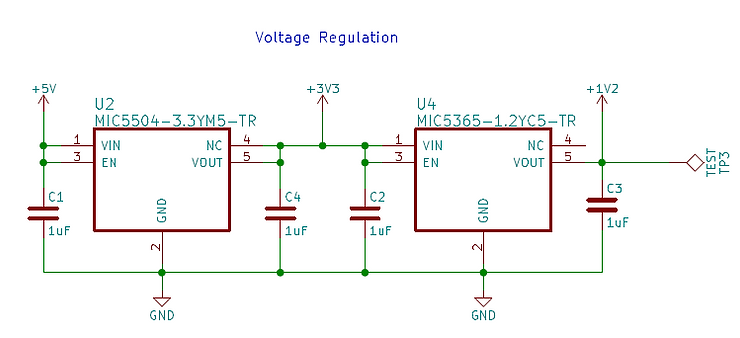

Microchip Ldo, Fixed, 3.3V, 0.3A, Sot-23-5 - MIC5504-3.3YM5-TR \[[datasheet](http://ww1.microchip.com/downloads/en/DeviceDoc/MIC550x-300mA-Single-Output-LDO-in-Small-Packages-DS20006006A.pdf)\]

Microship (Micrel) High-Performance Single 150mA LDO MIC5365-1.2YC5-TR \[[datasheet](http://ww1.microchip.com/downloads/en/DeviceDoc/mic5365.pdf)\]

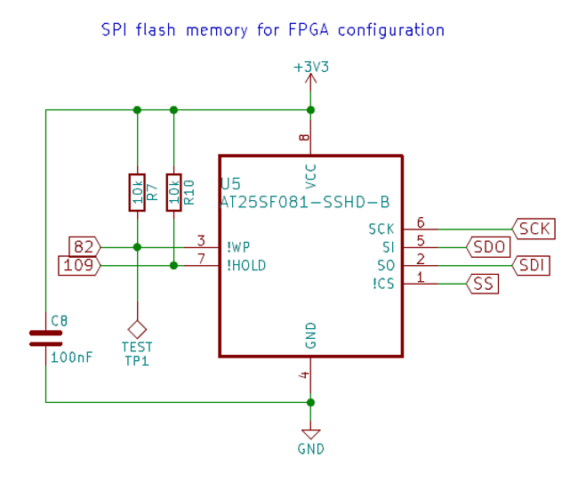

Adesto Technologies \[[link](https://www.adestotech.com/)\] 8-Mbit, 2.3V Minimum SPI Serial Flash Memory with Dual-I/O and Quad-IO Support AT25SF081 \[[datasheet](https://www.adestotech.com/wp-content/uploads/DS-AT25SF081_045.pdf)\]

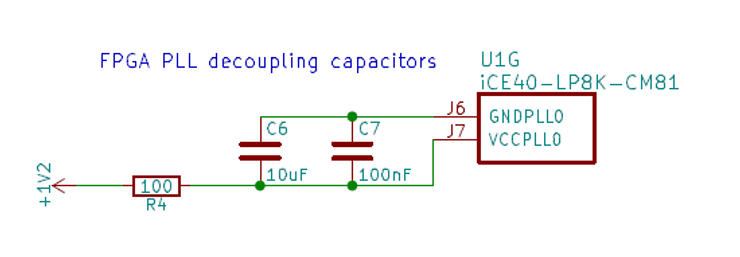

Lattice iCE40-LP8K-CM81 [[datasheet](http://www.latticesemi.com/~/media/LatticeSemi/Documents/DataSheets/iCE/iCE40LPHXFamilyDataSheet.pdf)]

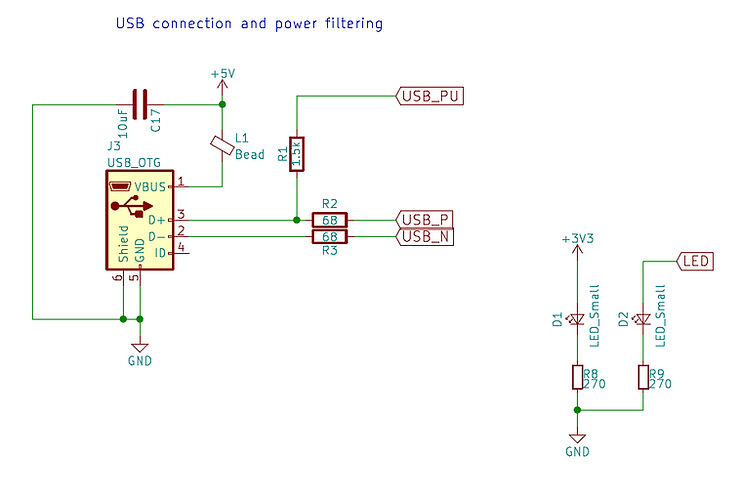

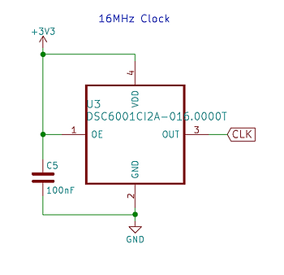

Microchip Ultra-Small, Ultra-Low Power MEMS Oscillator DSC60XX \[[datasheet](http://ww1.microchip.com/downloads/en/devicedoc/20005625b.pdf)\]

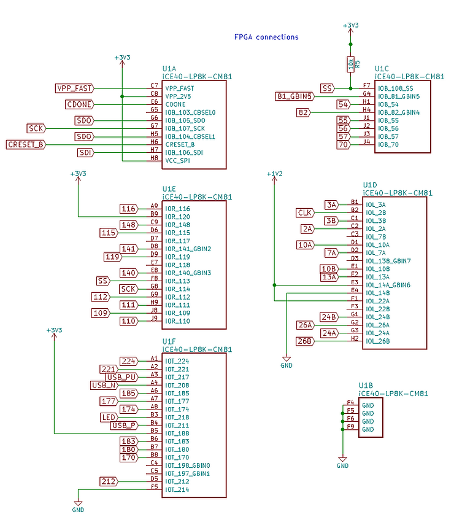

Lattice iCE40-LP8K-CM81 [[datasheet](http://www.latticesemi.com/~/media/LatticeSemi/Documents/DataSheets/iCE/iCE40LPHXFamilyDataSheet.pdf)]

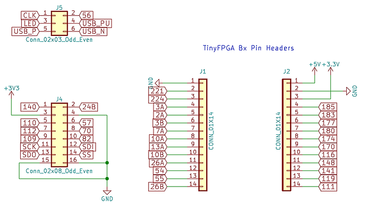

**<u>More Info</u>**

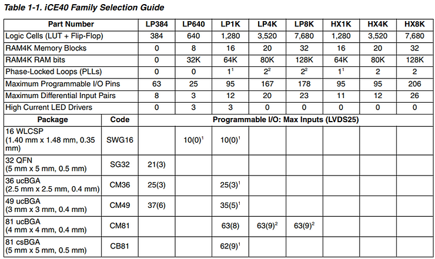

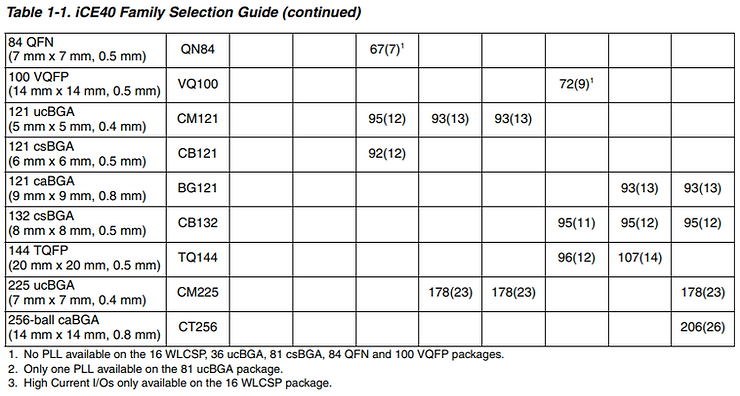