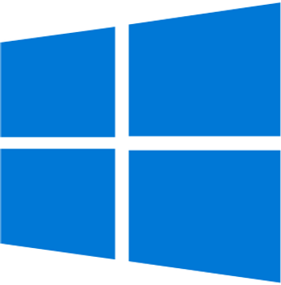

# Touch gestures for Windows

I have created a copy of the content at https://support.microsoft.com/en-us/windows/touch-gestures-for-windows-a9d28305-4818-a5df-4e2b-e5590f850741 to preserve this information for myself and others. This resource provides valuable information on touch gestures for Windows, and I believe it is important to keep it available for future reference.

Windows 10

Try out these gestures on the touchpad of your Windows 10 laptop.

-   **Select an item:** Tap on the touchpad.
    
-   **Scroll:** Place two fingers on the touchpad and slide horizontally or vertically.
    
-   **Zoom in or out:** Place two fingers on the touchpad and pinch in or stretch out.
    
-   **Show more commands (similar to right-clicking):** Tap the touchpad with two fingers, or press in the lower-right corner.
    
-   **See all open windows:** Place three fingers on the touchpad and swipe them away from you.
    
-   **Show the desktop:** Place three fingers on the touchpad and swipe them towards yourself.
    
-   **Switch between open windows:** Place three fingers on the touchpad and swipe right or left.
    
-   **Open Cortana:** Tap three fingers on the touchpad.
    
-   **Open action center:** Tap four fingers on the touchpad.
    
-   **Switch virtual desktops:** Place four fingers on the touchpad and swipe right or left.
    
-   Some of these gestures will only work with precision touchpads. To find out if your laptop has one, select **Start** \> **Settings** \> **Devices** \> **Touchpad**.
    

Change your touch gestures To change the default touch gestures on your Windows 10 PC, select **Start** \> **Settings** \> **Devices >Touchpad**. Scroll to **Three-finger gestures** or **Four-finger gestures** to change your touch gesture settings.

**<u>Reference</u>**

Windows 10 logo adapted from commons.wikimedia.org @ \[[<u>link</u>](https://commons.wikimedia.org/wiki/File:Windows_10_Logo.svg)\]