# Transcript of Ali Rahimi NIPS 2017 Test-of-Time Award Presentation Speech

This post lists a transcript of Ali Rahimi NIPS 2017 Test-of-Time award speech, a.k.a. the "machine learning has become alchemy" speech.

**Lady Introducing Ali Rahimi (can't find her name)**

Good morning. I think we are ready for the next talk if this actually works.

So not every nips has a test of time award so it's a test time even to get a test a time award this year and one of the criteria that we decided - the program decided on - for for awarding it was ten year back nips papers so we formed a little committee and I must say that it was not easy - all the ones that did not get their test of time award don't feel too bad, this was not an easy decision but we did arrive, we did arrive, at a paper that we definitely felt was really really good and we're happy about it

So just let me introduce it in the author's own word

random features I check to speed up supervised learning algorithms so they can operate on big that as millions of data point data says traditional learning algorithms work too hard because they optimized parameters that don't actually need to be optimized instead one can randomize over some of the parameters and quickly optimize over the rest thanks to the concentration of measure-of-phenomenon this still provides excellent accuracy this recipe makes for accurate learning algorithms that run extremely fast and are very easy to implement

So the paper introduced random 4-year feature sampling to efficiently approximate Gaussian kernels

It also introduced random binning features to approximate separate separate separable multivariate shift invariant kernels later they followed up with random stamps for boosting and random support vectors for empirical kernel maps

and from the later variations of this paper follow a very popular term the random kitchen sink

So without any further ado, in case you shouldn't have guessed what paper it is, random features for life scale kerning machine kernel machines by Ali Rahimi and pen raft and they are here both of them let's give them a hand and Ali will be giving the talk thank you

Would you mind, oh thank you.

**Ali Rahimi**

Okay it feels great to get an award thank you but I got to tell you nothing makes you feel old like getting an award award called Test of Time.

It's forcing me to come to grips with my age. Ben and I are no longer young so we decided to name the talk accordingly (Back When We Were Kids)

We're giving you this award for this paper this first paper up here, but this paper was the beginning of a trilogy of sorts and like all stories worth telling the good stuff happens in the middle or at the end not at the beginning

So if you'll put up with my old man ways I'd like to take you all the way back to NIPS 2006 when dinosaurs roamed the earth and Ben and I were young spry men

Deep learning had just made a had just made a splash at NIPS 2006 the training algorithms were complicated and the results were competitive with linear methods like PCA and linear SVMs

At the workshop some of us were kibitzing and somebody pointed out that this should maybe be compared against long nonlinear methods like SVM's, but of course at the time you couldn't scale SVM's up to that size data set.

Ben and I had both been working on randomized algorithms separately, Ben for compressed sensing and I for sketches to speed up bipartite graph matching for computer vision.

Once we got home it took us just two emails to come up with a way to speed up kernel machines.

These two emails became that first paper.

The idea was simple.

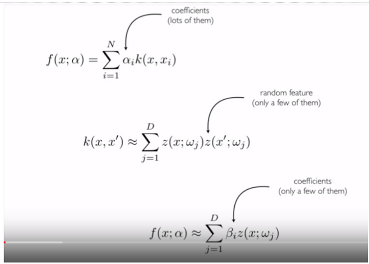

Normally when you train a kernel a machine on a data set, you slap one kernel on top of each data point and an associate of weights to each one of those kernels and you let your optimizers tune those weights to minimize the lots that are training there.

Here's the here's the observation in the paper

Most of the kernels people were using at the time can be approximated as a straight sum of the product random functions.

if you plug in that approximation in that first equation you get a linear combination of a straight sum which is just a linear combination but one with fewer coefficients to solve for and that's something the optimizes at the time could handle

The paper provided ways to approximately popular kernels as randomly like this and also provided guarantees about the quality of the approximation

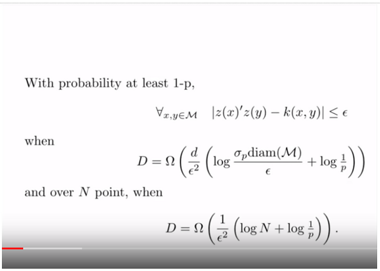

If you have a kernel, and you want to approximate it with such-and-such fidelity, here's how many random features you need

And in practice the method worked very well

Now we set out to provide a baseline for deep learning so they could compare against nonlinear methods but we can find any code to compare against - this was before machine learning was reproducible the way it is now

So we compared against what was reproducible at the time which was boosting and non accelerated kernel machines of various kinds

During our presentation at the the poster session we handed out this leaflet to showcase how easy it was to train large-scale kernel machines

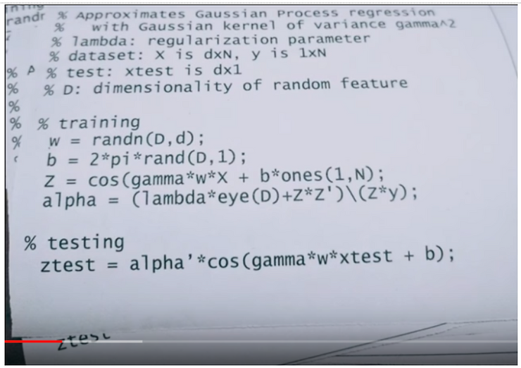

It's uh, "hey buddy you wanna you want to train a kernel machine here's just four lines of MATLAB code" a little bit of a guerilla marketing for for an algorithm

Now there's something a little shady about the story up and telling you

According to the bound I just showed you

and that bound is a fine bound

in order to approximate a kernel accurately with these random features you need tens of thousands of random features and yet in our experiments we were getting away with using just a few hundred features and getting good results

Even more strangely in some of our experiments our approximate method was producing lower test errors than the original kernel machine we were trying to approximate

It's always weird when the thing you're trying to approximate does worse than your approximation

This is relevant, because back in those days machine learning had just finished transitioning from what Sam Roweis used to call "an ideas conference" into something more... rigorous

During the poster sessions you could see this roving band of what I used to call the nips rigor police.They would come to your poster and make sure that your arguments were airtight I'm thinking of Nati Srebro, Ofer Dekel, some of Mike Jordan’s students, or if you’re unlucky, Shai Ben-David, and if you’re really unlucky, Manfred Warmuth.

But anyway, we decided to send the paper out as-is with this doggyness in it and braved the the nips rigor police - but to do right by them we eventually came up with an explanation for this phenomenon and I'll share it with you

Here's the algorithm without any of the kernel flim-flam, straight up:

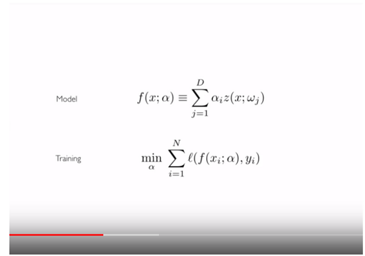

you just draw a bunch of functions, independently from your data set - you weight them and you tune those weights so that you get a low loss on your training data set okay

In the second paper we showed this, in the same way that Fourier basis

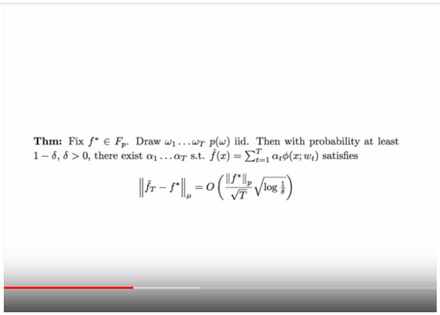

provide a dense base basis set for for an l2 ball of l2 functions

Or in the same way that three layer wide neural networks could approximate any smooth function arbitrarily well, so to do a bunch of randomly drawn smooth functions approximate densely a function in a Hilbert space arbitrarily well with high probability

So now you don't need to talk about kernels to justify these random features

They don't have to be eigenfunctions of any famous kernels, they're a legitimate basis for learning into themselves

In the third paper we finally derive generalization bounds for the algorithm I just showed you

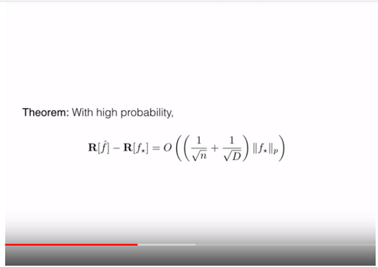

If you have a data set with this many points and you want to achieve this kind of test error on a data set here's how many random features you need

Now at the time - but by this point we were now just no longer thinking about kernels we'd legitimize using, taking a bunch of random kitchen sinks and combining them together and you don't need to justify that the approximate kernels in anyway, so it didn't really bother us if we were underperforming or over performing kernel machines or if we had to use fewer parameters or more parameters than a Kernel machine, we'd set out on this journey to provide a baseline for deep learning and we couldn't do it at the time

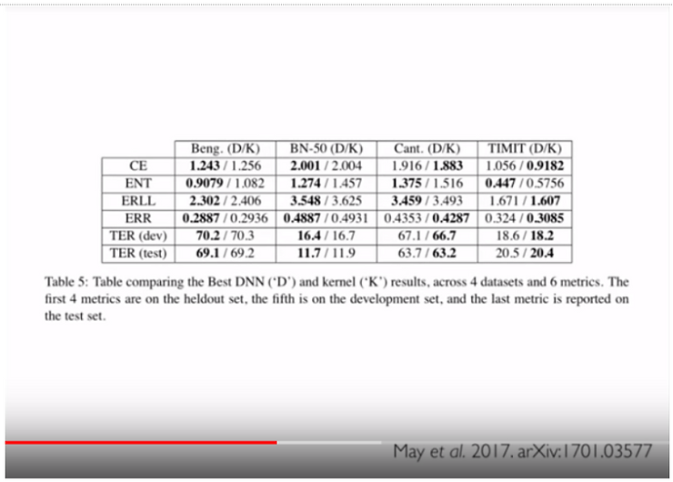

But since then the field has become much more reproducible and various folks have provided baselines in speech where random features are competitive with, with deep learning to this day

I myself still use random features at work, I'd like to get creative with the random functions I use and adapt them to the problem at hand

When they work well and I'm feeling good I say to myself, "Wow random features is so powerful - they cracked this dataset" or if I'm in a more somber mood I might say, "huh this problem wasn't hard at all, even random features cracked it"

It's the same way I think about nearest neighbors.

When nearest neighbors does well you can either marvel about the power of nearest neighbors or you might conclude that your problem wasn't hard to begin with

Both of these algorithms are good solid baselines and a way to get a diagnostic on your problem

It's not 2017 (he meant to say It’s now 2017) and the field has changed

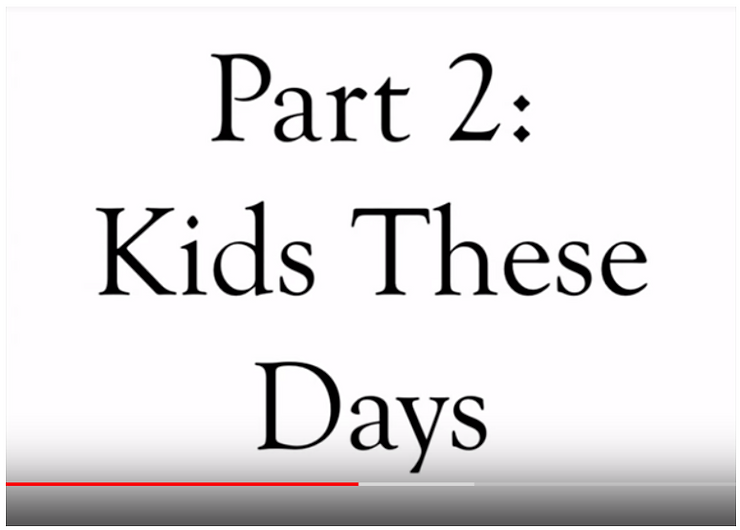

We've made incredible progress

We are now reproducible

We shared code freely and used common tasks benchmarks

We've also made incredible technological progress

self-driving cars seem to be around the corner

artificial intelligence tags photos, transcribes voicemails, translates documents, serves us ads billion-dollar companies are built on top of machine learning

In many ways we're way better off than we were 10 years ago

And in some ways we're worse off

There's a self-congratulatory feeling in the air

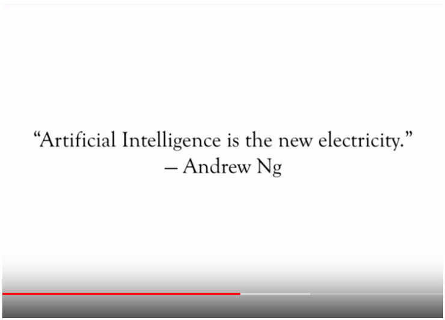

We say things like "machine learning is the new electricity"

I'd like to offer another analogy

Machine learning has become alchemy 12:09 in the YouTube

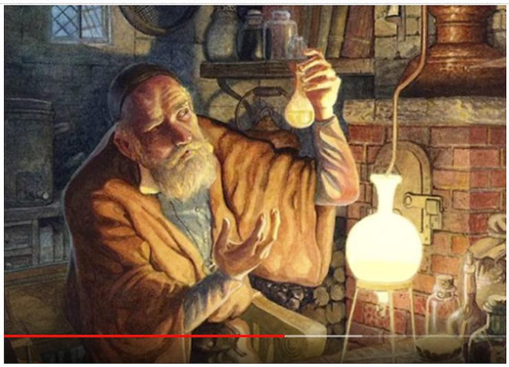

Now alchemy is okay

Alchemy is not bad

There is a place for alchemy

Alchemy "worked"

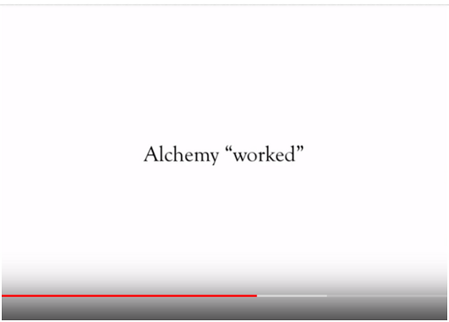

Alchemists invented metallurgy, ways to dye textiles, our modern glass making processes and medications

Then again alchemists also believed that could cure diseases with leeches and transmute base metals into gold

For the physics and chemistry of the 1700s to usher in the sea change in our understanding of the universe that we now experience, scientists had to dismantle 2,000 years worth of alchemical theories

If you're building photo-sharing systems alchemy is okay

But we're beyond that now

We're building systems that govern healthcare and mediate our Civic dialogue

We influence elections

I would like to live in a society whose systems are built on top of verifiable, rigorous, thorough knowledge and not on alchemy

As aggravating as the NIPS rigor police was

I miss them and I wish they'd come back

I'll give you examples of where this hurts us

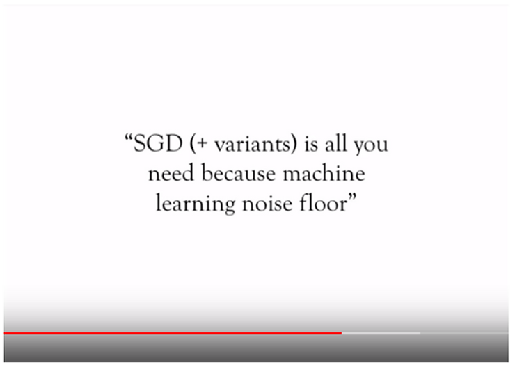

How many of you have devised the deep net from scratch architecture and all and trained it from the ground up and when it didn't work you felt bad about yourself like you did something wrong

Please raise your hand

This happens to me about every three months and let me tell you I don't think it's you, I don't think it's your fault.

I think it's gradient descents fault

I'll illustrate

I'm gonna take the simplest deep net I can think of

it's a two layer linear net, so identity activation functions

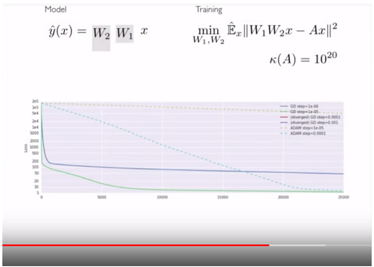

and the labels are badly conditioned linear function of the inputs

On the left is my model it's a product of two matrices that get taller and they just multiply the input and on the right is my loss function and this is the progress of gradient descent in a various variants of it

It looks like gradient descent goes really fast at the beginning and then it just seems to peter out

You might say this is a local minimum or a saddle point, but its not a local minimum, it's not a saddle point the gradient magnitudes are nowhere near zero

You might say it's hitting some statistical noise floor of the problem, that's not it either this is not a statistical noise floor, I can compute the expectation of the loss, run grading descent and get the same curve, this is not due to randomness

Here's what a better descent direction would do

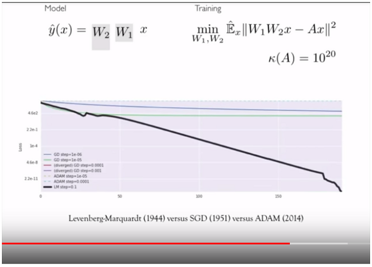

This is Levenberg-Marquardy, it gets down to zero loss it nails the solution a few hundred iterations, it gets to machine precision zero

If you haven't tried optimizing this problem please take 10 minutes on your laptop and just try it

This is our workhorse, this is what we're building models around

You might say this is a contrived problem, that badly conditions something, something has just seen the columns of this A matrix are are correlated that's the only weird thing about it - this is not a contrived problem

You might say gradient descent works just fine on more complicated larger networks

Two answers: first everybody you just raised their hands we'd probably disagree with you and second this is how we build knowledge we apply our tools on simple, easy to analyze setups, we learn and we work our way up in complexity

We seem to have just jumped our way up

This pain is real, here's an email that landed in my inbox just a month ago

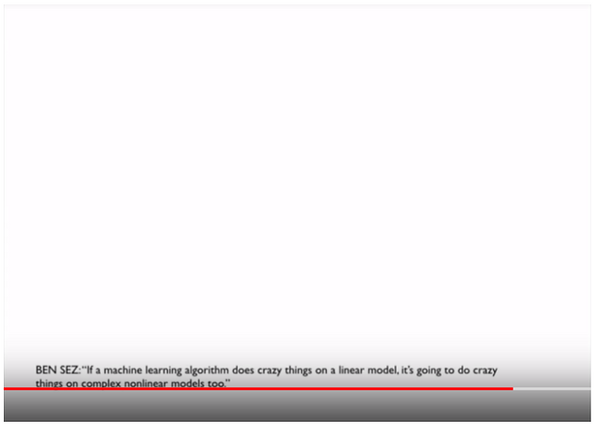

I'll read it out loud for you

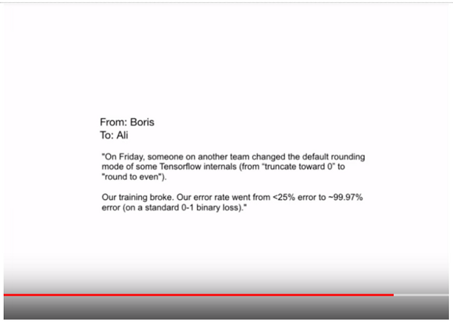

it's for my friend Boris

On Friday someone on another team changed the default rounding mode of some tensorflow internals from truncate toward zero to round to even

Our training broke, our error rate went from less than 25% error it's almost 99 percent error

I have several emails like this in my inbox and you can find similar reports on various boards on various bug reports

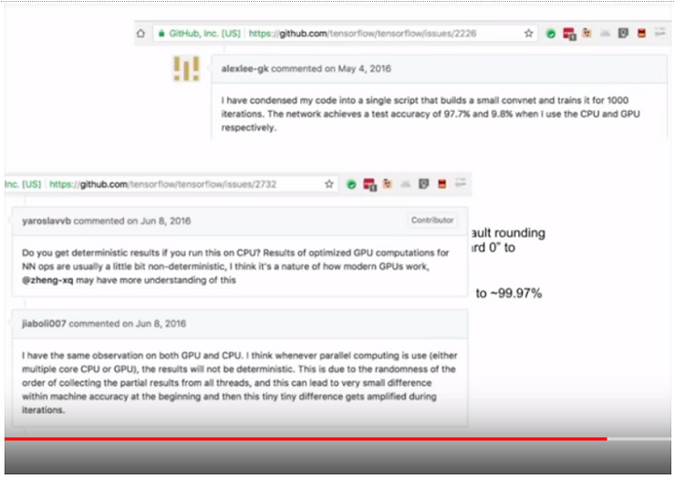

on the public internet

This is happening because we apply brittle optimization techniques to lost surfaces we don't understand

In our solution is to add more mystery to an already mysterious technical stack

Batch norm is a way to speed up gradient descent

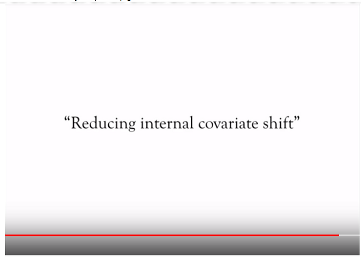

You insert Batch Norm between the layers of your deep net and gradient descent goes faster

Now I'm okay using technologies I don't understand

I got here on an airplane and I don't fully understand how airplanes work

But I take comfort knowing that there is an entire field of aeronautics dedicated to creating that understanding

Here is what we know about batch norm as a field

It works because it reduces internal covariant shift

Wouldn't you like to know why reducing internal covariant shift speeds up gradient descent

Wouldn't you like to see a theorem or an experiment

Wouldn't you like to know, wouldn't you like to see evidence that batch norm reduces internal covariant shift?

Wouldn't you like to know what internal covariant shift is?

Wouldn't you like to see a definition of it?

Batch Norm has become a foundational tool in how we build deep nets and yet as a field we know almost nothing about it

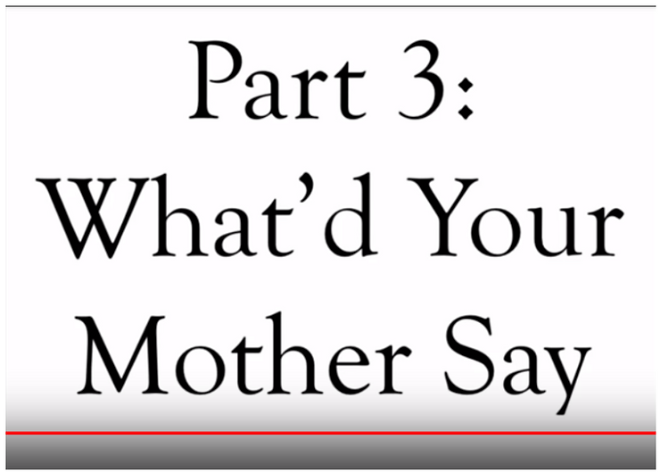

Machine learning is taking a new spot in society

If any of what I've been saying resonates with you, let me offer just two ways we can assume this new position responsibly

Think about in the past year the experiments you ran where you were jockeying for position on a leaderboard and trying out different techniques to see if they could give you an edge in performance

And now think about in the past year the experiments you ran where you were chasing down an explanation for a strange phenomenon you'd observed

You were trying to find the root cause for something weird

We do a lot of the former kind of experiments, we could use a lot more of the later

Simple experiments, simple theorems are the building blocks that help us understand more complicated systems

Here's a second, second thing we could do

Right now are mature computational engines that run on commodity hardware are all variants of gradient descent

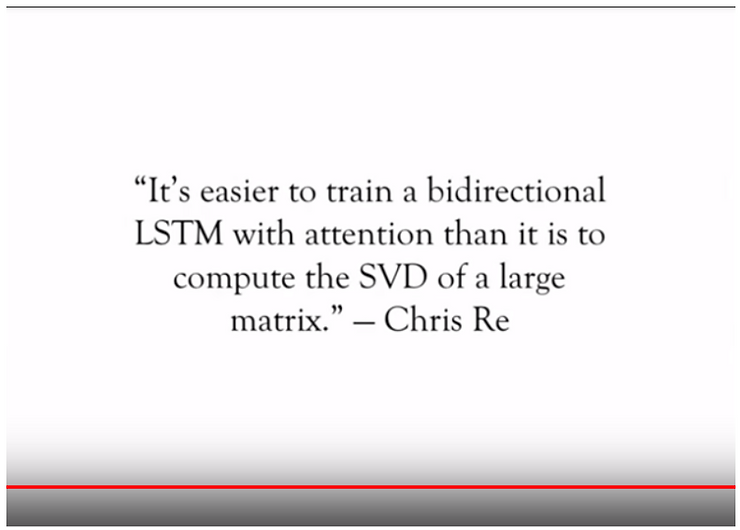

That's what we have that can handle tens of billions of variables

Imagine if we had linear system solvers or matrix factorization engines that could handle tens of billions of variables and operate on commodity hardware

Imagine the amazing kinds of optimization algorithms we could build

Imagine the incredible models we could experiment with

Of course it's a hard math problem and it's a hard system's problem, but this is exactly the group that can solve these problems

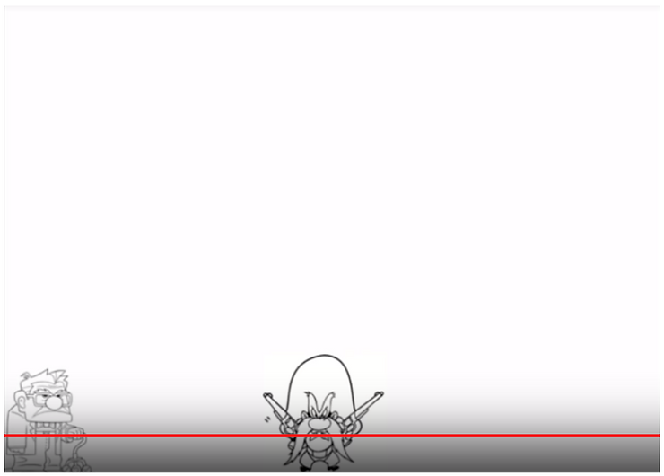

Over the years many of my dearest relationships that have emerged from this community

My affection and respect for this group are sincere and that's why I'm up here asking us to be more rigorous, less alchemical, better

Ben and I are grateful for the award and the opportunity to have gotten to know many of you and to work with many of you

And we would love it if we could work together to take machine learning from alchemy and into electricity

\[Applause\]

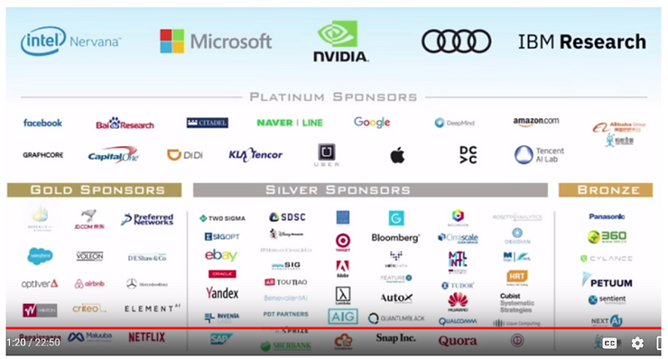

**Lady**

I thank you so much for this talk I hope that we'll be able to give you a new award in ten years from that from now for the return of the rigor in the next community. We have time for probably one question or two. Since we are since, since, we all just stunned by by them message here which we all appreciated so much I just want to invite Ben up here as well so I can hand you the official certificate for the Test of Time award.

\[Applause\]

**Man's Voice**

Here by it is the end of the test of time award and the program continues on I think there's a break now so we you Up next

**References**

-   Speech at \[[link](http://www.argmin.net/2017/12/05/kitchen-sinks/)\]
    
-   Transcript of the YouTube video at \[[link](http://www.youtube.com/watch?v=ORHFOnaEzPc)\], used YouTube's transcribe feature