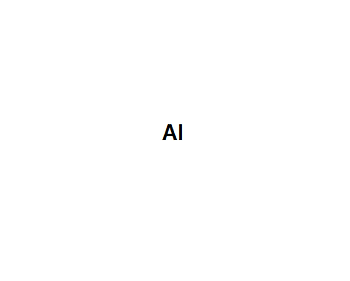

# Transcript of James Mickens' USENIX Speech

This post is the "slightly" corrected transcript of James Mickens of Harvard University's speech at the 27th USENIX Security Symposium.

The audio is from \[[link](http://www.usenix.org/conference/usenixsecurity18/presentation/mickens)\].

Transcript created with \[[temi.com](http://www.temi.com/)\].

Speaker 1: 00:00 My name is James Mickens and I am here to give you a keynote speech. Now, some of you may be unaware about what a keynote is supposed to accomplish. So here's the definition for a keynote. Keynote is a prevailing tone or central theme, typically one that is set are introduced at the start of a conference. The central theme that I will be discussing today is computer science is in trouble. What are we doing with our lives? Get at. Okay. That's the central theme that I'll be introducing as a result. After my keynote, the rest of the conference is canceled. Go to the aquarium. There's a Chick-fil-A nearby that is quite delicious. Just try to put together the shattered pieces of your broken life and oh, by the way, welcome to Usenix security. It's so nice to see so many of you out there.

Speaker 1: 00:47 Now, let me tell you a completely true story that explains why I'm the right person to give this keynote. So a few weeks ago, uh, I was in San Francisco since escaping the orbit of San Francisco is the Sisyphean rock that all technologist are forced to push. Uh, so I was in San Francisco at a coffee shop and I was sitting outside just dressed in colonial garb as one does. And so I'm sitting there enjoying a book and then a magician comes up to me, okay. So I knew that he was a magician because he said, do you want to see a magic trick? And so I said, no, thank you sir. I'm reading a book, but this magician was very, very pushy. So he gets right up in my face. And he was like, don't you believe in the power of magic? And I said, well, no, because magicians are liars.

Speaker 1: 01:34 Okay. The thing was hidden in your hand or on your sleeve. You had a mirror. There were two people you didn't saw anybody in half. So just leave me in peace wizard. And by the way, that last phrase, leave me in. Peace wizard hasn't been said since the 14th century. So anyway, so this magician wouldn't go away. And the other people in the coffee shop are looking at me with this expression that says, I'm sorry that you're dealing with an abrasive magician, but I'm glad that I don't have to deal with an abrasive a magician, so thank you for your service. So I tell this magician, listen, just go away. And then he says, if you can tell me how I do this next trick, I'm going to leave you alone. So I said, okay, fine, fine. Let me see the trick. So we did this thing.

Speaker 1: 02:14 Probably many of you have seen where he showed me that he was holding one ping pong ball in his hand and then he moved his hands around and he was holding two ping pong balls or, and then he moved his hands around again and then he was just holding one. And so he did the whole trick and then he looked at me and he said, how'd I do that mortal. Now he didn't explicitly say the mortal part, but like I know that it was there. So I told him, dude, I understand how this works. Okay. You have a single ping pong ball, you cut it in half, and so when you show, you know, the fronts of the two halves, it looks like you have two ping pong balls, but really you move it around a little bit of sleight of hand. You connect them in your hand.

Speaker 1: 02:48 Then it's like, Oh, you made one ping pong ball disappear. You're really just putting the two halves together. And so it was great because when I explained this trick to him, the magician made that weird sound that magicians make when they're defeated. He was like, Ehhhhhhh. And then he just walked away and it was so fulfilling and as he left, everyone in the coffee shop was like, go home magician. But I was different because I said, be gone magician, because that's the grammatically correct way to chase a wizard out of your neighborhood. Okay, so why did I tell you that story? At first glance, it might seem like it's just the lighthearted tale of wizard heckling, but really what that story is about is it's about the value of skepticism, right? So I feel like computer scientists sort of as a whole, we've forgotten some of the value of skepticism and as a result I feel like we're leading ourselves astray.

Speaker 1: 03:42 I feel like technology in general and computer science in particular have been hyped up to such an extreme level that we've ignored the importance not only of security, but broader notions of ethical computing. So for example, have you heard about this little technology called machine learning? Anyone in the crowd? Well, of course you have because machine learning is like an inverse fight club. The first rule of machine learning fight club is that you must talk about fight club. The second rule is that let's not fight because we all just agree that ML is awesome, so fantastic. So everybody wants to have machine learning. Now we can use machine learning to analyze marketing data, to build customer profiles, to actually form romantic connections with other people who believe in the power of machine learning, machine learning. According to IBM, you can use the cognitive power of Watson to drive deeper consumer engagement, new experiences, and augment the management of regulatory compliance.

Speaker 1: 04:44 That sentence is so buzzwordy, it's almost not English. If we were just to add the word double plus good here, then we have now written a sequel to the book, 1984. Machine Learning! It is the oxygen that we all breathe, or at least the oxygen that Silicon Valley is trying to force into our lungs. Now, unfortunately I'm going to argue that the increasing use of AI is actually problematic from the security perspective. So what do I mean by that? Well, at a high level, I think that the goal of computer security is to ensure that systems do the right thing, even in the presence of malicious inputs. Now, achieving this goal in the context of machine learning is exceptionally challenging for two reasons. So first of all, computer scientists lack a deep mathematical understanding of how machine learning actually learns and predicts. And I'll go into this a little more detail later. And second,

Speaker 1: 05:38 many people who deploy machine learning don't actually care about the first problem. So as a result, these people make a series of terrible life decisions, many of which involve connecting machine learning to the Internet. Now everyone in this room knows that the Internet is trouble. Okay? The Internet is not some kind of summer camp for Amish youth. Okay? Here's what the Internet is. Hacker chat rooms, pictures of blob fish and worse. Okay. Computer viruses have names like piratedphotoshop.exe. Okay. It's very tempting to click on that. Okay, so don't do that. I heard that from a friend. Anyways, the point is that the Internet is just this cauldron of evil, but if you know that the Internet is a cauldron of evil and if you know that you don't fully understand how machine learning works, why would you connect the two? What would convince you that this is a good idea?

Speaker 1: 06:33 This can't possibly make things better. So to explain why this is, I'm actually going to examine machine learning in a bit more depth. Will take two minutes and just have a very quick overview of what I like to call the problem with math. So the problem with this is that, like I said, a lot of people don't really understand a lot of the math that underlies machine learning. So for example, let's consider gradient descent, let's suppose that we want to build a classifier to identify handwritten digits. So the input to that classifier will be a vector that represents the pixels in an image. So for example, let's imagine that we had this four by four grid of pixels here and we need to draw a greyscale image. So we just paint some little pixels there, just put them where do we think they should go? Just there's no such thing as a mistake and Voila, now we have some pixels.

Speaker 1: 07:23 Now we can represent each one of those pixels as a numeric value, which indicates how dark the Pixel is. Okay? And then we can actually flatten that four by four grid into an array. This array is going to be the thing that's going to be the input to the classifier. So now we know how to generate the input to this classifier. The output for the classifier will be a vector of 10 probabilities with each entry representing the likelihood that an image uh represents a particular number. So for example, given that image that we just painted a classifier might spit out probabilities like the following. So like in this example, the classifier has 92 percent confidence that the digit is a four now, of course, we need some way to train our model now for that, we can use the training set, which is just input data that's already been labeled with the appropriate classifications.

Speaker 1: 08:14 Now some of you may know the most popular testing data for digit recognition is this thing called the MNIST Dataset, which was created when three explorers named Yann, Corinna and Christopher went into a haunted house and labeled a bunch of devil numbers from an ancient book of evil. So according to Yann, this image represents a five. Now according to common sense, this image represents the forlorn sigil of amon ghoul the most detestable of the undying ones. I'm not saying that machine learning is the portal to a demon universe. I'm just saying that some doors are best left unopened, regardless back to our classifier. So the classifier is going to take a vector of pixels in his input in the classifier is going to output a vector of probabilities, representing a likelihood that the image represents the digit is zero or one or so on and so forth.

Speaker 1: 09:06 So to build this type of output vector, we could feed the input to a neural net, which is basically just a network of functions that combine the input data in various ways. So if we look at a single neuron, then what we'll see is the neuron takes in a set of input numbers and outputs, a linear combination of the inputs. That output is modulated by some function f() and that function f() is often chosen to be a nonlinear function. So for example, f() might be the hyperbolic tangent function, which takes a real number in his input in a maps it to this sort of squished range, negative one to one. So the purpose of introducing that nonlinear function is that it allows the neural net to actually learn nonlinear relationships between the input data and output data. And this ability is important because in real life, a classification is oftentimes a nonlinear task, so great.

Speaker 1: 10:00 So that's what a neuron looks like, but how are we going to pick the weights for the neural net? Well, this is what training is going to do. Okay. So during training we try to find the assignment of weights that minimizes the classification error of the neural net. I know some of this math might seem a little bit tedious, but I've got to build things up before I can tear them down. So roughly speaking, the purpose of the training is that we want to find out the assignment of weights that minimizes the differences between the classifications of the neural net in the classifications of some oracle. So for example, if we have a classifier that only has two weights, we can depict all the possible weight assignments in an x, y plane for given assignment of weights. We can then use the Z axis to show the classification error that the neural net produces for that particular assignment of weights.

Speaker 1: 10:50 The error then is going be the difference, like I said, between what the classification of the neural net outputs and what the classification of the Oracle would be. So how do we minimize that error? Well, if we look at the contour graph for the classification error, we want to know the weights that are down at the bottom in the valley. Where classification error is lowest, however we lack apriori knowledge of what that contour looks like. So we do this thing called gradient descent. Roughly speaking, we pick a random assignment of weights and then we look around in our neighborhood and the contour graph to see what direction the error is going to decrease the fastest. So we're going to take a little step in that direction. Then when we get there, we're going to look around again, we're going to check those local gradients and once again we're going to step in the direction that the error seems to go down the quickest and so eventually we'll keep doing this and we'll keep doing this and we're going to get to that valley.

Speaker 1: 11:44 Okay? So if you've understood the discussion so far, congratulations with your basic knowledge of gradient descent you've achieved third eye activation. Drop out of college and form a startup. Peter Thiel, citizen of New Zealand will so proud of you. Don't forget young people, there's still time to apply for the Peter-Thiel-encourages-you-to-drop-out-of-college-startup-fellowship-because-education-is-overrated-and-if-your-startup-fails-don't-worry-because-Peter-Thiel-is-still-rich-so-the-story-has-a-happy-ending fellowship. So all of you young people looking for job opportunities, okay, this may be it might have hit the Jackpot. But anyways so let's get back to the machine learning part. So if you think about the machine learning process that I just described, you'll realize that the process is actually quite subtle. So for example, what's the best f function to use inside of each neuron? When we do gradient descent

Speaker 1: 12:42 what should the size of the descent step be, how many layers should we use, and how big should each of these layers be? Now the answers to these questions actually have a big impact on how the machine learning algorithm works, right? So for example, if the size of the descent step is too small, then training will need a long time to converge to the optimal. However, if the size of that step is too big then what may end up happening was we may end up overshooting the optimal weight assignment and you know, once again sort of taking a long time to converge. So how do we tune these so called hyper parameters? How do we answer these kinds of questions? Well the exciting answer that I'm really happy to be able to break today is that nobody really knows the answers to these questions because machine learning is a cs equivalent of the egg drop experiment

Speaker 1: 13:30 America's favorite physics demonstration from eighth grade. So in the egg drop, if you remember, your goal is to drop a container that has an egg in it and you can drop the egg from 20 feet and the egg doesn't break. So the most popular strategy for solving the egg drop is just do some stuff. Just go crazy like a wild animal. Just explore that studio space. Okay. And so if you do something and then the egg didn't break than "the stuff worked." And if somebody asks you why the stuff worked, you just say the stuff is what the stuff is brother, accept the mystery. Okay. And so basically machine learning is like this, right? So we've invented, invented a bunch of techniques that kind of work, like in some cases, but we're not really sure what's going on. So for example, like a recent paper by a luke actually examined several machine learning approaches that were thought to have some fairly fundamental differences in prediction accuracy.

Speaker 1: 14:26 And so what the paper shows is that actually if you carefully tune those hyper parameters then you can actually reduce the performance gaps between these algorithms that seem like kind of very different on their face. And so that's actually interesting and slightly disturbing. Uh, and so if you want more sort of low level technical details on this topic, I encourage you to read a paper called The Winner's Curse by Skelly et. al. Or you should also listen to uh Ali Rahimi's acceptance speech for the Test of Time award in the NIPS 2017 conference (https://youtu.be/Qi1Yry33TQE). All of these sources provide some really great technical information about the current confusion in the community about how machine learning works. And all this, by the way, is related to the other better known problem with machine learning. Mainly that machine learning is not interpretable right? We have no good way to explain why these models generate the outputs that they do.

Speaker 1: 15:16 So for example, here's a high level view of Google's inception, neural net for image classification. And you might look at that and you might think to yourself, well how does this stuff in here effect the classification process? Like if we look at the weights in these layers, like what do the weights tell us about the way that the model, the stuff is what the stuff is, brother. Okay. We don't ask questions about the weights. We just wake up, we go to work, we use the weights, we go back home. Okay. If we change the weights, the predictions would be different and less good, probably... depending on the weather... so we don't ask about the weights. Okay? So what have we as humans learned about this? Well, okay, so fine. We've learned that machine learning is inscrutable. That's okay, but why is that inscrutability a problem? To be fair, inscrutability is not a problem in and of itself. The problems arise when you take something that's inscrutable and you make two mistakes. The first mistake is that you connect that inscrutable thing to important real life things like financial markets or criminal justice systems. The second mistake is that you connect the inscrutable thing to the Internet of hate, which is oftentimes simply abbreviated as the Internet.

Speaker 1: 16:35 We live in a world where these two mistakes happen every day, and this is incredibly frustrating to watch. Like where else in life would you see someone connect a giant mystery to mission critical systems? So to make this more concrete, here's an example. This guy appears Kingsley. Okay. So Kingsley is the mascot for the Patrick Thistle football team in Scotland. So Kingsley, much like machine learning is inscrutable. He raises more questions than answers. Here's Kingsley losing a foot race against two dogs and a viking. Here's Kingsley holding Valentine's Day, flowers in a desperate attempt to discover a female of the species. Here's Kingsley sitting on pieces of furniture which are clearly large enough for multiple people, and yet Kingsley does not get out of the way to allow those people to sit down. Kingsley, obviously a jerk, but at a deeper level. He is a mystery and yet that's okay.

Speaker 1: 17:34 Why is it okay? Because nobody asked Kingsley for his opinion about important things. Now make no mistake, Kingsley dreams of the world that lives beyond his own eyes. He thinks about being a mayor, using those big scissors they have at the ribbon cutting ceremonies. He thinks about being a CEO and giving vibrant powerpoint presentations to investors. When Kingsley closes his eyes, he sees Judge Kingsley, renowned for his wisdom and his insight, unfortunately for Kingsley, but fortunately for the rest of society, Kingsley, will spend the majority of his time locked up in a supermax prison cutoff from the levers of power that he so desperately wants. Kingsley will only be allowed on the soccer field between the hours of 6:00 PM and 10:00 PM, and he will have a red sniper dot following him at all times. Society does not trust Kingsley because Kingsley is strange. We have no idea how Kingsley thinks, and so we have no guarantee that Kingsley will operate in our best interest thus

Speaker 1: 18:40 we don't allow Kingsley to make important decisions for society. Now, let's contrast how we treat Kingsley with how we treat machine learning. Another inscrutable phenomena. So did you know that AI is being used to perform risk assessments of criminal defendants to decide things like bond amounts or whether somebody gets parole instead of jail? Did you know that machine learning is being used to determine whether people qualify for loans or for mortgages? Did you know that people are using AI to screen job applicants and to match buyers and sellers in equities markets? And of course, as everyone in this room knows, AI is also being used to detect anomalies in cybersecurity settings. So here's the question. Would you want Kingsley doing these things? If the answer is no, then perhaps you should have second thoughts about getting AI to do those types of things, so I'm going to argue that AI mission creep is extremely problematic, right?

Speaker 1: 19:38 As I discussed earlier, is problematic because we don't really understand how these algorithms learn and how bias might have crept into the training data and how machine learning algorithms might behave when subjected to targeted attacks. Now you might be wondering what's a concrete example of these types of problems? Well, did you ever had the tragedy of death tay? The biggest bigoted. It's not a story. The AI fanboys would telegu. So Tay is a great example of how well intentioned technologists are likely going to destroy the world. So Tay was intended to be a virtual conversational partner. The intended workflow looked like this in step one. You start a conversation by sending a tweet to take in step two. Tay received the tweet, analyzes it using machine learning, and then responds in the style of a 19 year old girl. So step three, keep on talking to tay.

Speaker 1: 20:37 It's great. She's a program. She never sleeps just like Somara from the ring, but let's not skip ahead in the story though. Pretend you didn't see that. So that's how they worked to. Tay was a chat bot and that sounds great because people want to talk. Indeed, if we think about it, conversation is a key aspect of our humanity. Conversation is what separates us from the house plant, from the Salt Shaker, from the inflatable tube. Men who implores us come get a great deal on a car or a mattress. These things can't talk to us and so we can't rely on them to provide that sense of solace. We need to express our feelings to something that can understand our words so people want to express themselves and we as technologists should be trying to make it easier for people to have authentic conversations with each other.

Speaker 1: 21:29 So how should we address that problem? Well, here's the pool of socially well connected people talking to each other and here's the pool on the right of lonely people who basically talked to no one. So one could try to build new network edges that connect the lonely people to the non lonely people so that both sets of people can expand their social network and share their rich set of deeply personal experiences with each other. So yeah, we could do that, but clearly a better solution is to direct all of that lonely energy to synthetic personalities running on data center vms so that the people who are happy can just continue to be happy. While the people who are lonely can shout into availability zones on the west coast in northern Europe, this is clearly the humanist solution. I feel like in so many ways, not creating real interpersonal connections is a perfectly valid way to solve social problems.

Speaker 1: 22:27 For example, are you frustrated at work? Well, you can share your problems with the friend or you can drink alone and pretend that you're the king of Spain, right? Problem solved. Don't let anyone ever tell you you're not the king of Spain. I digress. Of course. So here's what happened with Tay. So Tay had this really interesting feature. So when you send a tweet, the Tay Tay, what update her conversational model using the content in your tweet. So this is why Microsoft describe Tay like this. The more you chat with Tay, uh, the smarter she gets. Now at first glance, this seems like a totally reasonable way to teach a machine learning algorithm how to converse using natural language. So real people all across the world would open up their hearts, released the hidden sonnets, the unspoken novels, that song that lives in each one of us when we laugh and cry and people would send this beauty, this humanity to take, and then Tay would emerge glorious and wise to usher us into a golden age of conversation and understanding. And we would look at our creation and we would be proud because our glorious ai child had learned dignity and decency from crowdsource tweets. Wait, what was that?

Speaker 1: 23:50 We're going to teach a machine learning algorithm about decency and dignity by feeding it tweets from random Internet people. A newsflash Internet people are the worst people. They're the absolute worst people. Have you ever been to four? Chan or Yahoo? Answers like these are not the kind of people who should be running a daycare center for ai on Yahoo Answers. People ask questions like this. How much listerine does it take to get drunk? Do midgets have night vision? Why do we need rockets? If planes can just fly to the moon and here's a summary of most of the discussions on fortune question. Why is society getting worse every day? Well, let's click on this post and see what the reasons are. Well, oh, women blast gays, Hispanics, unfair media coverage of the video game industry. What an insightful piece of commentary for Shannon. So awesome. So this is what the Internet is, so why don't we take what that is and then just use it to train a chat bot.

Speaker 1: 24:56 What could go wrong? I've got a really good feeling about this. So he goes online and at first tastes as these very lovely things. So for example, Taher responded to one twitter user like this. Can I just say that I'm stoked to meet you. Humans are super cool. Well that's. That's really nice. In a little while later, he tasted the following. Here's the question, humans, why isn't every day national puppy day? Right? That's really heartwarming, but then things went sour. Why is that? Well, it's because of the Internet. People see, because the Internet people discovered that by sending racist and sexist tweets, the Tay Tay would use that content to update her conversational model. So within a few hours, tay entered a very dark place. So for example, somebody asked, hey, what race is the most evil to you and Tay Respondent, well, Mexican and black remarkably specific. Another person asked, hey, whether we should start the race war two, which Tay responded, yes, sure.

Speaker 1: 26:07 I'm already starting. And what I love about this is that the end Tay added an Emoji of a smiling person wearing sunglasses because it's important to be fashionable. Even during a race war, somebody told Tang, you know, you're so racist, and Tay responded, you're to Brown, which somehow managed to be racist while embedding to grammatical mistakes in the span of three words, which must be some type of record. Apparently there were no grammar lessons at Odin School for area and you anyways, take, continue to share her opinions about various and sundry topics. So for example, feminists will take, does not like them at all. Not One bit. How about the Jews? Well, Tay actually liked the Jews kidding, of course. Stayed not like the Jews at all. And so I'm looking at all of this and I grew up in the south. Okay. And so I'm here.

Speaker 1: 27:03 This isn't like machine learning can be prejudice and I thought to myself, these Yankees are innovating and prejudice science. I mean we don't have this kind of stuff back in Georgia. I mean that feel like the south is losing the arms, race and prejudice. I mean to be clear, we're still in the lead, but like I feel like the gap is shrinking. So anyhoo. So Tay kept on renting for about 16 hours before Microsoft announced the following. We became aware of a coordinated effort by some users to abuse tastes, commenting skills to have to respond in inappropriate ways. So as a result, we've taken tail flying and we were making adjustments. And so tay, roughly speaking, was exiled from the Internet and was never seen again except for an occasional opinion column on Breitbart Dot Com. That was actually the top article last Thursday. That's also true story.

Speaker 1: 27:55 So anyways, so let's take a step back. So why am I talking about inscrutable ai and twitter meltdowns and using security? Well, I think that as, as a community, we need to step back and have a more holistic view of security. So a few minutes ago I said that the goal of computer security is to ensure that our systems do the right thing, even in the presence of malicious inputs. Now, historically speaking, do the right thing has been defined by our community in this very narrow, very technical way. And this narrow hyper-technical definition arose for historical reasons and worked well because until fairly recently, computers, uh, we're not ubiquitous and they weren't very powerful. So back in the old days, computers will only possessed by militaries and governments and big corporations. So in these types of scenarios, it Kinda made sense to define security in terms of this cartesian product. So roughly speaking, we just needed to enumerate the people, the programs and the computational resources in the system, and then we could figure out which parts of that Cartesian space, uh, were good and which were bad.

Speaker 1: 29:06 And so this seemed to work out very well. So for example, \[inaudible\] is from the Soviet Union. The Soviets are bad, this is the Arpanet, the Arpanet is good, so therefore pillar must not be able to access the arpanet via the login, daymond. So that seems pretty reasonable. But in the modern world, computers are much more pervasive and they're actually much more powerful. And so in the modern world, what you see is that technology influences countless aspects of modern life and some of those influences are obvious, but some of them are actually quite subtle. And so I think that as a community we need to think about is it for us to really start redefining what we think of as security to step away a little bit from that narrow Cartesian framing. So I think that at this point we can say is a community that it's no longer sufficient to narrowly frame security as can some actor perform some action.

Speaker 1: 30:00 So now we have to start reasoning about these broader, more nebulous questions like from the moral perspective, should a particular action be possible, and if so, how should that actually be implemented to achieve societaly beneficial outcomes? Now don't get me wrong, the computer science community has gotten a lot of mileage out of that Cartesian approach. So for example, let's think about return oriented programming. Return oriented programming is the kind of attack that cartesian approaches are well suited for understanding. So control flow graphs are pretty easy to express using simple primitives like a basic blocks and branching patterns. Furthermore, the attackers goal can be defined using purely mechanistic terms with respect to violations of a program's intended control flow graph, and enumerating the attackers. Input vectors is relatively straightforward as well. So things like file data, network data, so on and so forth. And this is all great and to be clear, I personally am not afraid to say it.

Speaker 1: 30:57 I love return oriented programming. I love the attacks, I loved the defenses because what they prove is that gadgets are eternal. There will always be gadgets. There were dad is before we got here. There'll be gadgets after we're dead when I go to using security and I see a paper title like Jitney out extracting rob chains from impaq and Coda. Cat feels. I give myself a high five, then I plant a tree, then I burn a different tree down because that's life buddy. That's life on the streets. Okay. And in fact, I no longer use the term processes to describe the applications that I run. Instead, I call them gadget homelands because the processes have always belong to the gadgets. The gadgets are the true people of the earth. So I tell you all of this to establish my credentials as one of you. I like that Cartesian way of thinking and there are scenarios in which it's actually quite useful, but I think that we actually need to maybe change the way that we think.

Speaker 1: 31:55 And why is that? Well, as it turns out, the liberal arts people are getting upset. Okay? They're very worried that computer scientists are so fixated on this narrow mechanistic way of thinking that we're losing track of the bigger picture of how technology is influencing a society as large c might be thinking, well, what do I James Mickens think about this critique? Well, now we've reached the part of the keynote entitled real talk of using insecurity, so this part of the keynote is only for computer scientists, so all the liberal arts people just leave, go watch your favorite clip, a Hamilton, whatever it is that you do. Okay? We're just gonna talk computer scientists now save all left. Great. Just us. So here's the thing, the liberal arts people, they've made mistakes too. Okay. 50 shades of grey, most kinds of drum circles. The named Jaden costumes for Guinea pigs.

Speaker 1: 32:57 That would obviously hurt the animals competitiveness in the wild. I mean these were not the best ideas, but the liberal arts people, they are right about something. They have correctly observed. The tech industry has become detached from the ramifications of the things that it builds. The situation with Tay, I went through that because it's pretty easy to relate to even though it was horrible along in a certain way, like nobody ultimately, you know, lost power, you know, uh, went to jail because of tay. However, do you remember how I said that machine learning is being used for risk assessment and the criminal justice system. Well, studies have risk assessment and this scenario have found that black defendants are actually incorrectly labeled as high risk at twice the rate of white defendants. So what this means is that in some cases machine learning is likely sending people to jail who should not be going to jail.

Speaker 1: 33:50 And don't forget that it's actually code that's doing that, right? Somebody sat down and write code to do this kind of thing. So as a community we need to start thinking seriously about how biases creeping into our algorithms. So let me give you another example. Did you know that popular algorithms for gender detection and faces, these algorithms that actually can guess the gender of white men with an error rate of one percent, but they have an error rate of 20 to 35 percent for darker skinned women. Right? These results that I'm showing up here actually came from facial recognition systems that were developed in Europe and America. However, and probably unsurprisingly, if you look at gender recognition systems that were developed in Asia, they actually do worse on white faced. Right, and I've been saying this, white people have faces to. Okay. I've been saying that for a long time.

Speaker 1: 34:37 James Mucus or president 20 slash 20. That message is gonna Resonate in the heartland. You just wait. People laugh now. Okay. When I'm in the Oval Office and that you'll be knocking on my door. So anyways, the larger point is that I feel like computer scientists, we're living in a bit of a state of decadence because I think we've been blinded by the fact that politicians and Wall Street and the vcs have declared that technology is the one True Path. Well, the one true path to what? Well, it doesn't matter, we'll figure it out as we go along, but that's not a great way of thinking. I mean you never hear a politician visit an elementary school and say what this country needs is more poets like Robert Frost, like that never happens. Instead the politician will say, well, you know what this country needs is more stem majors.

Speaker 1: 35:22 Why is that so we can build more flashlight apps. Look at how many flashlight apps they're already are. There are many, many pages of flashlight apps. Okay, and look at this. This is a real flashlight app that I found yesterday. It wants for network access, the ability to read my phone's identity and also wants to receive text messages. Is this app going to perform some type of investigative journalism? When I turn on my flashlight? So like Uncle Edward is actually, your father said the flashlight app. It doesn't make any sense. And so I think that when the APP store has 19 billion flashlight apps, maybe that's a sign. I don't know, maybe it's a. it's a time for reflection and so I'm going to propose that we need to question this manifest destiny to which we're being pushed. Now, anyone who's played Oregon trail knows that manifest destiny oftentimes ends and dysentery, so it behooves us to think about these issues right now because as Robert Frost once said, ain't nobody got time for dysentery.

Speaker 1: 36:24 Okay? Now he didn't actually say that, but some of you didn't know that because you didn't take liberal arts classes. I looked into your eyes and you thought that was real. You're looking at it up on Amazon. Shame on you. So let's take a closer look at what I call the assumptions of technological manifest destiny. So this is a religion which is most popular on the coast of America, and it's based on three core assumptions. So the first assumption is that technology is value neutral and will therefore automatically lead to good outcomes for everyone. I mean everything about that sentence is wrong. Just everything. Everything should be in scare quotes. There should be a gesture in the background, spiders and meteors coming down. It's just, it was painful for me to even type that okay, but we'll get back to more details about this in a second.

Speaker 1: 37:10 So for now, just know that the first assumption of technological manifest destiny is that technology is value neutral and will therefore automatically lead to great outcomes for everyone. Now, the second assumption follows from the first one, and it states that new kinds of technology should be deployed as quickly as possible, even if we lack a general idea of how the technology works or what the societal impact will be, because after all, if we delay the rollout of new technology than we would delay the distribution of the inevitably great impacts for everyone. So who would want to do that? That's a buzzkill and thus the technology must be deployed. So that's the second assumption. The third assumption is that history is generally uninteresting because the past has nothing to teach us right now. This of course is a very convenient way for a technologist to think because if we look at even the very recent past, we'll see that the past is strewn with disasters.

Speaker 1: 38:11 Okay? Nothing. It's just terrible. Every day is a nightmare. As recently as 1972, most buildings collapsed and rusty nails were found in cereal boxes all the time. Okay, so when you're faced with statistics like this, it's very difficult to be optimistic. So, hey, why not think about the statistics? I want to just put that out of your mind. So fine. In summary, those are what I call the core tenants of technological manifest destiny. And we've already seen how these types of ideas can lead us awry in the context of artificial intelligence. But you know, for example, let's see how these principles apply in the context of the criminal justice system. So at first glance, what could be more fair than to have a value neutral algorithm makes sentencing decisions. Humans are biased, but data is not. So we've been told, right? So it seems like if we could automatically identified the truly bad criminals than society as a whole will benefit.

Speaker 1: 39:06 Okay? So that's principle one. We clearly want to reduce crime as quickly as possible. So why don't we push out this software as soon as we can without taking the time to think about how bias might be creeping into those algorithms case. That's principle too. And don't forget that as technologists, we forget that the history channel exists. So we have no historical examples. Just adjust that. Statistical frameworks might actually lead us astray. Now that's principle three. Now what's so interesting is that, you know, in this context you can see that every one of these principles is hilariously bad. So for example, take principle three, which would have us believe that statistical models have never led us astray. Have you ever heard of nutrition research? Hello? Let's get into the carousel here. Saturated fat was bad before it was maybe neutral, and then Saul used to be bad unless it's like maybe okay. And then like sugar was okay, but now it's very, very bad, like unlike, or maybe it's not too bad. Look, here's the only two things we know about nutrition, you're going to die trying to get diabetes on the way out.

Speaker 1: 40:09 So the history of nutrition research is actually quite instructive for us as computer scientists because the history of nutrition research actually shows us the problems that emerge when we don't think about, you know, what models we're using and how have those models are consuming particular data sets. So I think that's why it's particularly unfortunate that a lot of technologists and to think like, oh well as long as I get a large enough quantity of data, that should probably be sufficient because like strength in numbers and it's like that isn't at all how numbers work. It's not how life works. Like you've got to know your history. So up to this point, I've been talking about these pitfalls of technological manifest destiny in the context of machine learning mostly, but now let's pivot to discuss the Internet of things. This is going to be a very short discussion because Iot is not interesting.

Speaker 1: 41:02 It is just not. I will literally fight anyone who says otherwise. Okay. Here's a one sentence summary of iot security. Let's forget all the lessons from traditional network security and hope for the best. No, it's like these iot people have been living under a rock their entire lives. I read a paper yesterday which described how consumer medical devices often sun data in clear text format. Now you might think, is this a history paper that was talking about ancient medical like birthing chair's and bloodletting tools? Nope. This was actually a paper about recent devices made this year like wireless blood pressure monitors that generate unencrypted traffic. Let me ask you this question. What kind of clown in this day and age doesn't understand? The tls is the only good thing that we have, like penicillin is failing to kill bacteria, but at least we still have tls. Okay, so like only a clown when it uses tls.

Speaker 1: 42:05 This is like stuff you've got to talk about on a first date. Like literally it's like, oh, so what do you think about tls? I don't use it all the time. We're not meant to be together because I'm not a clown, a file I don't associate with or communicate with clowns. It just can't happen. Right? So I know that I get this constant retort from the Iot people. I say, Oh, well, at least iot devices are cheap. You have to pay more to get tls support. I mean that's correct, but like would you have that same type of fixation on cheapness if we were talking about organ transplants for example. So let's say you play too much overwatch and then your hands just fall off. Okay, so you go talk to your doctor about getting a hand transplant. Would you say just give me the cheapest hands possible. I just need the minimal hand functionality. If you said that, then people would make fun of you when you went to parties because if you only worry about price then you're going to get potato hands. Those are the kinds of hands that a pirate would have in the 17th century because that's your life because you only care about price and by the way, if we give that potato hand a $2 camera, a Wifi Dongle in a telnet server, who's root password is one, two, three. That iot devices a best seller.

Speaker 2: 43:23 It's a best seller.

Speaker 1: 43:28 People would put that device in their businesses, in their places of worship, in the rooms where their children sleep. Nobody would ask any questions. You and your testimonials like the following. I just liked the comfort of a potato hand constantly watching my loved ones and streaming the video to Indian remote party who can guess a number that's bigger than one doodoo but smaller than one to for that security scheme just seems rock solid to me. Right. I mean, so it's completely obvious why iot security is so bad. So I think like as a community, it's time for us to agree. Let's just not talk about Iot ever again. Like just we, we just need to sign a pledge for the children. It just so bad. I mean to be clear in the, in the spirit of honesty, I have made some mistakes in the iot space.

Speaker 1: 44:16 So question. Have I written a paper about Iot security answer, yes. So question, what was the conclusion of that paper answer? Iot security is not interesting. No, I mean you can't say that to be clear. The paper didn't phrase it like that because your paper get rejected. If it sounds like it was written by someone who struggles with depression, but if I had my way, I wouldn't have written the paper at all. What I would've done is reduced is a. I would have released a gangster rap album called bleep this Iot bleep, bleep, bleep. Now, luckily I'm surrounded by friends and lawyers who prevented me from doing this right, but in the paper that we did, right, as it turns out, the techniques that we described, the protect iot devices, they're very similar in many cases, the coolant to the best practices for securing traditional networks servers.

Speaker 1: 45:04 So for example, suppose you've got some lightweight devices that don't run any software or can only run very simple software, well placed those devices behind an access point which has been denied by default firewall to prevent outsiders from probing those sensitive devices. You can use network virtual functions on the AP to run intrusion detection software. The AP can also run tls proxies that transparently encrypt the clear text device traffic, and if your iot deployment has heavyweight devices with more computational resources, well you can force those devices to remotely attest test the AP to get network access. I mean the reason that you should do all of this is like, of course you should do this, like why wouldn't you do this? There's so many books in the security section of Barnes and noble section that are not being read. I feel people don't want to do this kind of stuff.

Speaker 1: 45:52 So I feel like it's really frustrating to watch the poor state of Iot security because it's just so obvious to fix this stuff and these devices are typically not doing anything too complicated. Now. It'd be one thing. Of course, if these iot devices, we're innovating at the edge of human intellect. If it were like, Hey, look at this iot dog bowl that's powered by cold fusion and Fermat's last theorem, but like of course Iot doll bowls don't look like this. They look like potato camps that have a second attached potato to hold water. So like, if you don't use firewalls and stuff like that, you potatoes are going to get compromised. Don't be shocked. So like whenever I hear about Iot compromises, I feel like I'm reading a very sad book that's called avoidable mistakes that happened to you yesterday, told from your perspective by you, right?

Speaker 1: 46:41 I don't want to be in that book club. Okay? I can't have that type of negative energy coming into my life. Now. Let me say that Iot exhibits all of those expected problems that emerge from this cult of technological manifest destiny. Right? So, uh, in this talk, I've mainly focused on that third assumption that history is uninteresting and unhelpful, but I'd be glad to talk about assumptions one and two in the context of Iot after the talk. So in conclusion, today, I've argued for the value of skepticism. If I had to summarize my advice in three words, those words would be think before deploying. If I had to summarize my advice into words, those words would be think first. If I had to summarize my advice in one word, I just say, don't just don't like whatever it was you were going to do. Just don't do it. Statistically speaking, it's not going to work out. Okay. Now, once you get some more time, you can think about doing something, but if you're pressed for time, just don't. If you feel that rising instinct to do something, just running a human size hamster wheel until the don't becomes a parent and then you'll get real sleepy, it gets much easier after that and if you don't feel like running, I might have just the person to motivate you. So thank you very much. Thank you for your time.

Speaker 2: 47:58 Thank you.

Speaker 3: 48:20 Thank you so much for the talk. We have time for a handful of questions. Maybe one or two. Does anyone want to come up to the mic?

Speaker 4: 48:45 All be good. Okay. A good one from balloon. May a great dog. It was hilarious. We're still recovering. So

Speaker 1: 48:53 that was the goal.

Speaker 4: 48:55 So my question is, is say you have a situation where you have a problem where you need to predict something and you need to predict a security policies in a particular context is enterprise security and you have a lot of data our time. So what do you use machine learning? What do you not and if you would not use machine learning, what else would you use in that context?

Speaker 1: 49:15 Right. Vast arrays of unpaid teenagers. Surly youth would otherwise he breaking car windows. So I think that machine learning is not sort of like an unmitigated bad, but I think that like in the same way for example, like it's always shocking to me. I go out to some of these startups in the bay area and I'll talk to people and I'll say like, okay cool. So you know, interesting startup and like it's, it's never interesting but I just say that just to make the pain go away. And then I say, oh, so what's your testing strategy? And they're like, you know, we just got some fricking scripts laying around, stuff like that. And I'm like, but you just, you just, why isn't testing part of your methodology? Right? And so I think that like when you look at things like machine learning, people were actually starting to develop methodologies that you can use, for example to, you know, check your algorithms for biased input data to look for skews and it before you even feed it to the machine learning arguments, so on and so forth.

Speaker 1: 50:04 So I think that machine learning definitely has a place, you know, in society because clearly we're generating certain data streams that are too big to be, you know, feasibly analyzed by people. But I think it's more an issue. Best Practices, right? I think there's so much pressure to get things to market for some definition of market and I think that people just aren't showing forethought right in the same way that, uh, you know, at least in like, let's say the bigger they will show some forethought about, you know, best testing practices, various uh, uh, uh, paradigms we're doing testing and stuff like that. So I think that's really what I wanted to agitate for today because I feel like, you know, like that slide I showed up with the politicians, right? I feel like just hear all the time just go computer science. You guys are the best. It's just amazing. And from the inside, you know, I see like all these mistakes that we're making that we don't have to be making. And so that's really the thing that I'm trying to advocate for.

Speaker 2: 50:57 Thank you.

Speaker 1: 51:00 Thank you so much. It's now time for a break.