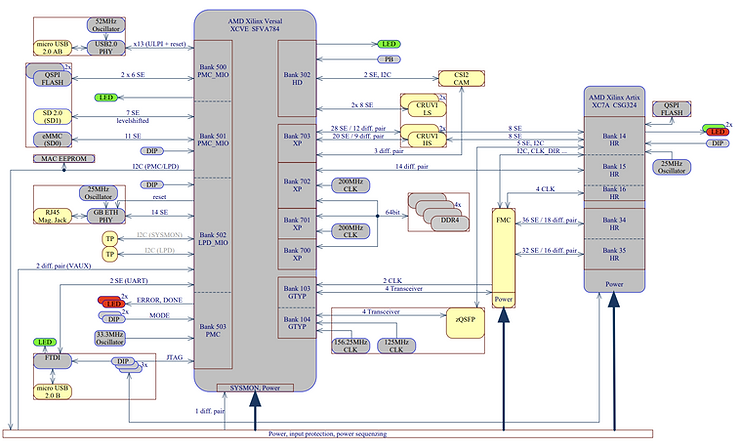
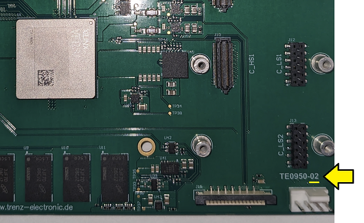
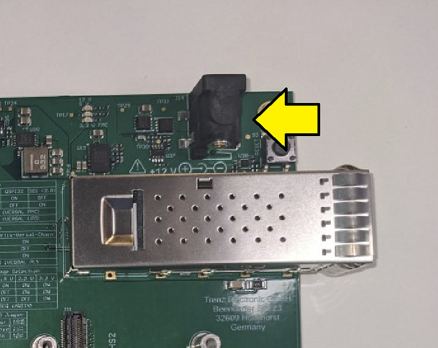
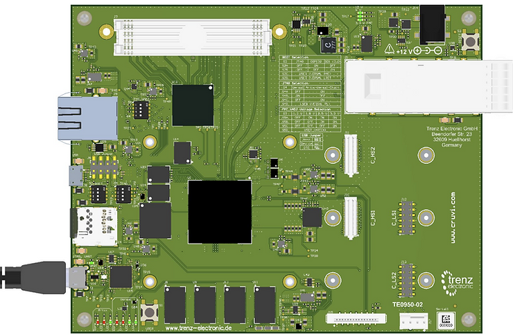
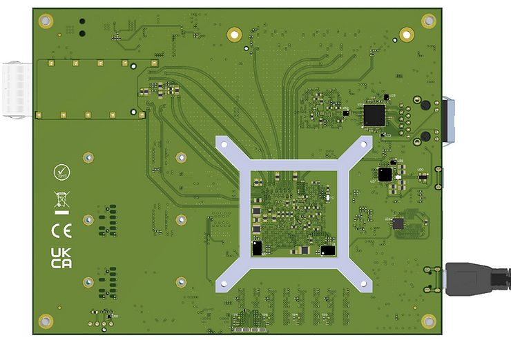
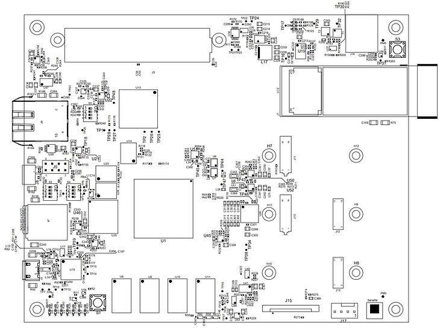
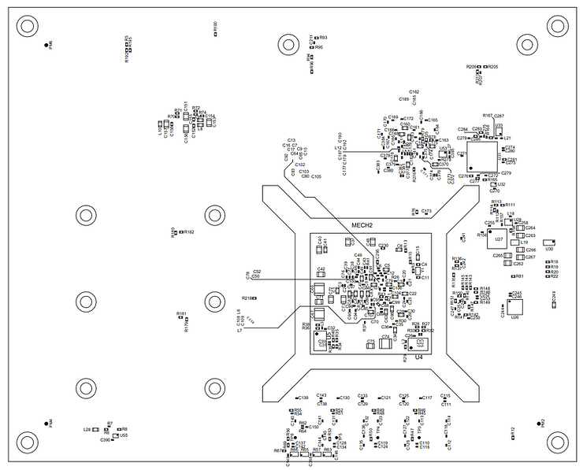
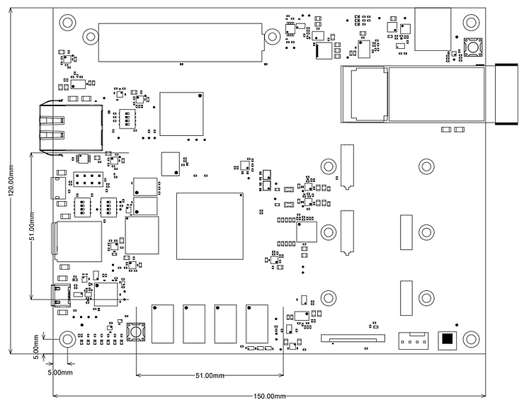
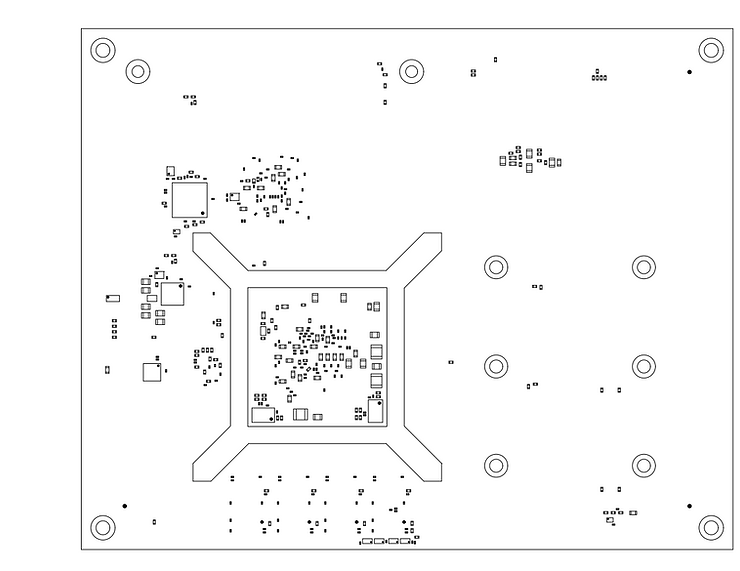

# Trenz Electronic TE0950-02-EGBE21A At-A-Glance

Get a quick look at the Trenz Electronic TE0950-02-EGBE21A with our 'At-A-Glance' guide.

Included:

-   The specific Versal part
    
-   A board system diagram
    
-   A link to the schematic
    
-   How to find the board rev ID
    
-   Where the power jack is, the type of power jack, power requirements, and where to order a power supply
    
-   A board rendering (3D)
    
-   The assembly diagram
    
-   Board dimensions
    
-   Links to the original docs
    

## <u>TE0950-02-EGBE21A Versal: VE2302 Versal AI Edge Series</u>

Trenz Electronic TE0950-02-EGBE21A Parts and Links to Docs : Sheet2

| Versal AI Edge Series          | VE2302                                                       |
| ------------------------------ | ------------------------------------------------------------ |
| AI Engines-ML                  | 34                                                           |
| AI Engines                     | 0                                                            |
| AIE/AIE-ML Data Memory (Mb)    | 17                                                           |
| AIE-ML Shared Memory (Mb)      | 68                                                           |
| DSP Engines                    | 464                                                          |
| System Logic Cells             | 328,720                                                      |
| CLB Flip-Flops                 | 300,544                                                      |
| LUTs                           | 150,272                                                      |
| Distributed RAM (Mb)           | 4.6                                                          |
| Block RAM Blocks               | 155                                                          |
| Block RAM (Mb)                 | 5.4                                                          |
| UltraRAM Blocks                | 155                                                          |
| UltraRAM (Mb)                  | 43.6                                                         |
| Accelerator RAM (Mb)           | 32                                                           |
| APU                            | Dual-core Arm Cortex-A72, 48KB/32KB L1 Cache w/ parity & ECC; 1MB L2 Cache w/ ECC |
| RPU                            | Dual-core Arm Cortex-R5F, 32KB/32KB L1 Cache, and 256KB TCM w/ECC |
| Memory                         | 256KB On-Chip Memory w/ECC                                   |
| Connectivity                   | Ethernet (x2); UART (x2); CAN-FD (x2); USB 2.0 (x1); SPI (x2); I2C (x2) |
| NoC to PL Master/ Slave Ports  | 5                                                            |
| DDR Bus Width                  | 64                                                           |
| DDR Memory Controllers (DDRMC) | 1                                                            |
| PCIe w/DMA & CCIX (CPM4)       | –                                                            |
| PCIe w/DMA & CCIX (CPM5)       | –                                                            |
| PCIe (PLPCIE4)                 | 1 x Gen4x8                                                   |
| PCIe (PLPCIE5)                 | –                                                            |
| 40G Multirate Ethernet MAC     | 1                                                            |
| XPIO                           | 216                                                          |
| HDIO                           | 22                                                           |
| GTY Transceivers(1)            | 0                                                            |
| GTYP Transceivers(1)           | 8                                                            |
| Video Decoder Engines (VDEs)   | –                                                            |

## <u>TE0950-02-EGBE21A System Diagram</u>

From:

https://shop.trenz-electronic.de/trenzdownloads/Trenz_Electronic/Development_Boards/TE0950/REV02/Documents/SCH-TE0950-02-EGBE21A.PDF [ [cached](https://drive.google.com/file/d/1Ok4keo70q7i68WuDQdMJK0GMrE9ZkRMP/view?usp=sharing) ] 

## <u>Schematic</u>

https://shop.trenz-electronic.de/trenzdownloads/Trenz_Electronic/Development_Boards/TE0950/REV02/Documents/SCH-TE0950-02-EGBE21A.PDF 

## <u>Parts</u>

Trenz Electronic TE0950-02-EGBE21A Parts and Links to Docs : Sheet1

| Specific Part #                      | Base Product Number      | Detailed Description                                         | Datasheet                                                    | Cached Datasheet                                             |
| ------------------------------------ | ------------------------ | ------------------------------------------------------------ | ------------------------------------------------------------ | ------------------------------------------------------------ |
| MPM3834CGPA                          | MPM3833C                 | 2.75 - 6V, 3A, Ultra-Small and Ultra-Low Noise Power Module  | [https://mm.digikey.com/Volume0/opasdata/d220001/medias/docus/713/MPM3833C_r1.0.pdf](https://www.google.com/url?q=https://mm.digikey.com/Volume0/opasdata/d220001/medias/docus/713/MPM3833C_r1.0.pdf&sa=D&source=editors&ust=1741224400650030&usg=AOvVaw1oxKDdIWPhgFOkH7-_15Xh) | [https://drive.google.com/file/d/1OwpfwkACc_ZcFIzWeV2cQsU4tQg-Uow3/view?usp=sharing](https://www.google.com/url?q=https://drive.google.com/file/d/1OwpfwkACc_ZcFIzWeV2cQsU4tQg-Uow3/view?usp%3Dsharing&sa=D&source=editors&ust=1741224400650259&usg=AOvVaw3MNEkVRuR862kuCm32AAoa) |
| NCV8164AMLADJTCG                     | NCV8164                  | LDO Regulator, 300mA, Low Dropout Voltage, Ultra Low Noise, High PSRR with Power Good | [https://shop.trenz-electronic.de/trenzdownloads/Trenz_Electronic/Development_Boards/TE0950/REV02/Documents/SCH-TE0950-02-EGBE21A.PDF](https://www.google.com/url?q=https://shop.trenz-electronic.de/trenzdownloads/Trenz_Electronic/Development_Boards/TE0950/REV02/Documents/SCH-TE0950-02-EGBE21A.PDF&sa=D&source=editors&ust=1741224400650581&usg=AOvVaw2RyDcT6TfDCaPiGIjkrmWp) | [https://drive.google.com/file/d/1OxbOrw_ZfLL7PCHnmy4iLJI2FW47MXHq/view?usp=sharing](https://www.google.com/url?q=https://drive.google.com/file/d/1OxbOrw_ZfLL7PCHnmy4iLJI2FW47MXHq/view?usp%3Dsharing&sa=D&source=editors&ust=1741224400650744&usg=AOvVaw2_l_OdasIIiIXbfQFBp4e-) |
| MPM3840GQV-Z                         | MPM3840                  | 2.8V-5.5V, 4A, Power Module, Synchronous Step-Down Converter with Integrated Inductor | [https://www.mouser.com/datasheet/2/277/MPM3840GQV-2946484.pdf](https://www.google.com/url?q=https://www.mouser.com/datasheet/2/277/MPM3840GQV-2946484.pdf&sa=D&source=editors&ust=1741224400651028&usg=AOvVaw201KfYIJPCZd2rQ-3gHrDd) | [https://drive.google.com/file/d/1P-4MyvS1m6F0I9V6a6HtVwASekj94AHZ/view?usp=sharing](https://www.google.com/url?q=https://drive.google.com/file/d/1P-4MyvS1m6F0I9V6a6HtVwASekj94AHZ/view?usp%3Dsharing&sa=D&source=editors&ust=1741224400651152&usg=AOvVaw1lXg9EtkYQx3RJFA1gU80U) |
| MP5077GG-Z                           | MP5077                   | 5.5V, 7A, Low RDSON Load Switch With Programmable Current Limit | [https://www.monolithicpower.com/en/documentview/productdocument/index/version/2/document_type/Datasheet/lang/en/sku/MP5077/document_id/1809/](https://www.google.com/url?q=https://www.monolithicpower.com/en/documentview/productdocument/index/version/2/document_type/Datasheet/lang/en/sku/MP5077/document_id/1809/&sa=D&source=editors&ust=1741224400651423&usg=AOvVaw3Ol4D6d_mu8WfbGS8cCz7v) | [https://drive.google.com/file/d/1P0biB4rbt2kCQIk2CioopfiykrgFy1SP/view?usp=sharing](https://www.google.com/url?q=https://drive.google.com/file/d/1P0biB4rbt2kCQIk2CioopfiykrgFy1SP/view?usp%3Dsharing&sa=D&source=editors&ust=1741224400651546&usg=AOvVaw2wFZAojlGUmnkLbdqPsez8) |
| TPS51206DSQ                          | TPS51206                 | TPS51206 2-A Peak Sink / Source DDR Termination Regulator With VTTREF Buffered Reference for DDR2, DDR3, DDR3L, and DDR4 | [https://www.ti.com/lit/ds/symlink/tps51206.pdf?HQS=dis-dk-null-digikeymode-dsf-pf-null-wwe&ts=1692831377620&ref_url=https%253A%252F%252Fwww.ti.com%252Fgeneral%252Fdocs%252F](https://www.google.com/url?q=https://www.ti.com/lit/ds/symlink/tps51206.pdf?HQS%3Ddis-dk-null-digikeymode-dsf-pf-null-wwe%26ts%3D1692831377620%26ref_url%3Dhttps%253A%252F%252Fwww.ti.com%252Fgeneral%252Fdocs%252F&sa=D&source=editors&ust=1741224400651795&usg=AOvVaw2yLX5MUnpe1qN8JR5HNkJ-) | [https://drive.google.com/file/d/1P1M5VbErHNl-sWbk08i3p0A1ViK3RGCP/view?usp=sharing](https://www.google.com/url?q=https://drive.google.com/file/d/1P1M5VbErHNl-sWbk08i3p0A1ViK3RGCP/view?usp%3Dsharing&sa=D&source=editors&ust=1741224400651910&usg=AOvVaw1OzBBev2wE5-j4IjbghQJ8) |
| MPM3683GMN-20                        | MPM3683-20               | 2.7V to 16V, 15A, Step-Down Power Module                     | [https://www.monolithicpower.com/en/documentview/productdocument/index/version/2/document_type/Datasheet/lang/en/sku/MPM3683GMN-20/document_id/11278/](https://www.google.com/url?q=https://www.monolithicpower.com/en/documentview/productdocument/index/version/2/document_type/Datasheet/lang/en/sku/MPM3683GMN-20/document_id/11278/&sa=D&source=editors&ust=1741224400652159&usg=AOvVaw0f7b75NpAranJjYN1pnc3k) | [https://drive.google.com/file/d/1P5NcdYDFyK5DvzdC59OXnSPLM0HRgxJU/view?usp=sharing](https://www.google.com/url?q=https://drive.google.com/file/d/1P5NcdYDFyK5DvzdC59OXnSPLM0HRgxJU/view?usp%3Dsharing&sa=D&source=editors&ust=1741224400652279&usg=AOvVaw3yIlTMt7BdDnPjVTq6c7rh) |
| MPM3834CGPA                          | MPM3834C                 | 2.75V to 6V, 3A, Ultra-Small Power Module with Ultra-Low Noise | [https://www.monolithicpower.com/en/documentview/productdocument/index/version/2/document_type/Datasheet/lang/en/sku/MPM3834CGPA/document_id/9651/](https://www.google.com/url?q=https://www.monolithicpower.com/en/documentview/productdocument/index/version/2/document_type/Datasheet/lang/en/sku/MPM3834CGPA/document_id/9651/&sa=D&source=editors&ust=1741224400652531&usg=AOvVaw03BpUO6RxN1hY365GZNE9L) | [https://drive.google.com/file/d/1P6croQ8pZE3cQ_KL0v52uhIGhInzbrO7/view?usp=sharing](https://www.google.com/url?q=https://drive.google.com/file/d/1P6croQ8pZE3cQ_KL0v52uhIGhInzbrO7/view?usp%3Dsharing&sa=D&source=editors&ust=1741224400652633&usg=AOvVaw0svX7QLbUgH60lGRSnfjwP) |
| 24AA025E48T-I/OT                     | 24AA025E48               | 2K I2C Serial EEPROMs with EUI-48™ or EUI-64™ Node Identity  | [https://ww1.microchip.com/downloads/en/DeviceDoc/24AA02E48-24AA025E48-24AA02E64-24AA025E64-Data-Sheet-20002124H.pdf](https://www.google.com/url?q=https://ww1.microchip.com/downloads/en/DeviceDoc/24AA02E48-24AA025E48-24AA02E64-24AA025E64-Data-Sheet-20002124H.pdf&sa=D&source=editors&ust=1741224400652900&usg=AOvVaw1GoA7H8Kr0cDCOS3Cjn2f0) | [https://drive.google.com/file/d/1PU2u5c7n9XWGVbSs4vjsJXCYVYat77tV/view?usp=sharing](https://www.google.com/url?q=https://drive.google.com/file/d/1PU2u5c7n9XWGVbSs4vjsJXCYVYat77tV/view?usp%3Dsharing&sa=D&source=editors&ust=1741224400653023&usg=AOvVaw0de0-btO_WIolwj6hxSD99) |
| 74LVC2G07FZ4-7                       | 74LVC2G07                | Buffer, Non-Inverting 2 Element 1 Bit per Element Open Drain Output X2-DFN1410-6 | [https://www.diodes.com/assets/Datasheets/74LVC2G07.pdf](https://www.google.com/url?q=https://www.diodes.com/assets/Datasheets/74LVC2G07.pdf&sa=D&source=editors&ust=1741224400653248&usg=AOvVaw2s2Acj2bFtetGaJzMAl4lR) | [https://drive.google.com/file/d/1Q_4_BGdBmtj8mKNChUHov4KKWxiWalrK/view?usp=sharing](https://www.google.com/url?q=https://drive.google.com/file/d/1Q_4_BGdBmtj8mKNChUHov4KKWxiWalrK/view?usp%3Dsharing&sa=D&source=editors&ust=1741224400653348&usg=AOvVaw0i4uqWmYt0fZBSTrGsyfyk) |
| 88E1512-A0-NNP2I000                  | 88E1512                  | Integrated 10/100/1000 Mbps Energy Efficient Ethernet Transceiver | [https://www.marvell.com/content/dam/marvell/en/public-collateral/phys-transceivers/marvell-ethernet-phys-alaska-88e151x-datasheet.pdf](https://www.google.com/url?q=https://www.marvell.com/content/dam/marvell/en/public-collateral/phys-transceivers/marvell-ethernet-phys-alaska-88e151x-datasheet.pdf&sa=D&source=editors&ust=1741224400653654&usg=AOvVaw3zXg5X71mMcwrpX7mtlCsG) | [https://drive.google.com/file/d/1Pe_owvPSdvXi4UN1YWZle9XGQVzPSw7B/view?usp=sharing](https://www.google.com/url?q=https://drive.google.com/file/d/1Pe_owvPSdvXi4UN1YWZle9XGQVzPSw7B/view?usp%3Dsharing&sa=D&source=editors&ust=1741224400653787&usg=AOvVaw215iPTwTjq0aWIIESpFcZr) |
| 93AA56BT-I/OT                        | 93AA56B                  | 2K Microwire Compatible Serial EEPROM                        | [https://ww1.microchip.com/downloads/en/DeviceDoc/21794G.pdf](https://www.google.com/url?q=https://ww1.microchip.com/downloads/en/DeviceDoc/21794G.pdf&sa=D&source=editors&ust=1741224400654063&usg=AOvVaw1vez8ow43NefFHWAQ5g-dq) | [https://drive.google.com/file/d/1PT0spskf8k9oH6gyNxaxO33H0MoKL_GV/view?usp=sharing](https://www.google.com/url?q=https://drive.google.com/file/d/1PT0spskf8k9oH6gyNxaxO33H0MoKL_GV/view?usp%3Dsharing&sa=D&source=editors&ust=1741224400654176&usg=AOvVaw1SxX4ksvaGjtuhJKkt5sRX) |
| DSC1123CI2-125.0000T 125M            | DSC1123                  | MEMS OSC XO 125.0000MHZ LVDS SMD                             | [https://ww1.microchip.com/downloads/aemDocuments/documents/TCG/ProductDocuments/DataSheets/DSC1103-23-Low-Jitter-Precision-LVDS-Oscillator-DS20005745C.pdf](https://www.google.com/url?q=https://ww1.microchip.com/downloads/aemDocuments/documents/TCG/ProductDocuments/DataSheets/DSC1103-23-Low-Jitter-Precision-LVDS-Oscillator-DS20005745C.pdf&sa=D&source=editors&ust=1741224400654458&usg=AOvVaw2bfpxivLBoHqJYbYS-2IVM) | [https://drive.google.com/file/d/1QQoz4J4OxtyV1nf8umL40xsgQzj6l8c0/view?usp=sharing](https://www.google.com/url?q=https://drive.google.com/file/d/1QQoz4J4OxtyV1nf8umL40xsgQzj6l8c0/view?usp%3Dsharing&sa=D&source=editors&ust=1741224400654589&usg=AOvVaw0N0lBQu3mSPRMiBysBAE1M) |
| FT2232H-56Q                          | FT2232H-56Q              | FT2232H Dual High Speed USB to Multipurpose UART/FIFO IC Datasheet Version 2.6 | [https://ftdichip.com/wp-content/uploads/2020/07/DS_FT2232H.pdf](https://www.google.com/url?q=https://ftdichip.com/wp-content/uploads/2020/07/DS_FT2232H.pdf&sa=D&source=editors&ust=1741224400654893&usg=AOvVaw3Fwp-FoE-uc7A3NqM5Q_Ka) | [https://drive.google.com/file/d/1PS7hE09avovllthLeSv69L7IklaeUyVX/view?usp=sharing](https://www.google.com/url?q=https://drive.google.com/file/d/1PS7hE09avovllthLeSv69L7IklaeUyVX/view?usp%3Dsharing&sa=D&source=editors&ust=1741224400655024&usg=AOvVaw0OeJc7_r71HsFCC0dJdcOz) |
| LTC4365ITS8#TRMPBF                   | LTC4365                  | Overvoltage, Undervoltage and Reverse Supply Protection Controller | [https://www.analog.com/media/en/technical-documentation/data-sheets/LTC4365.pdf](https://www.google.com/url?q=https://www.analog.com/media/en/technical-documentation/data-sheets/LTC4365.pdf&sa=D&source=editors&ust=1741224400655335&usg=AOvVaw02MPwl6D3N5eojpyRLn3Wb) | [https://drive.google.com/file/d/1PM0_OenEV67SWjpLxFIddMQbogGQFOyS/view?usp=sharing](https://www.google.com/url?q=https://drive.google.com/file/d/1PM0_OenEV67SWjpLxFIddMQbogGQFOyS/view?usp%3Dsharing&sa=D&source=editors&ust=1741224400655462&usg=AOvVaw1R5F9ih2U08VJ9QawJd25Y) |
| MAX13035EETE+                        | MAX13035                 | Voltage Level Translator Bidirectional 1 Circuit 6 Channel 100Mbps 16-TQFN (4x4) | [https://www.analog.com/media/en/technical-documentation/data-sheets/max13030e-max13035e.pdf](https://www.google.com/url?q=https://www.analog.com/media/en/technical-documentation/data-sheets/max13030e-max13035e.pdf&sa=D&source=editors&ust=1741224400655771&usg=AOvVaw2iCYbopCTKlfjyBnxHXiAS) | [https://drive.google.com/file/d/1QFYMKa8AAgEp2L13HPhYNTvR_VPS3AK3/view?usp=sharing](https://www.google.com/url?q=https://drive.google.com/file/d/1QFYMKa8AAgEp2L13HPhYNTvR_VPS3AK3/view?usp%3Dsharing&sa=D&source=editors&ust=1741224400655901&usg=AOvVaw3YzN6apQczrSW48uTEDi_8) |
| MIC2544-1YMM                         | MIC2544-1YMM             | Programmable Current-Limit High-Side Switch                  | [https://ww1.microchip.com/downloads/aemDocuments/documents/OTH/ProductDocuments/DataSheets/20005725B.pdf](https://www.google.com/url?q=https://ww1.microchip.com/downloads/aemDocuments/documents/OTH/ProductDocuments/DataSheets/20005725B.pdf&sa=D&source=editors&ust=1741224400656176&usg=AOvVaw3xc7nAiDRXqwrx9S3lWazw) | [https://drive.google.com/file/d/1Q0NnhaKhpZuZ25K9uT-_qfa9CLqgfqCH/view?usp=sharing](https://www.google.com/url?q=https://drive.google.com/file/d/1Q0NnhaKhpZuZ25K9uT-_qfa9CLqgfqCH/view?usp%3Dsharing&sa=D&source=editors&ust=1741224400656299&usg=AOvVaw2NotQxkUEc5IXJo_Megad5) |
| MP8869SGL-Z                          | MP8869S                  | 18V, 12A, High-Efficiency, Wide-Input, Synchronous, Step-Down Converter with Integrated Telemetry via I2C Interface | [https://www.monolithicpower.com/en/documentview/productdocument/index/version/2/document_type/Datasheet/lang/en/sku/MP8869S/document_id/3905/](https://www.google.com/url?q=https://www.monolithicpower.com/en/documentview/productdocument/index/version/2/document_type/Datasheet/lang/en/sku/MP8869S/document_id/3905/&sa=D&source=editors&ust=1741224400656579&usg=AOvVaw3h0jr9MP9-96Kxy9db6ePw) | [https://drive.google.com/file/d/1PGClQNkiL14eWSKUkRJeUO1THQ9VI_zv/view?usp=sharing](https://www.google.com/url?q=https://drive.google.com/file/d/1PGClQNkiL14eWSKUkRJeUO1THQ9VI_zv/view?usp%3Dsharing&sa=D&source=editors&ust=1741224400656718&usg=AOvVaw3i2tz7VjX5wAHkexnaYy-1) |
| MPM3650CGQW-Z                        | MPM3650C                 | 2.75 to 17V, 6A, 1.2MHz, Ultra-Thin, Synchronous, Step-Down Power Module with Forced Continuous Conduction Mode | [https://www.monolithicpower.com/en/documentview/productdocument/index/version/2/document_type/datasheet/lang/en/sku/MPM3650CGQW-Z/document_id/9145](https://www.google.com/url?q=https://www.monolithicpower.com/en/documentview/productdocument/index/version/2/document_type/datasheet/lang/en/sku/MPM3650CGQW-Z/document_id/9145&sa=D&source=editors&ust=1741224400657022&usg=AOvVaw1NGDW1AShRUGwxLJyDF4As) | [https://drive.google.com/file/d/1PDygDgjxLX0rVhg-CiF5_1rySvGqY5xZ/view?usp=sharing](https://www.google.com/url?q=https://drive.google.com/file/d/1PDygDgjxLX0rVhg-CiF5_1rySvGqY5xZ/view?usp%3Dsharing&sa=D&source=editors&ust=1741224400657152&usg=AOvVaw3lizDzExFZi4qKhH2mi8aU) |
| MT25QU512ABB8E12-0SIT                | MT25QU512                | FLASH - NOR Memory IC 512Mbit SPI 133 MHz 24-T-PBGA (6x8)    | [https://media-www.micron.com/-/media/client/global/documents/products/data-sheet/nor-flash/serial-nor/mt25q/die-rev-b/mt25q_qlkt_u_512_abb_0.pdf](https://www.google.com/url?q=https://media-www.micron.com/-/media/client/global/documents/products/data-sheet/nor-flash/serial-nor/mt25q/die-rev-b/mt25q_qlkt_u_512_abb_0.pdf&sa=D&source=editors&ust=1741224400657471&usg=AOvVaw3nJKg7ViV33GVMxXx8aGMy) | [https://drive.google.com/file/d/1QIhO9mEo-cOm9Ku6oJNLJUQWHxqArOUt/view?usp=sharing](https://www.google.com/url?q=https://drive.google.com/file/d/1QIhO9mEo-cOm9Ku6oJNLJUQWHxqArOUt/view?usp%3Dsharing&sa=D&source=editors&ust=1741224400657620&usg=AOvVaw3rzEtbtO_p4vfLKewn9V-9) |
| MT40A1G16TB-062E IT:F                | MT40A1G16                | IC DRAM 16GBIT PARALLEL 96FBGA                               | [https://media-www.micron.com/-/media/client/global/documents/products/data-sheet/dram/ddr4/16gb_ddr4_sdram.pdf](https://www.google.com/url?q=https://media-www.micron.com/-/media/client/global/documents/products/data-sheet/dram/ddr4/16gb_ddr4_sdram.pdf&sa=D&source=editors&ust=1741224400657923&usg=AOvVaw0eKTmKjT8yr5DCPRvO6u9F) | [https://drive.google.com/file/d/1QJAjmtD1hPDqgKPzUx_xLPYgABPxhcvA/view?usp=sharing](https://www.google.com/url?q=https://drive.google.com/file/d/1QJAjmtD1hPDqgKPzUx_xLPYgABPxhcvA/view?usp%3Dsharing&sa=D&source=editors&ust=1741224400658046&usg=AOvVaw0hCvaKXO79ayE8M53PljV8) |
| PCA9617ADPJ                          | PCA9617A                 | Level translating Fm+ I2C-bus repeater                       | [https://www.nxp.com/docs/en/data-sheet/PCA9617A.pdf](https://www.google.com/url?q=https://www.nxp.com/docs/en/data-sheet/PCA9617A.pdf&sa=D&source=editors&ust=1741224400658330&usg=AOvVaw0haldjau9KOwF5rGMHK-iV) | [https://drive.google.com/file/d/1PYAB-eojOlYKgTiyCIrBpuMPbJJLnsu4/view?usp=sharing](https://www.google.com/url?q=https://drive.google.com/file/d/1PYAB-eojOlYKgTiyCIrBpuMPbJJLnsu4/view?usp%3Dsharing&sa=D&source=editors&ust=1741224400658453&usg=AOvVaw0xG91atFvnstOJTbN83UQm) |
| S25FL256SAGBHI20                     | S25FL256S                | 128 Mb (16 MB)/256 Mb (32 MB) FL-S Flash SPI Multi-I/O, 3.0V | [https://www.infineon.com/dgdl/Infineon-S25FL128S_S25FL256S_128_Mb_(16_MB)_256_Mb_(32_MB)_3.0V_SPI_Flash_Memory-DataSheet-v18_00-EN.pdf?fileId=8ac78c8c7d0d8da4017d0ecfb6a64a17](https://www.google.com/url?q=https://www.infineon.com/dgdl/Infineon-S25FL128S_S25FL256S_128_Mb_(16_MB)_256_Mb_(32_MB)_3.0V_SPI_Flash_Memory-DataSheet-v18_00-EN.pdf?fileId%3D8ac78c8c7d0d8da4017d0ecfb6a64a17&sa=D&source=editors&ust=1741224400658759&usg=AOvVaw3VHYF4sSLzVYESxWU7nmOs) | [https://drive.google.com/file/d/1PONdXH_H19Ra4zpDkm9ntzr8pFm5JfyY/view?usp=sharing](https://www.google.com/url?q=https://drive.google.com/file/d/1PONdXH_H19Ra4zpDkm9ntzr8pFm5JfyY/view?usp%3Dsharing&sa=D&source=editors&ust=1741224400658887&usg=AOvVaw3weFvotBgkGDYEDCJvVuaD) |
| SDINBDG4-32G-XI2                     | SDINBDG4-32G             | Western Digital® iNAND® IX EM122a Industrial Embedded Flash Devices | [https://www.mouser.com/datasheet/2/669/wdig_s_a0011786314_1-2290667.pdf](https://www.google.com/url?q=https://www.mouser.com/datasheet/2/669/wdig_s_a0011786314_1-2290667.pdf&sa=D&source=editors&ust=1741224400659165&usg=AOvVaw2nlUuScfHU8LiFyAWxrbbi) | [https://drive.google.com/file/d/1Q3cEaUFEMjJ6nToJAlz8qdv1_z-PL822/view?usp=sharing](https://www.google.com/url?q=https://drive.google.com/file/d/1Q3cEaUFEMjJ6nToJAlz8qdv1_z-PL822/view?usp%3Dsharing&sa=D&source=editors&ust=1741224400659280&usg=AOvVaw2bEA41R4WK-0hwue5g5hIC) |
| SiT8008BI-73-18S-25.000000E 25M      | SiT8008B                 | Low Power Programmable Oscillator                            | [https://www.sitime.com/datasheet/SiT8008](https://www.google.com/url?q=https://www.sitime.com/datasheet/SiT8008&sa=D&source=editors&ust=1741224400659534&usg=AOvVaw1uI_jnO90C6aRLskuMULZy) | [https://drive.google.com/file/d/1POTMtOTkFujFBD3KBsUKZG_QJKXMLYgn/view?usp=sharing](https://www.google.com/url?q=https://drive.google.com/file/d/1POTMtOTkFujFBD3KBsUKZG_QJKXMLYgn/view?usp%3Dsharing&sa=D&source=editors&ust=1741224400659661&usg=AOvVaw130NzZ7rfZZ78DoMpDC7XX) |
| SiT8008BI-73-XXS-25.000000E          | SiT8008B                 | Low Power Programmable Oscillator                            | [https://www.sitime.com/datasheet/SiT8008](https://www.google.com/url?q=https://www.sitime.com/datasheet/SiT8008&sa=D&source=editors&ust=1741224400659926&usg=AOvVaw1ymsVyft6eJmvZzdhVI3rC) | [https://drive.google.com/file/d/1POTMtOTkFujFBD3KBsUKZG_QJKXMLYgn/view?usp=sharing](https://www.google.com/url?q=https://drive.google.com/file/d/1POTMtOTkFujFBD3KBsUKZG_QJKXMLYgn/view?usp%3Dsharing&sa=D&source=editors&ust=1741224400660054&usg=AOvVaw0x4x93TSI3wUqZoDa9QouG) |
| SiT8008BI-73-XXS-33.333333E 33M      | SiT8008B                 | 33.333333 MHz XO (Standard) HCMOS, LVCMOS Oscillator 2.5V ~ 3.3V Standby (Power Down) 4-SMD, No Lead | [https://www.sitime.com/datasheet/SiT8008](https://www.google.com/url?q=https://www.sitime.com/datasheet/SiT8008&sa=D&source=editors&ust=1741224400660305&usg=AOvVaw3hVlmIFcTTBlLbPKsVjiST) | [https://drive.google.com/file/d/1POTMtOTkFujFBD3KBsUKZG_QJKXMLYgn/view?usp=sharing](https://www.google.com/url?q=https://drive.google.com/file/d/1POTMtOTkFujFBD3KBsUKZG_QJKXMLYgn/view?usp%3Dsharing&sa=D&source=editors&ust=1741224400660406&usg=AOvVaw34xkTkHSaiiar6nmFGnJ9J) |
| SiT8008BI-73-XXS-52.000000E52M       | SiT8008B                 | Low Power Programmable Oscillator                            | [https://www.sitime.com/datasheet/SiT8008](https://www.google.com/url?q=https://www.sitime.com/datasheet/SiT8008&sa=D&source=editors&ust=1741224400660669&usg=AOvVaw16FfXRi-vBCVrYy2fgg3CW) | [https://drive.google.com/file/d/1POTMtOTkFujFBD3KBsUKZG_QJKXMLYgn/view?usp=sharing](https://www.google.com/url?q=https://drive.google.com/file/d/1POTMtOTkFujFBD3KBsUKZG_QJKXMLYgn/view?usp%3Dsharing&sa=D&source=editors&ust=1741224400660787&usg=AOvVaw2Ha2atnw90VWLdBzX2cch4) |
| SIT9120AI-2C2-33E200.000000 200M     | SiT9120                  | 200 MHz XO (Standard) LVDS Oscillator 3.3V Enable/Disable 6-SMD, No Lead | [https://www.sitime.com/datasheet/SiT9120](https://www.google.com/url?q=https://www.sitime.com/datasheet/SiT9120&sa=D&source=editors&ust=1741224400661054&usg=AOvVaw2FxKax3sw-bXpmv_YlC0dp) | [https://drive.google.com/file/d/1QX-kn928tQceIuhOt1GZQes1gwzPpKby/view?usp=sharing](https://www.google.com/url?q=https://drive.google.com/file/d/1QX-kn928tQceIuhOt1GZQes1gwzPpKby/view?usp%3Dsharing&sa=D&source=editors&ust=1741224400661171&usg=AOvVaw3cMfEbsDdSb4y-pcbcM3N9) |
| SIT9365AC-2B2-33E156.250000G 156.25M | SiT9365, Elite Platform™ | 156.25 MHz XO (Standard) LVDS Oscillator 3.3V Enable/Disable 6-SMD, No Lead | [https://www.sitime.com/datasheet/SiT9365](https://www.google.com/url?q=https://www.sitime.com/datasheet/SiT9365&sa=D&source=editors&ust=1741224400661477&usg=AOvVaw3JqnSEsSfAH9Xe1aFWNTUo) | [https://drive.google.com/file/d/1QTXcPo7RnA3TCEIUJb5pPaKYJRGOyoC_/view?usp=sharing](https://www.google.com/url?q=https://drive.google.com/file/d/1QTXcPo7RnA3TCEIUJb5pPaKYJRGOyoC_/view?usp%3Dsharing&sa=D&source=editors&ust=1741224400661601&usg=AOvVaw1UeKMJb3w_Muu-SFQ9yiq4) |
| SN74LVC1G06DRL                       | SN74LVC1G06              | Single Inverter Buffer/Driver With Open-Drain Output         | [https://www.ti.com/lit/ds/symlink/sn74lvc1g06.pdf?ts=1693114347837](https://www.google.com/url?q=https://www.ti.com/lit/ds/symlink/sn74lvc1g06.pdf?ts%3D1693114347837&sa=D&source=editors&ust=1741224400661915&usg=AOvVaw0WhOfY9dg6msL5lnobFGuY) | [https://drive.google.com/file/d/1Qb6GKu_HsBbb01j1Fv5vSw4BfAjWR4Wc/view?usp=sharing](https://www.google.com/url?q=https://drive.google.com/file/d/1Qb6GKu_HsBbb01j1Fv5vSw4BfAjWR4Wc/view?usp%3Dsharing&sa=D&source=editors&ust=1741224400662038&usg=AOvVaw116Qq1TnF1dOhiSu0xHTF-) |
| TPS389033DSER                        | TPS3890                  | Low Quiescent Current, 1% Accurate Supervisor with Programmable Delay | [https://www.ti.com/general/docs/suppproductinfo.tsp?distId=26&gotoUrl=https://www.ti.com/lit/gpn/tps3890](https://www.google.com/url?q=https://www.ti.com/general/docs/suppproductinfo.tsp?distId%3D26%26gotoUrl%3Dhttps://www.ti.com/lit/gpn/tps3890&sa=D&source=editors&ust=1741224400662308&usg=AOvVaw37Rq5x7mGeiI8QTM6aPy2l) | [https://drive.google.com/file/d/1PI1qRPlNfg5-apym4AdKSkmx5WpyFnIP/view?usp=sharing](https://www.google.com/url?q=https://drive.google.com/file/d/1PI1qRPlNfg5-apym4AdKSkmx5WpyFnIP/view?usp%3Dsharing&sa=D&source=editors&ust=1741224400662426&usg=AOvVaw2AOaLjt5olO0xAjwTarSaK) |
| USB3320C-EZK                         | USB3320                  | Highly Integrated Full Featured Hi-Speed USB 2.0 ULPI Transceiver | [https://ww1.microchip.com/downloads/en/DeviceDoc/00001792E.pdf](https://www.google.com/url?q=https://ww1.microchip.com/downloads/en/DeviceDoc/00001792E.pdf&sa=D&source=editors&ust=1741224400662671&usg=AOvVaw1G6Zlz5s2GKeIeBhEKDu5x) | [https://drive.google.com/file/d/1Q1qJ7DPi0BavsMNfsEToo-qU6P68Jh0v/view?usp=sharing](https://www.google.com/url?q=https://drive.google.com/file/d/1Q1qJ7DPi0BavsMNfsEToo-qU6P68Jh0v/view?usp%3Dsharing&sa=D&source=editors&ust=1741224400662788&usg=AOvVaw23lUxpgXZkliy0D0TNSI51) |
| XC7A35T-2CSG324C                     | XC7A35T                  | Artix-7                                                      | [https://docs.xilinx.com/v/u/en-US/ds180_7Series_Overview](https://www.google.com/url?q=https://docs.xilinx.com/v/u/en-US/ds180_7Series_Overview&sa=D&source=editors&ust=1741224400663024&usg=AOvVaw0JCFshCTxBn5HcL5HDr5u8) | [https://drive.google.com/file/d/1PMoo3oitlSAxEdgS2AdG0olt1O4mlocj/view?usp=sharing](https://www.google.com/url?q=https://drive.google.com/file/d/1PMoo3oitlSAxEdgS2AdG0olt1O4mlocj/view?usp%3Dsharing&sa=D&source=editors&ust=1741224400663133&usg=AOvVaw0I2qQRmOWb1HpbivbK-RaM) |
| XCVE2302-1LSESFVA784-ES9780          | VE2302                   | Versal AI Edge Series                                        | [https://docs.xilinx.com/v/u/en-US/ds950-versal-overview](https://www.google.com/url?q=https://docs.xilinx.com/v/u/en-US/ds950-versal-overview&sa=D&source=editors&ust=1741224400663405&usg=AOvVaw39uK4qGSkQ_93KuVGXB88v) | [https://drive.google.com/file/d/1QOxxi4PRzfkBOg89iZzNBDryMu-f9bbJ/view?usp=sharing](https://www.google.com/url?q=https://drive.google.com/file/d/1QOxxi4PRzfkBOg89iZzNBDryMu-f9bbJ/view?usp%3Dsharing&sa=D&source=editors&ust=1741224400663524&usg=AOvVaw0yrcMcPsyDT2QXD2F66mNI) |
| zQSFP+ 1x1 Connector                 |                          |                                                              |                                                              |                                                              |

## <u>Where is the Rev # on the TE0950-02-EGBE21A?</u>

Rev 2 in this case.

## <u>Power (J16)</u>

### Some Power Specs

DC Output Connector: 2.1∅ x 5.5∅ x 11 mm Barrel Plug

Output Power: 30 W

Output Voltage-Channel 1: 12 V

Output Current-Channel 1: 2.5 A

Manufacturer: Mean Well

Manufacturer's article number: GE30I12-P1J [ [order](https://www.mouser.com/ProductDetail/MEAN-WELL/GE30I12-P1J?qs=bs%2Fy4qIPrJzm8ysnHYC3ww%3D%3D&gclid=Cj0KCQjw3JanBhCPARIsAJpXTx7MqEAbkmtHJowjbolgAiHpSyDcTWGtIhxDjFJ5Vjq3JhC8rj1OsXwaApK7EALw_wcB) ] [ [spec](https://www.meanwell.com/productPdf.aspx?i=556) ] [ [cached spec](https://drive.google.com/file/d/1Obdx-S17EnxXuFKr32XGdm8d8tjSW0Sx/view?usp=sharing) ]

And Plug US [ [order](https://www.mouser.com/ProductDetail/?qs=kU9BrJCShynjdAvkilHAjQ%3D%3D) ] 

https://shop.trenz-electronic.de/en/28169-Interchangeable-Plug-with-four-adapters-and-cable-12V/2.5A 

### Ordering

Example Cart

Mouser #:709-ACPLUG-US

Mfr. #:AC PLUG-US

Mfr.:MEAN WELL

Mouser #:709-GE30I12-P1J

Mfr. #:GE30I12-P1J

Mfr.:MEAN WELL

## <u>TE0950-02-EGBE21A 3D</u>

### TE0950-02-EGBE21A 3D Top

From:

[https://shop.trenz-electronic.de/trenzdownloads/Trenz_Electronic/Development_Boards/TE0950/REV02/Documents/3DT-TE0950-02-No%20Variations.PDF](https://shop.trenz-electronic.de/trenzdownloads/Trenz_Electronic/Development_Boards/TE0950/REV02/Documents/3DT-TE0950-02-No Variations.PDF) [ [cached](https://drive.google.com/file/d/1OLE4Zgc5EGiUDX3ICcrtAAOmV0ofjMGY/view?usp=sharing) ]

### TE0950-02-EGBE21A 3D Bottom

From:

[https://shop.trenz-electronic.de/trenzdownloads/Trenz_Electronic/Development_Boards/TE0950/REV02/Documents/3DT-TE0950-02-No%20Variations.PDF](https://shop.trenz-electronic.de/trenzdownloads/Trenz_Electronic/Development_Boards/TE0950/REV02/Documents/3DT-TE0950-02-No Variations.PDF) [ [cached](https://drive.google.com/file/d/1OLE4Zgc5EGiUDX3ICcrtAAOmV0ofjMGY/view?usp=sharing) ]

## <u>TE0950-02-EGBE21A Assembly</u>

### TE0950-02-EGBE21A Assembly Top

### TE0950-02-EGBE21A Assembly Bottom

From:

https://shop.trenz-electronic.de/trenzdownloads/Trenz_Electronic/Development_Boards/TE0950/REV02/Documents/AD-TE0950-02-EGBE21A.PDF  [ [cached](https://drive.google.com/file/d/1OW6mcvgWdJTKkKLfxxtPCQZo9Mh31xXY/view?usp=sharing) ]

## <u>TE0950-02-EGBE21A Dimensions</u>

### TE0950-02-EGBE21A Dimensions Top

### TE0950-02-EGBE21A Dimensions Bottom

From:

[https://shop.trenz-electronic.de/trenzdownloads/Trenz_Electronic/Development_Boards/TE0950/REV02/Documents/DIM-TE0950-02-No%20Variations.PDF](https://shop.trenz-electronic.de/trenzdownloads/Trenz_Electronic/Development_Boards/TE0950/REV02/Documents/DIM-TE0950-02-No Variations.PDF) [ [cached](https://drive.google.com/file/d/1OK3OZTAznC9yy6hhIRSIGRjY21HP6O4I/view?usp=sharing) ]

## <u>Additional Links</u>

-   Purchase & Description, Downloads, Resources @ [<u>https://shop.trenz-electronic.de/en/TE0950-02-EGBE21A-AMD-Versal-AI-Edge-Evalboard-with-VE2302-ES-device-8-GB-DDR4-SDRAM-15x12cm</u>](https://shop.trenz-electronic.de/en/TE0950-02-EGBE21A-AMD-Versal-AI-Edge-Evalboard-with-VE2302-ES-device-8-GB-DDR4-SDRAM-15x12cm)
    
-   Online Docs @ [<u>https://wiki.trenz-electronic.de/display/PD/TE0950+Resources</u>](https://wiki.trenz-electronic.de/display/PD/TE0950+Resources)
    
-   Logo from [<u>https://www.trenz-electronic.de/</u>](https://www.trenz-electronic.de/)
    

### Trenz Electronic TE0950-02-EGBE21A At-A-Glance