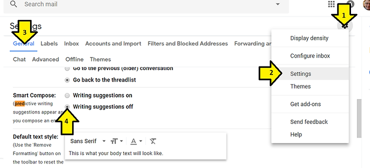
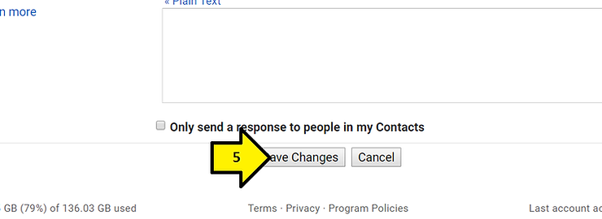

# Turn Off Gmail Predictive Writing

This post shows you how to turn off predictive writing in gmail.

**Steps**

1\. Click the gear

2\. Click **Settings**

3\. Click **General**

4\. Scroll down, find **Smart Compose** and click **Writing suggestions off**

5\. Scroll down and click **Save Changes**

**Reference**

Gmail image from \[[link](http://esr-divparty.netdna-ssl.com/images/guides/iosgmailapp/gmail-app-icon.png)\]