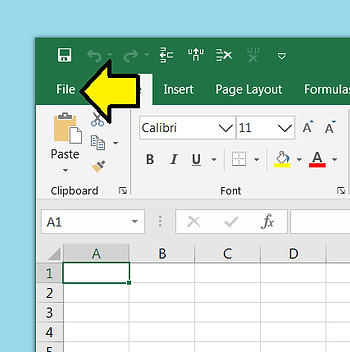
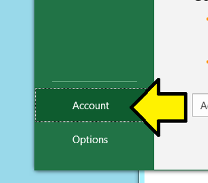
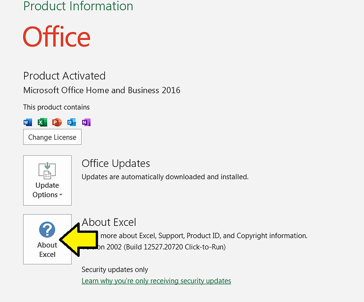
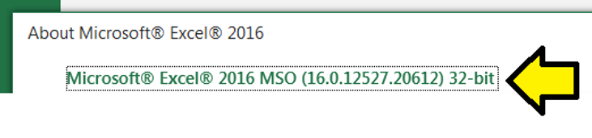
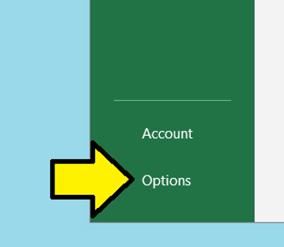
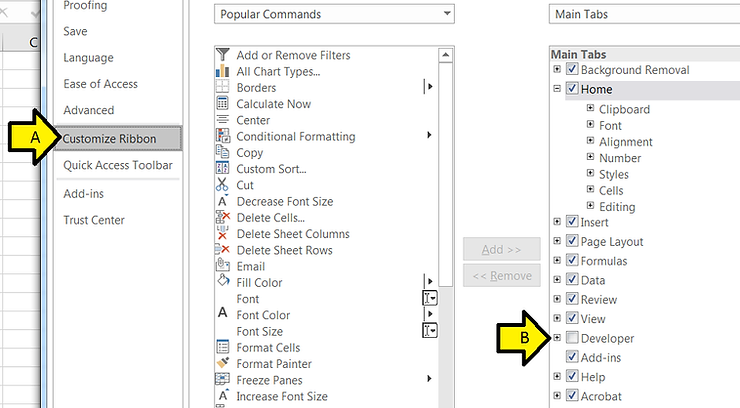
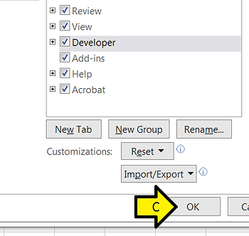
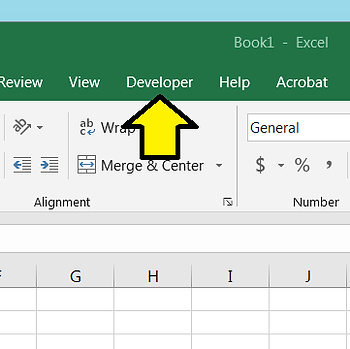

# Turn On the Developer Tab in Excel 2016 on Windows 7

This post shows how to check the version of Excel you're using and turn on the Developer Tab in Excel 2016. You may need this if you want to record a macro.

**Find Excel Version**

Step 1: Click **File**

Step 2: Click **Account**

Step 3: Click **About Excel**

Step 4: Check the version

**Turn on Developer Mode**

Step 1: Click **File**

Step 2: Click **Options**

Step 3:

A. Click **Customize Ribbon**

B. Click the **Developer** checkbox

C. Click OK

Step 4: Check

**References**

Excel icon downloaded from \[[link](http://upload.wikimedia.org/wikipedia/commons/7/7f/Microsoft_Office_Excel_%282018%E2%80%93present%29.svg)\] as SVG and saved as a PNG using Microsoft Explorer