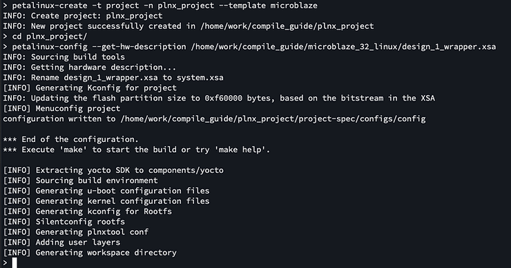
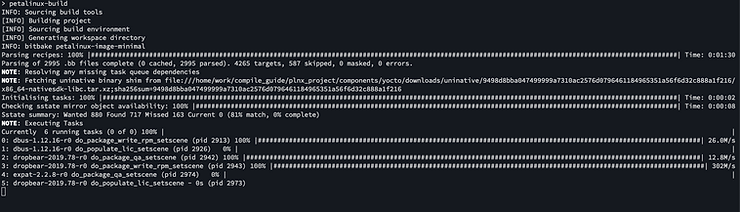
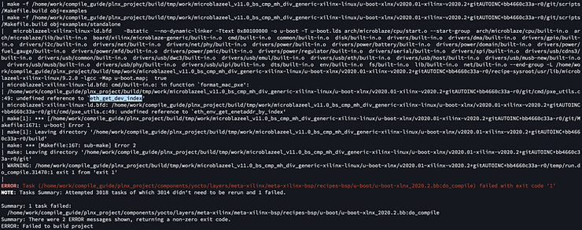

# U-Boot compile errors, MicroBlaze, and problems with Vivado 2020.2

In this post I attempted following [<u><span>this guide</span></u>](https://www.centennialsoftwaresolutions.com/post/create-a-microblaze-test-the-uart-in-sdk-and-boot-linux-using-2019-1-vivado-and-petalinux-tools) on newer version of Vivado. (and different FPGA)

## Preface

Main differences between 2020.2 and 2019.1:

1.  PetaLinux is not bundled with Vitis (it is installed separately through the same installer)
    
2.  Xilinx SDK has been replaced with Vitis
    
3.  Hardware Description File (.hdf) now has extension of .xsa. (Like previously it is generated when **Export Hardware** button is pressed in Vivado)
    
4.  Vitis has slightly different names for everything
    

## Following the guide

Following the guide I generated this block design (view the README): https://github.com/centennialsoftwaresolutions/vivado_tcl/tree/master/vivado_2020_2_tcl 

I attempted this with 2019.1 version and it succeeded. [<u><span>(tcl here)</span></u>](https://github.com/centennialsoftwaresolutions/vivado_tcl/tree/master/vivado_2019_1_tcl)

2020.2 however seems fine until you get to **petalinux-build** part.

```
petalinux-create -t project -n plnx_project --template microblaze
cd plnx_project/
petalinux-config --get-hw-description /home/work/compile_guide/microblaze_32_linux/design_1_wrapper.xsa

petalinux-build
```



Running petalinux-build:



Error:



## Conclusion

I think PetaLinux is not pulling some configs from .xsa correctly - causing the build to fail.

Something to do with **eth\_get\_dev\_index**.